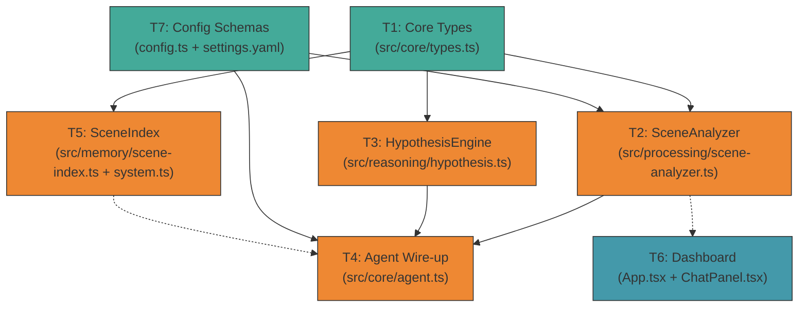

# 🗂️ Planning: HypothesisEngine + SceneAnalyzer

> 📋 **Phase 2/3 — Planning**. Filled by the `planner` agent.
> This card is the ONLY context the `coder` receives.

## Overview

Implementa duas capacidades complementares no Vigia:

1. **SceneAnalyzer** (`src/processing/scene-analyzer.ts`) — Usa LLM Vision (GPT-4o-mini / LLaVA / Ollama vision) para descrever semanticamente cada frame com movimento significativo. Produz `SceneObservation` com narração em português, pessoas, veículos, objetos e flags de anomalia.

2. **HypothesisEngine refactor** (`src/reasoning/hypothesis.ts`) — Substitui o stub `generateFromEvent()` por chamada real ao `LlmClient.generateHypotheses()`, consumindo `SceneObservation` + baseline de rotina + dados de pessoas para gerar hipóteses abdutivas com probabilidades.

3. **SceneIndex** (`src/memory/scene-index.ts`) — Persiste `SceneObservation` em SQLite (metadados) + ChromaDB (embedding da narração), com busca semântica cross-modal.

4. **Dashboard updates** — Exibe narrações de cena no ChatPanel e lida com eventos `scene.observation` via WebSocket.

---

## Tasks (ordered by dependency)

### Task 1: Estender Core Types (complexity: low)

- **Files to create**: Nenhum
- **Files to edit**: `src/core/types.ts`
- **Dependencies**: Nenhuma
- **Conventions to follow**:
  - Manter padrão de interfaces existentes (`SecurityEvent`, `PersonRecord`)
  - Usar `const` enum pattern com `as const` + type alias (igual `EventType`, `Severity`)
  - Campos opcionais com `?` e `| null` (igual `snapshotPath: string | null`)
  - Todas as strings de UI em português nos comentários JSDoc
- **Key design decisions**:
  - `SceneObservation` é o envelope (id, timestamp, cameraId, snapshotPath, description, textEmbedding)
  - `SceneDescription` é o payload rico da LLM Vision (narration, persons[], vehicles[], objects[], actions[], intentions[], anomalyFlags[])
  - `PersonObservation` é distinto de `PersonRecord` — é uma observação visual pontual, não um registro de longo prazo
  - `VehicleObservation` é superficial (type, color, plate, parkedMinutes) — o rastreamento completo fica no `VehicleTracker`
  - `ObjectObservation` tem relevance enum: `"normal" | "suspicious" | "threat"`
  - Adicionar `SCENE_OBSERVATION: "scene_observation"` ao enum `EventType`
  - Tipos exportados com `export interface` (consistent with existing)

**Tipos a adicionar:**

```typescript
export interface SceneObservation {
  id: string;
  timestamp: Date;
  cameraId: string;
  snapshotPath: string;
  description: SceneDescription;
  textEmbedding?: number[];
}

export interface SceneDescription {
  narration: string;
  persons: PersonObservation[];
  vehicles: VehicleObservation[];
  objects: ObjectObservation[];
  actions: string[];
  intentions: string[];
  anomalyFlags: string[];
}

export interface PersonObservation {
  localId: string;
  personId?: string;
  appearance: {
    estimatedAge?: string;
    clothing: string;
    accessories: string[];
    height?: string;
  };
  movement?: string;
  appearsKnown: boolean;
}

export interface VehicleObservation {
  type: string;
  color: string;
  plate?: string;
  parkedMinutes?: number;
}

export interface ObjectObservation {
  type: string;
  relevance: "normal" | "suspicious" | "threat";
}
```

---

### Task 2: Implementar SceneAnalyzer (complexity: high)

- **Files to create**: `src/processing/scene-analyzer.ts`
- **Files to edit**: Nenhum
- **Dependencies**: Task 1 (types)
- **Conventions to follow**:
  - **Pipeline class pattern** do `VehicleTracker`: classe com constructor injection (`private llmClient?: LlmClient`, `private bus?: EventBus`), método async principal, integração via EventBus
  - **ESM imports com `.js`**: `import { logger } from "../core/logger.js"`
  - **Portuguese JSDoc + English code**: comentários e strings de sistema em português
  - **Async processing, never block**: `analyze(frame)` é async, chamada com `void` do event loop
  - **Fallback returns null**: Se LLM offline ou erro de rede → `logger.warn()` + retorna `null` (nunca throw)
  - **Frame format**: `CameraFrame.data` é JPEG Buffer → converter para base64 antes de enviar para LLM Vision
  - **System prompt em português**: "Você é o Vigia, um agente de segurança residencial. Descreva esta cena..."
- **Key design decisions**:
  - **Constructor**: `constructor(private llmClient?: LlmClient, private bus?: EventBus, private config?: SceneAnalyzerConfig)`
  - **Método principal**: `async analyze(frame: CameraFrame, motionScore?: number): Promise<SceneObservation | null>`
  - **Throttling interno**: `lastAnalysisTime` Map por cameraId, só processa se passou `minIntervalMs` (default 5000ms) desde última análise
  - **Só processa frames com motion**: Recebe `motionScore` — só chama LLM se acima do threshold configurável
  - **LLM Vision prompt**: Envia JPEG base64 + system prompt estruturado pedindo JSON com `SceneDescription`
  - **Parsing robusto**: `try { JSON.parse(jsonMatch) } catch { logger.warn; return null }`
  - **EventBus publish**: Após análise bem-sucedida, publica `"scene.observation"` com o `SceneObservation`
  - **Config interface**: `SceneAnalyzerConfig` com `enabled`, `minIntervalMs`, `motionThreshold`, `maxTokens`, `model?`
  - **Cooldown por câmera**: `private lastAnalysis = new Map<string, number>()`

---

### Task 3: Implementar HypothesisEngine real (complexity: medium)

- **Files to edit**: `src/reasoning/hypothesis.ts`
- **Files to create**: Nenhum
- **Dependencies**: Task 1 (types), Task 2 (SceneAnalyzer — só para tipo, não runtime)
- **Conventions to follow**:
  - Manter estrutura existente da classe `HypothesisEngine`
  - Substituir stub `generateFromEvent()` por implementação real
  - **Corrigir tipagem fraca**: `private llmClient?: unknown` → `private llmClient?: LlmClient`
  - **Corrigir tipagem fraca**: `private memory?: unknown` → `private memory?: MemorySystem`
  - Usar `LlmClient.generateHypotheses()` que já existe e retorna `Array<{ title, description, probability }>`
  - Manter `confirmByUser()`, `rejectByUser()`, `getActiveHypotheses()` existentes (já funcionam)
  - **Prompt em português**: O `LlmClient.generateHypotheses()` já usa SYSTEM_PROMPT em português
- **Key design decisions**:
  - **generateFromEvent()** agora:
    1. Chama `this.llmClient.generateHypotheses(event, enrichedContext)`
    2. Enriquece o context com `sceneObservation` se disponível (do `event.payload`)
    3. Enriquece com dados de rotina (`RoutineLearner`) e pessoas (`PersonRegistry`) via `this.memory`
    4. Mapeia resultado do LLM → `Hypothesis[]` com IDs únicos (`hyp_${uuid}`)
    5. Armazena no array interno `this.hypotheses`
    6. Aplica thresholds: `probability > 0.8` → `confirmed`, `< 0.3` → descartada
    7. Retorna as hipóteses geradas
  - **Enriched context**: Adiciona ao context informações de `SceneObservation.narration`, baseline de rotina, e pessoa conhecida se aplicável
  - **Não adicionar novas dependências**: Usa apenas `LlmClient` + `MemorySystem`

---

### Task 4: Wire-up no Agent (complexity: medium)

- **Files to edit**: `src/core/agent.ts`
- **Files to create**: Nenhum
- **Dependencies**: Task 2 (SceneAnalyzer), Task 3 (HypothesisEngine)
- **Conventions to follow**:
  - Seguir padrão de inicialização existente em `setup()` — `this.xxx = new Xxx(...)`
  - Adicionar `sceneAnalyzer` como propriedade da classe
  - Seguir padrão de import: `import { SceneAnalyzer } from "../processing/scene-analyzer.js"`
- **Key design decisions**:
  - **ONDE chamar SceneAnalyzer**: NO camera loop (`runCameraLoop`), NÃO no `handleEvent`. Motivo: o SceneAnalyzer precisa do `CameraFrame` (JPEG buffer), não do `SecurityEvent`.
  - **Integração no `runCameraLoop`**: Após `visionPipeline.process(frame)` retornar evento com motion, chamar `void this.sceneAnalyzer?.analyze(frame, ...)`
  - **Instanciação em `setup()`**: Após `this.llmClient` ser criado
  - **NÃO modificar `generateHypothesesForEvent`**: Já chama `hypothesisEngine.generateFromEvent()`, que agora funciona
  - **Adicionar handler para `scene.observation` no bus**

---

### Task 5: Implementar SceneIndex (complexity: medium)

- **Files to create**: `src/memory/scene-index.ts`
- **Files to edit**: `src/memory/system.ts`
- **Dependencies**: Task 1 (types), Task 2 (SceneAnalyzer — tipo `SceneObservation`)
- **Conventions to follow**:
  - **Padrão de classe do MemorySystem**: Classe com constructor injection, async methods, integração com SQLite + ChromaDB
  - **ESM imports com `.js`**
  - **Fallback pattern**: Se ChromaDB offline, usa `InMemoryVectorStore`
  - Interface `SemanticQuery` e `SemanticResult`
- **Key design decisions**:
  - **Persistência dual**: SQLite (metadados) + ChromaDB (text embedding da `narration`)
  - **Métodos públicos**: `store()`, `search()`, `getRecent()`, `searchByDescription()`
  - **Text embedding**: Usa `LlmClient` se disponível, senão fallback para embedding dummy
  - **Integração com MemorySystem**: Adicionar `sceneIndex: SceneIndex` como propriedade pública

---

### Task 6: Dashboard — Exibir Scene Observations (complexity: low)

- **Files to edit**: `dashboard/src/App.tsx`, `dashboard/src/ChatPanel.tsx`
- **Files to create**: Nenhum
- **Dependencies**: Task 2 (SceneAnalyzer publica `scene.observation`)
- **Conventions to follow**:
  - Seguir padrão existente de handler WebSocket no `App.tsx`
  - Seguir padrão de mensagens no `ChatPanel.tsx`
- **Key design decisions**:
  - Adicionar handler para `msg.topic === "scene.observation"` no WebSocket
  - Renderizar narração como mensagem do tipo `observation`
  - NÃO adicionar quickReplies para scene observations (são informativas)

---

### Task 7: Estender Config com Zod Schemas (complexity: low)

- **Files to edit**: `src/core/config.ts`, `config/settings.yaml`
- **Files to create**: Nenhum
- **Dependencies**: Task 2 (SceneAnalyzerConfig)
- **Conventions to follow**:
  - **Zod schema pattern**: `z.object({...}).default({})` com todos os campos opcionais com default
  - Adicionar dentro de `VigiaConfig` (já existe)
- **Key design decisions**:
  - Schema `SceneAnalyzerConfigSchema` com `enabled`, `minIntervalMs`, `motionThreshold`, `maxTokens`, `model?`
  - Adicionar ao `settings.yaml` valores default comentados

---

## Dependency Graph



**Ordem de execução recomendada**: T1 → T7 → T2 → T5 → T3 → T4 → T6

---

## Files Summary

| File                               | Action | Task | Est. Lines         |
| ---------------------------------- | ------ | ---- | ------------------ |
| `src/core/types.ts`                | edit   | T1   | +80                |
| `src/processing/scene-analyzer.ts` | create | T2   | ~150               |
| `src/reasoning/hypothesis.ts`      | edit   | T3   | ~60 (replace stub) |
| `src/core/agent.ts`                | edit   | T4   | +30                |
| `src/memory/scene-index.ts`        | create | T5   | ~120               |
| `src/memory/system.ts`             | edit   | T5   | +15                |
| `src/core/config.ts`               | edit   | T7   | +25                |
| `config/settings.yaml`             | edit   | T7   | +8                 |
| `dashboard/src/App.tsx`            | edit   | T6   | +20                |
| `dashboard/src/ChatPanel.tsx`      | edit   | T6   | +15                |

**Total estimated:** ~270 lines new, ~153 lines modified. ~6-8 hours.

---

## Handoff Contract

> **From:** Planner → **To:** Coder
>
> **What you receive:** This Planning Card ONLY. Tasks are ordered by dependency — implement in sequence.
>
> **Critical constraints (from Research + Planning):**
>
> - ✅ `LlmClient` already exists — do NOT create a second LLM client. Use `this.llmClient.generate()` for SceneAnalyzer, `this.llmClient.generateHypotheses()` for HypothesisEngine.
> - ✅ All prompts in Portuguese (Vigia system language). System prompt já existe em `client.ts:40`.
> - ✅ Use `.js` extension for ALL relative ESM imports.
> - ✅ SceneAnalyzer processes asynchronously with `void` — NEVER `await` in the camera loop.
> - ✅ Fallback on LLM error: return `null`, never throw. Log warning with `logger.warn()`.
> - ✅ Config must use Zod schema in `src/core/config.ts` — add `sceneAnalyzer` inside `VigiaConfig`.
> - ✅ Types first (T1) — all other tasks depend on `SceneObservation`, `SceneDescription`, etc.
> - ✅ HypothesisEngine already has working `confirmByUser()`, `rejectByUser()`, `getActiveHypotheses()` — do NOT touch these methods, only replace `generateFromEvent()`.
> - ✅ Fix `unknown` types: `llmClient?: unknown` → `llmClient?: LlmClient`, `memory?: unknown` → `memory?: MemorySystem`.
> - ✅ SceneIndex persists to SQLite + ChromaDB (same pattern as `MemorySystem`). ChromaDB offline → fallback to `InMemoryVectorStore`.
> - ⚠️ No audio pipeline exists yet — SceneAnalyzer and HypothesisEngine are visual-only for now.
> - ⚠️ `VisionPipeline` currently does pixel-diff only (no object detection). SceneAnalyzer fills the semantic gap via LLM Vision.
