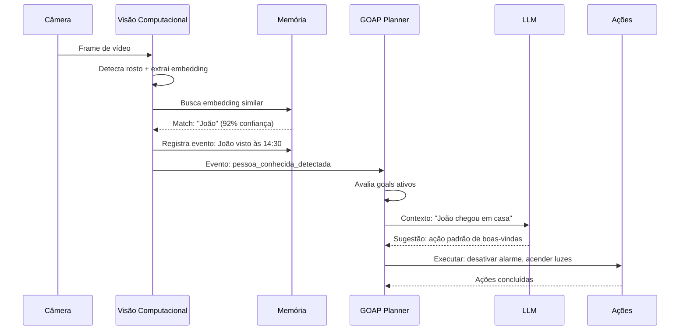

# SecurityAgent — Agente de IA para Segurança Doméstica e Empresarial

Sistema inteligente de segurança que integra câmeras, microfones, visão computacional, reconhecimento de voz e LLMs com planejamento baseado em objetivos (GOAP) para tomada de decisão em tempo real.

## Visão Geral

O SecurityAgent é um agente autônomo que:

- Conecta-se a câmeras de segurança (IP, RTSP, ONVIF, USB)
- Analisa vídeo em tempo real com visão computacional
- Detecta e reconhece rostos (pessoas conhecidas, desconhecidas, e "frequentemente vistas")
- Analisa áudio para reconhecimento de voz e classificação de sons
- Mantém memória de curto e longo prazo sobre eventos e pessoas
- Utiliza GOAP (Goal-Oriented Action Planning) para planejar ações de segurança
- Usa LLMs para raciocínio de alto nível, detecção de anomalias e descrição de eventos
- Executa ações: notificações, integração com casa inteligente, alarmes, chamadas automáticas

## Arquitetura em Camadas

```
┌─────────────────────────────────────────────────────────────┐
│                     ACTION LAYER                             │
│  Notificações | Alarmes | IoT | API Externa | Chamadas      │
├─────────────────────────────────────────────────────────────┤
│                    DECISION LAYER                            │
│     GOAP Planner  │  Rule Engine  │  LLM Reasoner           │
├─────────────────────────────────────────────────────────────┤
│                    MEMORY LAYER                              │
│  Vector DB (rostos/vozes) │ Event Store │ Knowledge Graph   │
├─────────────────────────────────────────────────────────────┤
│                  PROCESSING LAYER                            │
│  Face Detect/Recog │ Object Detect │ Audio Classify │ VAD   │
├─────────────────────────────────────────────────────────────┤
│                  PERCEPTION LAYER                            │
│     Câmeras (RTSP/ONVIF)  │  Microfones  │  Sensores        │
└─────────────────────────────────────────────────────────────┘
```

## Funcionalidades Principais

### 🔍 Reconhecimento Inteligente
- Detecção facial em tempo real (YOLOv8-face, RetinaFace)
- Reconhecimento facial com embeddings (ArcFace, FaceNet)
- Reconhecimento de voz independente de texto (ECAPA-TDNN)
- Identificação de "visitantes frequentes" não identificados
- Detecção de objetos relevantes (pacotes, veículos, armas)

### 🧠 Memória e Aprendizado
- Memória vetorial para rostos e vozes (ChromaDB / Qdrant)
- Memória episódica de eventos com timestamps
- Grafo de conhecimento de relacionamentos (pessoa A + pessoa B)
- Detecção de anomalias por desvio de padrões históricos
- Esquecimento progressivo de eventos antigos (importância decrescente)

### 🎯 Tomada de Decisão (GOAP + LLM)
- **GOAP**: planejamento goal-oriented para cenários de segurança
  - Ex: Goal "garantir perímetro seguro" → Actions: verificar câmeras, trancar portas, etc.
- **Motor de Regras**: para ameaças imediatas e determinísticas
- **LLM**: para situações ambíguas, descrições em linguagem natural
  - "Pessoa parada na porta há 5min com mochila → suspeito?"
  - Sumarização diária: "Hoje: 3 entregadores, 2 visitas, 1 evento incomum"

### ⚡ Ações Automatizadas
- Notificações push (app, Telegram, WhatsApp)
- Integração com Home Assistant / MQTT / Z-Wave / Zigbee
- Acionamento de alarmes sonoros e visuais
- Chamada automática para contatos de emergência
- Gravação e upload de clipes para nuvem

### 🏘️ Inteligência de Vizinhança (O Vigia)
Sistema de observação social inspirado na história "Manuel e o Vigia":
- **Reconhecimento de veículos** com associação a pessoas
- **Aprendizado de rotinas** (carteiro 10h, gás terça, vizinha sábado)
- **Baselines estatísticos** ("a maioria dos carros fica <5min")
- **Mineração de padrões** ("11 visitas em 38 dias, sempre noturno")
- **Geração de hipóteses** ("Probabilidade de relacionamento próximo")
- **Perguntas interativas** ("Você conhece este carro? Posso fazer uma pergunta?")
- **Investigação social autorizada** (fontes públicas, idade, relacionamentos)
- **Predição social** ("97,4% de chance da Dona Marlene descobrir")
- **Personalidade adaptável** (informativo → casual → humorístico)

## Stack Tecnológica

| Camada | Tecnologias |
|--------|-------------|
| Linguagem Principal | Python 3.11+ |
| Visão Computacional | OpenCV, YOLOv8, InsightFace, Ultralytics |
| Áudio | PyAudio, SpeechBrain, Librosa, Whisper |
| Banco Vetorial | ChromaDB / Qdrant |
| Banco Relacional | PostgreSQL (eventos, configurações) |
| Grafo | Neo4j ou NetworkX |
| LLM | OpenAI GPT-4o / Claude / LLM Local (Ollama) |
| Mensageria | Redis Pub/Sub, MQTT |
| Stream Processing | Apache Kafka (escala empresarial) |
| Infraestrutura | Docker, Docker Compose, NVIDIA CUDA |
| Frontend (futuro) | React / Next.js |

## Estrutura do Projeto

```
SecurityAgent/
├── docs/
│   ├── architecture.md          # Arquitetura detalhada
│   ├── goap-design.md           # Design do sistema GOAP
│   └── memory-system.md         # Sistema de memória
├── src/
│   ├── perception/              # Camada de percepção
│   │   ├── camera/              # Conectores de câmera
│   │   └── audio/               # Captura de áudio
│   ├── processing/              # Pipeline de processamento
│   │   ├── vision/              # Visão computacional
│   │   └── audio/               # Processamento de áudio
│   ├── memory/                  # Sistema de memória
│   │   ├── vector_store.py      # DB vetorial
│   │   ├── event_store.py       # Eventos temporais
│   │   └── knowledge_graph.py   # Grafo de conhecimento
│   ├── reasoning/               # Camada de raciocínio
│   │   ├── goap/                # Planejador GOAP
│   │   ├── rules/               # Motor de regras
│   │   └── llm/                 # Integração LLM
│   ├── actions/                 # Ações executáveis
│   │   ├── notifications.py
│   │   ├── smart_home.py
│   │   └── alarms.py
│   ├── core/                    # Núcleo do agente
│   │   ├── agent.py             # Loop principal do agente
│   │   ├── bus.py               # Barramento de eventos interno
│   │   └── config.py            # Configuração
│   └── api/                     # API REST (gerenciamento)
├── config/
│   ├── settings.yaml
│   └── goap_world_state.yaml
├── tests/
├── docker-compose.yaml
└── requirements.txt
```

## Exemplo de Fluxo



## Roadmap

- [x] Design da arquitetura
- [ ] MVP: Detecção facial + notificações
- [ ] Integração GOAP básica
- [ ] Memória vetorial para rostos
- [ ] Reconhecimento de voz
- [ ] LLM para raciocínio de anomalias
- [ ] Integração com Home Assistant
- [ ] Dashboard web
- [ ] Modo multi-câmera
- [ ] Grafo de relacionamentos
- [ ] Aprendizado contínuo não-supervisionado
