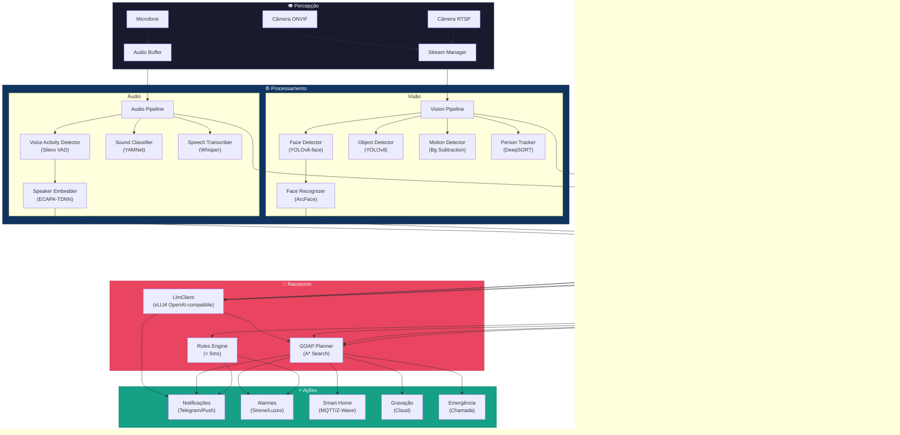
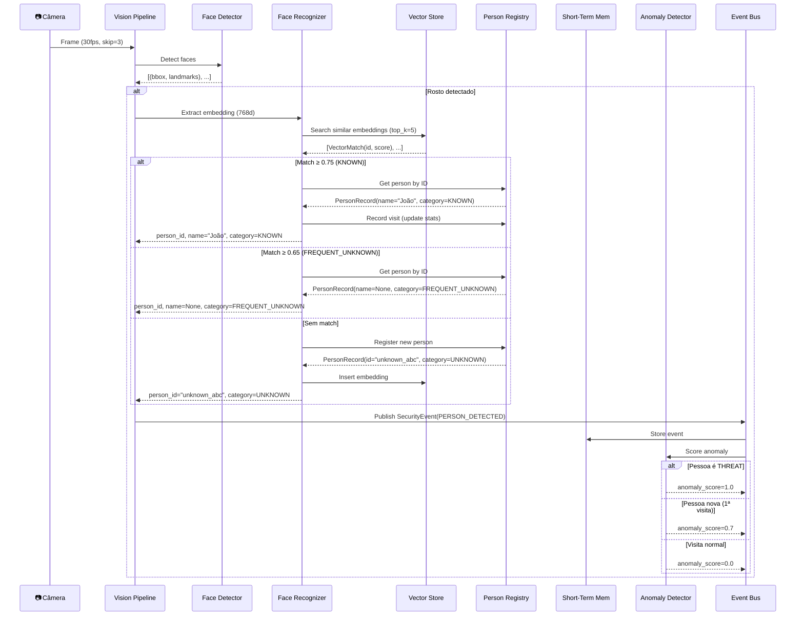
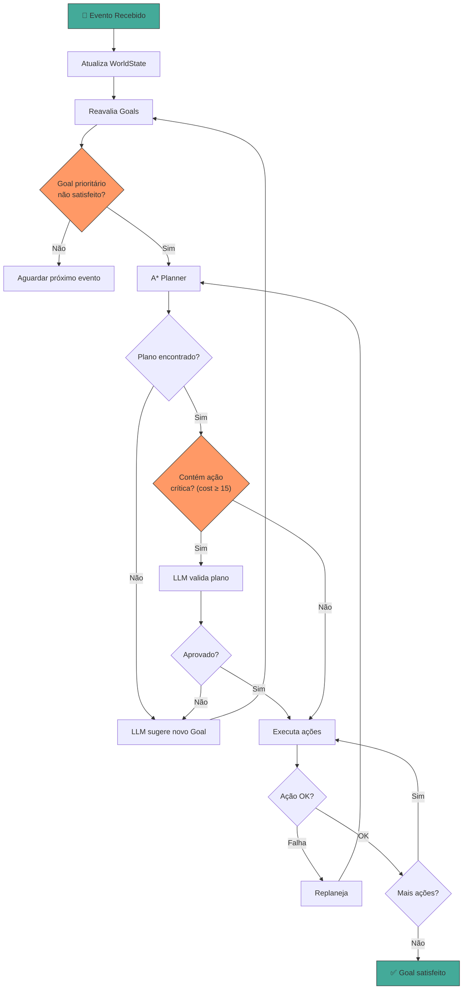
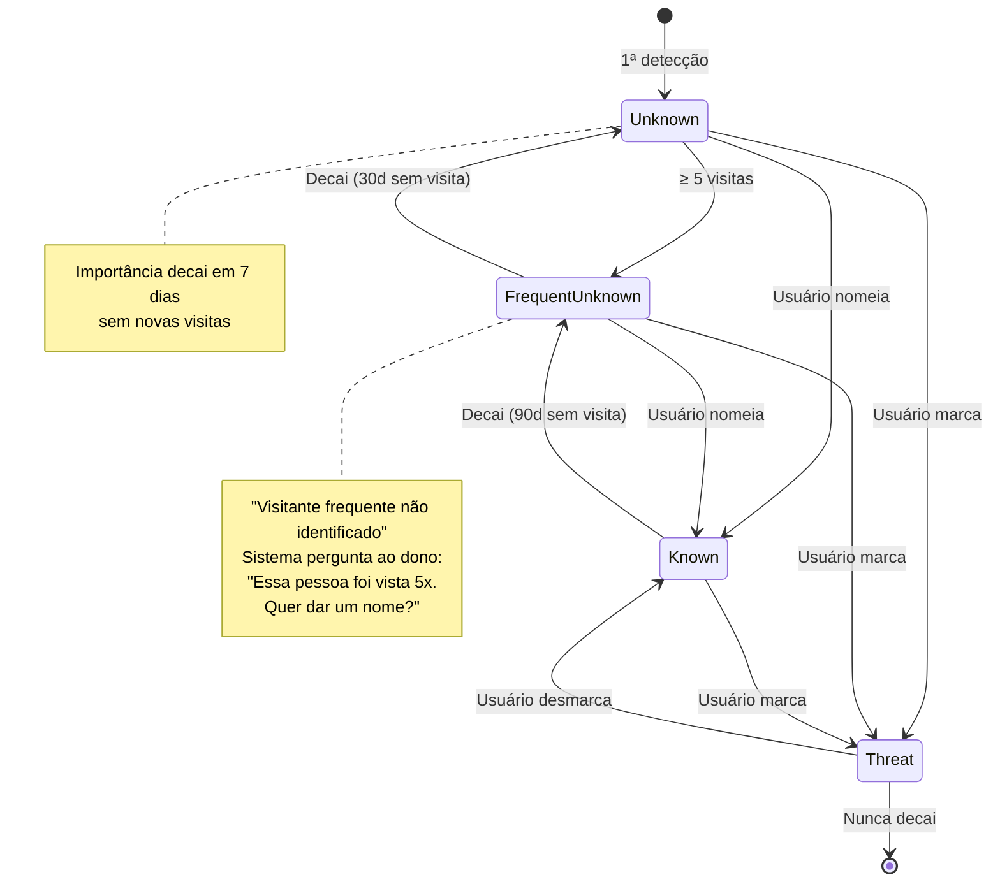

# Sistema de Segurança Inteligente — Diagramas de Fluxo

## 1. Diagrama Geral do Sistema



## 2. Fluxo de Detecção e Identificação de Pessoa



## 3. Fluxo de Decisão GOAP



## 4. Ciclo de Vida de uma Pessoa



## 5. Modos de Operação

```mermaid
flowchart LR
    subgraph Home["🏠 HOME"]
        direction TB
        H1["Alarme: Desativado"]
        H2["Câmeras: Monitorando"]
        H3["Notificações: Apenas anômalo"]
        H4["Ações: Leves"]
    end

    subgraph Away["🚗 AWAY"]
        direction TB
        A1["Alarme: Ativo"]
        A2["Câmeras: Full scan"]
        A3["Notificações: Qualquer movimento"]
        A4["Ações: Lockdown total"]
    end

    subgraph Night["🌙 NIGHT"]
        direction TB
        N1["Alarme: Ativo (perimetral)"]
        N2["Câmeras: Infravermelho"]
        N3["Notificações: Movimento externo"]
        N4["Ações: Moderadas"]
    end

    subgraph Vacation["✈️ VACATION"]
        direction TB
        V1["Alarme: Máximo"]
        V2["Câmeras: Full + gravação"]
        V3["Notificações: Tudo"]
        V4["Ações: Máximas + emergência"]
    end

    Home --> Away: Usuário sai
    Away --> Home: Usuário chega
    Home --> Night: Horário noturno
    Night --> Home: Amanhecer
    Away --> Vacation: Modo férias
    Vacation --> Away: Retorno
```
