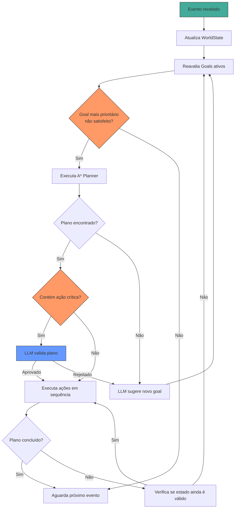

# GOAP Design — Goal-Oriented Action Planning para Segurança

## 1. Conceito

GOAP (Goal-Oriented Action Planning) é um sistema de planejamento que:
1. Define um **estado do mundo** (`WorldState`) com fatos booleanos e numéricos
2. Define **goals** (objetivos) que representam estados desejados
3. Define **actions** (ações) com preconditions e effects
4. Usa busca **A\*** para encontrar a sequência de ações que leva do estado atual ao goal

No contexto de segurança, GOAP oferece:
- **Reatividade inteligente**: reavalia planos quando o mundo muda
- **Composição dinâmica**: combina ações simples para resolver situações complexas
- **Explicabilidade**: cada plano é uma sequência rastreável de ações

---

## 2. Estrutura de Dados

### 2.1 WorldState

```python
@dataclass
class WorldState:
    """Representa o estado atual do mundo como fatos key-value."""

    facts: dict[str, Any]  # ex: {"alarm_active": True, "people_inside": 3}

    # Métodos para comparação (distância de Hamming para A*)
    def distance_to(self, goal: "WorldState") -> float:
        """Calcula distância heurística até o goal."""
        ...

    def satisfies(self, conditions: dict[str, Any]) -> bool:
        """Verifica se o estado atual satisfaz certas condições."""
        ...

    def apply_effects(self, effects: dict[str, Any]) -> "WorldState":
        """Retorna novo estado após aplicar efeitos de uma ação."""
        ...
```

### 2.2 Facts do Mundo de Segurança

```yaml
# Exemplo de world state inicial
facts:
  # Status do sistema
  system_mode: "home"          # home | away | night | vacation | business_hours
  alarm_active: false
  perimeter_secured: true

  # Presença
  people_inside: 2
  people_at_door: 0
  people_in_perimeter: 0
  known_people_inside: ["p1", "p2"]
  unknown_person_present: false

  # Câmeras
  cameras_online: 4
  cameras_with_motion: 0
  cameras_obstructed: 0

  # Áudio
  loud_noise_detected: false
  breaking_glass_detected: false
  gunshot_detected: false

  # Tempo
  time_of_day: "afternoon"
  light_level: "bright"

  # Ameaças
  threat_level: 0             # 0-10
  intrusion_detected: false
  suspicious_activity: false

  # Ambiente
  main_door_locked: true
  garage_door_closed: true
  lights_on: false
```

---

## 3. Goals (Objetivos)

Goals são estados desejados do mundo. O planejador tenta atingi-los.

```python
@dataclass
class Goal:
    name: str
    priority: int               # Maior = mais prioritário
    target_state: dict[str, Any] # Estado alvo (pode ser parcial)
    preconditions: dict[str, Any] # Condições para ativar este goal
    is_persistent: bool          # Se true, reavalia continuamente
    ttl_seconds: float | None    # Timeout do goal
```

### Goals de Exemplo

```python
SECURITY_GOALS = [
    Goal(
        name="eliminate_threat",
        priority=100,
        target_state={"threat_level": 0, "intrusion_detected": False},
        preconditions={"threat_level": (">", 5)},
        is_persistent=False,
    ),
    Goal(
        name="verify_unknown_person",
        priority=80,
        target_state={"unknown_person_present": False},
        preconditions={"unknown_person_present": True},
        is_persistent=False,
    ),
    Goal(
        name="secure_perimeter",
        priority=70,
        target_state={
            "perimeter_secured": True,
            "main_door_locked": True,
            "garage_door_closed": True,
        },
        preconditions={"perimeter_secured": False},
        is_persistent=False,
    ),
    Goal(
        name="maintain_awareness",
        priority=50,
        target_state={"cameras_online": (">=", 1)},
        preconditions={},
        is_persistent=True,
    ),
    Goal(
        name="night_mode_security",
        priority=60,
        target_state={
            "alarm_active": True,
            "lights_on": False,
            "main_door_locked": True,
        },
        preconditions={"time_of_day": "night", "system_mode": "home"},
        is_persistent=True,
    ),
    Goal(
        name="away_mode_full_lockdown",
        priority=85,
        target_state={
            "alarm_active": True,
            "perimeter_secured": True,
            "main_door_locked": True,
            "garage_door_closed": True,
            "cameras_online": (">=", 1),
        },
        preconditions={"system_mode": "away"},
        is_persistent=True,
    ),
    Goal(
        name="welcome_known_person",
        priority=40,
        target_state={"people_at_door": 0},
        preconditions={
            "people_at_door": (">", 0),
            "unknown_person_present": False,
        },
        is_persistent=False,
    ),
]
```

---

## 4. Actions (Ações)

Cada ação tem **preconditions** (o que precisa ser verdade para executar) e **effects** (o que muda após execução).

```python
@dataclass
class GoapAction:
    name: str
    cost: float                    # Custo base (A* minimiza custo total)
    preconditions: dict[str, Any]  # Condições para executar
    effects: dict[str, Any]        # Efeitos no world state
    duration_estimate: float       # Tempo estimado (segundos)
    is_reversible: bool            # Se pode ser desfeita
    max_retries: int = 3

    async def execute(self, context: "AgentContext") -> bool:
        """Executa a ação. Retorna True se sucesso."""
        ...

    async def undo(self, context: "AgentContext") -> bool:
        """Desfaz a ação (se reversível)."""
        ...
```

### Catálogo de Ações

```python
ACTIONS = [
    GoapAction(
        name="activate_alarm",
        cost=1.0,
        preconditions={"alarm_active": False},
        effects={"alarm_active": True, "threat_level": ("-", 2)},
        duration_estimate=0.5,
        is_reversible=True,
    ),
    GoapAction(
        name="deactivate_alarm",
        cost=1.0,
        preconditions={"alarm_active": True},
        effects={"alarm_active": False},
        duration_estimate=0.5,
        is_reversible=True,
    ),
    GoapAction(
        name="lock_main_door",
        cost=2.0,
        preconditions={"main_door_locked": False},
        effects={"main_door_locked": True, "perimeter_secured": True},
        duration_estimate=2.0,
        is_reversible=True,
    ),
    GoapAction(
        name="unlock_main_door",
        cost=2.0,
        preconditions={"main_door_locked": True},
        effects={"main_door_locked": False, "perimeter_secured": False},
        duration_estimate=2.0,
        is_reversible=True,
    ),
    GoapAction(
        name="turn_on_lights",
        cost=1.5,
        preconditions={"lights_on": False},
        effects={"lights_on": True, "light_level": "bright"},
        duration_estimate=1.0,
        is_reversible=True,
    ),
    GoapAction(
        name="send_notification_owner",
        cost=3.0,
        preconditions={},
        effects={"threat_level": ("-", 1)},
        duration_estimate=2.0,
        is_reversible=False,
    ),
    GoapAction(
        name="call_emergency",
        cost=20.0,  # Alto custo — última opção
        preconditions={"threat_level": (">=", 8)},
        effects={"threat_level": ("-", 5)},
        duration_estimate=30.0,
        is_reversible=False,
    ),
    GoapAction(
        name="start_recording",
        cost=1.0,
        preconditions={"cameras_online": (">", 0)},
        effects={"recording_active": True},
        duration_estimate=0.5,
        is_reversible=True,
    ),
    GoapAction(
        name="sound_siren",
        cost=8.0,
        preconditions={"alarm_active": True, "threat_level": (">=", 5)},
        effects={"threat_level": ("-", 3), "intrusion_detected": False},
        duration_estimate=1.0,
        is_reversible=True,
    ),
    GoapAction(
        name="query_llm_situation",
        cost=5.0,
        preconditions={"unknown_person_present": True},
        effects={"unknown_person_present": False},  # LLM pode identificar ou classificar
        duration_estimate=3.0,
        is_reversible=False,
    ),
    GoapAction(
        name="close_garage",
        cost=2.0,
        preconditions={"garage_door_closed": False},
        effects={"garage_door_closed": True, "perimeter_secured": True},
        duration_estimate=3.0,
        is_reversible=True,
    ),
]
```

---

## 5. Planejador (A* Search)

```python
class GoapPlanner:
    """Planejador A* que encontra sequência de ações para atingir um goal."""

    def __init__(self, actions: list[GoapAction]):
        self.actions = actions

    def plan(
        self,
        current_state: WorldState,
        goal: Goal,
        max_depth: int = 10,
        max_iterations: int = 1000,
    ) -> list[GoapAction] | None:
        """
        Retorna sequência de ações ou None se não encontrar plano.

        Heurística: distância do estado atual ao goal (quantos fatos faltam)
        Custo: soma dos custos das ações + penalidade por ações irreversíveis
        """
        open_set = PriorityQueue()
        start_node = PlanNode(state=current_state, actions=[], cost=0)
        open_set.put(start_node, priority=0)

        came_from: dict[tuple, PlanNode] = {}
        g_score: dict[tuple, float] = {current_state.hash(): 0}

        while not open_set.empty() and iterations < max_iterations:
            current = open_set.get()

            if current.state.satisfies(goal.target_state):
                return current.actions

            if len(current.actions) >= max_depth:
                continue

            for action in self._applicable_actions(current.state):
                new_state = current.state.apply_effects(action.effects)
                tentative_g = g_score[current.state.hash()] + action.cost

                if tentative_g < g_score.get(new_state.hash(), inf):
                    g_score[new_state.hash()] = tentative_g
                    h = new_state.distance_to(goal.target_state)
                    f = tentative_g + h

                    new_node = PlanNode(
                        state=new_state,
                        actions=current.actions + [action],
                        cost=tentative_g,
                    )
                    open_set.put(new_node, priority=f)

        return None  # Nenhum plano encontrado
```

---

## 6. Integração GOAP + LLM

O LLM atua em 3 pontos no ciclo GOAP:

### 6.1 Geração de Goals pelo LLM
Quando um evento complexo ocorre, o LLM pode sugerir novos goals:

```python
async def llm_suggest_goals(event: SecurityEvent, world_state: WorldState) -> list[Goal]:
    prompt = f"""
    Evento: {event.description}
    Estado atual: {world_state.facts}
    Pessoas conhecidas: {[p for p in world_state.get_known_people()]}

    Com base nisso, sugira goals de segurança em JSON:
    [{{"name": "...", "priority": 0-100, "target_state": {{...}}, "reasoning": "..."}}]
    """
    response = await llm_client.generate(prompt)
    return parse_goals(response)
```

### 6.2 Validação de Plano pelo LLM
Antes de executar ações irreversíveis (como chamar emergência), o LLM revisa:

```python
async def llm_validate_plan(plan: list[GoapAction], context: dict) -> bool:
    """LLM valida se o plano é apropriado antes de executar ações críticas."""
    critical_actions = [a for a in plan if a.cost >= 15]
    if not critical_actions:
        return True
    # Consulta LLM para validar
    ...
```

### 6.3 LLM como Ação no Plano
A ação `query_llm_situation` pode ser inserida no plano quando há ambiguidade:

```python
GoapAction(
    name="query_llm_situation",
    cost=5.0,
    preconditions={"unknown_person_present": True},
    effects={
        # LLM pode "resolver" a situação classificando a pessoa
        "unknown_person_present": False,  # Se identificar
        # Ou gerar novos facts que disparam novos goals
    },
    duration_estimate=3.0,
    is_reversible=False,
)
```

---

## 7. Ciclo de Vida do GOAP



---

## 8. Exemplo de Execução

### Cenário: Pessoa desconhecida no jardim às 23h

```
Estado Inicial:
  system_mode: "home"
  time_of_day: "night"
  alarm_active: True
  unknown_person_present: True
  perimeter_secured: False  ← pessoa está no jardim
  main_door_locked: True
  threat_level: 3

Goal Ativado: "verify_unknown_person" (priority=80)

Plano gerado pelo A*:
  1. start_recording        (cost=1.0)
  2. query_llm_situation    (cost=5.0)  ← LLM analisa se é ameaça
  3. turn_on_lights         (cost=1.5)  ← tenta afugentar
  4. send_notification_owner(cost=3.0)  ← notifica dono

Custo total: 10.5 (bom plano, sem ações extremas)

Se após 2min a pessoa ainda estiver lá:
  threat_level sobe para 6
  Goal Ativado: "eliminate_threat" (priority=100)

Novo plano:
  1. sound_siren            (cost=8.0)
  2. call_emergency         (cost=20.0) ← se LLM validar
```

---

## 9. Estado do Mundo Compartilhado

O `WorldState` é atualizado por TODOS os componentes do sistema:

| Fonte | Facts atualizados |
|-------|------------------|
| Câmera + CV | `people_at_door`, `people_inside`, `unknown_person_present` |
| Sensores porta/janela | `main_door_locked`, `perimeter_secured` |
| Áudio | `breaking_glass_detected`, `gunshot_detected` |
| Relógio | `time_of_day` |
| Usuário (app) | `system_mode` |
| Ações executadas | `alarm_active`, `lights_on`, etc. |

---

## 10. Tratamento de Conflitos

Quando múltiplos goals estão ativos:
1. **Prioridade**: goals de maior prioridade são resolvidos primeiro
2. **Composição**: se goals não conflitam, ações podem ser intercaladas
3. **Preempção**: um goal de prioridade mais alta interrompe o plano atual
4. **Timeout**: se um plano demora muito, é descartado e replanejado
