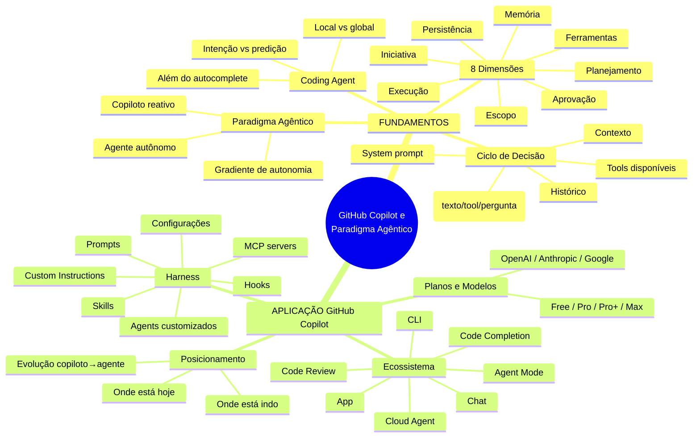
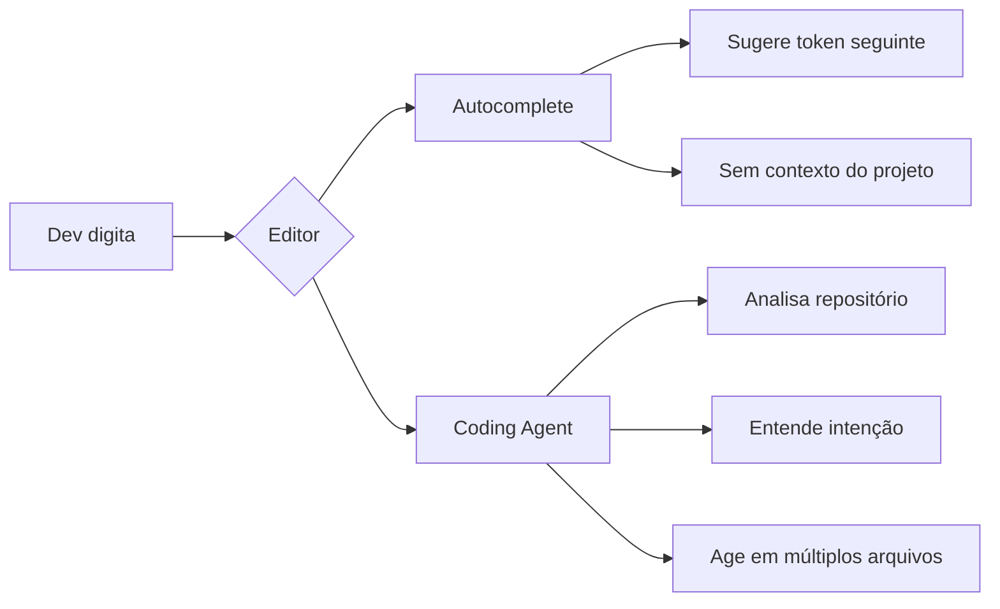
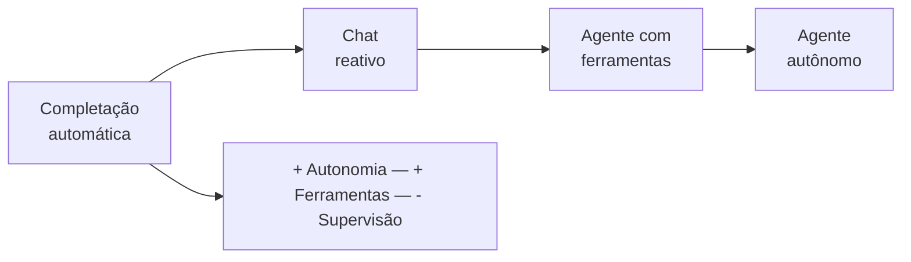
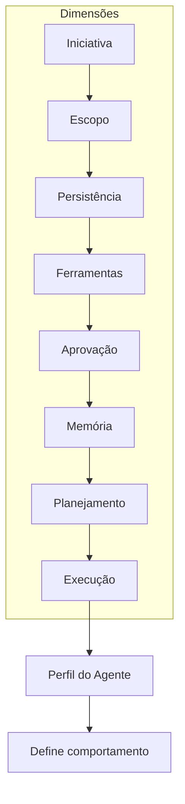
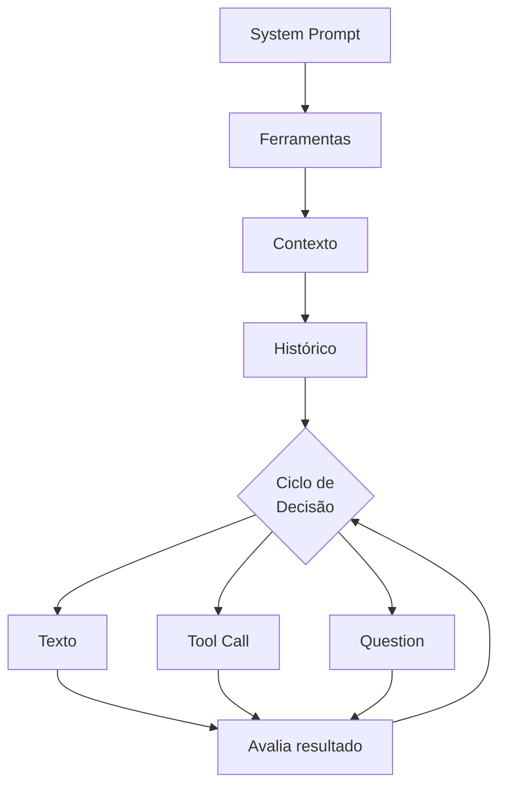
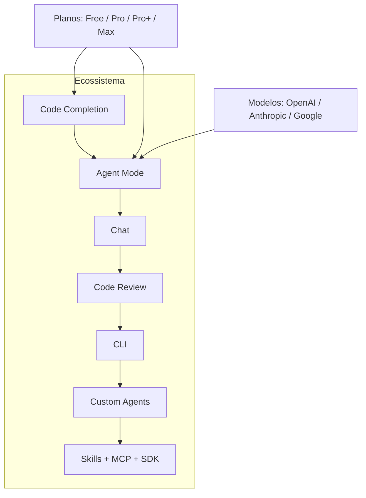
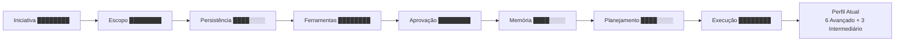
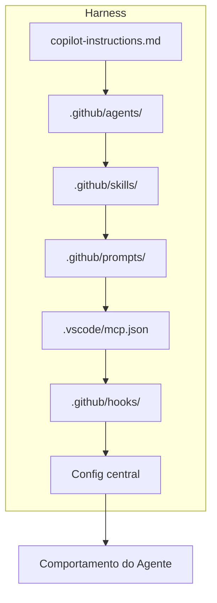

# Harness do GitHub Copilot e Programação Agêntica com VS Code — Aula 01

## Ecossistema GitHub Copilot e o Paradigma Agêntico

- **Duração:** 60 minutos (40 de leitura + 20 de prática)
- **Nível:** Intermediário
- **Pré-requisitos:** Programação em nível intermediário. Git e GitHub (clone, push, pull, issues). HTML, CSS e JavaScript básicos. VS Code ou editor similar.

---

## Objetivos de Aprendizagem

- [ ] **Definir** o que é um coding agent e como ele se diferencia de ferramentas de autocomplete tradicionais
- [ ] **Distinguir** entre os paradigmas de assistente reativo (copiloto) e agente autônomo, explicando o que caracteriza cada um
- [ ] **Identificar** as 8 dimensões da agencialidade — iniciativa, escopo, persistência, ferramentas, aprovação, memória, planejamento e execução — e descrever o que cada uma mede
- [ ] **Explicar** o ciclo fundamental de decisão de um coding agent: system prompt, tools disponíveis, contexto, histórico e os 3 tipos de decisão (texto, tool call ou pergunta)
- [ ] **Mapear** os produtos do ecossistema GitHub Copilot (Code Completion, Chat, Agent Mode, Cloud Agent, CLI, Code Review, App) e descrever a função de cada um
- [ ] **Comparar** os planos disponíveis (Free, Pro, Pro+, Max) e os modelos de IA oferecidos (OpenAI, Anthropic, Google), entendendo a relação entre plano, créditos e acesso a modelos premium
- [ ] **Posicionar** o GitHub Copilot nas 8 dimensões da agencialidade, identificando em quais dimensões ele atua como copiloto e em quais atua como agente
- [ ] **Explicar** o conceito de harness — o conjunto de instruções, ferramentas e configurações que governa o comportamento do agente — e por que ele é o fio condutor deste curso
- [ ] **Comparar** os níveis de autonomia de um agente (Default Approvals, Bypass Approvals, Autopilot) e avaliar os trade-offs entre controle humano e velocidade de execução
- [ ] **Reconhecer** as 9 famílias de ferramentas (tool sets) disponíveis para coding agents modernos e seus propósitos: #edit, #read, #search, #execute, #vscode, #web, #todos, #browser, #agent

---

## Como Usar Esta Aula

Esta é a **aula dos fundamentos** — você não vai instalar extensões, escrever código nem abrir o terminal. Cada conceito que você aprender aqui será aplicado nas próximas 11 aulas. Pense nela como a aula de teoria musical antes de pegar o instrumento.

A aula está organizada em duas partes:

- **Parte 1 — FUNDAMENTOS (Seções 1 a 4):** Conceitos universais sobre coding agents — o que são, como funcionam, como medir sua agencialidade. Estes conceitos valem para qualquer ferramenta, independentemente de marca ou produto.
- **Parte 2 — APLICAÇÃO (Seções 5 a 7):** O ecossistema GitHub Copilot e o conceito de harness. Aqui conectamos os conceitos da Parte 1 a implementações concretas.

Ao longo de cada seção, você encontra **Quick Checks** (perguntas rápidas para verificar seu entendimento antes de avançar). Ao final, o arquivo **Questões de Aprendizagem** (separado deste arquivo) traz tarefas de checkpoint — só avance para a Aula 02 quando conseguir completá-las por conta própria.

**Tempo estimado:** 60 minutos (40 de leitura com Quick Checks + 20 de exercícios e quiz).

---

## Mapa Mental

---

**FUNDAMENTOS: Mecanismos Universais de Coding Agents**
> *O que todo desenvolvedor precisa saber sobre agentes de programação — sem depender de marcas ou produtos específicos.*

---

## 1. O Que é um Coding Agent?

Tradicionalmente, ferramentas de edição de código se comportam como dicionários ou corretores ortográficos: você digita e elas sugerem a próxima palavra ou a linha seguinte com base em padrões estatísticos. Um **coding agent** representa um salto qualitativo: ele não apenas completa — ele *entende*, *planeja* e *executa*.

**Autocomplete** funciona como um corretor ortográfico de e-mail: você escreve "Que" e ele sugere "tal". Não há compreensão do parágrafo, apenas da sequência imediata de tokens. A ferramenta reage ao que você faz, token a token.

**Coding Agent** funciona como um colega de trabalho que leu o e-mail inteiro antes de sugerir a resposta. Ele analisa o repositório, entende a arquitetura do projeto, identifica padrões nos arquivos abertos e decide qual ação tomar — seja editar um bloco de código, criar um novo arquivo, executar um comando no terminal ou fazer uma pergunta de esclarecimento.

A diferença fundamental está na **direcionalidade**: autocomplete é um fenômeno *reativo* (resposta a um estímulo imediato), enquanto o coding agent é *proativo* (pode iniciar ações sem gatilho token a token).

> *Autocomplete responde ao último caractere; coding agent responde ao último commit.*

### Quick Check — Seção 1

**1.** Qual a diferença essencial entre autocomplete e coding agent?
**Resposta:** Autocomplete reage ao caractere digitado e sugere o próximo token sem contexto do projeto; coding agent analisa o repositório, entende a intenção e executa ações planejadas em múltiplos arquivos.

**2.** A analogia usada compara autocomplete a qual ferramenta do dia a dia?
**Resposta:** A um corretor ortográfico que sugere a próxima palavra sem entender o parágrafo inteiro.

---

## 2. Copiloto vs. Agente — O Paradigma Shift

Nem toda interação com um coding agent é igual. Existe um **espectro** que vai do modo mais reativo (copiloto) ao mais autônomo (agente). A palavra "copiloto" originalmente descrevia um assistente passivo que apenas respondia a perguntas — como um copiloto humano que fala mas não toca nos controles.

**Modo Copiloto (Reativo):**
- Você pergunta, a ferramenta responde
- Nenhuma ação no editor sem sua aprovação explícita
- Ideal para exploração, dúvidas pontuais, aprendizado

**Modo Agente (Autônomo):**
- A ferramenta recebe um objetivo e decide o plano
- Pode ler arquivos, editá-los, executar comandos, criar novos recursos
- Solicita aprovação apenas em ações de alto risco
- Ideal para tarefas multi-arquivo, refatorações, geração de boilerplate

> *Copiloto responde perguntas; agente executa tarefas.*

A analogia útil é com carros: o modo copiloto é um carro manual onde cada marcha exige sua ação; o modo agente é o piloto automático que mantém velocidade, direção e distância — mas você ainda pode assumir o controle a qualquer momento.

### Quick Check — Seção 2

**1.** Em que posição do espectro um agente autônomo se diferencia de um chat reativo?
**Resposta:** Um chat reativo apenas responde perguntas sem agir no editor; um agente autônomo recebe um objetivo, planeia os passos e executa ações como ler, editar e criar arquivos.

**2.** Qual analogia é usada para descrever a diferença entre copiloto e agente?
**Resposta:** Carro manual (copiloto — cada ação exige intervenção) vs. piloto automático (agente — mantém curso com supervisão eventual).

---

## 3. As 8 Dimensões da Agencialidade

Nem todo coding agent é igual. Para comparar ferramentas de forma objetiva, usamos **8 dimensões** que funcionam como sliders em um mixer de áudio — cada uma pode estar em um nível diferente, e o perfil resultante define o comportamento do agente.

| Dimensão | Mínimo | Máximo |
|---|---|---|
| Iniciativa | Responde apenas | Age proativamente |
| Escopo | Linha atual | Repositório inteiro |
| Persistência | Esquece após resposta | Mantém estado entre turnos |
| Ferramentas | Nenhuma | Leitura, edição, terminal, web, busca |
| Aprovação | Tudo exige confirmação | Executa sem supervisão |
| Memória | Zero contexto | Acesso ao git log + arquivos |
| Planejamento | Passo único | Plano multi-etapas |
| Execução | Só texto | Edita, executa, navega, pergunta |

> *Assim como um mixer de áudio, cada dimensão é um slider. O perfil do agente é a soma de todas as posições.*

**As 8 Dimensões em Ação**

> Cenário: um desenvolvedor pede "refatore este componente para usar hooks".
>
> *Iniciativa:* o agente começa a análise sem esperar cada linha. *Escopo:* lê o arquivo inteiro e dependências. *Persistência:* lembra que você pediu estilo consistente na mensagem anterior. *Ferramentas:* usa busca para encontrar usos do componente em outros arquivos. *Aprovação:* executa a refatoração e mostra o diff para revisão. *Memória:* consulta o git log para entender mudanças recentes. *Planejamento:* divide em 4 passos (analisar, refatorar, testar, validar). *Execução:* edita 3 arquivos, executa os testes e pergunta se quer commit.

### Quick Check — Seção 3

**1.** Quantas dimensões compõem o modelo de agencialidade apresentado?
**Resposta:** Oito dimensões: Iniciativa, Escopo, Persistência, Ferramentas, Aprovação, Memória, Planejamento e Execução.

**2.** Qual analogia é usada para explicar como as dimensões interagem?
**Resposta:** A de um mixer de áudio — cada dimensão é um slider que pode estar em diferentes posições, e o perfil resultante é a soma de todas elas.

---

## 4. Como um Coding Agent Funciona — O Ciclo de Decisão

Internamente, todo coding agent segue um ciclo de decisão que se repete a cada interação. Esse ciclo independe do produto ou marca e pode ser descrito em 5 componentes.

1. **System Prompt** — Instruções fundamentais que definem o papel, as regras e as limitações do agente. É o "código de conduta" que o agente nunca esquece.
2. **Ferramentas** — O conjunto de capacidades que o agente pode invocar: ler arquivos, editar linhas, executar comandos, buscar na web, etc. Cada ferramenta tem uma assinatura (nome + parâmetros + descrição).
3. **Contexto** — O estado atual da conversa: arquivos abertos, seleção, terminal, estrutura do projeto. Alimenta a compreensão situacional do agente.
4. **Histórico** — Mensagens anteriores da conversa, incluindo o que o agente já fez e o que o usuário já solicitou. Permite coerência entre turnos.
5. **Decisão** — A cada ciclo, o agente escolhe uma entre três saídas possíveis:
   - **Texto:** responde diretamente ao usuário (explicação, pergunta)
   - **Tool Call:** invoca uma ferramenta (editar arquivo, executar comando)
   - **Question:** pede esclarecimento ao usuário quando informações são insuficientes

> *Pense no ciclo como uma API REST: o system prompt é o endpoint base, as ferramentas são os métodos disponíveis e o contexto+histórico são os headers da requisição.*

O ciclo é contínuo: após cada ação, o agente avalia o resultado (sucesso, erro, informação nova) e realimenta o ciclo para a próxima decisão. O loop só termina quando o objetivo é alcançado, um limite é atingido ou o usuário interrompe.

### Quick Check — Seção 4

**1.** Quais são os 5 componentes do ciclo de decisão de um coding agent?
**Resposta:** System prompt, ferramentas, contexto, histórico e decisão (que pode produzir texto, tool call ou question).

**2.** Quais são as três saídas possíveis em cada ciclo de decisão?
**Resposta:** Texto (resposta direta), Tool Call (invocação de ferramenta) e Question (pedido de esclarecimento ao usuário).

---

**APLICAÇÃO: O GitHub Copilot — Do Ecossistema ao Harness**

> *Agora que entendemos os mecanismos universais — coding agent vs autocomplete (Seção 1), espectro copiloto-agente (Seção 2), as 8 dimensões da agencialidade (Seção 3) e o ciclo de decisão (Seção 4) — vamos aplicá-los ao ecossistema e ao conceito de harness.*

---

## 5. O Ecossistema GitHub Copilot

O ecossistema atual vai muito além da completação de código. São 12 produtos em GA (General Availability), além de recursos em Technical Preview, que cobrem todo o ciclo de desenvolvimento.

### 5.1 Produtos e Capacidades

| Produto | Função |
|---|---|
| Code Completion | Sugestões inline durante a digitação |
| Next Edit Suggestions | Predição da próxima edição |
| Chat | Assistente conversacional no editor |
| Agent Mode | Loop Understand-Act-Validate (autônomo) |
| Cloud Agent | Agente executado em cloud |
| CLI | Assistente no terminal |
| Code Review | Revisão automatizada de PRs |
| PR Summaries | Resumo automático de pull requests |
| Custom Agents | Agentes especializados criados pelo usuário |
| Agent Skills | Habilidades modulares para agentes |
| MCP | Model Context Protocol — conexão com APIs externas |
| SDK | Kit de desenvolvimento para extensões |

### 5.2 Planos e Preços

| Plano | Preço | Créditos/mês | Principais Restrições |
|---|---|---|---|
| Free | US$ 0 | limitados | Code Completion e Chat limitados, sem modelos premium |
| Pro | US$ 10 | 1.500 | Agentes, skills e MCP liberados |
| Pro+ | US$ 39 | 7.000 | Modelos premium, rate limits maiores |
| Max | US$ 100 | 20.000 | Uso irrestrito, prioridade máxima |

**Conjuntos de ferramentas disponíveis:** 9 tool sets — `#edit`, `#read`, `#search`, `#execute`, `#vscode`, `#web`, `#todos`, `#browser`, `#agent`.

### 5.3 Modelos de IA

| Provedor | Modelos |
|---|---|
| OpenAI | GPT-5 mini, GPT-5.2, GPT-5.2-Codex, GPT-5.3-Codex, GPT-5.4, GPT-5.5 |
| Anthropic | Claude Haiku 4.5, Sonnet 4/4.5/4.6, Opus 4.5/4.6/4.7/4.8 |
| Google | Gemini 2.5 Pro, Gemini 3 Flash, Gemini 3.1 Pro, Gemini 3.5 Flash |

O **Agent Mode** merece destaque: implementa o loop **Understand → Act → Validate**, com três níveis de autonomia — **Default** (aprova por ação), **Bypass** (aprova por arquivo) e **Autopilot** (execução contínua sem aprovação).

### Quick Check — Seção 5

**1.** Quantos produtos em GA compõem o ecossistema atualmente?
**Resposta:** Doze produtos em General Availability, incluindo Code Completion, Agent Mode, CLI, Code Review, MCP e SDK.

**2.** Quais são os três níveis de autonomia do Agent Mode?
**Resposta:** Default (aprova por ação), Bypass (aprova por arquivo) e Autopilot (execução contínua).

---

## 6. O Copilot nas 8 Dimensões

Aplicando o modelo da Seção 3 ao ecossistema, podemos posicionar cada dimensão no estado atual.

| Dimensão | Posição Atual | Status |
|---|---|---|
| Iniciativa | Age proativamente (Agent Mode) | Avançado |
| Escopo | Repositório inteiro (com limitações) | Avançado |
| Persistência | Mantém estado entre turnos na sessão | Intermediário |
| Ferramentas | 9 tool sets integrados | Avançado |
| Aprovação | Configurável (Default/Bypass/Autopilot) | Avançado |
| Memória | Contexto da conversa + projeto aberto | Intermediário |
| Planejamento | Planos multi-etapas no Agent Mode | Intermediário |
| Execução | Edita, executa, navega, pergunta | Avançado |

**Interpretação:** 5 dimensões em estágio avançado e 3 em intermediário. Persistência, memória e planejamento são as frentes com maior potencial de evolução. As dimensões mais maduras (Iniciativa, Ferramentas, Execução) refletem o foco do ecossistema em autonomia e riqueza de ferramentas.

> *Onde as dimensões estão mais baixas é onde o ecossistema mais evoluiu nos últimos ciclos — e onde o usuário mais se beneficia de configuração refinada.*

### Quick Check — Seção 6

**1.** Quantas dimensões estão em estágio avançado no ecossistema?
**Resposta:** Cinco — Iniciativa, Escopo, Ferramentas, Aprovação e Execução. Três estão em intermediário: Persistência, Memória e Planejamento.

**2.** Quais dimensões têm maior potencial de evolução futura?
**Resposta:** Persistência, Memória e Planejamento — as três que ainda estão em estágio intermediário.

---

## 7. O Conceito de Harness

**Harness** é o sistema de configuração, instruções e extensões que molda o comportamento do coding agent. Se o agente é o motor, o harness é o volante, os pedais e o painel de instrumentos — é o que permite dirigir o agente em vez de apenas ser levado por ele.

Um harness completo é composto por:

| Componente | Arquivo / Local | Função |
|---|---|---|
| Custom Instructions | `.github/copilot-instructions.md` | Regras globais de comportamento |
| Conditional Instructions | .github/instructions/*.instructions.md | Regras que se aplicam a arquivos específicos |
| Custom Agents | `.github/agents/` | Agentes especializados por domínio |
| Skills | `.github/skills/` | Habilidades modulares reutilizáveis |
| Prompts | `.github/prompts/` | Templates de prompt para tarefas |
| MCP Servers | `.vscode/mcp.json` | Conexão com APIs e ferramentas externas |
| Hooks | `.github/hooks/` | Gatilhos para eventos do ciclo |
| Config | `.vscode/settings.json` | Configuração central do harness |

> *Harness não é um produto — é uma prática. É a camada que separa o usuário que apenas consome IA do usuário que a domina.*

**Visão do Curso**

Este módulo inteiro é construído em torno do harness. Cada aula adiciona uma peça:

- **Aula 01 (esta):** fundamentos e visão geral do ecossistema
- **Aula 02:** setup, instalação e primeiros passos no VS Code
- **Aulas seguintes:** configuração de cada componente do harness — custom instructions, custom agents, skills, prompts, MCP, hooks

O projeto prático que construiremos ao longo do curso é o **Portal de Projetos Dev**: um dashboard HTML+CSS+JS vanilla que evoluirá conforme configuramos cada parte do harness.

### Quick Check — Seção 7

**1.** O que significa "harness" no contexto de coding agents?
**Resposta:** É o sistema de configuração, instruções e extensões que molda o comportamento do agente — o volante e os pedais que permitem dirigir o agente.

**2.** Em quais diretórios ficam os Custom Agents e as Skills no harness?
**Resposta:** Custom Agents em `.github/agents/` e Skills em `.github/skills/`. Prompts ficam em `.github/prompts/` e MCP em `.vscode/mcp.json`.

---

## Autoavaliação: Quiz Rápido

**1.** Qual a principal diferença entre autocomplete e coding agent?

**Resposta:** Autocomplete sugere o próximo token sem contexto; coding agent entende o projeto, planeja ações e executa em múltiplos arquivos.

**2.** Quantas dimensões compõem o modelo de agencialidade?

**Resposta:** Oito.

**3.** Quais são as três saídas possíveis no ciclo de decisão de um coding agent?

**Resposta:** Texto, Tool Call e Question.

**4.** Quantos produtos em GA o ecossistema do Copilot oferece atualmente?

**Resposta:** Doze.

**5.** Qual o plano que libera agentes, skills e MCP por US$ 10/mês?

**Resposta:** O plano Pro.

**6.** Quantas tool sets estão disponíveis no ecossistema?

**Resposta:** Nove — #edit, #read, #search, #execute, #vscode, #web, #todos, #browser, #agent.

**7.** O que é o harness e onde ele fica no repositório?

**Resposta:** É o sistema de configuração do agente, localizado em `.github/` (instructions, agents, skills, prompts, hooks) e `.vscode/mcp.json`.

---

## Mão na Massa: Exercícios Graduados

### Fácil — Mapeamento de Dimensões

Escolha uma ferramenta de IA que você usa no dia a dia (qualquer uma — ChatGPT, Claude, Gemini, etc.) e posicione-a nas 8 dimensões da agencialidade. Para cada dimensão, atribua um valor de 0 a 5 e justifique em uma frase.

**Gabarito:** Resposta pessoal. Exemplo para um chat comum: Iniciativa=1 (só responde), Escopo=2 (só o prompt), Persistência=3 (mantém conversa), Ferramentas=0 (só texto), Aprovação=5 (nada executa sem você), Memória=2 (só a conversa), Planejamento=0 (passo único), Execução=0 (só texto).

### Médio — Ciclo de Decisão no Papel

Descreva passo a passo o ciclo de decisão que um coding agent executaria para a tarefa: "Crie um arquivo `utils/helpers.js` com uma função `formatDate` que recebe uma string ISO e retorna data formatada no padrão brasileiro." Identifique em cada passo qual componente do ciclo está sendo usado (system prompt, ferramenta, contexto, histórico, decisão).

**Gabarito:** 1. System prompt define que o agente pode criar arquivos. 2. Contexto informa que o projeto existe e está aberto. 3. Ferramenta `#read` verifica se `utils/` existe. 4. Decisão: tool call para criar diretório. 5. Contexto atualiza com sucesso. 6. Decisão: tool call para escrever arquivo com o código. 7. Histórico registra toda a sequência. 8. Decisão final: texto confirmando a criação.

### Difícil — Desenhe o Harness de um Projeto Real

Pense em um projeto real que você mantém ou conhece bem (pode ser open source). Desenhe (em markdown, como lista ou diagrama textual) como seria o harness ideal para esse projeto: quais instruções custom você colocaria, que tipo de custom agents criaria, que skills seriam úteis e que MCP tools você conectaria. Justifique cada escolha.

**Gabarito:** Resposta pessoal. Deve incluir: (a) pelo menos 3 instruções custom específicas do domínio do projeto, (b) 1-2 custom agents com propósito definido, (c) 1-2 skills modulares e (d) pelo menos 1 MCP server com justificativa de conexão.

---

## Resumo da Aula

- **Coding agents** diferem de autocomplete por entenderem o contexto, planejarem ações e executarem em múltiplos arquivos
- O **espectro copiloto-agente** vai do modo reativo (responde perguntas) ao autônomo (executa sem supervisão)
- **8 dimensões da agencialidade** — Iniciativa, Escopo, Persistência, Ferramentas, Aprovação, Memória, Planejamento, Execução — permitem comparar qualquer coding agent objetivamente
- O **ciclo de decisão** (system prompt, ferramentas, contexto, histórico, decisão) é o motor interno que todo coding agent compartilha
- O **ecossistema** tem 12 produtos GA, 4 planos (Free a Max) e 3 provedores de modelo (OpenAI, Anthropic, Google)
- O **Agent Mode** opera em loop Understand-Act-Validate com 3 níveis de autonomia
- **9 tool sets** habilitam diferentes capacidades nos agentes
- O **harness** é o sistema de configuração que molda o comportamento do agente — composto por custom instructions, agents, skills, prompts, MCP e hooks

---

## Próxima Aula

**Aula 02: Setup, Instalação e Primeiros Passos no VS Code** — Instalação da extensão, configuração inicial, escolha de modelos, primeiros comandos no Agent Mode e criação do projeto Portal de Projetos Dev.

---

## Referências

### Documentação Oficial

- [GitHub Copilot — Documentação Oficial](https://docs.github.com/en/copilot) — features, planos, custom instructions, agentes, MCP
- [VS Code — Agents Overview](https://code.visualstudio.com/docs/agents/overview) — agent mode, contexto, custom instructions
- [Model Context Protocol](https://modelcontextprotocol.io/) — especificação oficial do protocolo MCP

### Planos e Preços

- [GitHub Copilot — Planos e Preços](https://docs.github.com/en/copilot/get-started/plans) — comparação Free, Pro, Pro+, Max
- [Modelos e Pricing](https://docs.github.com/en/copilot/reference/copilot-billing/models-and-pricing) — lista atualizada de modelos disponíveis por plano

### Comunidade e Ecossistema

- [awesome-copilot](https://github.com/github/awesome-copilot) — 500+ recursos curados: agents, instructions, skills, plugins, hooks
- [GitHub Copilot SDK](https://github.com/github/copilot-sdk) — SDK multi-linguagem para extensões

### Leitura Complementar

- [Agentskills.io](https://agentskills.io/specification) — especificação de Agent Skills
- [MCP Registry](https://github.com/mcp) — 98 servidores MCP curados

---

## FAQ

**1. Preciso saber programação avançada para aproveitar esta aula?**

Não. Navegação básica em IDE e familiaridade com terminal são suficientes. Os conceitos são apresentados progressivamente.

**2. Esta aula funciona se eu uso outro ecossistema de IA?**

Sim. A Parte 1 (Seções 1-4) é independente de produto. Os conceitos se aplicam a qualquer coding agent do mercado.

**3. O que eu preciso instalar antes da Aula 02?**

Apenas o VS Code. A instalação da extensão e configurações serão feitas durante a Aula 02.

**4. Qual a diferença entre Pro e Pro+?**

Pro (US$ 10/mês, 1.500 créditos) é suficiente para uso individual. Pro+ (US$ 39/mês, 7.000 créditos) adiciona modelos premium e rate limits maiores.

**5. O plano Free é suficiente para aprender?**

Sim. O plano Free inclui Code Completion e Chat limitado — suficientes para acompanhar as aulas e fazer os exercícios iniciais.

**6. O Agent Mode gasta créditos diferente do Chat?**

Sim. Cada tool call no Agent Mode consome créditos adicionais. Ações de leitura geralmente custam menos que ações de escrita.

**7. O que são os "9 tool sets"?**

São categorias de ferramentas que os agentes podem usar: #edit, #read, #search, #execute, #vscode, #web, #todos, #browser e #agent.

**8. Harness é a mesma coisa que configuração?**

Configuração é parte do harness. O harness inclui também custom agents, skills, MCP servers e hooks — é um sistema completo de orquestração.

**9. Posso compartilhar meu harness com o time?**

Sim. Todo harness é baseado em arquivos no repositório (`.github/` e `.vscode/`), o que facilita versionamento e compartilhamento.

**10. O que acontece se eu não configurar o harness?**

O agente funciona com configurações padrão. O harness é uma camada opcional de refinamento — você pode começar sem ele e adicionar conforme aprende.

---

## Glossário

| Termo | Definição |
|---|---|
| **Agente Autônomo** | Coding agent que executa tarefas sem aprovação passo a passo |
| **Agent Mode** | Modo operacional do Copilot com loop Understand-Act-Validate |
| **Autocomplete** | Sugestão de código token a token sem contexto do projeto |
| **Bypass** | Nível de autonomia que aprova por arquivo, não por ação |
| **Coding Agent** | Ferramenta de IA que entende, planeja e executa código |
| **Contexto** | Estado atual do projeto e da conversa alimentando o agente |
| **Créditos** | Unidade de consumo para uso de agentes e modelos premium |
| **Custom Agent** | Agente especializado criado pelo usuário para domínios específicos |
| **Default** | Nível de autonomia que exige aprovação por ação individual |
| **Harness** | Sistema de configuração que molda o comportamento do agente |
| **Hooks** | Gatilhos para eventos do ciclo de decisão |
| **MCP** | Model Context Protocol — protocolo de conexão com APIs externas |
| **Memória** | Capacidade do agente de reter e consultar informações entre turnos |
| **Persistência** | Continuidade do estado do agente entre interações |
| **Plano Free** | Plano gratuito com Code Completion e Chat limitados |
| **Plano Pro** | Plano de US$ 10/mês com 1.500 créditos e agentes liberados |
| **Skill** | Habilidade modular reutilizável para coding agents |
| **Tool Call** | Invocação de uma ferramenta pelo agente durante o ciclo de decisão |
| **Tool Set** | Categoria de ferramentas disponíveis para o agente (ex: #edit, #search) |
| **System Prompt** | Instruções fundamentais que definem o papel e as regras do agente |
