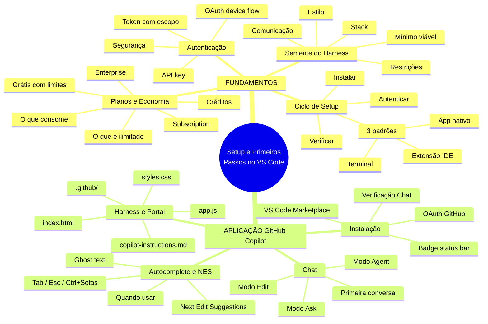
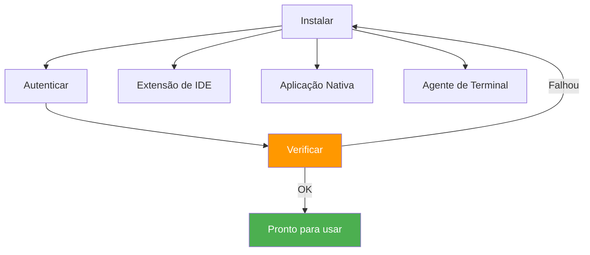
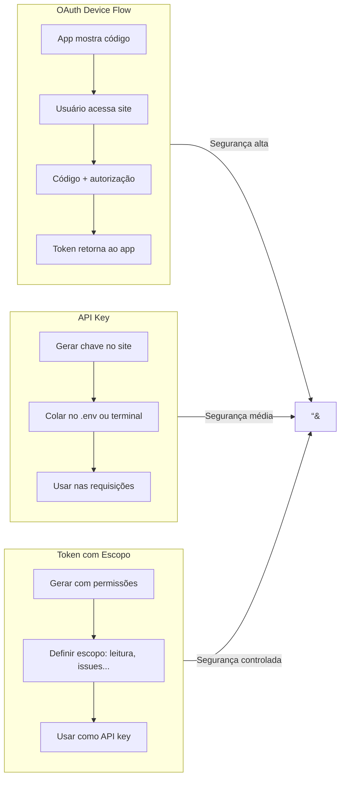
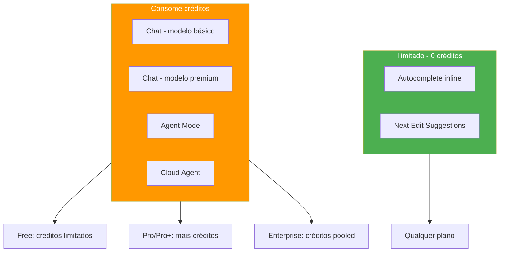
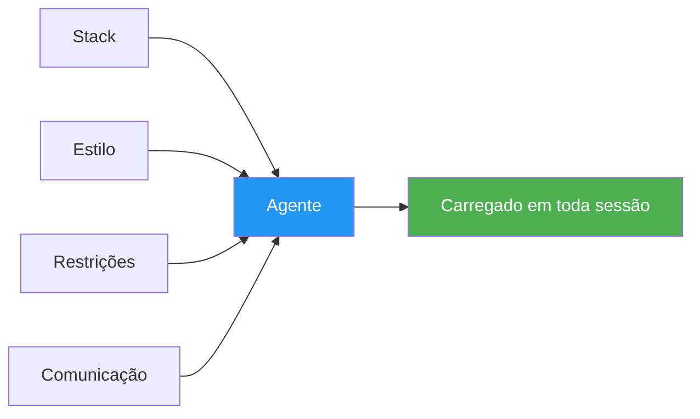
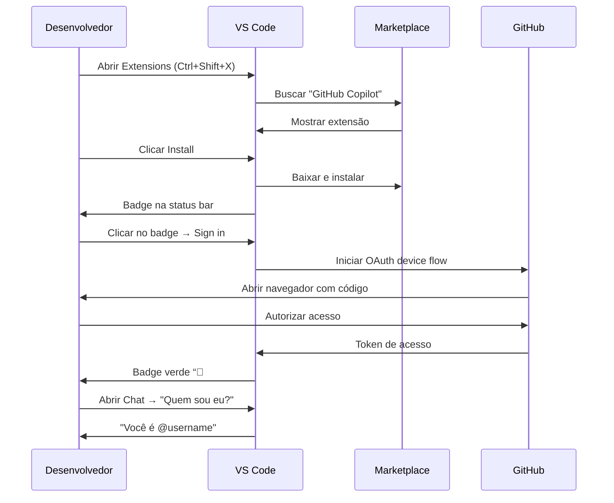
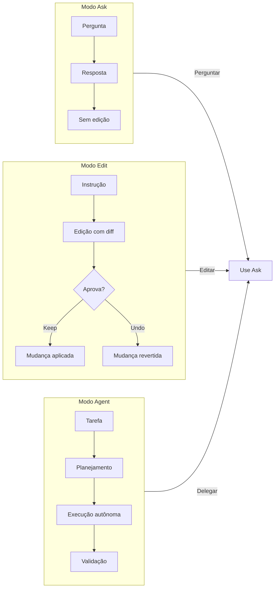
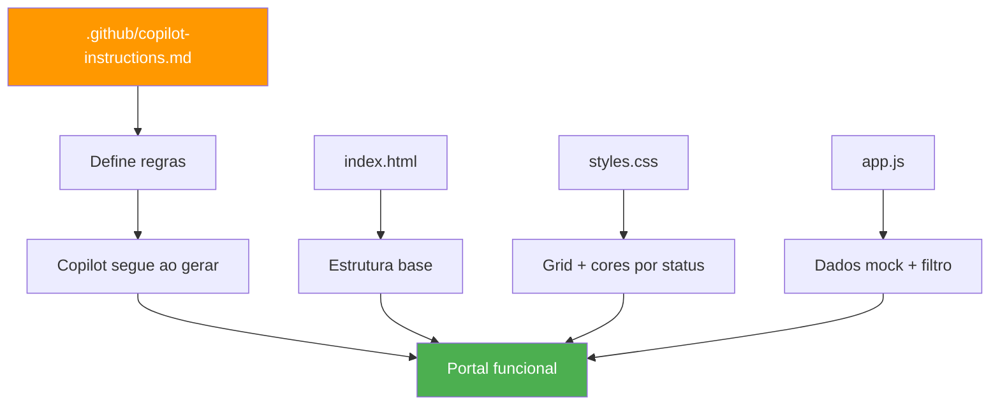

# Harness do GitHub Copilot e Programação Agêntica com VS Code — Aula 02

## Setup, Instalação e Primeiros Passos no VS Code

**Duração estimada:** 75 minutos (40 de leitura + 35 de prática)
**Nível:** Intermediário
**Pré-requisitos:** Aula 01 concluída — você já entende o que é um coding agent, as 8 dimensões da agencialidade e o ecossistema do GitHub Copilot. VS Code instalado, Git configurado, conta GitHub ativa.

---

## Objetivos de Aprendizagem

Ao final desta aula, você será capaz de:

- [ ] **Descrever** o ciclo universal de setup de um coding agent — instalar, autenticar e verificar — e reconhecer os três padrões de instalação (extensão de IDE, aplicação nativa, agente de terminal)
- [ ] **Explicar** os padrões de autenticação de coding agents (OAuth device flow, API keys, tokens de acesso) e por que a autenticação é necessária para segurança, quotas e personalização
- [ ] **Comparar** modelos de precificação de coding agents (gratuito com limites, subscription por créditos, enterprise) e **definir** o conceito de créditos como abstração de consumo de API
- [ ] **Definir** o que é um arquivo de instruções permanentes e por que ele é a "semente do harness" — a peça que cresce ao longo do curso
- [ ] **Instalar** a extensão GitHub Copilot no VS Code a partir do marketplace e **autenticar** com uma conta GitHub via OAuth device flow
- [ ] **Selecionar** o plano Copilot adequado (Free, Pro, Pro+, Max) com base no perfil de uso esperado, entendendo a relação entre plano, créditos e acesso a modelos premium
- [ ] **Utilizar** autocomplete inline e Next Edit Suggestions (NES) para acelerar a escrita de código, incluindo navegação entre sugestões alternativas, aceitação parcial e rejeição
- [ ] **Distinguir** entre os modos Ask, Edit e Agent do Copilot Chat e **selecionar** o modo adequado com base na tarefa (perguntar vs editar vs delegar)
- [ ] **Criar** um arquivo `.github/copilot-instructions.md` mínimo com stack, estilo e convenções iniciais para o Portal de Projetos Dev
- [ ] **Construir** a estrutura inicial do Portal de Projetos Dev (`index.html`, `styles.css`, `app.js`) usando o Copilot como assistente, com cards mock e filtro por status

---

## Como Usar Esta Aula

Esta aula está organizada em duas partes. A **primeira parte** constrói os mecanismos universais de setup de coding agents — conceitos que valem para qualquer ferramenta, não apenas para o Copilot. A **segunda parte** aplica esses conceitos na prática com o GitHub Copilot no VS Code.

Ao longo do caminho, você encontrará seções **"Mão na Massa"** (para fazer, não só ler) e **"Quick Check"** (para verificar se entendeu antes de avançar). Ao final, o arquivo separado **Questões de Aprendizagem** traz as tarefas de checkpoint — só avance para a próxima aula quando conseguir completá-las por conta própria.

**Tempo estimado:** 40 minutos de leitura + 35 minutos de prática.
**Dica:** Tenha o VS Code aberto durante a leitura — você alternará entre ler e praticar.

---

## Mapa Mental

Este diagrama mostra todos os conceitos que você vai dominar nesta aula:




---

## Recapitulação da Aula 01

| Aula | Conceito | Onde aparece nesta aula | Como se conecta |
|---|---|---|---|
| Aula 01 | **Coding agent** (Seção 1) | Seções 1, 5 — Você instala pela primeira vez o agente que estudou conceitualmente | O abstrato vira concreto |
| Aula 01 | **8 dimensões da agencialidade** (Seção 3) | Seções 6-7 — Autocomplete (iniciativa=baixa) vs Chat Edit (iniciativa=média) vs Agent Mode (iniciativa=alta) | Cada feature se posiciona no espectro |
| Aula 01 | **Ciclo de decisão** (Seção 4) | Seção 7 — O Chat implementa o ciclo: system prompt + tools + contexto → decisão | O modelo abstrato ganha uma interface |
| Aula 01 | **Ecossistema Copilot** (Seção 5) | Seções 5-7 — Você usa os produtos que viu na Aula 01 (Code Completion, Chat, Agent Mode) | Do catálogo para a prática |
| Aula 01 | **Planos e modelos** (Seção 5) | Seções 3, 5 — Você escolhe um plano real e entende o que cada tier oferece | Da teoria de créditos para a decisão de compra |
| Aula 01 | **Harness** (Seção 7) | Seções 4, 8 — Você cria o primeiro componente real do harness (`copilot-instructions.md`) | Da definição para a construção |

---

**FUNDAMENTOS: Mecanismos Universais de Setup de Coding Agents**

> *Os conceitos desta seção são universais — valem para qualquer coding agent, independentemente da ferramenta, IDE ou provedor. Na segunda parte, você verá como o GitHub Copilot implementa cada um deles. Mas aqui, o foco está no "como funciona" e "por que existe", ancorado em experiências que você já tem: instalar extensões, fazer login OAuth, escolher planos de serviços e criar arquivos de configuração. As âncoras de conhecimento ao longo desta parte referenciam ferramentas que você já conhece (formatadores de código, CLIs, serviços cloud) — isso é intencional. Os conceitos em si são universais.*

---

## 1. O Ciclo de Setup — Instalar, Autenticar, Verificar

### O que é o ciclo de setup?

Instalar um coding agent não é "apertar um botão e pronto". É um ciclo de três etapas que se repetem em qualquer ferramenta, seja ela uma extensão de IDE, um agente de terminal ou uma aplicação nativa.

O ciclo universal é:

1. **Instalar** — colocar o componente de software no seu ambiente (extensão, pacote npm, binário)
2. **Autenticar** — provar sua identidade ao provedor, para que ele saiba quem está usando, gerencie quotas e personalize a experiência
3. **Verificar** — um teste rápido: "o agente responde? Estou conectado?"

### Os três padrões de instalação

Todo coding agent que você encontrar vai se encaixar em um destes três padrões:

- **Extensão de IDE** — integrado ao editor, instalado via marketplace. Exemplos que você já conhece: Prettier, ESLint, Live Server. O fluxo é: abrir o marketplace → buscar → instalar → ativar.
- **Aplicação nativa** — um aplicativo desktop standalone. Funciona como qualquer programa: download, instalador, abrir e configurar.
- **Agente de terminal** — instalado via gerenciador de pacotes (npm, pip, brew, cargo). Você digita um comando e o agente roda no terminal.

### Por que o ciclo importa?

Pular a verificação é o erro mais comum. Você instala, autentica, mas nunca testa se o agente realmente está funcionando. Só descobre o problema quando precisa dele — no meio de uma tarefa importante. A verificação não é opcional; é a única garantia de que o setup foi bem-sucedido.

> *Analogia: instalar um coding agent é como configurar um novo smartphone. Você tira da caixa (instala), faz login na sua conta (autentica) e testa se as notificações estão chegando (verifica). Pular a verificação é como sair de casa sem saber se o celular tem sinal — você só descobre o problema quando já está no meio da rua.*




### Quick Check 1

**1. Quais são as três etapas do ciclo universal de setup de um coding agent?**
**Resposta:** Instalar (colocar o componente no ambiente), autenticar (provar identidade ao provedor) e verificar (testar se o agente responde).

**2. Quais são os três padrões de instalação de coding agents? Dê um exemplo de cada que você já conhece.**
**Resposta:** Extensão de IDE (ex: Prettier no VS Code Marketplace), aplicação nativa (ex: Discord, Slack — programas standalone) e agente de terminal (ex: instalado via npm, pip ou brew). Os exemplos podem variar, mas o padrão de instalação deve corresponder à categoria correta.

---

## 2. Autenticação e Identidade — Como o Agente Sabe Quem é Você

### Por que autenticação é necessária

Coding agents operam em nome de um desenvolvedor. Eles acessam arquivos, executam comandos e consomem recursos pagos. Por isso, precisam de uma **identidade verificada**. Autenticação não é burocracia — é o que separa "o agente está me ajudando" de "alguém está usando o agente na minha conta sem eu saber".

### Os três padrões de autenticação

**OAuth device flow** — o padrão mais comum para extensões de IDE. O aplicativo mostra um código na tela; você insere esse código em um site no navegador, autoriza o acesso, e um token é retornado ao aplicativo. Você já usou este fluxo ao logar no GitHub CLI (`gh auth login`): o terminal mostra um código, você abre o navegador, cola o código, autoriza, e o terminal recebe o token.

**API key** — uma chave secreta que você gera no site do provedor e cola no terminal ou arquivo de configuração. Exemplo: `OPENAI_API_KEY=sk-...` no `.env`. É simples, mas menos segura — se vazar, qualquer um pode usar. Por isso, boas práticas recomendam variáveis de ambiente em vez de colar a chave no código-fonte.

**Token com escopo** — similar à API key, mas com permissões limitadas. Um token pode ser configurado para "só ler repositórios públicos" ou "só acessar issues". É como dar a chave da sala de visitas, não a chave de casa inteira.

> *Um token sem escopo é como dar a chave da sua casa para um desconhecido. Um token com escopo é como dar a chave só da sala de visitas — ele faz o que precisa, mas não tem acesso ao resto.*




### Âncora de Conhecimento

Você já usou OAuth device flow sem saber — cada vez que loga no GitHub CLI (`gh auth login`), o fluxo é idêntico: código no terminal → navegador → autorização → token. Também já usou API keys se já configurou `OPENAI_API_KEY` ou alguma chave de serviço cloud. O padrão é universal — só muda o serviço.

### Quick Check 2

**1. Explique como funciona o OAuth device flow e dê um exemplo de uso que você já pode ter encontrado.**
**Resposta:** O aplicativo exibe um código na tela; o usuário acessa um site no navegador, insere o código e autoriza; o token de acesso é retornado ao aplicativo. Exemplo: `gh auth login` no GitHub CLI, que mostra um código no terminal e pede para autorizar no navegador.

**2. Qual a diferença entre uma API key sem escopo e um token com escopo?**
**Resposta:** Uma API key sem escopo concede acesso total aos recursos associados à chave. Um token com escopo limita as permissões a ações específicas (ex: "só ler repositórios públicos"), reduzindo o risco caso o token seja comprometido.

---

## 3. Planos, Créditos e Economia — O Modelo de Negócio dos Agentes

### Por que coding agents não são software tradicional

Software tradicional você paga uma vez e usa para sempre. Coding agents consomem recursos caros a cada interação: GPUs para rodar modelos de IA, APIs de terceiros (OpenAI, Anthropic) e infraestrutura de nuvem. O modelo de negócio reflete esse custo variável.

### Os três modelos de precificação

**Gratuito com limites (Free tier)** — créditos limitados por mês, acesso apenas a modelos básicos. Suficiente para experimentar e aprender, mas com restrições de uso. Similar ao AWS Free Tier: você tem uma cota mensal gratuita; passou dela, o serviço para ou cobra.

**Subscription por créditos (Pro, Pro+)** — pagamento mensal fixo por um pacote de créditos, com acesso a modelos premium nos planos mais caros. Similar a Netflix ou Spotify: você paga um valor fixo por mês e consome dentro do limite do plano.

**Enterprise** — créditos pooled para o time, faturamento centralizado, políticas de uso e controles administrativos. Ideal para organizações que precisam gerenciar o consumo de vários desenvolvedores.

### Créditos: a moeda dos coding agents

**Créditos** são a abstração do custo de computação. Um crédito equivale aproximadamente a um centavo de dólar em recursos computacionais. Diferentes ações consomem diferentes quantidades:

- Autocomplete inline e Next Edit Suggestions: **0 créditos** — são ilimitados em todos os planos. Usam modelos menores e mais baratos, otimizados para baixa latência.
- Chat com modelos básicos: **0.5-1 crédito** por interação
- Chat com modelos premium (Claude Opus, GPT-5.5): **3-10 créditos** por interação
- Agent Mode (múltiplas tool calls): **10-50 créditos** por tarefa

### Distinção crucial

Nem tudo consome créditos. **Autocomplete inline e Next Edit Suggestions são ilimitados** em todos os planos — usam modelos especializados e mais baratos. O que consome créditos são as interações que exigem "raciocínio" — conversas no Chat com modelos premium, tarefas no Agent Mode com múltiplas ferramentas, e o Cloud Agent.




### Âncora de Conhecimento

Você já lida com modelos similares no seu dia a dia: AWS Free Tier (gratuito com limites), Netflix/Spotify (subscription mensal), GitHub Actions (minutos grátis por mês, cobrança por uso excedente). A diferença é que coding agents cobram por "pensamento" (inferência do modelo), não por "tempo de máquina" ou "conteúdo consumido".

### Quick Check 3

**1. O que são créditos no contexto de coding agents e o que determina quantos créditos uma ação consome?**
**Resposta:** Créditos são a abstração do custo computacional de cada interação com o agente. O consumo depende do modelo usado (básico vs premium) e da complexidade da ação (pergunta simples no Chat vs tarefa no Agent Mode com múltiplas tool calls).

**2. O autocomplete inline consome créditos? Por que ele é tratado de forma diferente?**
**Resposta:** Não. Autocomplete inline e Next Edit Suggestions consomem 0 créditos e são ilimitados em todos os planos porque usam modelos menores e mais baratos, otimizados para baixa latência, sem o custo computacional de uma conversa completa no Chat.

---

## 4. A Semente do Harness — O Arquivo de Instruções Permanentes

### O que é um arquivo de instruções permanentes

Todo coding agent tem um mecanismo para receber instruções persistentes — regras que são carregadas automaticamente em TODA sessão, sem que o desenvolvedor precise repeti-las a cada conversa. Este arquivo é a **semente do harness**: a primeira peça de um sistema de governança que cresce ao longo do tempo.

### Âncora de Conhecimento

Você já cria arquivos de configuração para ferramentas: `.gitignore` (o que o Git deve ignorar), `.eslintrc` (regras de lint), `.prettierrc` (formatação de código). Um arquivo de instruções é o equivalente para o comportamento do agente — em vez de configurar "como formatar código", você configura "como pensar sobre código".

### Anatomia da semente mínima

Um arquivo de instruções bem escrito tem quatro componentes:

1. **Stack** — "Este projeto usa HTML5, CSS3 e JavaScript vanilla. Não adicione frameworks ou bibliotecas externas."
2. **Estilo** — "Use CSS Grid para layout. Classes em kebab-case. Funções JavaScript em camelCase."
3. **Restrições** — "Nunca use `var`. Prefira `const` a `let`. Não use `eval()`."
4. **Comunicação** — "Sempre explique mudanças em português (Brasil) antes de aplicá-las."

### O princípio do mínimo viável

A versão inicial deve ser **mínima**. O anti-padrão é escrever um "romance de instruções" na primeira vez: o agente fica sobrecarregado, as regras conflitam entre si, e o custo de contexto aumenta desnecessariamente.

> *Um arquivo de instruções bem escrito é como um bom README: quem chega no projeto entende as regras em 30 segundos. Um arquivo mal escrito é como um contrato de 50 páginas: ninguém lê, e todo mundo interpreta do seu jeito. Comece pequeno. Evolua com a necessidade.*




### Quick Check 4

**1. Quais são os quatro componentes da anatomia de uma semente de instruções?**
**Resposta:** Stack (tecnologias do projeto), Estilo (convenções de código), Restrições (o que NÃO fazer) e Comunicação (como o agente deve se expressar).

**2. Por que a semente deve ser mínima na primeira versão?**
**Resposta:** Para evitar sobrecarregar o agente com regras conflitantes e aumentar desnecessariamente o custo de contexto. A semente evolui conforme a necessidade — começa pequena e cresce organicamente.

---

**APLICAÇÃO: GitHub Copilot no VS Code — Da Instalação ao Primeiro Harness**

> *Agora que você entende os mecanismos universais — o ciclo de setup (Seção 1), os padrões de autenticação (Seção 2), a economia de créditos e planos (Seção 3) e o conceito de semente do harness (Seção 4) — vamos aplicá-los na prática com o GitHub Copilot. Você vai instalar a extensão, autenticar com GitHub, escolher seu plano, experimentar o autocomplete e o Chat, e plantar a semente do seu harness: o arquivo `.github/copilot-instructions.md`.*

---

## 5. Instalação e Autenticação — O Copilot no Seu VS Code

### O fluxo completo

Você vai executar agora o ciclo universal de setup (Seção 1) com o GitHub Copilot. Cada passo corresponde a um conceito da Parte 1:

1. **Instalar** — extensão de IDE via VS Code Marketplace (padrão "extensão de IDE", Seção 1)
2. **Autenticar** — OAuth device flow com GitHub (Seção 2)
3. **Escolher o plano** — modelo de precificação Free/Pro/Pro+/Max (Seção 3)
4. **Verificar** — teste rápido no Chat (ciclo de setup, Seção 1)

**Mão na Massa — Instalação e Autenticação:**

- [ ] Abrir VS Code → Extensions (Ctrl+Shift+X) → buscar "GitHub Copilot" → clicar Install
- [ ] Aguardar a instalação — o VS Code mostra o badge do Copilot na status bar (ícone no canto inferior direito)
- [ ] Clicar no badge → "Sign in with GitHub" — o navegador será aberto
- [ ] No navegador: autorizar o GitHub Copilot a acessar sua conta → código de verificação
- [ ] De volta ao VS Code: o badge mostra um check verde — autenticado com sucesso
- [ ] Verificar: abrir o Chat (Ctrl+Shift+I) e digitar "Qual é o meu nome de usuário no GitHub?"

**Verificação:** Se o Copilot responder com seu username → instalado e autenticado “

### Escolha do plano

Durante a autenticação, o GitHub oferece escolher um plano. **Recomendação do curso:** comece com **Free** (créditos limitados, mas suficientes para as 11 aulas restantes). Autocomplete e NES são ilimitados em todos os planos, então a maior parte da prática não consome créditos. Se você já tem Copilot Pro/Pro+/Max via trabalho, pode usar — mas não é necessário comprar para este curso.

### Conexão com FUNDAMENTOS

- O fluxo Marketplace → Install → Sign In → Verificar é exatamente o ciclo universal de setup da **Seção 1**
- O popup no navegador pedindo autorização é o **OAuth device flow** da **Seção 2**
- A escolha entre Free, Pro, Pro+ ou Max é o modelo de precificação da **Seção 3**
- O badge verde na status bar é a **verificação** — o ciclo está completo

### Troubleshooting

| Problema | Causa provável | Solução |
|---|---|---|
| Copilot não aparece no marketplace | VS Code desatualizado | Atualizar para a versão estável mais recente |
| Badge cinza / não responde | Sessão expirada | Clicar no badge → Sign out → Sign in novamente |
| Chat diz "You need to sign in" | Autenticação falhou | Repetir o fluxo OAuth |
| "Sign in with GitHub" não abre navegador | Pop-up bloqueado | Permitir pop-ups do VS Code ou copiar a URL manualmente |




### Quick Check 5

**1. Qual padrão de autenticação o GitHub Copilot usa durante a instalação no VS Code?**
**Resposta:** OAuth device flow — o VS Code mostra um código, o navegador abre para autorização, e o token retorna ao VS Code automaticamente.

**2. O que fazer se o badge do Copilot na status bar estiver cinza e não responder?**
**Resposta:** A sessão provavelmente expirou. Clique no badge, selecione "Sign out", depois "Sign in" novamente para repetir o fluxo OAuth.

---

## 6. Autocomplete Inline e Next Edit Suggestions

### O que é e por que é diferente do IntelliSense

O autocomplete inline do Copilot é a funcionalidade mais imediata. Enquanto você digita, sugestões em cinza (ghost text) aparecem após o cursor. A diferença crucial para o IntelliSense tradicional: o IntelliSense completa símbolos que JÁ EXISTEM no código (métodos de classe, propriedades de objeto); o Copilot GERA código NOVO baseado na intenção inferida do contexto.

### Como usar

| Ação | Atalho | Efeito |
|---|---|---|
| Aceitar sugestão | Tab | Insere o ghost text completo |
| Rejeitar sugestão | Esc | Descarta o ghost text |
| Próxima alternativa | Ctrl+→ (Cmd+→) | Mostra outra sugestão |
| Alternativa anterior | Ctrl+← (Cmd+←) | Volta para sugestão anterior |
| Aceitar parcialmente | Ctrl+→ palavra por palavra | Aceita só a próxima palavra |

### Next Edit Suggestions (NES)

O NES vai além do autocomplete: mesmo quando você NÃO está digitando, o Copilot prevê qual será sua próxima edição e sugere proativamente. É como se o agente "lesse sua mente" e já deixasse a mudança pronta para você aprovar.

### Quando o autocomplete brilha

- Código repetitivo: CRUD, formulários, testes
- Padrões conhecidos: estrutura de função, loops, condicionais
- Tradução de comentário em código: `// função que filtra projetos por status` → o Copilot gera a função

### Quando o autocomplete atrapalha

- Código criativo ou não-óbvio — a sugestão pode ser genérica demais
- Algoritmos complexos com requisitos sutis — o Copilot não conhece as regras de negócio
- Quando você está experimentando e ainda não tem certeza da abordagem

> *Aceitar sugestões sem pensar é como aceitar todo autocomplete do celular — às vezes sai algo que você não queria.*

**Mão na Massa — Testando autocomplete com o Portal:**

- [ ] Criar um arquivo `index.html` vazio no seu diretório de projetos
- [ ] Digitar `<!DOCTYPE html>` e pressionar Enter — o Copilot sugere a estrutura básica do HTML
- [ ] Aceitar com **Tab**
- [ ] Digitar `<!-- Card de projeto -->` e pressionar Enter — o Copilot sugere um elemento de card
- [ ] Testar NES: selecionar o texto do card e deletar — observe o Copilot sugerir a próxima edição antes mesmo de você digitar
- [ ] Navegar entre alternativas: Ctrl+→ para ver outras sugestões
- [ ] Salvar o arquivo como base para o Portal

**Verificação:** Se o Copilot sugeriu código coerente com o comentário que você escreveu, o autocomplete está funcionando. Se sugeriu algo completamente fora de contexto, verifique se o arquivo tem contexto suficiente (outras tags HTML abertas, por exemplo).

### Conexão com FUNDAMENTOS

Autocomplete e NES são as funcionalidades que NUNCA consomem créditos (Seção 3). Você pode usar à vontade em qualquer plano. Elas usam modelos otimizados para baixa latência, sem o custo computacional de uma conversa completa no Chat.

### Quick Check 6

**1. Qual a diferença entre IntelliSense e o autocomplete inline do Copilot?**
**Resposta:** IntelliSense completa símbolos que já existem no código (métodos, propriedades, tipos). O Copilot gera código NOVO baseado na intenção inferida do contexto — ele cria, não apenas referencia.

**2. O que são Next Edit Suggestions (NES) e como elas diferem do autocomplete tradicional?**
**Resposta:** NES são sugestões proativas que aparecem mesmo quando o desenvolvedor não está digitando — o Copilot prevê a próxima edição. Autocomplete tradicional só aparece durante a digitação.

---

## 7. Copilot Chat — Ask, Edit e Agent

### Os três modos de conversa

O Copilot Chat é a interface de conversa com o agente. Ele opera em três modos, e entender QUANDO usar cada um é a chave para produtividade:

**Ask** — O Copilot responde perguntas, explica código, sugere abordagens. NÃO edita arquivos. Ideal para:
- "O que esse código faz?"
- "Como eu resolvo X?"
- "Qual a melhor prática para Y?"

**Edit** — O Copilot aplica mudanças DIRETAMENTE nos arquivos. Você vê o diff, aprova (Keep) ou rejeita (Undo). Ideal para:
- "Adiciona validação de e-mail neste formulário"
- "Converte estas 3 funções para arrow functions"
- "Muda a cor do header para azul escuro"

**Agent** — O Copilot age autonomamente: lê o codebase, planeja, edita múltiplos arquivos, executa comandos no terminal, detecta erros e corrige. *Este modo será aprofundado na Aula 05 — aqui é só uma visão geral.*

### Analogia para lembrar

> *Ask é como perguntar para um arquiteto "qual o melhor material para esta parede?". Edit é como pedir para o pedreiro "levanta esta parede aqui". Agent é como contratar uma construtora: "me entrega esta casa pronta até sexta".*

### Abrindo o Chat

| Ação | Atalho |
|---|---|
| Abrir Chat | Ctrl+Shift+I (Cmd+Shift+I no Mac) |
| Modo Ask | Ctrl+Shift+Alt+I |
| Modo Edit | Ctrl+Shift+Alt+E |
| Modo Agent | Ctrl+Shift+Alt+A |

**Mão na Massa — Primeira conversa:**

- [ ] Abrir o Chat (Ctrl+Shift+I) e verificar que está no modo **Ask**
- [ ] Perguntar: "Explique o que faz este arquivo HTML" (com `index.html` aberto)
- [ ] Mudar para modo **Edit**: "/edit Adicione uma tag `<footer>` com o texto 'Portal de Projetos Dev — 2026'"
- [ ] Observar o diff inline — Aceitar (Keep) ou Rejeitar (Undo)
- [ ] Perguntar no modo Ask: "Que outros elementos você sugere para este portal?"
- [ ] Testar modo Edit novamente: "/edit Adicione um header com o título 'Portal de Projetos Dev'"

**Verificação:** Se o Copilot editou o arquivo e você viu o diff com opções Keep/Undo, o modo Edit está funcionando.




### Conexão com FUNDAMENTOS

O Chat é o primeiro lugar onde seu arquivo de instruções (que você criará na Seção 8) faz efeito. Se você definiu "sempre responda em português", o Chat obedecerá. Se definiu "use CSS Grid para layout", o modo Edit aplicará Grid quando você pedir mudanças de layout. Isto é a **semente do harness** (Seção 4) em ação.

### Quick Check 7

**1. Qual a diferença entre os modos Ask e Edit no Copilot Chat?**
**Resposta:** Ask responde perguntas e explica código, mas NÃO edita arquivos. Edit aplica mudanças diretamente nos arquivos com diff inline que o desenvolvedor aprova (Keep) ou rejeita (Undo).

**2. Em que situação você usaria o modo Agent (em vez de Ask ou Edit)?**
**Resposta:** O modo Agent é ideal para tarefas que exigem múltiplas edições coordenadas, leitura de vários arquivos, execução de comandos no terminal ou correção autônoma de erros. É como delegar uma tarefa completa em vez de pedir uma edição específica.

---

## 8. Plantando a Semente e Criando o Portal

### O momento mais importante da aula

Esta seção é o ponto central da aula. Você vai criar DOIS artefatos que evoluirão ao longo de todo o curso:

1. **`.github/copilot-instructions.md`** — a semente do harness (o arquivo de instruções permanentes da Seção 4)
2. **Estrutura inicial do Portal de Projetos Dev** — o projeto sobre o qual o harness opera

> *O Portal de Projetos Dev é o seu laboratório de testes — não é um produto final. O HTML, CSS e JS são placeholders que evoluirão ao longo do curso. O foco hoje NÃO é o design do Portal — é ver o Copilot operar SOB as instruções que você definiu.*

### Criando o `.github/copilot-instructions.md`

Crie a pasta `.github/` na raiz do seu projeto e dentro dela o arquivo `copilot-instructions.md` com o seguinte conteúdo:

```markdown
# Portal de Projetos Dev — Instruções do Copilot

## Stack
- HTML5 semântico, CSS3 vanilla, JavaScript ES6+ vanilla
- Nenhum framework ou biblioteca externa
- Dados mock em JSON (arquivo `data.json`)

## Estilo de Código
- HTML: indentação de 2 espaços, tags semânticas (header, main, section, article)
- CSS: Grid para layout principal, Flexbox para componentes internos, classes em kebab-case
- JS: funções em camelCase, prefira `const` a `let`, nunca use `var`, arrow functions para callbacks

## Convenções
- Comentários em português (Brasil) explicando a intenção, não o óbvio
- Nomes de classes descritivos: `.projeto-card`, `.status-badge`, `.filtro-barra`
- Arquivos: `index.html`, `styles.css`, `app.js`, `data.json`

## Restrições
- NÃO usar `eval()`
- NÃO modificar `data.json` diretamente via JavaScript (somente leitura)
- NÃO adicionar dependências externas (CDNs, npm packages)
```

Este arquivo será REFINADO na Aula 03 com instruções condicionais. Por enquanto, o mínimo já faz o Copilot trabalhar alinhado com as convenções do projeto.

### Criando o Portal de Projetos Dev

Em vez de digitar tudo manualmente, use o Chat no modo Edit para gerar a estrutura:

**Mão na Massa — Criando a Semente e o Portal:**

- [ ] Criar a pasta `.github/` na raiz do projeto
- [ ] Criar o arquivo `.github/copilot-instructions.md` com o template acima
- [ ] Abrir Chat (Ctrl+Shift+I) → modo Edit
- [ ] Usar o prompt: "Crie a estrutura inicial do Portal de Projetos Dev: um index.html com header, grid de 3 cards de projeto (nome, descrição, status, data), um styles.css com grid de 3 colunas e cores por status, e um app.js com dados mock e filtro por status. Siga as instruções em .github/copilot-instructions.md."
- [ ] Revisar cada arquivo gerado — ajustar se necessário
- [ ] Verificar que o Copilot respeitou as instruções (CSS Grid, sem frameworks, classes em kebab-case)
- [ ] Abrir `index.html` no navegador — o portal deve mostrar 3 cards com cores por status
- [ ] Modificar o array de projetos em `app.js` e verificar que novos cards aparecem

**Verificação:**
```bash
# Linux / Mac / Git Bash:
ls -la .github/copilot-instructions.md
ls -la index.html styles.css app.js

# Windows (PowerShell):
Get-ChildItem .github/copilot-instructions.md
Get-ChildItem index.html, styles.css, app.js
```
Abra `index.html` no navegador → 3 cards visíveis com cores por status (verde=concluído, amarelo=em andamento, vermelho=pausado).

### Conexão com FUNDAMENTOS

O arquivo que você acabou de criar é exatamente a **semente do harness** da Seção 4 — mínimo, focado, com stack + estilo + restrições + comunicação. Nas próximas aulas, ele crescerá para incluir instructions condicionais (Aula 03), prompts customizados (Aula 04), skills (Aula 07) e agentes especializados (Aula 08).




### Quick Check 8

**1. Quais são os quatro componentes que o `copilot-instructions.md` deve ter na sua versão inicial?**
**Resposta:** Stack (tecnologias do projeto), Estilo de código (convenções), Convenções (nomes, comentários) e Restrições (o que não fazer).

**2. Como você verificaria que o Copilot está seguindo as instruções do `copilot-instructions.md`?**
**Resposta:** Peça ao Copilot no modo Edit para adicionar um novo card ao Portal e observe se ele usa CSS Grid (conforme instruído), classes em kebab-case, `const` em vez de `var`, e se não adiciona frameworks externos. Se violar alguma regra, a instrução precisa ser refinada.

---

## Autoavaliação: Quiz Rápido

**1. Quais são as três etapas do ciclo universal de setup de um coding agent?**
**Resposta:**

Instalar, autenticar e verificar. Instalar coloca o componente no ambiente, autenticar prova a identidade ao provedor, e verificar confirma que o agente está funcional.

**2. Qual a diferença entre OAuth device flow e API key?**
**Resposta:**

OAuth device flow é um fluxo interativo que envolve código + navegador + autorização + token, mais seguro. API key é uma chave secreta estática que você cola no código ou terminal — simples, mas menos segura se vazar.

**3. O autocomplete inline do Copilot consome créditos? Por quê?**
**Resposta:**

Não. Autocomplete e NES são ilimitados em todos os planos porque usam modelos menores e mais baratos, otimizados para baixa latência. Apenas interações no Chat (especialmente com modelos premium) e no Agent Mode consomem créditos.

**4. O que aconteceu quando você clicou no badge do Copilot na status bar e fez "Sign in with GitHub"?**
**Resposta:**

O VS Code iniciou um fluxo OAuth device flow: abriu o navegador com um código de verificação, pediu autorização para o GitHub Copilot acessar a conta, e após a autorização retornou um token para o VS Code — materializando o conceito de autenticação da Seção 2.

**5. Você está editando um arquivo HTML e o Copilot mostra uma sugestão. Você quer ver uma alternativa. Qual tecla pressiona?**
**Resposta:**

Ctrl+→ (Cmd+→ no Mac) para ver a próxima sugestão alternativa. Ctrl+← (Cmd+←) para voltar à anterior.

**6. Seu colega quer saber se deve usar Ask ou Edit no Chat para adicionar um footer ao HTML. O que você responde?**
**Resposta:**

Use **Edit** — ele aplica a mudança diretamente no arquivo com um diff que pode ser aprovado ou rejeitado. Ask só responderia como fazer, sem modificar o arquivo. Se a tarefa for mais complexa (múltiplos arquivos, validação autônoma), considere Agent.

**7. O Copilot gerou um card no Portal, mas usou Bootstrap em vez do CSS Grid que você definiu no `copilot-instructions.md`. O que isso indica?**
**Resposta:**

Indica que o `copilot-instructions.md` precisa ser verificado e possivelmente refinado. O Copilot pode não estar "vendo" as instruções corretamente, ou a instrução sobre CSS Grid não está clara o suficiente. Na Aula 03 você aprenderá a escrever instruções mais eficazes.

---

## Mão na Massa: Exercícios Graduados

**Exercício 1 (Fácil) — Verifique Seu Setup**

Este exercício verifica que você completou o ciclo de setup corretamente.

1. Abra uma janela limpa do VS Code (sem projeto)
2. Verifique se o badge do Copilot está verde na status bar
3. Crie um arquivo `teste.js` vazio
4. Digite `// função que soma dois números` e pressione Enter
5. O Copilot deve sugerir a função — aceite com Tab
6. Abra o Chat (Ctrl+Shift+I) e pergunte "Qual versão do Node.js estou usando?"

**Gabarito:**

Se o badge está verde, a extensão está instalada e autenticada. Se o Copilot sugeriu a função de soma, o autocomplete está operacional. Se o Chat respondeu com a versão do Node.js (ou informou que não tem acesso ao terminal, dependendo do modo), o Chat está funcionando. Se algum passo falhou, refaça a Seção 5 — troubleshooting incluso.

---

**Exercício 2 (Médio) — Expanda o Portal**

Usando o Copilot Chat no modo Edit, adicione uma barra de filtros funcional ao Portal: "todos / concluído / em andamento / pausado". A barra deve aparecer entre o header e a grid de cards.

1. Abra o Chat no modo Edit
2. Prompt: "/edit Adicione uma barra de filtros entre o header e a grid de cards. Botões: Todos, Concluído, Em Andamento, Pausado. Ao clicar em um botão, apenas os cards com o status correspondente devem aparecer. O botão ativo deve ter destaque visual. Siga as instruções em .github/copilot-instructions.md."
3. Revise o código gerado — ele usou CSS Grid? Classes em kebab-case? `const` em vez de `var`?
4. Teste no navegador: clique em "Concluído" — apenas cards verdes devem aparecer

**Gabarito:**

O Copilot deve gerar:
- HTML: botões de filtro dentro de uma `<nav>` ou `<div>` entre `<header>` e `<main>`
- CSS: estilo para `.filtro-barra` (Flexbox), `.filtro-botao`, `.filtro-botao--ativo` (destaque)
- JS: função `filtrarPorStatus(status)` que esconde/mostra cards baseado no atributo data-status

Se o Copilot usou `var`, adicionou Bootstrap, ou usou classes em PascalCase, ele não seguiu as instruções — o `copilot-instructions.md` precisa ser verificado. Anote o que deu errado para o Exercício 3.

---

**Desafio (Difícil) — Refine a Semente**

Analise o comportamento do Copilot durante o Exercício 2 e refine o `copilot-instructions.md` para corrigir problemas identificados.

1. Relembre: o Copilot cometeu algum erro no Exercício 2? Deixou de seguir alguma instrução?
2. Se sim, identifique qual instrução falhou e por quê (muito vaga? conflitante?)
3. Reescreva o `copilot-instructions.md` para ser mais específico nas áreas problemáticas
4. Teste novamente: peça ao Copilot (modo Edit) para adicionar um novo componente e verifique se as regras atualizadas são seguidas
5. Se o Copilot continuar desobedecendo, identifique se o problema é na instrução ou no comportamento do agente

**Gabarito:**

Exemplo de refinamento: se o Copilot ignorou a instrução "nunca use var", a instrução atual pode ser muito genérica. Uma versão mais específica:

```markdown
## Restrições
- NÃO usar `var` em hipótese alguma — sempre `const` por padrão, `let` apenas quando a variável precisar ser reatribuída
- NÃO usar `eval()` — é inseguro e desnecessário
- NÃO adicionar CDNs, frameworks ou bibliotecas externas — CSS e JS vanilla apenas
```

O objetivo deste desafio não é criar o arquivo de instruções "perfeito" — é desenvolver o **hábito de verificar** o que o Copilot produz e ajustar as instruções com base no comportamento observado. Este ciclo de refino contínuo é a essência do Continual Harness.

---

## Resumo da Aula

### Os 10 Conceitos Fundamentais

1. **Ciclo universal de setup**: instalar → autenticar → verificar. Todo coding agent segue este ciclo.
2. **Três padrões de instalação**: extensão de IDE, aplicação nativa, agente de terminal.
3. **OAuth device flow**: o padrão de autenticação mais comum para extensões de IDE — código + navegador + autorização + token.
4. **API key vs token com escopo**: chave estática (simples, menos segura) vs token com permissões limitadas (mais seguro).
5. **Créditos**: abstração do custo computacional — autocomplete é ilimitado, Chat e Agent Mode consomem créditos.
6. **Planos**: Free (créditos limitados), Pro/Pro+ (subscription), Enterprise (créditos pooled).
7. **Autocomplete inline**: ghost text que gera código novo com base no contexto; aceitar (Tab), rejeitar (Esc), alternativas (Ctrl+→).
8. **Next Edit Suggestions**: sugestões proativas que aparecem mesmo sem digitação.
9. **Chat Ask vs Edit vs Agent**: Ask pergunta, Edit aplica e mostra diff, Agent executa autonomamente.
10. **Semente do harness**: `.github/copilot-instructions.md` — arquivo mínimo com stack, estilo, convenções e restrições.

### O Que Você Construiu Hoje

- [x] GitHub Copilot instalado e autenticado no VS Code
- [x] Autocomplete inline e NES testados e dominados
- [x] Chat usado nos modos Ask e Edit
- [x] `.github/copilot-instructions.md` criado com 4 seções
- [x] Portal de Projetos Dev com `index.html`, `styles.css` e `app.js` funcionais
- [x] Verificação de que o Copilot respeita as instruções

---

## Próxima Aula

**Aula 03: Custom Instructions — O Coração do Harness**

Você plantou a semente do harness na Aula 02. Na Aula 03, você vai regá-la: instruções condicionais com `.instructions.md` e `applyTo` glob, níveis de escopo (usuário vs repositório vs organização), anti-padrões comuns e o pipeline de teste das instruções. Seu `copilot-instructions.md` de 20 linhas vai se transformar em um sistema de governança que controla como o Copilot se comporta em cada parte do projeto.

---

## Referências

### Documentação Oficial

- [Installing GitHub Copilot in VS Code](https://docs.github.com/en/copilot/setup/vs-code)
- [Getting Started with GitHub Copilot](https://docs.github.com/en/copilot/get-started)
- [Copilot Plans](https://docs.github.com/en/copilot/get-started/plans)
- [Models and Pricing](https://docs.github.com/en/copilot/reference/copilot-billing/models-and-pricing)
- [Custom Instructions](https://docs.github.com/en/copilot/customizing-copilot)
- [Chat Modes](https://docs.github.com/en/copilot/using-github-copilot/asking-questions)

### Ferramentas

- [VS Code — Copilot Chat](https://code.visualstudio.com/docs/copilot/copilot-chat)
- [GitHub Copilot Extension (Marketplace)](https://marketplace.visualstudio.com/items?itemName=GitHub.copilot)

### Vídeos Recomendados

- [GitHub Copilot: Your AI pair programmer (oficial)](https://www.youtube.com/watch?v=ZkUHuG5YJqo) — visão geral (~3 min)
- [VS Code Copilot Series (oficial)](https://www.youtube.com/playlist?list=PLLTbQK6WjRYP5rF2M-6sG4UfLTJNn3qM) — playlist com tutoriais (~30 min total)

### Artigos para Aprofundamento

- [OAuth Device Flow — GitHub Docs](https://docs.github.com/en/apps/oauth-apps/building-oauth-apps/authorizing-oauth-apps#device-flow)
- [Understanding GitHub Copilot Plans — GitHub Blog](https://github.blog/changelog/2025-04-15-new-plans-for-github-copilot/)
- [Best Practices for Copilot Custom Instructions](https://docs.github.com/en/copilot/customizing-copilot/best-practices-for-custom-instructions)

---

## FAQ

**P: O Copilot não aparece no marketplace do VS Code. O que fazer?**
R: Atualize o VS Code para a versão estável mais recente. A extensão do Copilot requer VS Code 1.80+. Se ainda assim não aparecer, verifique sua conexão com a internet e se o marketplace não está bloqueado por proxy corporativo.

**P: Fiz "Sign in with GitHub", mas o navegador não abriu. Como resolver?**
R: Verifique se pop-ups do VS Code estão permitidos. Alternativamente, copie a URL de autorização que aparece no badge do Copilot e cole manualmente no navegador.

**P: O badge do Copilot está verde, mas o Chat não responde. O que está errado?**
R: Pode ser um problema de sessão. Clique no badge → "Sign out" → "Sign in" novamente. Se persistir, reinicie o VS Code.

**P: Preciso comprar o Copilot Pro para fazer este curso?**
R: Não. O plano Free é suficiente para todas as 12 aulas. Autocomplete e NES são ilimitados no Free, e os créditos mensais gratuitos cobrem as interações de Chat necessárias para o curso.

**P: Aceitei uma sugestão do autocomplete sem querer. Como desfazer?**
R: Ctrl+Z (Cmd+Z no Mac) desfaz a última ação, incluindo a inserção de ghost text.

**P: Qual a diferença entre Next Edit Suggestions e autocomplete inline?**
R: Autocomplete inline aparece enquanto você digita. NES aparece mesmo quando você NÃO está digitando — o Copilot prevê sua próxima edição e sugere proativamente.

**P: Usei o modo Edit e o Copilot modificou o arquivo errado. Como reverter?**
R: No diff que aparece após a edição, clique em "Undo" para rejeitar todas as mudanças. Se já fechou o diff, use Ctrl+Z para desfazer a última edição.

**P: O que acontece se eu ignorar o Quick Check e pular para a próxima seção?**
R: Você pode, mas os Quick Checks existem para verificar conceitos que serão usados na Parte 2. Se pular a Seção 4 (semente do harness), a Seção 8 fará menos sentido.

**P: Meu `copilot-instructions.md` tem 50 linhas. É demais?**
R: Para a primeira versão, sim. O ideal para esta aula são 15-25 linhas com 4 seções claras. Seu arquivo crescerá naturalmente nas próximas aulas — não force.

**P: O Copilot ignorou minha instrução "use CSS Grid" e gerou Flexbox. Por quê?**
R: Pode ser que a instrução não esteja específica o suficiente ou o Copilot não tenha "visto" o arquivo de instruções (verifique se o arquivo está em `.github/copilot-instructions.md`, exatamente neste caminho). Na Aula 03 você aprenderá técnicas para garantir que as instruções sejam seguidas.

---

## Glossário

| Termo | Definição |
|---|---|
| **Autocomplete inline** | Sugestões em ghost text que aparecem enquanto você digita, gerando código novo com base no contexto. (Ver seção 6) |
| **Badge** | Ícone na status bar do VS Code que indica o status do Copilot (cinza = deslogado, verde = autenticado). (Ver seção 5) |
| **Ciclo de setup** | Sequência universal de três etapas para configurar um coding agent: instalar, autenticar, verificar. (Ver seção 1) |
| **Coding agent** | Assistente de IA que opera no ambiente do desenvolvedor com capacidade de ler, editar e executar código. (Ver Aula 01) |
| **Créditos** | Unidade abstrata que mede o consumo computacional de ações do Copilot; autocomplete é gratuito, Chat e Agent consomem créditos. (Ver seção 3) |
| **Diff** | Visualização das diferenças entre o código original e o código modificado, usada no modo Edit para aprovação ou rejeição. (Ver seção 7) |
| **Ghost text** | Texto em cinza exibido após o cursor que representa a sugestão de autocomplete do Copilot. (Ver seção 6) |
| **Harness** | Conjunto de instruções, skills, agentes e ferramentas que governam o comportamento do Copilot no projeto. (Ver Aula 01, seção 7) |
| **NES** *(Next Edit Suggestions)* | Sugestões proativas que o Copilot mostra mesmo quando o desenvolvedor não está digitando. (Ver seção 6) |
| **OAuth device flow** | Padrão de autenticação onde o app exibe um código, o usuário autoriza no navegador, e o token retorna ao app. (Ver seção 2) |
| **Plano Free** | Tier gratuito do Copilot com créditos limitados por mês e acesso apenas a modelos básicos. (Ver seção 3) |
| **Plano Pro/Pro+** | Tiers pagos do Copilot com mais créditos mensais e acesso a modelos premium. (Ver seção 3) |
| **Plano Enterprise** | Tier corporativo com créditos pooled para o time, faturamento centralizado e controles administrativos. (Ver seção 3) |
| **Semente do harness** | Primeira versão do arquivo de instruções (`copilot-instructions.md`), propositalmente mínima, que evolui ao longo do curso. (Ver seção 4) |
| **Token com escopo** | Chave de acesso com permissões limitadas (ex: "só ler repositórios públicos"), mais segura que API key sem escopo. (Ver seção 2) |
| **Troubleshooting** | Conjunto de soluções para problemas comuns de instalação e autenticação. (Ver seção 5) |
| **API key** | Chave secreta estática usada para autenticação direta, simples de implementar mas menos segura que OAuth. (Ver seção 2) |
| **Chat Ask/Edit/Agent** | Os três modos de interação com o Copilot via Chat: Ask (pergunta), Edit (aplica mudanças), Agent (execução autônoma). (Ver seção 7) |