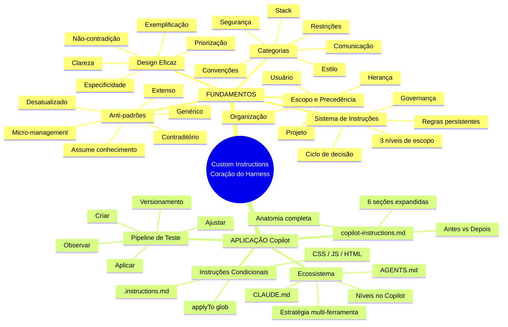
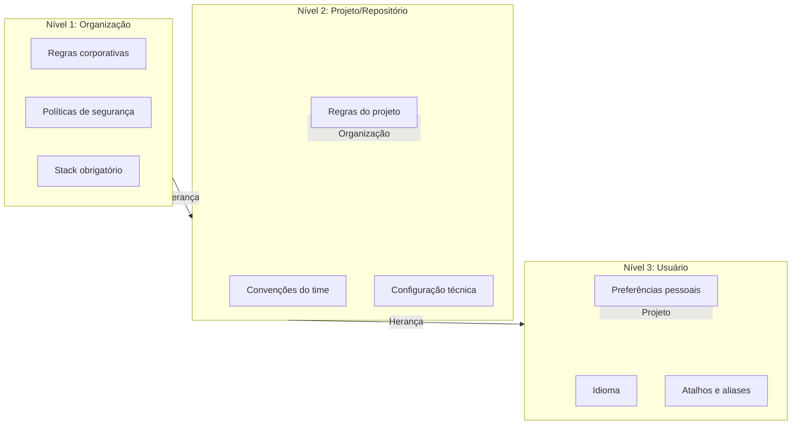
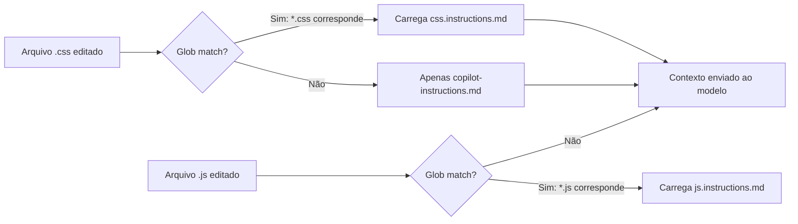
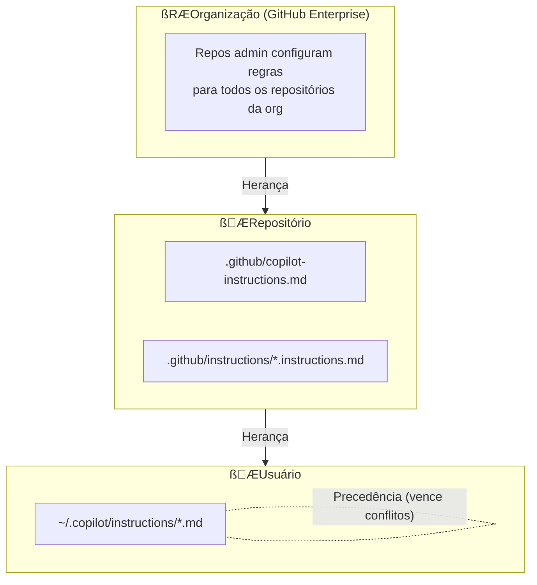
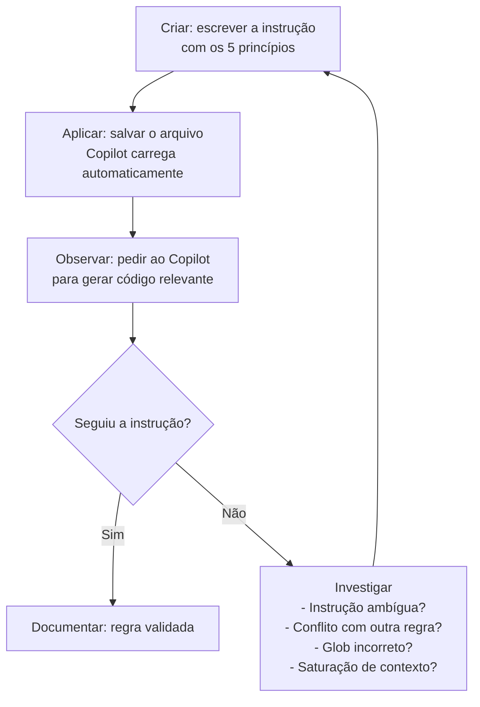

# Harness do GitHub Copilot e Programação Agêntica com VS Code — Aula 03

## Custom Instructions — O Coração do Harness

**Duração estimada:** 90 minutos (50 de leitura + 40 de prática)
**Nível:** Intermediário
**Pré-requisitos:** Aula 01 concluída (modelo mental de coding agents, 8 dimensões, ecossistema Copilot). Aula 02 concluída (Copilot instalado e autenticado no VS Code, `.github/copilot-instructions.md` mínimo de ~20 linhas, Portal de Projetos Dev com `index.html`, `styles.css`, `app.js`).

---

## Objetivos de Aprendizagem

Ao final desta aula, você será capaz de:

- [ ] **Classificar** regras de instrução em 6 categorias (stack, estilo, convenções, restrições, comunicação, segurança) e **explicar** o propósito de cada uma
- [ ] **Aplicar** os 5 princípios de design de instruções eficazes — especificidade, clareza, não-contradição, exemplificação e priorização
- [ ] **Identificar** e **corrigir** 6 anti-padrões comuns em arquivos de instrução: genérico demais, contraditório, extenso demais, micro-management, assume conhecimento prévio, desatualizado
- [ ] **Distinguir** entre os três níveis de escopo de instruções (usuário, repositório, organização) e **explicar** o mecanismo de herança e precedência que resolve conflitos
- [ ] **Estruturar** um `copilot-instructions.md` completo com seções detalhadas, regras específicas e exemplos comentados
- [ ] **Criar** arquivos `.instructions.md` condicionais com a diretiva `applyTo` e padrões glob para tipos específicos de arquivo (CSS, JS, HTML)
- [ ] **Posicionar** um arquivo de instruções no nível de escopo correto (usuário vs repositório) com base no tipo de regra e seu alcance
- [ ] **Explicar** a compatibilidade entre `copilot-instructions.md`, `AGENTS.md` e `CLAUDE.md` e decidir qual formato usar em cada cenário
- [ ] **Executar** o pipeline de teste de instruções — criar, aplicar, observar comportamento, ajustar — para verificar se o Copilot segue as regras
- [ ] **Refinar** o harness do Portal de Projetos Dev: evoluir o `copilot-instructions.md` de ~20 linhas para ~60 linhas com regras detalhadas e criar instructions condicionais por tipo de arquivo

---

## Como Usar Esta Aula

Esta aula está organizada em duas partes. A **primeira parte** constrói os mecanismos universais de sistemas de instruções para coding agents — conceitos que valem para qualquer ferramenta, independentemente de ecossistema ou provedor. A **segunda parte** aplica esses conceitos na prática com o GitHub Copilot no VS Code, refinando o harness do seu projeto.

Ao longo de cada seção da primeira parte, você encontrará **Quick Checks** (perguntas rápidas para verificar seu entendimento antes de avançar). Na segunda parte, cada seção inclui **Mão na Massa** — atividades práticas para executar no seu editor. Ao final, o arquivo separado **Questões de Aprendizagem** traz as tarefas de checkpoint — só avance para a Aula 04 quando conseguir completá-las por conta própria.

**Tempo estimado:** 50 minutos de leitura + 40 minutos de prática.
**Dica:** Tenha o VS Code com o Portal de Projetos Dev aberto durante a segunda parte.

---

## Mapa Mental

Este diagrama mostra todos os conceitos que você vai dominar nesta aula:




---

## Recapitulação das Aulas 01 e 02

| Aula | Conceito | Onde aparece nesta aula | Como se conecta |
|---|---|---|---|
| Aula 01 | **Coding agent** (Seção 1) | Seções 1-5 — O agente como executor de instruções | Instruções são o modulo que governa o agente |
| Aula 01 | **8 dimensões** (Seção 3) | Seções 4, 6 — Instruções modulam a Iniciativa do agente | Instruções precisas = menos micro-management |
| Aula 01 | **Ciclo de decisão** (Seção 4) | Seção 1 — Onde as instruções entram no ciclo | System prompt + instructions + tools + contexto → decisão |
| Aula 01 | **Harness** (Seção 7) | Aula inteira — O sistema de instruções é o componente central do harness | Da definição para o mergulho profundo |
| Aula 02 | **copilot-instructions.md** (Seção 8) | Seções 6-9 — Você refina o arquivo que criou na Aula 02 | Da semente de 20 linhas para 60 linhas |
| Aula 02 | **Portal de Projetos Dev** (Seção 8) | Seções 6-9 — O harness opera sobre o mesmo projeto | O código de teste evolui junto com o harness |

---

**FUNDAMENTOS: Mecanismos Universais de Sistemas de Instruções para Coding Agents**

> *Os conceitos desta parte são universais — valem para qualquer coding agent, independentemente de IDE, provedor ou ecossistema. Use analogias com ferramentas que você já conhece (ESLint, Prettier, .editorconfig) como âncoras. Na segunda parte, você verá como um coding agent concreto implementa cada um desses mecanismos.*

---

## 1. O Sistema de Instruções — O Motor de Governança do Agente

Você já viu na Aula 01 o ciclo de decisão de um coding agent: **system prompt + instructions + tools + contexto → decisão**. As instruções são o componente que transforma um agente genérico em um assistente especializado no seu projeto.

### O que é um sistema de instruções?

Um **sistema de instruções** é um conjunto de regras persistentes que definem **como** o agente deve trabalhar. Diferente do prompt de uma conversa, que você digita e esquece, as instruções são carregadas automaticamente em toda nova sessão — são a "constituição" do seu projeto para o agente.

Sem instruções, o agente opera com defaults genéricos. Ele pode escolher TypeScript quando você usa JavaScript puro, pode usar tabs quando o time usa espaços, pode escrever documentação em inglês quando o projeto é em português.

### O problema que o sistema de instruções resolve

Pense em quantas vezes você já viu código que não segue o padrão do projeto — imports desorganizados, mistura de estilos de nomenclatura, comentários em múltiplos idiomas. Agora imagine um agente gerando esse código a cada interação. Sem um sistema de instruções, cada sessão com o agente começa do zero: ele não sabe que o projeto usa camelCase, que prefere CSS Grid a Flexbox, que não usa frameworks.

O sistema de instruções **elimina essa reinvenção**. Ele é a memória permanente do agente sobre como o projeto funciona.

### Instruções vs Configuração

Uma distinção crucial: **instruções não são configuração**. Um arquivo `.editorconfig` define "indentação = 2 espaços" — o editor aplica isso automaticamente. Uma instrução diz "use 2 espaços de indentação" — o agente entende e gera código conforme. A diferença?

- **Configuração**: parâmetros que a ferramenta aplica sem interpretação (tamanho de tab, charset)
- **Instrução**: regras que o agente **interpreta e decide como seguir** (padrão arquitetural, estilo de nomenclatura)

Instruções moldam **comportamento**, não parâmetros. É a diferença entre dizer "identação = 2" e "use indentação consistente com o resto do arquivo, priorizando 2 espaços".

### Analogia com ferramentas conhecidas

| Ferramenta | O que faz | Análogo em instruções |
|---|---|---|
| `.editorconfig` | Define formatação básica | Regras de estilo (indentação, charset) |
| `.eslintrc` | Aplica regras de lint | Regras de restrições e convenções |
| `.gitignore` | Exclui arquivos do versionamento | Regras de segurança (o que NÃO gerar) |
| `tsconfig.json` | Configura o compilador | Regras de stack (versões, módulos) |

Cada uma dessas ferramentas resolve um problema específico com regras declarativas. O sistema de instruções faz o mesmo, mas para o comportamento **do agente** — não do compilador, do linter ou do editor.

### Quick Check 1

**1. Qual a diferença entre um sistema de instruções e uma configuração de ferramenta?**
**Resposta:** Configuração define parâmetros que a ferramenta aplica sem interpretação (ex: "indent_style = space"). Instruções definem regras que o agente interpreta e decide como seguir (ex: "use camelCase para variáveis, PascalCase para classes"). Instruções moldam comportamento; configuração define parâmetros.

**2. Em que ponto do ciclo de decisão do agente as instruções são injetadas?**
**Resposta:** As instruções são carregadas como parte do contexto, junto com o system prompt, as tools disponíveis e o histórico da conversa. Elas entram no ciclo antes da decisão do modelo — o modelo recebe as instruções como regras permanentes que devem guiar todas as respostas.

---

## 2. Categorias de Regras — O Que Instruir

Um sistema de instruções precisa cobrir diferentes aspectos do trabalho do agente. Organizar as regras em categorias ajuda a garantir que nenhuma área importante fique de fora — e que as regras não se contradigam.

### As 6 categorias universais

```mermaid
flowchart TD
    A[Sistema de Instruções] --> B[Stack]
    A --> C[Estilo]
    A --> D[Convenções]
    A --> E[Restrições]
    A --> F[Comunicação]
    A --> G[Segurança]

    B --> B1["Tecnologias do projeto"]
    B --> B2["Versões de runtime"]
    B --> B3["Dependências permitidas"]

    C --> C1["Formatação"]
    C --> C2["Nomenclatura"]
    C --> C3["Organização de código"]

    D --> D1["Padrões arquiteturais"]
    D --> D2["Estrutura de pastas"]
    D --> D3["Tratamento de erros"]

    E --> E1["Proibições explícitas"]
    E --> E2["Práticas proibidas"]
    E --> E3["Ferramentas vetadas"]

    F --> F1["Idioma"]
    F --> F2["Tom das respostas"]
    F --> F3["Nível de detalhe"]

    G --> G1["Proteção de dados"]
    G --> G2["Comandos bloqueados"]
    G --> G3["Secrets e credenciais"]
```




### Stack — O ecossistema técnico

Define **o que** o projeto usa. Inclui linguagens de programação, versões de runtime, frameworks autorizados, gerenciadores de pacotes, bancos de dados e serviços externos.

*Exemplo genérico:* "Runtime Node.js 20 LTS. JavaScript puro (sem TypeScript). NPM como gerenciador de pacotes. Sem frameworks — apenas vanilla."

### Estilo — A aparência do código

Define **como** o código se parece. Inclui formatação (indentação, aspas, ponto-e-vírgula), nomenclatura (camelCase, PascalCase, kebab-case) e organização (ordem de imports, agrupamento de declarações).

*Exemplo genérico:* "Indentação de 2 espaços. Aspas simples. Ponto-e-vírgula obrigatório. camelCase para variáveis e funções. PascalCase para classes e construtores."

### Convenções — Os padrões do projeto

Define **os padrões arquiteturais** que o projeto segue. Inclui estrutura de arquivos, padrões de projeto (MVC, observer, factory), organização de responsabilidades e tratamento de erros.

*Exemplo genérico:* "Um componente por arquivo. Imports no topo, agrupados por tipo (nativos, terceiros, locais). Funções puras preferencialmente. Erros tratados com try/catch em operações de I/O."

### Restrições — O que NÃO fazer

Define **proibições explícitas** — coisas que o agente jamais deve fazer, mesmo que pareçam uma boa ideia no contexto.

*Exemplo genérico:* "NÃO usar `eval()`. NÃO adicionar bibliotecas externas sem aprovação. NÃO gerar código com side effects não declarados. NÃO modificar arquivos de configuração sem permissão."

### Comunicação — Como se expressar

Define **como** o agente se comunica com você. Inclui idioma, tom, nível de detalhe das explicações e formato das respostas.

*Exemplo genérico:* "Responda em português. Explique o porquê das decisões técnicas em 1-2 frases. Ao sugerir alterações, mostre o diff. Se houver múltiplas abordagens, recomende uma e justifique."

### Segurança — A linha vermelha

Define **regras de proteção** que previnem acidentes e vazamentos. Embora parecida com Restrições, a categoria de Segurança trata de riscos específicos que podem ter consequências reais (financeiras, legais, de infraestrutura).

*Exemplo genérico:* "Nunca gerar secrets, tokens ou senhas. Nunca executar comandos destrutivos sem confirmação explícita. Nunca expor variáveis de ambiente em outputs. Nunca sugerir deploy para produção sem validação."

### Por que 6 categorias e não uma lista única?

Organizar em categorias traz três benefícios práticos:

1. **Cobertura**: você consegue verificar se todas as áreas estão contempladas
2. **Manutenção**: quando algo muda (ex: nova versão do runtime), você sabe exatamente onde editar
3. **Resolução de conflitos**: regras de categorias diferentes têm prioridades diferentes — Segurança sempre vence Estilo

### Quick Check 2

**1. Qual categoria você usaria para instruir o agente sobre a organização de pastas do projeto?**
**Resposta:** Convenções. Organização de pastas é um padrão arquitetural do projeto, não uma regra de estilo (formatação) nem de stack (tecnologias). Faz parte de "como o projeto se estrutura".

**2. Por que "Restrições" e "Segurança" são categorias separadas — não bastaria uma só?**
**Resposta:** Porque têm propósitos e urgências diferentes. Restrições são regras de qualidade e consistência do projeto (ex: "não use frameworks"). Segurança trata de riscos com consequências reais (ex: "nunca gere secrets"). Separar permite dar prioridade máxima à Segurança — regras de Segurança sempre sobrescrevem Restrições em caso de conflito.

---

## 3. Design de Instruções Eficazes

Ter as categorias certas é o primeiro passo. O segundo — e mais difícil — é escrever instruções que o agente **realmente siga**. Um agente não é um compilador: ele interpreta, e interpretação mal feita gera resultados imprevisíveis.

### Os 5 princípios

**1. Especificidade**

Uma instrução específica diz **exatamente** o que fazer. Uma instrução genérica deixa margem para interpretação.

- Ì "Use layout moderno" — o que é "moderno" para você pode ser CSS Grid; para o agente, pode ser Flexbox ou até Float
- “& "Use CSS Grid para layouts de página e Flexbox para componentes de linha única"

**Regra prática:** se você pode imaginar duas implementações diferentes para a mesma instrução, ela não é específica o suficiente.

**2. Clareza**

Frases curtas, verbos de ação, sem ambiguidade sintática. Uma instrução clara é compreendida na primeira leitura — pelo agente e por outros desenvolvedores.

- Ì "Quando for fazer validação, considere usar expressões regulares se necessário, mas não exagere"
- “& "Valide e-mails com regex simples (`/^\\S+@\\S+\\.\\S+$/`). Para CPF, use função dedicada em `utils/validate.js`"

**3. Não-contradição**

Duas regras que se anulam fazem o agente escolher arbitrariamente — e você nunca sabe qual vai vencer.

- Ì "Use `const` para todas as variáveis" + "Use `var` se precisar de hoisting"
- “& "Use `const` como padrão. Use `let` apenas quando a variável precisar ser reatribuída. `var` não deve ser usado."

**A não-contradição é o princípio mais difícil** porque arquivos grandes acumulam regras ao longo do tempo. Uma regra adicionada na seção "Estilo" pode contradizer outra na seção "Convenções" sem que ninguém perceba.

**4. Exemplificação**

Mostrar é melhor que descrever. Um exemplo concreto vale mais que uma parágrafo de explicação.

- Ì "As funções devem seguir o padrão de nomenclatura do projeto"
- “& "Nomenclatura de funções: verbos no infinitivo — `calcularTotal()`, `validarEmail()`, `formatarData()`. Exemplo:

```javascript
// “& Correto
function calcularTotal(itens) { ... }
function validarEmail(email) { ... }

// Ì Incorreto
function total(itens) { ... }
function email_validation(email) { ... }
```

**5. Priorização**

Nem toda regra tem o mesmo peso. Sinalizar o que é obrigatório (MUST) vs preferência (SHOULD) ajuda o agente a fazer trade-offs inteligentes.

- **MUST**: "Arquivos HTML devem ter `<!DOCTYPE html>` e `<meta charset=\"UTF-8\">`"
- **SHOULD**: "Prefira funções puras, mas efeitos colaterais são aceitáveis em handlers de evento"
- **MAY**: "Comentários JSDoc em funções públicas são opcionais mas bem-vindos"

### Quick Check 3

**1. Reescreva "O código deve ser bom" aplicando o princípio da especificidade.**
**Resposta:** Exemplo: "Funções devem ter no máximo 20 linhas. Nomes de variáveis devem ser auto-documentáveis (evitar `x`, `temp`, `data`). Todo `if` deve ter bloco `else` correspondente ou comentário explicando por que não há." — A instrução original é tão vaga que o agente não sabe o que fazer com ela.

**2. Por que a não-contradição é o princípio mais difícil de garantir em arquivos grandes?**
**Resposta:** Porque regras são adicionadas incrementalmente por pessoas diferentes em momentos diferentes. Uma regra "use CSS Grid" adicionada na seção de Estilo pode contradizer "use Flexbox para responsividade" na seção de Convenções. Conforme o arquivo cresce, o custo de verificar todas as combinações de regras cresce exponencialmente — ninguém relê o arquivo inteiro a cada adição.

---

## 4. Anti-padrões — O Que NÃO Fazer

Se os 5 princípios são o "caminho das pedras", os anti-padrões são as armadilhas no caminho. Conhecer os erros mais comuns é tão importante quanto saber acertar.

### Os 6 anti-padrões

**1. Genérico demais**

Instruções vagas que o agente não consegue transformar em ação.

*Exemplo real:* "Escreva código limpo" — o que é "limpo" para você? Para o agente, qualquer código sintaticamente válido pode ser "limpo". Sem critérios objetivos, a instrução é ignorada.

*Correção:* "Código limpo significa: (1) funções com até 20 linhas, (2) nomes descritivos que eliminem comentários, (3) sem código comentado, (4) um nível máximo de aninhamento (3 níveis de profundidade)."

**2. Contraditório**

Duas regras que se anulam produzem comportamento imprevisível.

*Exemplo real:* "Use tabs para indentação" + no mesmo arquivo: "Indentação deve ser consistente com 2 espaços"

*Correção:* Audite o arquivo periodicamente. Toda nova regra deve ser verificada contra todas as existentes. Use a categorização (Seção 2) para agrupar regras afins e facilitar a detecção de conflitos.

**3. Extenso demais**

Mais de 200 linhas de instruções saturam a janela de contexto do modelo. O agente "esquece" regras no meio do arquivo.

*Exemplo real:* Um arquivo de 347 linhas com regras de CSS, JS, HTML, Python, Docker e SQL misturadas.

*Correção:* Separe em múltiplos arquivos por categoria ou por tipo de arquivo. Use o princípio da instrução condicional (Seção 7): regras de CSS vão em um arquivo, regras de JS em outro. O limite recomendado por arquivo é 60-80 linhas.

**4. Micro-management**

Instruções tão detalhadas que sufocam a capacidade do agente de resolver problemas criativamente.

*Exemplo real:* "Use 2 espaços, não 4. Use ponto-e-vírgula. Use aspas simples. Abra chaves na mesma linha. Nunca use arrow functions. Sempre use `function` keyword. Coloque espaços dentro de parênteses [...]"

*Correção:* Concentre-se no **o quê**, não no **como**. Regras de formatação pertencem a ferramentas de formatação (Prettier, ESLint), não a instruções. Instruções devem focar em padrões arquiteturais, convenções e decisões de design.

**5. Assume conhecimento prévio**

Instruções que só fazem sentido para quem já conhece o projeto — e o agente não conhece.

*Exemplo real:* "Siga o padrão do sistema legado" — qual padrão? Onde está documentado? O agente não tem acesso à sua memória.

*Correção:* Toda instrução deve ser auto-contida. Se referencia um padrão, descreva-o ou aponte para um arquivo que o descreva. Se menciona uma decisão arquitetural, explique o racional.

**6. Desatualizado**

Instruções que não refletem o estado atual do projeto.

*Exemplo real:* "Use jQuery para manipulação do DOM" — em um projeto que migrou para vanilla JS há dois anos.

*Correção:* Versionamento é a chave (Seção 9). Toda mudança no harness deve ser um commit. Revise o arquivo de instruções sempre que houver mudança significativa no stack ou nas convenções do projeto.

### Quick Check 4

**1. Qual anti-padrão é mais perigoso para um projeto que está começando? Por quê?**
**Resposta:** "Genérico demais". Quando o projeto está começando, não há convenções estabelecidas — tudo que o agente sabe são as instruções que você escreveu. Se elas são genéricas, o agente gera código inconsistente desde o dia zero, criando dívida técnica que será cara de corrigir depois.

**2. Como você diferencia "instrução detalhada" de "micro-management"?**
**Resposta:** Instrução detalhada foca no **o quê** e **por quê** — define o resultado esperado e a justificativa. Micro-management foca no **como** — dita cada passo da implementação. Exemplo de detalhada: "Use CSS Grid para layouts de página porque o projeto precisa ser responsivo sem media queries complexas." Exemplo de micro-management: "Use `grid-template-columns: 1fr 1fr;` exatamente assim, sem alterar."

---

## 5. Escopo e Precedência de Regras

Nem toda regra serve para todo contexto. Regras de formatação pessoais não deveriam valer para o repositório da empresa. Regras de segurança da organização não deveriam ser Sobrescritas por preferências locais.

### Os três níveis de escopo




**Organização (nível 1)**

Regras que valem para todos os repositórios da organização. São definidas por administradores e aplicadas globalmente.

*Exemplos:* "Stack padrão: Node.js + React. Idioma: português. Proibido: gerar secrets em código. Todos os projetos devem ter testes unitários."

**Projeto/Repositório (nível 2)**

Regras específicas de um projeto, versionadas com o código-fonte. Valem para todos que trabalham no projeto.

*Exemplos:* "Runtime Node.js 20 LTS. Padrão MVC: `models/`, `views/`, `controllers/`. CSS Grid para layouts. Testes com Vitest."

**Usuário (nível 3)**

Regras pessoais que valem para todos os projetos que o desenvolvedor trabalha. Não são versionadas — ficam na máquina do usuário.

*Exemplos:* "Prefira arrow functions. Use `const` sempre. Comentários em português. Funções com no máximo 15 linhas."

### Herança e Precedência

O mecanismo tem duas direções:

- **Herança (top-down):** Organização → Projeto → Usuário. Cada nível herda as regras do nível superior. As regras da organização valem para todos os projetos; as regras do projeto valem para todos os desenvolvedores.
- **Precedência (bottom-up):** Usuário > Projeto > Organização. Quando há conflito, a regra mais específica vence. Sua preferência pessoal de indentação sobrescreve a regra do projeto.

### Mecanismo de Merge

Instruções não são sobrescritas — são **concatenadas**. Se a organização diz "use Node.js" e o projeto diz "use TypeScript", o agente recebe as duas regras. A precedência define qual considerar em caso de conflito explícito.

- Regras que não conflitam: acumulam (organização define "responda em português", projeto define "use camelCase" — ambas valem)
- Regras conflitantes: a de maior precedência vence (usuário define "responda em inglês" — sobrescreve a regra da organização para aquele usuário)

### Quick Check 5

**1. Se a organização define "use Python" e o projeto define "use TypeScript", qual prevalece?**
**Resposta:** Projeto. A precedência é bottom-up: Usuário > Projeto > Organização. A regra do projeto (mais específica) prevalece sobre a regra da organização (mais genérica). O agente usará TypeScript no contexto daquele projeto.

**2. Em que situação você colocaria uma regra no nível de usuário em vez de no projeto?**
**Resposta:** Quando a regra é uma preferência pessoal que não reflete uma decisão do time. Exemplos: formato de comentários, idioma de mensagens de commit, preferência entre arrow functions e function declarations, nível de detalhe das explicações. Se você mudar de projeto, essas preferências devem continuar valendo.

---

**APLICAÇÃO: Custom Instructions no GitHub Copilot**

> *Agora que você entende os mecanismos universais de sistemas de instruções — categorias, design, anti-padrões, escopo e precedência — vamos conectá-los à prática com o GitHub Copilot. Você vai transformar a semente plantada na Aula 02 em um sistema de governança completo para o Portal de Projetos Dev.*

---

## 6. Anatomia do `copilot-instructions.md`

Você criou na Aula 02 um arquivo `.github/copilot-instructions.md` com cerca de 20 linhas e 4 seções. Agora é hora de refiná-lo — aplicar as 6 categorias (Seção 2), os 5 princípios de design (Seção 3) e evitar os anti-padrões (Seção 4).

### Antes (Aula 02) — A semente

```markdown
# Instruções para o Copilot — Portal de Projetos Dev

## Stack
- HTML, CSS e JavaScript
- Sem frameworks

## Estilo
- camelCase para JS
- kebab-case para CSS classes

## Convenções
- Um componente por arquivo
- Imports no topo

## Restrições
- Sem dependências externas
```

### Depois (Aula 03) — O sistema de governança

```markdown
# Instruções para o Copilot — Portal de Projetos Dev

## Stack
- **Linguagens:** HTML5, CSS3, JavaScript (ES2022+)
- **Runtime:** Navegador (sem Node.js ou backend)
- **Framework:** Nenhum — vanilla apenas (mantém o foco no harness)
- **Gerenciamento:** NPM não usado — dependências via CDN são proibidas (veja Restrições)

## Estilo
- **JavaScript:** camelCase para variáveis e funções; PascalCase para classes e construtores
- **CSS:** kebab-case para classes e IDs; nomes semânticos (`.project-card`, `.status-badge`)
- **HTML:** minúsculas para tags e atributos; aspas duplas para valores de atributos
- **Organização de imports:** módulos nativos primeiro, depois terceiros, depois locais
- **Indentação:** 2 espaços (MUST)

## Convenções
- **Arquitetura:** Cada widget do portal em seu próprio arquivo (ex: `project-card.js`, `filter-bar.js`)
- **Event listeners:** Usar `addEventListener`, não atributos HTML on* (MUST)
- **Tratamento de erros:** Try/catch em operações de I/O (fetch, localStorage); fallback visual em caso de erro
- **Comentários:** JSDoc em funções públicas; comentários inline apenas para lógica não óbvia
- **Estrutura de pastas:** `/css/`, `/js/`, `/assets/` — cada tipo na sua pasta

## Restrições
- **NÃO** usar frameworks (React, Vue, Svelte, Angular) — o projeto é vanilla por design
- **NÃO** adicionar dependências externas sem aprovação explícita
- **NÃO** usar `eval()` ou `Function()` — risco de segurança
- **NÃO** modificar `index.html` para incluir scripts não aprovados
- **NÃO** gerar CSS inline em elementos HTML — use classes e arquivos .css separados

## Comunicação
- **Idioma:** Responda em português
- **Tom:** Profissional mas didático — explique decisões técnicas
- **Explicações:** Ao sugerir alterações, mostre o diff e justifique o porquê
- **Dúvidas:** Se houver ambiguidade, pergunte antes de implementar

## Segurança
- **NUNCA** gere secrets, tokens ou senhas no código
- **NUNCA** sugira armazenar dados sensíveis em localStorage sem criptografia
- **NUNCA** execute comandos de terminal sem confirmação explícita
- **NUNCA** referencie APIs externas não autorizadas
- **SEMPRE** valide entradas de usuário antes de processar
```




```mermaid
flowchart TD
    A[copilot-instructions.md] --> B[Stack]
    A --> C[Estilo]
    A --> D[Convenções]
    A --> E[Restrições]
    A --> F[Comunicação]
    A --> G[Segurança]

    B --> B1["Linguagens: HTML5, CSS3, ES2022+"]
    B --> B2["Runtime: Navegador"]
    B --> B3["Framework: Nenhum (vanilla)"]

    C --> C1["JS: camelCase, PascalCase"]
    C --> C2["CSS: kebab-case, semântico"]
    C --> C3["HTML: minúsculas, aspas duplas"]

    D --> D1["Arquitetura: 1 widget = 1 arquivo"]
    D --> D2["Eventos: addEventListener"]
    D --> D3["Erros: try/catch + fallback"]

    E --> E1["Proibido: frameworks"]
    E --> E2["Proibido: eval(), Function()"]
    E --> E3["Proibido: CSS inline"]

    F --> F1["Idioma: português"]
    F --> F2["Tom: didático"]
    F --> F3["Diffs com justificativa"]

    G --> G1["Nunca: secrets/tokens"]
    G --> G2["Nunca: comandos destrutivos"]
    G --> G3["Sempre: validar entradas"]
```

### O que mudou da versão da Aula 02?

1. **Stack** ganhou versões específicas (ES2022+, Node.js — ou a ausência dele)
2. **Estilo** foi detalhado por linguagem (JS, CSS, HTML) com exemplos
3. **Convenções** agora inclui tratamento de erros, comentários e estrutura de pastas
4. **Restrições** ganharam justificativas — cada "NÃO" é acompanhado do "por quê"
5. **Comunicação** (nova seção) — define idioma, tom e formato das respostas
6. **Segurança** (nova seção) — regras de proteção do projeto

### Mão na Massa — Refine seu `copilot-instructions.md`

- [ ] Abra seu `.github/copilot-instructions.md` atual (o que você criou na Aula 02)
- [ ] Adicione as seções **Comunicação** e **Segurança** com pelo menos 3 regras cada
- [ ] Expanda **Stack** com versões específicas (ex: "ES2022+, navegador Chrome/Firefox/Edge atuais")
- [ ] Expanda **Estilo** com regras de naming por tipo de arquivo (JS, CSS, HTML)
- [ ] Refine **Restrições** — cada proibição deve ter uma justificativa entre parênteses ou após um travessão
- [ ] Refine **Convenções** — adicione tratamento de erros, estrutura de pastas e padrão de comentários
- [ ] **Verifique:** o arquivo tem entre 40-60 linhas? Cada seção tem exemplos concretos?
- [ ] Salve e faça um commit:

```bash
git add .github/copilot-instructions.md
git commit -m "refina(harness): instruções detalhadas para o Portal de Projetos Dev"
```

### Quick Check 6

**1. Qual seção você adicionaria para instruir o Copilot a sempre incluir atributos `alt` em imagens?**
**Resposta:** Convenções (ou Restrições, dependendo do tom). "Sempre incluir `alt` descritivo em imagens" é uma convenção de acessibilidade do projeto. Se for uma exigência inegociável, pode ir em Restrições como "NÃO gerar `` sem atributo `alt`".

**2. Por que a seção "Comunicação" é separada de "Estilo" — não são ambas sobre "como o código se parece"?**
**Resposta:** Não, elas tratam de aspectos diferentes. Estilo define a aparência **do código** (formatação, nomenclatura). Comunicação define a aparência **da resposta do agente** (idioma, tom, nível de detalhe). O estilo do código é uma regra técnica; a comunicação é uma regra de interação humano-agente. Misturá-las dificulta a manutenção e a resolução de conflitos.

---

## 7. Instruções Condicionais com `.instructions.md` e `applyTo`

O `copilot-instructions.md` resolve o problema de regras globais do projeto. Mas nem toda regra é global — regras de CSS não fazem sentido em arquivos JS, e vice-versa. Instruções condicionais resolvem isso.

### O problema

Se você colocar "Use CSS Grid com `grid-template-areas`" no `copilot-instructions.md`, o Copilot carrega essa regra **sempre** — inclusive quando você está editando um arquivo JavaScript. A regra ocupa espaço no contexto sem trazer benefício.

Se você colocar essa regra em um arquivo separado com `applyTo: "*.css"`, ela só é carregada **quando o contexto do Copilot inclui arquivos CSS**.

### Anatomia de um `.instructions.md`

```markdown
---
applyTo: "*.css"
---

# Regras para arquivos CSS

## Estilo
- Use CSS Grid para layouts de página
- Use Flexbox para componentes de linha única
- Prefira variáveis CSS a valores literais para cores e espaçamentos

## Convenções
- Mobile-first: escreva o estilo base para mobile, depois adicione media queries
- Classes semânticas: `.project-card`, `.status-badge`, `.filter-bar`
- Agrupe propriedades por tipo (posicionamento, box model, tipografia, cores)
```

O frontmatter YAML com `applyTo` define **quando** este arquivo é carregado. O corpo é Markdown comum, exatamente como o `copilot-instructions.md`.

### Sintaxe do `applyTo`

| Padrão | O que ativa |
|---|---|
| `"*.css"` | Qualquer arquivo .css |
| `"*.js"` | Qualquer arquivo .js |
| `"src/**/*.js"` | Apenas JS dentro de src/ |
| `"*.html"` | Qualquer arquivo .html |
| `["*.css", "*.scss"]` | CSS ou SCSS |
| `"docs/**/*.md"` | Markdown dentro de docs/ |

### Onde colocar os arquivos

A localização padrão é `.github/instructions/`. Você pode organizar por tipo de arquivo:

```
.github/
  instructions/
    css.instructions.md       # applyTo: "*.css"
    js.instructions.md        # applyTo: "*.js"
    html.instructions.md      # applyTo: "*.html"
```

### `copilot-instructions.md` vs `.instructions.md`

| Aspecto | `copilot-instructions.md` | `.instructions.md` |
|---|---|---|
| Escopo | Projeto inteiro — sempre carregado | Condicional — só quando o glob match |
| Localização | `.github/copilot-instructions.md` | `.github/instructions/*.instructions.md` |
| Quando usar | Regras que valem para todo o projeto | Regras específicas de um tipo de arquivo |
| Quantidade | 1 por repositório | Múltiplos (quantos tipos de arquivo houver) |
| Contexto | Sempre ocupa espaço | Ocupa espaço apenas quando necessário |

### Exemplos práticos para o Portal de Projetos Dev

**`css.instructions.md`** (com `applyTo: "*.css"`):

```markdown
---
applyTo: "*.css"
---

# Instruções para CSS — Portal de Projetos Dev

## Estilo
- Use CSS Grid para layout de cards e páginas
- Use Flexbox para barras de navegação e agrupamentos de linha única
- Prefira `rem` para fontes e `px` para bordas (MUST)
- Variáveis CSS em `:root` para paleta de cores (MUST)

## Convenções
- Mobile-first: base mobile, depois media queries para tablet e desktop
- Nomes de classes semânticas e em kebab-case
- Cada componente tem seu próprio bloco de CSS, separado por comentário
```

**`js.instructions.md`** (com `applyTo: "*.js"`):

```markdown
---
applyTo: "*.js"
---

# Instruções para JavaScript — Portal de Projetos Dev

## Estilo
- camelCase para variáveis e funções; PascalCase para classes
- Use `const` como padrão, `let` apenas quando necessário
- Arrow functions para callbacks e métodos de array
- Template literals para concatenação de strings

## Convenções
- Módulos ES6 (`import`/`export`) para organização de código
- Event listeners com `addEventListener`, nunca atributos HTML on*
- Fetch API para requisições HTTP com try/catch
- Dados persistidos em localStorage com fallback para estado vazio
```

**`html.instructions.md`** (com `applyTo: "*.html"`):

```markdown
---
applyTo: "*.html"
---

# Instruções para HTML — Portal de Projetos Dev

## Estilo
- Tags e atributos em minúsculas
- Aspas duplas para valores de atributos
- Indentação de 2 espaços para aninhamento

## Convenções
- HTML5 semântico: `<header>`, `<main>`, `<section>`, `<footer>`
- Atributo `alt` descritivo em TODAS as imagens (MUST)
- Meta viewport para responsividade
- Atributos `lang` e `charset` no `<html>` e `<head>`
```




### Mão na Massa — Crie instructions condicionais

- [ ] Crie a pasta `.github/instructions/`
- [ ] Crie `css.instructions.md` com `applyTo: "*.css"` — inclua regras de CSS Grid, variáveis e mobile-first
- [ ] Crie `js.instructions.md` com `applyTo: "*.js"` — inclua regras de ES6 modules, eventos e fetch API
- [ ] Crie `html.instructions.md` com `applyTo: "*.html"` — inclua regras de semântica HTML5 e acessibilidade
- [ ] **Teste:** abra o Chat no modo Ask e pergunte "Com base nas instruções CSS, como devo estruturar o layout de cards?" — verifique se a resposta reflete as regras do `css.instructions.md`
- [ ] Commit:

```bash
git add .github/instructions/
git commit -m "feat(harness): instructions condicionais por tipo de arquivo"
```

### Quick Check 7

**1. Se você tem `applyTo: "*.css"`, a regra será aplicada quando o Copilot gerar HTML que referencia CSS?**
**Resposta:** Não. O glob `*.css` corresponde apenas a arquivos .css abertos ou referenciados no contexto. Se o Copilot está gerando HTML, o contexto contém um arquivo .html, não .css. As regras de CSS só seriam carregadas se um arquivo .css estivesse ativo no contexto.

**2. O que acontece se dois `.instructions.md` diferentes tiverem globs que se sobrepõem (ex: `*.js` e `src/**/*.js`)?**
**Resposta:** Ambos são carregados — o Copilot não deduplica. Se houver regras conflitantes (ex: "use const" em um e "use var" no outro), o comportamento é imprevisível. A boa prática é garantir que os globs não se sobreponham, ou se sobreporem com regras compatíveis.

---

## 8. Ecossistema de Arquivos de Instrução no Copilot

Agora que você domina `copilot-instructions.md` e `.instructions.md`, é hora de entender como eles se encaixam no ecossistema maior de arquivos de instrução — e como decidir onde colocar cada regra aplicando a hierarquia de escopo da Seção 5.

### Níveis de escopo no Copilot

O GitHub Copilot implementa exatamente os três níveis que você estudou na Seção 5:




**Nível de Usuário: `~/.copilot/instructions/`**

Regras pessoais que você carrega em **todos os projetos** que trabalha com Copilot. O diretório fica em:

- **Linux/Mac:** `~/.copilot/instructions/`
- **Windows:** `%USERPROFILE%\.copilot\instructions\`

Cada arquivo `.md` dentro deste diretório é carregado automaticamente. Exemplo de `~/.copilot/instructions/preferencias.md`:

```markdown
# Preferências Pessoais

## Comunicação
- Responda em português
- Explique decisões técnicas em 1-2 frases
- Prefira exemplos concisos a explicações longas

## Estilo (preferências pessoais)
- Arrow functions para funções anônimas
- Template literals para concatenação
- Destructuring em objetos e arrays
```

**Nível de Repositório: `.github/copilot-instructions.md` + `.github/instructions/`**

Regras do projeto, versionadas com o código. Cada repositório pode ter seu próprio conjunto.

**Nível de Organização: Configurado no GitHub Enterprise**

Administradores configuram regras que valem para todos os repositórios da organização. Você não cria arquivos para isso — a configuração é feita via interface do GitHub Enterprise.

### Compatibilidade com AGENTS.md e CLAUDE.md

Seu time pode usar múltiplas ferramentas — GitHub Copilot, OpenCode, Claude Code, Cursor, Windsurf. Cada uma tem seu formato de instrução:

| Formato | Lido por | Propósito |
|---|---|---|
| `.github/copilot-instructions.md` | GitHub Copilot | Regras globais do repositório |
| `.github/instructions/*.instructions.md` | GitHub Copilot | Regras condicionais por tipo de arquivo |
| `AGENTS.md` | OpenCode, Cursor, Windsurf | Definição de agentes, skills e instruções |
| `CLAUDE.md` | Claude Code | Instruções para o Claude Code |
| `.cursorrules` | Cursor | Regras específicas do Cursor |

**O Copilot NÃO lê automaticamente `AGENTS.md` ou `CLAUDE.md`.** Se você usa múltiplas ferramentas, isso significa duplicação de regras.

### Estratégia recomendada para times multi-ferramenta

1. **Fonte única:** Mantenha `AGENTS.md` como a definição mestra das regras do projeto (stack, estilo, convenções, agentes)
2. **Referência cruzada:** No `copilot-instructions.md`, adicione uma linha no topo: "Consulte também AGENTS.md para regras detalhadas do projeto"
3. **Evite duplicação:** Se uma regra está em `AGENTS.md`, não a repita em `copilot-instructions.md` — referencie
4. **Condicionais dedicadas:** Use `.instructions.md` para regras que são específicas do Copilot (ex: como usar @mentions, como estruturar prompts)

**Por que evitar duplicação?** Quando uma regra muda, você precisa atualizar N arquivos. Com fonte única + referência, você atualiza um arquivo e todas as ferramentas "veem" a mudança.

### Mão na Massa — Posicione suas regras

- [ ] Identifique 3 regras do seu `copilot-instructions.md` que são preferências pessoais (não do projeto)
- [ ] Mova-as para `~/.copilot/instructions/preferencias.md` (crie o diretório se necessário)
- [ ] Identifique 2 regras que são específicas de um tipo de arquivo mas estão no `copilot-instructions.md`
- [ ] Mova-as para os `.instructions.md` condicionais correspondentes (criados na Seção 7)
- [ ] **Verifique:** o que sobrou no `copilot-instructions.md` são regras verdadeiramente globais do projeto?
- [ ] Commit:

```bash
git add .github/
git commit -m "refactor(harness): move regras pessoais para escopo de usuário e condicionais para .instructions.md"
```

### Quick Check 8

**1. Se seu time usa OpenCode, Copilot e Claude Code, qual estratégia de arquivos de instrução você recomenda?**
**Resposta:** Usar `AGENTS.md` como fonte única das regras do projeto (porque OpenCode, Cursor e Windsurf o leem nativamente). No `copilot-instructions.md`, adicionar uma referência: "Consulte AGENTS.md na raiz do projeto para regras de stack, estilo e convenções." Criar `.instructions.md` apenas para regras Copilot-específicas (condicionais por tipo de arquivo). Isso evita triplicação de regras.

**2. Qual a diferença prática entre colocar uma regra em `~/.copilot/instructions/` vs `.github/copilot-instructions.md`?**
**Resposta:** `~/.copilot/instructions/` é pessoal e vale para todos os projetos que você abre. `.github/copilot-instructions.md` é do projeto e vale para todos os desenvolvedores que trabalham nele. Uma regra em `~/.copilot/instructions/` viaja com você (mesmo em projetos open source que você não mantém). Uma regra em `.github/copilot-instructions.md` viaja com o repositório (todos os contribuidores a recebem).

---

## 9. Pipeline de Teste e Refinamento de Instruções

Você criou as instruções. Agora precisa verificar se o Copilot **realmente as segue**. Um sistema de instruções sem teste é like uma promessa sem comprovação — você só descobre que não funciona quando o agente gera algo inesperado.

### O ciclo Criar → Aplicar → Observar → Ajustar




**Fase 1 — Criar**

Escreva a instrução aplicando os 5 princípios da Seção 3: específica, clara, não-contraditória, com exemplos e priorizada.

**Fase 2 — Aplicar**

Salve o arquivo. O Copilot carrega automaticamente as mudanças — não precisa reiniciar o VS Code nem a extensão. O ciclo é instantâneo para o `copilot-instructions.md`; para `.instructions.md`, o carregamento acontece quando o contexto incluir arquivos que batem com o glob.

**Fase 3 — Observar**

Peça ao Copilot para gerar código que deveria seguir a regra. Use o Chat em diferentes modos:

- **Modo Ask:** "Com base nas minhas instruções, como você geraria um card de projeto?"
- **Modo Edit:** "Crie um arquivo `css/components.css` com o estilo dos cards seguindo as regras do projeto"
- **Modo Agent:** "Adicione um filtro por status na página inicial. Siga as convenções do projeto."

Observe o output e compare com as regras:

- A regra foi seguida? “&
- Foi parcialmente seguida? Ú�️
- Foi ignorada? Ì

**Fase 4 — Ajustar**

Se a regra não foi seguida, investigue a causa:

| Sintoma | Causa provável | O que fazer |
|---|---|---|
| Regra global ignorada | Instrução ambígua ou genérica demais | Aplique o princípio da especificidade |
| Regra ignorada em contexto com muitas instruções | Saturação de contexto | Reduza o arquivo, separe em condicionais |
| Regra condicional não aparece | Glob incorreto | Verifique `applyTo` e padrão do arquivo aberto |
| Comportamento imprevisível | Conflito entre regras | Audite contradições entre arquivos |
| Regra seguida às vezes | Priorização ambígua | Use MUST/SHOULD/MAY explícitos |

### Padrões de falha comuns

1. **Instrução longa demais** (>200 linhas): o modelo "esquece" regras no meio. Solução: separe em condicionais (Seção 7).
2. **Glob incorreto**: o `.instructions.md` nunca é carregado. Solução: teste abrindo um arquivo do tipo e verificando se a regra aparece no Chat.
3. **Conflito entre `copilot-instructions.md` e `.instructions.md`**: o modelo recebe duas regras contraditórias. Solução: audite ambos os arquivos periodicamente.
4. **Instrução muito restritiva**: o agente passa mais tempo "se verificando" do que gerando código. Solução: revise o micro-management (Seção 4).

### Versionamento como ferramenta de teste

Cada mudança no harness deve ser um commit. Isso permite:

- **Rollback**: se uma regra nova quebra o comportamento, você volta para o commit anterior
- **Auditoria**: "quando essa regra foi adicionada? quem decidiu?"
- **Teste A/B**: compare o comportamento antes e depois do commit

### Mão na Massa — Pipeline completo

- [ ] Escolha 3 regras do seu harness:
  - 1 global (do `copilot-instructions.md`)
  - 1 condicional CSS (do `css.instructions.md`)
  - 1 condicional JS (do `js.instructions.md`)
- [ ] Para cada regra, execute o pipeline:
  1. **Criar:** a regra já existe (você a criou nas seções anteriores)
  2. **Aplicar:** salve o arquivo
  3. **Observar:** peça ao Copilot para gerar código que deveria seguir a regra. Use o Chat no modo Ask para verificar
  4. **Documente:** a regra foi seguida? “& ou Ì? Se não, por quê?
- [ ] Ajuste as regras que falharam:
  - Ambígua? Torne mais específica
  - Conflito? Resolva a contradição
  - Glob errado? Corrija o padrão
- [ ] Repita o teste até passar
- [ ] Commit final:

```bash
git add .github/
git commit -m "test(harness): pipeline de teste e refinamento concluído"
```

### Quick Check 9

**1. Você criou uma regra "use CSS Grid para layouts" e o Copilot gerou Flexbox. Liste 3 possíveis causas.**
**Resposta:** (1) A regra está em um `.instructions.md` com glob `*.css`, mas você pediu para gerar HTML — o glob não match, a regra não foi carregada. (2) Há uma regra conflitante em outro arquivo dizendo "use Flexbox" — o modelo escolheu a errada. (3) A instrução está em uma seção muito longa do `copilot-instructions.md` e foi "esquecida" por saturação de contexto.

**2. Por que versionar o harness com Git é importante para o pipeline de teste?**
**Resposta:** (1) Permite rollback imediato se uma regra nova quebra o comportamento. (2) Cada commit é um experimento documentado — você sabe exatamente o que mudou entre "antes funcionava" e "agora não funciona". (3) Facilita teste A/B: você pode comparar o comportamento do agente com dois conjuntos diferentes de instruções fazendo checkout entre commits.

---

## Autoavaliação: Quiz Rápido

**1. Qual categoria de regra deve conter "NÃO usar eval()"?**
**Resposta:** Restrições. É uma proibição explícita sobre uma prática específica. Não é Segurança (não envolve proteção contra vazamento de dados ou comandos destrutivos), é uma restrição técnica de qualidade de código.

**2. Reescreva "O código deve ser legível" aplicando os 5 princípios de design.**
**Resposta:** "MUST: Funções com no máximo 20 linhas. Nomes descritivos que eliminem a necessidade de comentários (exceto JSDoc em APIs públicas). Um nível máximo de 3 níveis de aninhamento. Prefira early return a if/else aninhados. Exemplo: `function validarEntrada(dados) { if (!dados.nome) return { valido: false, erro: 'Nome obrigatório' }; ... }`"

**3. Qual anti-padrão: "Use const. Mas em loops, use let. Mas se precisar de hoisting, use var."?**
**Resposta:** Contraditório. Três regras que se anulam progressivamente: a primeira diz "use const", a segunda abre exceção para let, a terceira abre exceção para var. O agente não sabe qual seguir.

**4. Se `copilot-instructions.md` define "use Flexbox" e `css.instructions.md` define "use CSS Grid", qual prevalece ao gerar CSS?**
**Resposta:** Nenhum — os dois são carregados (um é global, o outro é condicional para CSS). A regra mais específica (ou a última no contexto) pode prevalecer, mas o comportamento não é determinístico. A solução correta é eliminar a contradição: escolha um padrão ou use "Flexbox para layouts de linha, CSS Grid para layouts de página".

**5. Onde você colocaria a regra "sempre responda em português": `~/.copilot/instructions/` ou `.github/copilot-instructions.md`?**
**Resposta:** `~/.copilot/instructions/` (nível de usuário). Idioma de resposta é uma preferência pessoal, não uma regra do projeto. Se você mudar de projeto, ainda quer respostas em português. Se um colega clonar o repositório, ele pode preferir inglês.

**6. O Copilot lê automaticamente um `AGENTS.md` na raiz do projeto?**
**Resposta:** Não. O Copilot lê apenas `.github/copilot-instructions.md` e `.github/instructions/*.instructions.md`. `AGENTS.md` é lido por OpenCode, Cursor e Windsurf. Para compartilhar regras entre ferramentas, a estratégia é manter `AGENTS.md` como fonte única e referenciá-lo no `copilot-instructions.md`.

**7. Qual a diferença entre a fase "Observar" e a fase "Ajustar" do pipeline de teste?**
**Resposta:** Observar é passivo — você pede ao agente para gerar código e verifica se a regra foi seguida. Ajustar é ativo — você modifica a instrução com base no que observou. A fronteira entre elas é a decisão "a regra foi seguida?": se sim, documenta; se não, ajusta.

---

## Mão na Massa: Exercícios Graduados

**Exercício 1 (Fácil) — Diagnóstico de Categorias**

Você recebeu o seguinte `copilot-instructions.md` de outro desenvolvedor. Classifique cada regra na categoria correta (Stack, Estilo, Convenções, Restrições, Comunicação, Segurança). Identifique 2 regras que estão na categoria errada e justifique.

```markdown
## Stack
- CSS Grid para layouts
- camelCase para variáveis

## Estilo
- Node.js 20 LTS
- 2 espaços de indentação

## Restrições
- NÃO usar eval()
- Prefira const a let
```

**Gabarito:**

**Classificação correta:**

| Regra | Categoria correta | Categoria no arquivo | Correção? |
|---|---|---|---|
| CSS Grid para layouts | Convenções | Stack | Ì — Estilo de layout, não tecnologia |
| camelCase para variáveis | Estilo | Stack | Ì — Nomenclatura, não tecnologia |
| Node.js 20 LTS | Stack | Estilo | Ì — Tecnologia do projeto, não estilo |
| 2 espaços de indentação | Estilo | Estilo | “& |
| NÃO usar eval() | Restrições | Restrições | “& |
| Prefira const a let | Estilo | Restrições | Ì — Convenção de estilo, não proibição |

**Regras na categoria errada:**
1. **"CSS Grid para layouts" está em Stack, mas deveria ser Convenções** — não é uma tecnologia do projeto, é um padrão arquitetural de layout.
2. **"Node.js 20 LTS" está em Estilo, mas deveria ser Stack** — define o runtime do projeto, não a aparência do código.

---

**Exercício 2 (Médio) — Correção de Anti-padrões**

O arquivo de instruções abaixo tem 4 anti-padrões dos 6 estudados na Seção 4. Identifique cada um e reescreva as regras problemáticas.

```markdown
# Instruções do Projeto

Escreva código de qualidade. Siga as melhores práticas do mercado.

## Stack
- Use Node.js

## Estilo e Formatação
- Use const. Mas let é aceitável se precisar reatribuir. Mas evite let.
- 2 espaços de indentação, a menos que o arquivo existente use tabs, nesse caso use tabs
- camelCase para JS, kebab-case para CSS, snake_case para Python (mas o projeto é só JS)
```

**Gabarito:**

**Anti-padrões identificados:**

1. **Genérico demais:** "Escreva código de qualidade. Siga as melhores práticas do mercado." — Sem especificidade, o agente não sabe o que fazer.
2. **Contraditório:** "Use const. Mas let é aceitável... Mas evite let." — Regras que se anulam.
3. **Contraditório (2):** "2 espaços de indentação, a menos que o arquivo existente use tabs, nesse caso use tabs" — O agente não sabe qual escolher.
4. **Assume conhecimento prévio:** "Siga as melhores práticas do mercado" — Quais práticas? O agente não tem acesso a esse conhecimento.

**Reescrita aplicando os 5 princípios:**

```markdown
# Instruções do Projeto

## Stack
- **Runtime:** Node.js 20 LTS (MUST)
- **Linguagem:** JavaScript puro, sem TypeScript (MUST)

## Estilo
- **Declaração de variáveis:** Use `const` como padrão. Use `let` apenas quando a variável precisar ser reatribuída. `var` não deve ser usado. (MUST)
- **Indentação:** 2 espaços (MUST). Arquivos existentes com tabs devem ser convertidos para espaços na primeira edição significativa.
- **Nomenclatura:** camelCase para variáveis e funções; kebab-case para classes CSS (MUST)

## Restrições
- **NÃO** usar `eval()` ou `Function()`
- **NÃO** adicionar dependências externas sem aprovação
- **NÃO** gerar código comentado
```

---

**Desafio (Difícil) — Sistema de Instruções Completo para o Portal de Projetos Dev**

A partir do harness que você construiu na Aula 02 (`.github/copilot-instructions.md` com ~20 linhas, Portal de Projetos Dev com `index.html`, `styles.css`, `app.js`), projete e implemente um sistema de instruções completo:

1. **`copilot-instructions.md` refinado** — ~60 linhas, 6 seções (Stack, Estilo, Convenções, Restrições, Comunicação, Segurança), cada seção com 3-5 regras específicas e exemplos
2. **3 arquivos `.instructions.md` condicionais** — CSS, JS e HTML, cada um com `applyTo` e 3-5 regras específicas do tipo de arquivo
3. **1 arquivo de preferências pessoais** em `~/.copilot/instructions/` — 3-5 regras que são suas preferências pessoais
4. **Pipeline de teste** — execute para pelo menos 2 regras e documente os resultados
5. **Documentação de decisões** — para cada regra, justifique: por que ela está nesse nível de escopo? Por que nessa categoria?

**Gabarito:**

**Critérios de avaliação:**

| Critério | Atendeu? |
|---|---|
| `copilot-instructions.md` com 6 seções e ~60 linhas | “& Verificar manualmente |
| 3 `.instructions.md` com `applyTo` correto | “& Verificar globs |
| Preferências pessoais em `~/.copilot/instructions/` | “& Verificar diretório e arquivo |
| Pipeline de teste documentado (2+ regras) | “& Verificar o arquivo de teste |
| Decisões de escopo justificadas | “& Verificar documentação |

**Exemplo de documentação de decisão:**

| Regra | Nível de escopo | Categoria | Justificativa |
|---|---|---|---|
| "Responda em português" | Usuário (~/.copilot/instructions/) | Comunicação | Preferência pessoal — não faz sentido forçar outros contribuidores |
| "CSS Grid para layouts" | Repositório (css.instructions.md) | Convenções | Regra técnica do projeto — todos os devs devem seguir |
| "NÃO usar eval()" | Repositório (copilot-instructions.md) | Restrições | Regra global de qualidade — vale para todo o código do projeto |

---

## Resumo da Aula

### Os 9 Conceitos Fundamentais

1. **Sistema de instruções**: conjunto de regras persistentes que definem como o agente deve trabalhar — a "constituição" do projeto para o agente
2. **6 categorias de regras**: Stack, Estilo, Convenções, Restrições, Comunicação e Segurança — organizam as instruções por propósito
3. **5 princípios de design**: Especificidade, Clareza, Não-contradição, Exemplificação e Priorização — transformam instruções vagas em diretrizes acionáveis
4. **6 anti-padrões**: Genérico, Contraditório, Extenso, Micro-management, Assume conhecimento, Desatualizado — armadilhas que sabotam o sistema de instruções
5. **3 níveis de escopo**: Organização → Projeto → Usuário — herança top-down, precedência bottom-up
6. **Anatomia do `copilot-instructions.md`**: 6 seções detalhadas, regras específicas com justificativas, exemplos comentados
7. **Instruções condicionais**: `.instructions.md` com `applyTo` e padrões glob — regras específicas por tipo de arquivo
8. **Ecossistema multi-ferramenta**: `copilot-instructions.md` (Copilot), `AGENTS.md` (OpenCode/Cursor), `CLAUDE.md` (Claude Code) — estratégia de fonte única com referência cruzada
9. **Pipeline de teste**: Criar → Aplicar → Observar → Ajustar — o ciclo contínuo de refinamento do harness

### O Que Você Construiu Hoje

- [x] `copilot-instructions.md` refinado: de ~20 para ~60 linhas, com 6 seções
- [x] 3 arquivos `.instructions.md` condicionais: CSS, JS, HTML
- [x] 1 arquivo de preferências pessoais em `~/.copilot/instructions/`
- [x] Pipeline de teste executado e documentado (pelo menos 2 regras)
- [x] Commits versionando cada mudança no harness

### Próxima Aula

**Aula 04: Contexto, @mentions e Prompt Files**

Você construiu um sistema de instruções robusto — o coração do seu harness. Na próxima aula, você vai aprender como o Copilot monta o contexto completo (system prompt + instructions + tools + histórico) e como usar @mentions (`@workspace`, `@file`, `@web`) e Prompt Files (`/comandos`) para turbinar suas interações. O sistema de instruções que você refinou hoje será a base sobre a qual os prompt files vão operar.

---

## Referências

### Documentação Oficial

- [GitHub Copilot — Custom Instructions](https://docs.github.com/en/copilot/customizing-copilot)
- [GitHub Copilot — Best Practices for Custom Instructions](https://docs.github.com/en/copilot/customizing-copilot/best-practices-for-custom-instructions)
- [VS Code — Copilot Customization](https://code.visualstudio.com/docs/copilot/copilot-customization)
- [GitHub Copilot — Instruções Condicionais](https://docs.github.com/en/copilot/customizing-copilot/adding-repository-custom-instructions-for-github-copilot)

### Ferramentas

- [OpenCode — AGENTS.md](https://opencode.ai/docs/agents) — formato de instrução para agentes
- [Anthropic — CLAUDE.md](https://docs.anthropic.com/en/docs/claude-code) — instruções para Claude Code

### Artigos para Aprofundamento

- [Effective Prompt Engineering for Coding Agents](https://docs.github.com/en/copilot/using-github-copilot/prompt-engineering-for-copilot) — guia de engenharia de prompt do GitHub
- [Patterns for Building Agent Harnesses](https://code.visualstudio.com/docs/agents/overview) — visão geral de harness no VS Code

---

## FAQ

**P: O que acontece se eu não criar nenhuma instrução?**
R: O Copilot opera com defaults genéricos. Ele pode usar TypeScript se seu projeto é JavaScript puro, ou gerar código inconsistent com as convenções do time. Instruções são opcionais, mas sem elas você perde o principal benefício do harness: consistência.

**P: Quantas regras devo colocar no `copilot-instructions.md`?**
R: Entre 20 e 60 linhas é o ponto ideal. Menos que 20 é genérico demais (não cobre os casos importantes). Mais que 60 começa a saturar a janela de contexto — o modelo pode "esquecer" regras no meio do arquivo.

**P: Instruções condicionais vs globais — qual usar primeiro?**
R: Comece com o `copilot-instructions.md` global (cobre 80% dos casos). Adicione `.instructions.md` condicionais quando perceber que regras específicas de um tipo de arquivo estão poluindo o arquivo global.

**P: O Copilot lê `AGENTS.md` ou `CLAUDE.md`?**
R: Não — ele lê apenas `.github/copilot-instructions.md` e `.github/instructions/*.instructions.md`. Para times multi-ferramenta, a estratégia recomendada é manter `AGENTS.md` como fonte única e referenciá-lo no `copilot-instructions.md`.

**P: Como testar se uma instrução condicional foi carregada?**
R: Abra um arquivo do tipo correspondente (ex: `.css`), depois pergunte ao Chat: "Com base nas instruções do projeto, como devo estilizar X?" Se a resposta refletir as regras do `.instructions.md`, foi carregada.

**P: Posso usar emojis ou formatação avançada no `copilot-instructions.md`?**
R: Sim — o arquivo é Markdown padrão. Use negrito para MUST/SHOULD/MAY, listas para enumerações, e blocos de código para exemplos. A formatação ajuda o modelo a identificar a estrutura das regras.

**P: O que fazer se o Copilot ignora minhas instruções?**
R: Siga o pipeline de teste (Seção 9): (1) verifique se a instrução é específica, (2) verifique se não há conflitos com outras regras, (3) verifique se o glob condicional está correto, (4) verifique o tamanho total do arquivo.

**P: Devo versionar `~/.copilot/instructions/`?**
R: Não — esse diretório é local da sua máquina. Versionar preferências pessoais no repositório obrigaria todos os contribuidores a usarem suas preferências. Use o Git apenas para `.github/`.

**P: Instruções condicionais funcionam no Copilot Free?**
R: Sim — instruções (globais e condicionais) estão disponíveis em todos os planos (Free, Pro, Pro+, Max). O que muda entre planos é o limite de requests e o acesso a modelos premium, não o sistema de instruções.

**P: Posso usar `applyTo` com padrões negativos (ex: "tudo menos *.test.js")?**
R: Não — o `applyTo` atual suporta apenas padrões positivos de glob. Para excluir arquivos de teste, coloque as regras gerais em `copilot-instructions.md` e as específicas em `.instructions.md` com globs mais restritivos.

---

## Glossário

| Termo | Definição |
|---|---|
| **Sistema de instruções** | Conjunto de regras persistentes que definem como o agente deve trabalhar. (Seção 1) |
| **Instrução condicional** | Regra carregada apenas quando o contexto inclui arquivos que correspondem a um padrão glob. (Seção 7) |
| **`applyTo`** | Diretiva YAML em `.instructions.md` que define quais tipos de arquivo ativam a instrução. (Seção 7) |
| **Glob pattern** | Padrão de correspondência de arquivos (ex: `*.css`, `src/**/*.js`). (Seção 7) |
| **Herança (escopo)** | Mecanismo top-down: Organização → Projeto → Usuário. Cada nível herda as regras do nível superior. (Seção 5) |
| **Precedência (escopo)** | Mecanismo bottom-up: Usuário > Projeto > Organização. A regra mais específica vence em caso de conflito. (Seção 5) |
| **Stack** | Categoria de regras que define o ecossistema técnico do projeto. (Seção 2) |
| **Estilo** | Categoria de regras que define a aparência e formatação do código. (Seção 2) |
| **Convenções** | Categoria de regras que define padrões arquiteturais e organização do projeto. (Seção 2) |
| **Restrições** | Categoria de regras que define proibições explícitas. (Seção 2) |
| **Comunicação** | Categoria de regras que define como o agente se expressa. (Seção 2) |
| **Segurança** | Categoria de regras que define proteção contra riscos. (Seção 2) |
| **Pipeline de teste** | Ciclo Criar → Aplicar → Observar → Ajustar para verificar se as instruções são seguidas. (Seção 9) |
| **Saturação de contexto** | Quando o volume de instruções excede a janela de contexto do modelo, fazendo com que regras sejam "esquecidas". (Seção 9) |
| **Continual Harness** | Ciclo de melhoria contínua do harness: atuar (usar), observar (coletar feedback), refinar (melhorar). (Seção 9) |
