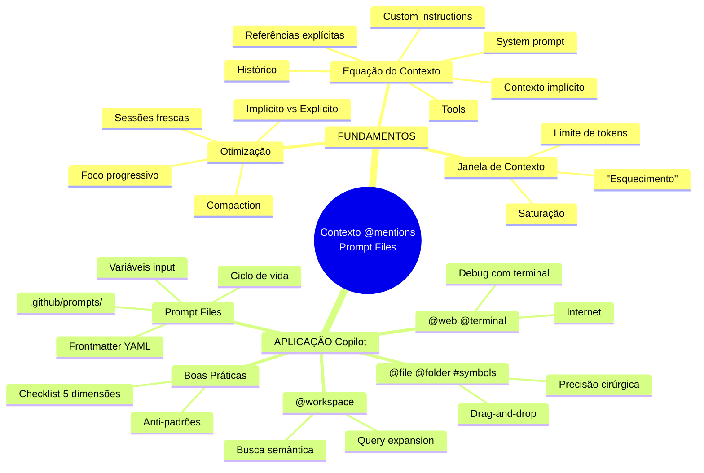
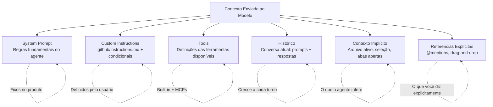
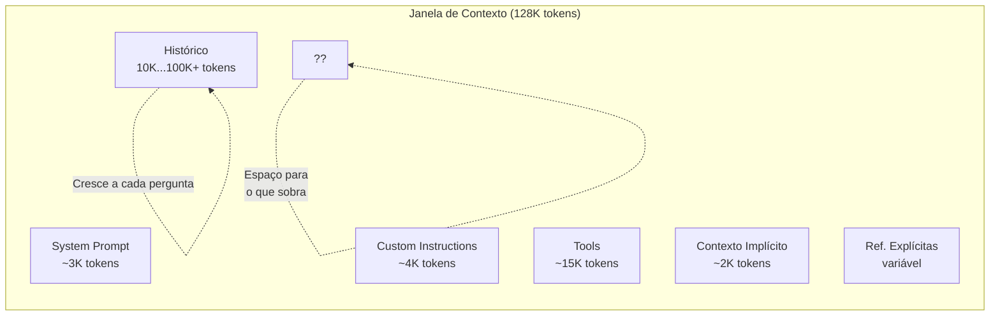
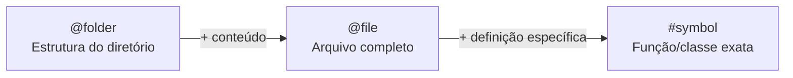
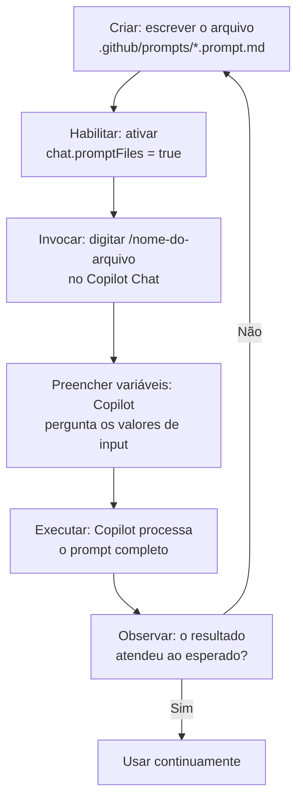

# Harness do GitHub Copilot e Programação Agêntica com VS Code — Aula 04

## Contexto, @mentions e Prompt Files

**Duração estimada:** 100 minutos (55 de leitura + 45 de prática)
**Nível:** Intermediário
**Pré-requisitos:** Aula 01 concluída (modelo mental de coding agents, 8 dimensões, ecossistema Copilot). Aula 02 concluída (Copilot instalado e autenticado no VS Code, Portal de Projetos Dev com `index.html`, `styles.css`, `app.js`). Aula 03 concluída (`.github/copilot-instructions.md` refinado com ~60 linhas e 6 seções, instructions condicionais CSS/JS/HTML em `.github/instructions/`, preferências pessoais em `~/.copilot/instructions/`, Git versionando o projeto).

---

## Objetivos de Aprendizagem

Ao final desta aula, você será capaz de:

- [ ] **Explicar** como um coding agent monta o contexto — a equação system prompt + custom instructions + tools + histórico + contexto implícito + referências explícitas — e por que cada componente importa
- [ ] **Descrever** a janela de contexto de um LLM: o que é, seus limites práticos (~128K a ~200K tokens) e o que acontece quando ela satura
- [ ] **Identificar** três estratégias de otimização de contexto (compaction, sessões frescas, foco progressivo) e escolher a adequada para cada cenário
- [ ] **Usar @workspace** para realizar buscas semânticas no repositório e interpretar os resultados
- [ ] **Aplicar @file e @folder** para incluir contexto preciso de arquivos e diretórios
- [ ] **Utilizar #symbols** para referenciar classes, funções e variáveis específicas com precisão cirúrgica
- [ ] **Empregar @web e @terminal** para injetar contexto de fontes externas (internet, terminal)
- [ ] **Criar Prompt Files** (`.github/prompts/*.prompt.md`) como slash commands reutilizáveis com frontmatter YAML e variáveis `${input:}`
- [ ] **Avaliar** a qualidade do contexto de uma sessão usando um checklist prático de 5 dimensões
- [ ] **Construir** três prompt files customizados para tarefas recorrentes do Portal de Projetos Dev, integrando-os ao harness

---

## Como Usar Esta Aula

Esta aula está organizada em duas partes. A **primeira parte** constrói os mecanismos universais de como um LLM agêntico recebe, processa e gerencia contexto — conceitos que valem para qualquer coding agent, independentemente de ferramenta ou provedor. A **segunda parte** aplica esses conceitos na prática com o GitHub Copilot no VS Code, dominando as @mentions, criando prompt files customizados e aplicando boas práticas de contexto ao Portal de Projetos Dev.

Ao longo do caminho, você encontrará seções **"Mão na Massa"** (para fazer, não só ler) e **"Quick Check"** (para verificar se entendeu antes de avançar). Ao final, o arquivo separado **Questões de Aprendizagem** traz as tarefas de checkpoint — só avance para a Aula 05 quando conseguir completá-las por conta própria.

**Tempo estimado:** 55 minutos de leitura + 45 minutos de prática.
**Dica:** Tenha o VS Code com o Portal de Projetos Dev aberto durante a segunda parte.

---

## Mapa Mental

Este diagrama mostra todos os conceitos que você vai dominar nesta aula:




---

## Recapitulação das Aulas 01 a 03

| Aula | Conceito | Onde aparece nesta aula | Como se conecta |
|---|---|---|---|
| Aula 01 | **Coding agent** (Seção 1) | Seções 1-3 — O agente como entidade que consome contexto | O contexto é o combustível do ciclo Understand→Act→Validate |
| Aula 01 | **Ciclo de decisão** (Seção 4) | Seção 1 — System prompt + instructions + tools + contexto → decisão | A equação do contexto é a versão detalhada do ciclo |
| Aula 02 | **Copilot Chat** (Seção 6) | Seções 4-8 — Você usa o Chat com @mentions e prompt files | O chat é o veículo para fornecer contexto |
| Aula 03 | **copilot-instructions.md** (Seção 6) | Seções 1, 8 — Instructions como componente da equação | O sistema de instruções da Aula 03 é uma peça do contexto |
| Aula 03 | **Instructions condicionais** (Seção 7) | Seção 5 — Contexto condicional por tipo de arquivo | O mesmo princípio de "só carregar quando necessário" |
| Aula 03 | **Pipeline de teste** (Seção 9) | Seção 8 — Checklist de contexto como ferramenta de avaliação | Do pipeline de instruções para o pipeline de contexto |

---

**FUNDAMENTOS: Mecanismos Universais de Contexto em Coding Agents**

> *Os conceitos desta parte são universais — valem para qualquer coding agent, independentemente de IDE, provedor ou ecossistema. Use analogias com ferramentas que você já domina (abas do navegador, memória RAM, grep) como âncoras. Na segunda parte, você verá como o GitHub Copilot implementa cada um desses mecanismos.*

---

## 1. A Equação do Contexto

Você já sabe, desde a Aula 01, que um coding agent segue o ciclo **system prompt + instructions + tools + contexto → decisão**. Mas o que exatamente compõe o "contexto" que o modelo recebe? E, mais importante, o que ele **não** vê?

### A equação completa

Um coding agent monta o contexto para cada interação combinando seis fontes:

```
Contexto = System Prompt + Custom Instructions + Tools + Histórico + Contexto Implícito + Referências Explícitas
```




**System Prompt**: O conjunto de regras fundamentais que define o comportamento básico do agente — como ele deve interpretar perguntas, em que formato responder, quais são seus limites éticos. É fixo do produto e o usuário não o altera.

**Custom Instructions**: As regras persistentes que você define — o `copilot-instructions.md` e os `.instructions.md` condicionais que você refinou na Aula 03. São carregadas automaticamente em toda nova sessão.

**Tools**: As definições das ferramentas que o agente pode usar — leitura de arquivos, busca no repositório, execução de comandos. O modelo não vê o **output** das ferramentas aqui, apenas a **definição** do que cada ferramenta faz. Os outputs aparecem durante a interação.

**Histórico**: A conversa atual — seus prompts e as respostas do modelo. Cada novo turno adiciona tokens ao histórico. Sessões longas consomem mais contexto.

**Contexto Implícito**: O que o agente infere sozinho sem você pedir — o arquivo atualmente aberto no editor, o texto selecionado, as abas abertas. É como sua mesa de trabalho: o que está sobre ela, o agente "vê".

**Referências Explícitas**: O que você fornece intencionalmente — @mentions como `@file:styles.css`, `@workspace`, drag-and-drop de arquivos. É você dizendo "olha aqui, isto é relevante".

### O que o modelo NÃO vê

Saber o que o modelo **não** vê é tão importante quanto saber o que ele vê:

- **Arquivos fechados**: Se um arquivo não está aberto no editor e você não o referenciou com @file, o modelo não sabe que ele existe
- **Sessões anteriores**: Cada conversa é isolada. O modelo não lembra do que você fez ontem
- **Internet**: A menos que você use @web, o modelo não tem acesso à internet — ele só sabe o que estava em seus dados de treino
- **Sistema de arquivos completo**: O modelo não "navega" pelo seu computador. Ele só vê o que está no contexto

### Analogia: sua mesa de trabalho

Pense no contexto como sua mesa física. O system prompt é o formato da mesa (retangular, com gavetas). As custom instructions são os post-its colados na borda com lembretes. As tools são suas ferramentas (caneta, régua, tesoura). O histórico são os papéis das conversas anteriores que você deixou sobre a mesa. O contexto implícito é o documento que está aberto na sua frente agora. As referências explícitas são os arquivos que você puxa da gaveta e coloca sobre a mesa.

O que está na gaveta (fechado), o modelo não vê. O que você conversou ontem e já guardou, o modelo não lembra.

### Quick Check 1

**1. Se você fecha um arquivo no editor sem usar @file para referenciá-lo, o agente ainda "lembra" do conteúdo dele?**
**Resposta:** Não. O agente só vê o que está no contexto ativo. Arquivos fechados não fazem parte do contexto implícito. Se você não os referenciou explicitamente com @file, o agente não sabe que eles existem — mesmo que estivessem abertos antes.

**2. Qual a diferença entre instructions e histórico na equação do contexto?**
**Resposta:** Instructions são regras persistentes carregadas em toda nova sessão (como post-its fixos na mesa). Histórico é o registro da conversa atual (como a transcrição do que foi dito até agora). Instructions definem COMO o agente deve se comportar; histórico define O QUE já foi discutido nesta sessão.

---

## 2. A Janela de Contexto: Limites e Saturação

Você aprendeu que o contexto é montado a partir de seis componentes. Mas existe um limite físico de quanto cabe de uma vez. Esse limite é a **janela de contexto**.

### Tokens: a moeda da atenção

Tudo que o modelo "vê" é medido em **tokens**. Um token não é exatamente uma palavra — é uma unidade de texto que o modelo processa de uma vez:

- Em inglês, 1 token ÉÆ4 caracteres (~¾ de palavra)
- Em português, 1 token ÉÆ2 caracteres (palavras mais longas, acentos, verbos conjugados)

Um arquivo de 60 linhas de JavaScript tem aproximadamente 500-800 tokens. Um prompt como "Explique este código" tem cerca de 5 tokens.

### Limites práticos

Os modelos atuais têm janelas de contexto entre **128K e 200K tokens**:

| Modelo | Janela de Contexto | Equivalente em texto |
|---|---|---|
| GPT-4o | ~128K tokens | ~300 páginas de livro, ~10-15 arquivos médios de código |
| Claude 3.5 Sonnet | ~200K tokens | ~500 páginas, ~20-25 arquivos médios |

128K tokens parece muito, mas lembre-se: o system prompt ocupa alguns milhares, as custom instructions ocupam 2-5K, as tools definitions ocupam dezenas de milhares, e o histórico cresce a cada interação. O espaço disponível para **novo conteúdo** é bem menor que o limite total.




### O que acontece quando a janela satura

Quando o total de tokens excede o limite, o modelo precisa "esquecer" algo. O mecanismo mais comum é: **o que está no início da janela é o primeiro a ser descartado**.

Isso significa que, em uma sessão longa:

1. O system prompt começa a ser "esquecido"
2. As custom instructions perdem efeito
3. As primeiras instruções do `copilot-instructions.md` são ignoradas
4. O modelo começa a se comportar como se as regras não existissem

**Sintomas de saturação:**

- O agente ignora regras que antes seguia perfeitamente
- Respostas inconsistentes dentro da mesma sessão
- O modelo "esquece" o que você pediu no início da conversa
- Comportamento regride para o padrão genérico do modelo

### Analogia: a memória RAM do seu computador

A janela de contexto é como a **memória RAM**. Você tem 16GB (128K tokens). O sistema operacional (system prompt) ocupa 2GB. Seus programas abertos (instructions + tools) ocupam 4GB. As abas do navegador (histórico) ocupam 8GB. Quando você abre mais uma aba (nova pergunta), a RAM enche e o SO faz swap — move dados da RAM para o disco. O que foi movido para o disco fica mais lento de acessar... até ser "esquecido".

Com o modelo, não há disco — o que sai da janela é **perdido** para aquela interação.

### Quick Check 2

**1. Quantos tokens aproximadamente tem um arquivo JavaScript de 60 linhas?**
**Resposta:** Entre 500 e 800 tokens, dependendo da densidade do código (variáveis curtas vs nomes longos, comentários, etc.). Um arquivo de 60 linhas consome menos de 1% de uma janela de 128K tokens.

**2. O que acontece com as instruções no início do `copilot-instructions.md` quando a janela satura?**
**Resposta:** Elas são as primeiras a serem "esquecidas". Como o conteúdo do início da janela é descartado primeiro, as regras no topo do arquivo de instruções perdem efeito antes das regras no final. Por isso a priorização (MUST/SHOULD/MAY) é importante — as regras MUST devem estar no início, mas são justamente as primeiras a serem perdidas na saturação.

---

## 3. Estratégias de Otimização de Contexto

Sabendo que a janela de contexto tem limites e que a saturação degrada a qualidade, você precisa de estratégias para gerenciar o contexto como um recurso finito.

### Três estratégias universais

**1. Compaction**

A **compaction** (compactação) é o processo de resumir o histórico antigo para liberar espaço na janela de contexto. Em vez de manter a conversa completa (cada prompt e resposta anteriores), o modelo resume o histórico: "O usuário pediu para criar um filtro de projetos, eu sugeri usar JavaScript puro com filter(), ele aprovou e agora pede para implementar."

Alguns sistemas fazem compaction automática quando a janela está cheia. Outros expõem um comando manual como `/compact`.

**Quando usar:** A sessão está longa (>20 interações) mas você ainda precisa do contexto geral do que foi discutido.

**2. Sessões Frescas**

Uma **sessão fresca** é simplesmente iniciar uma nova conversa. O histórico anterior é descartado, e o modelo começa com contexto limpo — apenas system prompt + instructions + tools.

**Quando usar:** A tarefa atual é completamente diferente da anterior. Exemplo: você estava debugando um erro de CSS e agora quer gerar uma nova funcionalidade em JavaScript. Manter o histórico de debugging no contexto só polui a nova tarefa.

**3. Foco Progressivo**

**Foco progressivo** significa começar com o mínimo de contexto necessário e adicionar mais apenas quando o modelo pedir ou errar.

- Comece com um prompt direto e específico, sem @mentions
- Se o modelo errar porque falta contexto, adicione @file ou @workspace
- Se o modelo ainda errar, adicione mais referências

Esta estratégia contrasta com o anti-padrão de "jogar tudo de uma vez" — arrastar 10 arquivos "por via das dúvidas", saturando a janela antes mesmo de começar.

**Quando usar:** Sempre que possível. É a estratégia mais eficiente porque minimiza o uso de tokens.

### Contexto Implícito vs Contexto Explícito

Uma distinção fundamental que atravessa as três estratégias:

| Tipo | O que é | Exemplo | Custo de tokens |
|---|---|---|---|
| **Implícito** | O que o agente infere sozinho | Arquivo ativo, seleção, abas abertas | Gratuito (já está no contexto) |
| **Explícito** | O que você fornece intencionalmente | @file:styles.css, @workspace, drag-and-drop | Pago (adiciona tokens ao contexto) |

O contexto implícito é "grátis" porque já faz parte do ambiente. O contexto explícito tem custo porque você está adicionando conteúdo novo à janela.

A arte de otimizar contexto está em **maximizar o implícito e minimizar o explícito** — manter apenas os arquivos relevantes abertos, usar @mentions precisas (#symbol em vez de @file), e só adicionar contexto quando necessário.

### Analogia: abas do navegador

Gerenciar contexto é como gerenciar abas do navegador. Manter 30 abas abertas "por via das dúvidas" deixa seu navegador lento e você se perde. O mesmo vale para o agente — manter 10 arquivos abertos sem necessidade só satura a janela.

A estratégia correta é: mantenha abertas apenas as abas que você está usando agora (contexto implícito). Quando precisar de uma aba diferente, feche as que não precisa mais (sessão fresca) ou use um atalho para encontrá-la rapidamente (@workspace).

### Quick Check 3

**1. Quando você deve usar /compact vs /clear?**
**Resposta:** Use /compact quando a sessão atual está longa mas o contexto geral ainda é relevante — você quer manter a linha de raciocínio mas liberar tokens. Use /clear quando a tarefa atual não tem relação com a anterior — não faz sentido manter um histórico de debugging de CSS para uma tarefa de criação de API.

**2. Por que "manter abas irrelevantes abertas" prejudica o agente?**
**Resposta:** Porque arquivos abertos consomem contexto implícito. Cada aba aberta adiciona conteúdo à janela de contexto, mesmo que você não esteja usando aquele arquivo na tarefa atual. Isso rouba espaço que poderia ser usado para instruções, histórico ou referências explícitas úteis. O agente "vê" arquivos que não são relevantes, o que pode confundir suas respostas.

---

**APLICAÇÃO: @mentions e Prompt Files no GitHub Copilot**

> *Agora que você entende os mecanismos universais de contexto — a equação, a janela de contexto, as estratégias de otimização — vamos conectá-los à prática com o GitHub Copilot no VS Code. Cada @mention que você vai aprender implementa um desses mecanismos de forma concreta, e os Prompt Files são a materialização do foco progressivo e da reutilização de contexto.*

---

## 4. @workspace — Busca Semântica no Repositório

O `@workspace` é a @mention mais poderosa e também a que consome mais tokens. Ela permite que o Copilot busque **por significado** em todo o seu repositório.

### Busca semântica vs busca textual

Um grep tradicional (`grep -r "renderizarCards" src/`) encontra **palavras exatas**. Se você escreveu "renderCards" em vez de "renderizarCards", o grep não encontra nada. A busca semântica entende **intenção**:

- Você pergunta: "como os projetos são filtrados por status?"
- O Copilot busca por: funções que filtram arrays, condicionais com status, variáveis relacionadas a filtro, strings que mencionam status
- Ele encontra `filtrarPorStatus()`, `projetosFiltrados`, o event listener do seletor de status, e a lógica de renderização condicional

Isso é possível porque o Copilot **indexa** seu workspace — ele cria um índice semântico do código, mappings de símbolos, e relações entre arquivos. A indexação é automática e contínua.

### Query expansion

Quando você faz uma pergunta com @workspace, o Copilot não busca literalmente suas palavras. Ele expande a consulta:

- "Onde a paleta de cores é definida?" → busca por `:root`, `--color-`, `var(--`, `paleta`, `tema`, `colors`, variáveis CSS
- "Como os cards são renderizados?" → busca por `renderizarCards`, `createCard`, `innerHTML`, `card`, `projeto`, template strings com HTML

### Quando usar @workspace

| Cenário | Recomendação |
|---|---|
| "Como X funciona no projeto?" | “& @workspace |
| "Onde Y está definido?" | “& @workspace |
| "Existe alguma função que faz Z?" | “& @workspace |
| "Explique este arquivo específico" | Ì Use @file |
| "Corrija este bug nesta função" | Ì Use #symbol |
| "Qual a previsão do tempo?" | Ì Use @web |

@workspace é ideal para **descoberta** — quando você não sabe exatamente onde algo está. Para tarefas em 1-2 arquivos que você já conhece, @file ou #symbol são mais eficientes.

### Mão na Massa — @workspace no Portal

- [ ] Abra o VS Code com o Portal de Projetos Dev
- [ ] No Copilot Chat, faça as três consultas abaixo com @workspace
- [ ] Observe os resultados e identifique quais arquivos foram encontrados

**Consulta 1:** `@workspace como os projetos são filtrados por status?`

**Consulta 2:** `@workspace onde a paleta de cores é definida no CSS?`

**Consulta 3:** `@workspace qual função renderiza os cards de projeto?`

**Verificação:** Cada consulta deve retornar os arquivos e funções relevantes. Se @workspace não encontrar o que espera, verifique se o índice foi construído (o Copilot indexa automaticamente, mas pode levar alguns segundos para projetos grandes).

### Quick Check 4

**1. @workspace encontra código por palavras exatas ou por significado?**
**Resposta:** Por significado (busca semântica). @workspace entende a intenção da pergunta e encontra código relacionado, mesmo que as palavras exatas não apareçam. É como perguntar "onde é o enterro?" em vez de procurar por "cemitério" no mapa — a intenção guia a busca.

**2. Quando @workspace seria desperdício de contexto?**
**Resposta:** (1) Quando você já sabe exatamente qual arquivo precisa — @file é mais preciso e econômico. (2) Para tarefas de debugging em uma função específica — #symbol é mais cirúrgico. (3) Para perguntas que não envolvem o codebase — @web ou uma pergunta direta sem @mention é mais adequada. @workspace adiciona o índice do repositório ao contexto, o que consome tokens desnecessariamente se você não precisa de busca no repositório.

---

## 5. @file, @folder e #symbols — Contexto Cirúrgico

Enquanto @workspace busca no repositório inteiro, @file, @folder e #symbols fornecem **contexto cirúrgico** — você diz exatamente o que incluir, sem depender de busca semântica.

### A sintaxe de cada menção

| Menção | Sintaxe | O que inclui no contexto | Quando usar |
|---|---|---|---|
| @file | `@file:app.js` | Conteúdo completo do arquivo | Explicar, refatorar ou depurar um arquivo específico |
| @folder | `@folder:.github/prompts` | Estrutura do diretório (nomes dos arquivos, não conteúdos) | Perguntar sobre organização, navegar pela estrutura |
| #symbol | `#symbol:renderizarCards` | Definição exata da função/classe/variável | Entender ou modificar um símbolo específico |

Você também pode arrastar arquivos do Explorer do VS Code diretamente para o chat — o Copilot cria automaticamente a @mention correspondente.

### Precisão crescente




- **@folder**: você pergunta "como este módulo está organizado?" — recebe a lista de arquivos e subpastas
- **@file**: você pergunta "explique este arquivo" — recebe o conteúdo completo para análise
- **#symbol**: você pergunta "como esta função funciona?" — recebe apenas a definição da função

Quanto mais específico você for, menos tokens consome e mais precisa é a resposta.

### Drag-and-drop como atalho

Em vez de digitar `@file:caminho/para/arquivo.js`, você pode arrastar o arquivo do Explorer para o chat. O Copilot cria a menção automaticamente. Isso funciona para:

- Arquivos individuais → `@file`
- Múltiplos arquivos → `@file` para cada um (separados por vírgula se arrastar junto)
- Pastas → `@folder`

### Casos de uso práticos

**@file para explicar código existente:**

```
@file:app.js Explique como a função de filtro de status funciona
```

**@folder para explorar organização:**

```
@folder:.github Como está organizada a estrutura de instruções do projeto?
```

**#symbol para entender um símbolo específico:**

```
#symbol:renderizarCards O que esta função faz? Ela usa innerHTML ou createElement?
```

Digite `#` no chat e aguarde o Intellisense — o Copilot mostra os símbolos disponíveis do seu workspace.

### Mão na Massa — @file, @folder e #symbols no Portal

- [ ] No Copilot Chat, use @file para pedir explicação do `app.js`:
  `@file:app.js Explique como a filtragem de projetos por status é implementada`

- [ ] Use #symbol para inspecionar uma função específica:
  `#symbol:renderizarCards Como esta função constrói o HTML dos cards?`

- [ ] Use @folder para explorar a estrutura de instruções:
  `@folder:.github/instructions Quantos arquivos de instrução existem e qual o propósito de cada um?`

**Verificação:** Cada resposta deve refletir o contexto fornecido. A resposta de @file deve cobrir o arquivo inteiro. A de #symbol deve focar apenas na função. A de @folder deve listar arquivos sem mostrar conteúdo.

### Quick Check 5

**1. Qual a diferença de precisão entre @file e #symbol?**
**Resposta:** @file inclui o conteúdo completo do arquivo no contexto (centenas ou milhares de tokens). #symbol inclui apenas a definição do símbolo específico (dezenas ou centenas de tokens). Para entender uma função específica em um arquivo grande, #symbol é mais preciso e econômico. @file é melhor quando você precisa do contexto completo do arquivo ou de múltiplos símbolos.

**2. @folder inclui o conteúdo dos arquivos ou apenas os nomes?**
**Resposta:** Apenas os nomes dos arquivos e a estrutura de subpastas. @folder é útil para perguntas sobre organização ("como este módulo está estruturado?") mas não fornece conteúdo para análise de código. Se você precisa do conteúdo, use @file.

---

## 6. @web e @terminal — Contexto Externo

Nem todo contexto está dentro do seu repositório. Às vezes você precisa de informação da internet (APIs, bibliotecas, documentação) ou do terminal (comandos, erros, saídas).

### @web — busca na internet

`@web` faz uma busca na internet e inclui os resultados no contexto. É útil para:

- **APIs recentes**: "CSS Grid auto-fill vs auto-fit examples 2025"
- **Documentação de bibliotecas**: "`Array.from()` vs spread operator performance"
- **Padrões web**: "HTML semantic landmarks accessibility"
- **Solução de problemas**: "fix flexbox gap not working in Safari"

**Exemplo:**

```
@web CSS Grid minmax() examples 2025
```

O Copilot busca na internet, encontra artigos, documentação e exemplos, e sintetiza uma resposta com base no que encontrou.

**Limitações:**

- Não acessa páginas que exigem autenticação (login, VPN)
- Resultados podem não ser os mais recentes (depende do que está indexado)
- O consumo de tokens é alto (os resultados da busca são incluídos no contexto)

### @terminal — debugging com contexto

`@terminal` captura o **último comando executado** no terminal integrado do VS Code e sua saída. É a forma mais rápida de pedir ajuda ao Copilot quando um comando falha.

**Antes (sem @terminal):**

```
Olá Copilot, executei o comando "npm run build" e deu o erro "Module not found: Error: Can't resolve './components/Card' in 'src/app.js'". Como corrigir?
```

**Depois (com @terminal):**

```
@terminal O build falhou. Como corrigir?
```

O Copilot vê o último comando e sua saída automaticamente, sem você precisar copiar e colar.

**Limitações:**

- Captura apenas o **último** comando executado (não o histórico completo)
- Funciona apenas com o terminal integrado do VS Code
- Se você executou múltiplos comandos rapidamente, pode capturar o errado

### Combinando @web + @terminal

O verdadeiro poder aparece quando você combina as duas:

```
@terminal Este erro de CSS está quebrando o layout. @web Como usar CSS Grid com fallback para navegadores antigos?
```

O Copilot tem o contexto do erro (do terminal) e busca a solução na internet simultaneamente.

### Mão na Massa — @web e @terminal no Portal

- [ ] **@web para pesquisa:** No Copilot Chat, pesquise:
  `@web CSS Grid minmax() examples 2025 como aplicar no layout de cards`

  Aplique um dos padrões encontrados no `styles.css` do Portal.

- [ ] **@terminal para debugging:**
  1. No terminal integrado, execute um comando que gere erro (ex: `node -e "console.log(naoDeclarado)"`)
  2. No Chat, digite: `@terminal Por que este comando falhou?`
  3. Observe que o Copilot "viu" o erro sem você copiar e colar

**Verificação:** A resposta de @web deve incluir exemplos de CSS Grid com `minmax()`. A resposta de @terminal deve identificar exatamente o erro que você provocou.

### Quick Check 6

**1. @web consegue acessar páginas que exigem login?**
**Resposta:** Não. @web busca conteúdo publicamente acessível na internet. Páginas atrás de autenticação (login, VPN, paywall) não são acessíveis. Para documentação de APIs privadas ou sistemas internos, você precisa fornecer o contexto manualmente.

**2. @terminal captura apenas o último comando ou o histórico completo?**
**Resposta:** Apenas o último comando executado e sua saída. Não captura o histórico completo do terminal. Se você executou múltiplos comandos e quer referenciar um específico, certifique-se de que ele foi o último antes de usar @terminal.

---

## 7. Prompt Files — Slash Commands Customizados

Você domina as @mentions para fornecer contexto. Agora vai aprender a **empacotar contexto reutilizável** em prompt files — arquivos que viram slash commands customizados no Copilot Chat.

### O que são Prompt Files?

Um **prompt file** é um arquivo `.prompt.md` que, quando colocado em `.github/prompts/`, vira um slash command (`/nome-do-arquivo`) no Copilot Chat. É como um snippet de prompt que você pode invocar com um comando curto.

Em vez de digitar todo o prompt toda vez:

```
Gere um card de projeto para o Portal seguindo o padrão HTML do index.html. 
O card deve ter: título, descrição, status, tecnologias e um link para detalhes.
Use classes CSS existentes (project-card, project-title, project-description, status-badge).
NÃO use frameworks. Siga as instruções do copilot-instructions.md.
```

Você digita apenas:

```
/gerar-cards Quantidade: 5 projetos mock
```

E o prompt file expande o prompt completo, pronto para o Copilot executar.

### Anatomia de um Prompt File

```markdown
---
agent: ask
description: Gera cards de projeto HTML seguindo o padrão do Portal
---

Gere cards de projeto para o Portal de Projetos Dev seguindo o padrão abaixo:

- Cada card deve conter: **título**, **descrição**, **status**, **tecnologias** e **link**
- Use as classes CSS existentes: `.project-card`, `.project-title`, `.project-description`, `.status-badge`
- O status deve usar a classe de cor correspondente: `status-active`, `status-paused`, `status-completed`
- NÃO use frameworks JavaScript
- Siga as regras do `copilot-instructions.md`

## Contexto do Projeto

Arquivos de referência:
- #file:index.html (estrutura HTML base)
- #file:styles.css (estilos e classes disponíveis)
- #file:app.js (estrutura de dados dos projetos)

## Instrução de Saída

${input:quantidade:Quantos cards gerar? Padrão: 3}
```

**Frontmatter YAML:** Define dois campos obrigatórios:

- `agent`: o tipo de agente que executará o prompt (`ask`, `edit` ou `agent`)
- `description`: texto que aparece no autocomplete quando você digita `/`

**Corpo em Markdown:** O prompt propriamente dito — tudo que você digitaria manualmente no chat.

**Variáveis `${input:}`:** Placeholders que o Copilot preenche antes de executar. Formato: `${input:nome:descricao}`. O Copilot pergunta o valor de cada variável quando você invoca o comando.

### Ciclo de Vida de um Prompt File




### Passo a passo da criação

**1. Criar o arquivo**

Crie o diretório `.github/prompts/` e dentro dele um arquivo `.prompt.md`. O nome do arquivo (sem extensão) vira o slash command. `gerar-cards.prompt.md` vira `/gerar-cards`.

**2. Habilitar no settings.json**

Adicione ao `.vscode/settings.json` do workspace:

```json
{
  "chat.promptFiles": true
}
```

**3. Invocar**

No Copilot Chat, digite `/` e veja a lista de prompt files disponíveis. Selecione o comando ou digite `/gerar-cards`.

O Copilot pergunta o valor de cada variável `${input:}` e expande o prompt completo.

### Referenciando arquivos do projeto

Dentro do prompt file, você pode referenciar arquivos do projeto de duas formas:

1. **Link Markdown:** `[index.html](../index.html)` — inclui o conteúdo no contexto
2. **#file inline:** `#file:index.html` — mesma sintaxe do chat

### Mão na Massa — Crie seu primeiro Prompt File

**Passo 1:** Habilite prompt files no seu workspace

- [ ] Crie a pasta `.vscode/` na raiz do projeto (se não existir)
- [ ] Crie/edite `.vscode/settings.json` adicionando:

```json
{
  "chat.promptFiles": true
}
```

**Passo 2:** Crie a pasta de prompt files

```bash
mkdir -p .github/prompts
```

**Passo 3:** Crie `gerar-cards.prompt.md`

```markdown
---
agent: ask
description: Gera cards de projeto HTML seguindo o padrão do Portal
---

Gere cards de projeto para o Portal de Projetos Dev.

## Padrão de cada card

- **Estrutura:** `<article class="project-card">` com header (título + status), body (descrição + tecnologias) e footer (link)
- **Classes CSS:** `.project-card`, `.project-title`, `.project-description`, `.status-badge`, `.tech-tag`
- **Status:** Use `status-active` (verde), `status-paused` (amarelo) ou `status-completed` (azul)
- **Tecnologias:** Lista de tags com classe `.tech-tag`
- **Ícones:** Não usar — texto puro apenas
- **Framework:** NÃO usar — HTML puro e CSS classes existentes

## Contexto

Consulte #file:index.html para a estrutura base e #file:styles.css para as classes disponíveis.

## Gere

${input:quantidade:Quantos cards gerar? Padrão: 3}
```

**Passo 4:** Teste o prompt file

- No Copilot Chat, digite `/gerar-cards`
- Responda à pergunta "Quantos cards gerar?" com `3`
- Verifique se o resultado segue o padrão do Portal

**Verificação:** O comando deve aparecer no autocomplete ao digitar `/`. A resposta deve conter cards HTML que usam as classes CSS do Portal.

### Quick Check 7

**1. Onde o prompt file precisa estar para ser reconhecido como slash command?**
**Resposta:** Em `.github/prompts/` com extensão `.prompt.md`. O nome do arquivo (sem extensão) vira o comando: `gerar-cards.prompt.md` → `/gerar-cards`. Além disso, o settings do workspace precisa ter `"chat.promptFiles": true`.

**2. Como referenciar outro arquivo do projeto dentro de um prompt file?**
**Resposta:** De duas formas: (1) `#file:caminho/para/arquivo.js` — sintaxe direta que inclui o conteúdo no contexto; (2) `[descrição](../caminho/arquivo.md)` — link Markdown que também inclui o conteúdo. Ambas funcionam dentro do corpo do prompt file.

---

## 8. Boas Práticas de Contexto — O Checklist do Harness

Você aprendeu as ferramentas: @workspace, @file, #symbols, @web, @terminal, Prompt Files. Agora o último passo é desenvolver o **discernimento** para usá-las bem.

### O Checklist de 5 Dimensões

Antes de cada sessão com o Copilot, ou quando sentir que a qualidade está caindo, aplique este checklist:

**1. Foco — O contexto está limitado ao necessário para esta tarefa?**

Pergunte-se: "Eu preciso de todos esses arquivos abertos para o que vou fazer agora?"

- “& Apenas arquivos relevantes estão abertos
- Ì 8 abas abertas "por via das dúvidas" para uma tarefa que envolve 2 arquivos

**2. Relevância — Os @mentions e referências são pertinentes?**

Pergunte-se: "Cada @mention que adicionei é realmente necessária?"

- “& Usei @file:app.js porque a tarefa envolve modificar a lógica de filtro
- Ì Usei @workspace para perguntar "o que este arquivo faz?" quando @file:app.js seria suficiente

**3. Isolamento — Esta sessão está poluída com histórico de tarefas anteriores?**

Pergunte-se: "O histórico atual atrapalha ou ajuda?"

- “& Sessão dedicada apenas à tarefa de criação de filtro
- Ì Na mesma sessão: debuguei CSS, gerei HTML, perguntei sobre JavaScript, mudei de branch

**4. Progressão — Comecei pequeno e expandi ou joguei tudo de uma vez?**

Pergunte-se: "Eu poderia começar com menos contexto e adicionar só se precisar?"

- “& Comecei com um prompt direto, adicionei @file quando o modelo pediu mais contexto
- Ì Arrastei 5 arquivos no primeiro prompt "para garantir"

**5. Renovação — Quando foi a última vez que usei /clear ou /compact?**

Pergunte-se: "Esta sessão tem mais de 20 interações? O modelo parece estar ignorando instruções?"

- “& Uso /clear para tarefas não relacionadas
- “& Uso /compact em sessões longas que ainda são relevantes
- Ì Sessão com 50 interações sobre 4 assuntos diferentes, modelo inconsistente

### Anti-padrões de Contexto

**Saturação por excesso de @mentions:** Arrastar 10 arquivos "por via das dúvidas" no primeiro prompt. Resultado: a janela satura, instruções são "esquecidas", e o modelo responde pior do que se tivesse recebido apenas 2 arquivos.

**Contexto poluído:** 5 tarefas diferentes na mesma sessão (CSS, JS, HTML, debugging, documentação). Resultado: o histórico de uma tarefa interfere nas respostas da outra. O modelo pode "lembrar" de uma função de debugging quando você está pedindo para gerar HTML.

**Instruções contraditórias:** Um prompt file que pede "use Flexbox" enquanto o `copilot-instructions.md` diz "use CSS Grid". Resultado: o modelo não sabe qual regra seguir e pode alternar entre as duas inconsistentemente.

**Dependência excessiva de @workspace:** Usar @workspace para tudo, mesmo quando você já sabe exatamente qual arquivo precisa. Resultado: consumo desnecessário de tokens e respostas menos precisas.

### Mão na Massa — Diagnóstico de Contexto

- [ ] Abra o Copilot Chat e examine a sessão atual
- [ ] Aplique o checklist de 5 dimensões:
  - **Foco:** Quantos arquivos estão abertos? Quantos são relevantes para a tarefa atual?
  - **Relevância:** As @mentions que você usou eram todas necessárias?
  - **Isolamento:** Esta sessão tem histórico de tarefas não relacionadas?
  - **Progressão:** Você começou pequeno e expandiu ou jogou tudo de uma vez?
  - **Renovação:** Quantas interações tem esta sessão? Precisa de /compact ou /clear?
- [ ] Se a sessão estiver poluída, use `/clear` e comece uma sessão fresca
- [ ] Se a sessão for longa mas relevante, use `/compact` para resumir o histórico

**Verificação:** Após /clear ou /compact, o comportamento do modelo deve melhorar — as instruções voltam a ser seguidas e as respostas ficam mais consistentes.

### Quick Check 8

**1. Qual a diferença entre "foco" e "relevância" no checklist?**
**Resposta:** Foco é sobre **quantidade** de contexto — você tem apenas o necessário ou está com excesso de arquivos abertos? Relevância é sobre **qualidade** — as referências que você adicionou são pertinentes à tarefa? Um cenário pode ter foco (poucos arquivos abertos) mas baixa relevância (os arquivos abertos não são os corretos para a tarefa). Ou alta relevância mas baixo foco (muitos arquivos relevantes, mas mais do que o necessário).

**2. Por que tarefas não relacionadas na mesma sessão são um anti-padrão?**
**Resposta:** Porque o histórico de uma tarefa contamina o contexto da outra. Se você estava debugando um erro de CSS e depois pede para gerar uma função JavaScript, o modelo pode "lembrar" do erro de CSS e tentar aplicar lógica de debugging no código novo. Além disso, o histórico ocupa tokens que poderiam ser usados para instruções e contexto da tarefa atual. Cada tarefa deve ter sua própria sessão.

---

## Autoavaliação: Quiz Rápido

**1. Qual componente da equação do contexto consome mais tokens em uma sessão longa?**
**Resposta:** O histórico. Enquanto system prompt, instructions e tools são fixos, o histórico cresce a cada interação. Em sessões com 20+ turnos, o histórico pode consumir 70-80% da janela de contexto.

**2. Você está em uma sessão com 30 interações sobre refatoração de CSS. Agora precisa implementar uma nova função em JavaScript. Qual estratégia de otimização você usa?**
**Resposta:** Sessão fresca (/clear). A tarefa de JavaScript não tem relação com a refatoração de CSS. Manter o histórico de CSS no contexto só polui a nova tarefa. Inicie uma nova sessão para a função JavaScript.

**3. Qual a diferença fundamental entre @workspace e @file?**
**Resposta:** @workspace busca por significado no repositório inteiro (o Copilot decide quais arquivos incluir). @file inclui um arquivo específico que você escolheu. @workspace é para descoberta (você não sabe onde está); @file é para precisão (você sabe exatamente qual arquivo precisa).

**4. Quando #symbol é melhor que @file?**
**Resposta:** Quando você precisa de uma função, classe ou variável específica dentro de um arquivo grande. #symbol inclui apenas a definição do símbolo (dezenas de tokens), enquanto @file incluiria o arquivo inteiro (centenas ou milhares de tokens). Para perguntas como "como a função renderizarCards funciona?", #symbol é mais eficiente.

**5. O que o `agent` no frontmatter YAML de um prompt file define?**
**Resposta:** Define qual tipo de agente executará o prompt: `ask` (responde em texto, não modifica arquivos), `edit` (faz edições no código) ou `agent` (modo autônomo, pode executar múltiplas ferramentas). A escolha depende do que o prompt file precisa fazer.

**6. Como você referencia um arquivo do projeto dentro de um prompt file?**
**Resposta:** De duas formas: (1) `#file:caminho/para/arquivo.js` — sintaxe direta; (2) `[descrição](../caminho/arquivo.md)` — link Markdown. Ambos incluem o conteúdo do arquivo no contexto quando o prompt é executado.

**7. Você percebeu que o Copilot está ignorando regras do `copilot-instructions.md` que antes seguia. Qual a causa mais provável e o que fazer?**
**Resposta:** Causa mais provável: saturação de contexto. O histórico da sessão cresceu e as instruções do início da janela foram "esquecidas". Solução: (1) use /compact para resumir o histórico, (2) se a tarefa atual não tem relação com o início da sessão, use /clear, (3) verifique se você não está com muitos arquivos abertos ou @mentions desnecessárias.

---

## Mão na Massa: Exercícios Graduados

**Exercício 1 (Fácil) — Diagnosticando o Contexto de uma Sessão**

Você está ajudando um colega que está com o Copilot "desobediente" — ele ignora as regras de estilo do projeto e gera código inconsistente. Usando o checklist de 5 dimensões da Seção 8, analise a sessão abaixo e identifique quais dimensões estão comprometidas:

```
Sessão atual do colega:
- 8 arquivos abertos: app.js, styles.css, index.html, README.md, 
  .github/copilot-instructions.md, .github/prompts/gerar-cards.prompt.md, 
  node_modules/alguma-coisa.js, package.json
- 47 interações na mesma sessão
- Começou o dia debugando CSS, depois refatorou JavaScript, 
  depois gerou HTML, depois perguntou sobre uma API externa com @web
- No prompt atual: @workspace:app.js @file:styles.css @file:index.html 
  #symbol:renderizarCards @folder:.github
- O modelo sugeriu usar React (o projeto é vanilla) e usou tabs (instrução pede 2 espaços)
```

**Gabarito:**

| Dimensão | Problema identificado |
|---|---|
| **Foco** | Ì 8 arquivos abertos, incluindo `node_modules/` e `package.json` que não são relevantes |
| **Relevância** | Ì 4 @mentions no mesmo prompt para uma tarefa que provavelmente precisa de 1-2 |
| **Isolamento** | Ì Na mesma sessão: CSS, JS, HTML, @web — 4 assuntos diferentes |
| **Progressão** | Ì Jogou 4 @mentions de uma vez sem começar pelo essencial |
| **Renovação** | Ì 47 interações sem /compact ou /clear |

**Recomendação:** (1) `/clear` — comece uma sessão fresca. (2) Feche arquivos irrelevantes (`node_modules`, `package.json`, `README.md`). (3) Para a tarefa atual, identifique qual arquivo é o principal e comece com ele apenas. (4) Adicione mais contexto só se o modelo pedir.

---

**Exercício 2 (Médio) — Prompt File com Variáveis**

Crie um prompt file chamado `estilizar-componente.prompt.md` em `.github/prompts/` que:

1. Gere estilos CSS para um componente do Portal de Projetos Dev
2. Receba como variáveis: nome do componente (ex: "filter-bar"), tipo de layout (grid/flex), e cor primária (hex)
3. Siga as regras do `css.instructions.md` (CSS Grid, variáveis CSS, mobile-first)
4. Referencie o `styles.css` para usar as variáveis CSS existentes

**Gabarito:**

Conteúdo do arquivo `.github/prompts/estilizar-componente.prompt.md`:

```markdown
---
agent: ask
description: Gera estilos CSS para um componente do Portal seguindo as convenções do projeto
---

Gere estilos CSS para o componente `${input:nome:Nome do componente (ex: filter-bar)}` do Portal de Projetos Dev.

## Requisitos de Estilo

- Use **${input:layout:Tipo de layout (grid/flex)}** como estratégia de layout principal
- Cor primária: ${input:cor:Cor primária (hex, ex: #3498db)}
- Siga as convenções do `css.instructions.md`:
  - Mobile-first: base mobile primeiro, depois media queries
  - Classes semânticas em kebab-case: `.${input:nome}`
  - Variáveis CSS para cores (consulte `:root` no `styles.css`)
  - `rem` para fontes, `px` para bordas
- NÃO use CSS inline
- NÃO use !important a menos que absolutamente necessário

## Contexto

Consulte #file:styles.css para as variáveis CSS existentes e padrões de estilo.

## Exemplo de estrutura esperada

```css
/* ${input:nome} - Componente */
.nome-componente {
  /* Layout */
  display: ${input:layout};
  /* ... propriedades específicas */
}

@media (min-width: 768px) {
  .nome-componente {
    /* Ajustes para tablet/desktop */
  }
}
```
```

**Teste:** Invoque `/estilizar-componente` no Chat e forneça valores como "filter-bar", "flex", "#2ecc71". Verifique se o CSS gerado:
- Usa classes em kebab-case “&
- Segue mobile-first “&
- Usa variáveis CSS existentes “&
- Não usa !important sem necessidade “&

---

**Desafio (Difícil) — Sessão de Contexto –timo para Feature Completa**

Você precisa implementar uma nova feature no Portal de Projetos Dev: **uma barra de busca que filtra projetos por nome em tempo real**.

Planeje e execute uma sessão de contexto ótimo seguindo o checklist de 5 dimensões:

1. **Planejamento (antes de abrir o VS Code):**
   - Quais arquivos são relevantes para esta feature? Liste no máximo 3.
   - Qual o prompt inicial ideal (sem @mentions ainda)?
   - Em que ordem você vai adicionar contexto (@workspace, @file, #symbol)?

2. **Execução (no VS Code):**
   - Inicie uma sessão fresca com /clear
   - Execute seu plano passo a passo
   - Documente cada etapa: o que funcionou, o que você ajustou

3. **Reflexão (depois da feature):**
   - Aplique o checklist de 5 dimensões na sessão que você executou
   - Identifique 1 coisa que faria diferente
   - A feature está funcionando? Se não, por quê?

**Gabarito — Exemplo de planejamento:**

**Arquivos relevantes (máx 3):**
1. `app.js` — onde a lógica de filtro e renderização existe
2. `index.html` — onde o input de busca será adicionado
3. `styles.css` — para estilizar a barra de busca

**Prompt inicial (sem @mentions):**

"Preciso adicionar uma barra de busca no Portal de Projetos Dev que filtre os cards de projeto por nome em tempo real. Conforme o usuário digita, os cards que não correspondem devem ser escondidos. O filtro atual é por status — preciso integrar com ele ou criar um filtro separado? Sugira a implementação."

**Ordem de adição de contexto:**
1. Começar sem @mentions (foco progressivo)
2. Se o modelo pedir, adicionar @file:app.js (contexto do arquivo principal)
3. Se precisar da estrutura HTML, adicionar @file:index.html
4. Se precisar de classes CSS específicas, adicionar #symbol:renderizarCards
5. Só usar @workspace se não encontrar o que precisa

**Critérios de avaliação:**

| Critério | Atendeu? |
|---|---|
| Máximo 3 arquivos abertos durante a sessão | “& / Ì |
| Começou sem @mentions, adicionou progressivamente | “& / Ì |
| Usou /clear para sessão fresca | “& / Ì |
| Não misturou tarefas não relacionadas na mesma sessão | “& / Ì |
| Feature implementada corretamente | “& / Ì |
| Documentou aprendizados | “& / Ì |

---

## Resumo da Aula

### Os 8 Conceitos Fundamentais

1. **Equação do contexto**: Contexto = System Prompt + Instructions + Tools + Histórico + Implícito + Explícito. O modelo só vê o que está na janela — não tem memória entre sessões.
2. **Janela de contexto**: ~128K a ~200K tokens. Quando satura, as primeiras instruções são "esquecidas". Sintomas: regras ignoradas, comportamento inconsistente.
3. **Otimização de contexto**: Três estratégias — compaction (resumir), sessões frescas (/clear), foco progressivo (começar pequeno, expandir sob demanda).
4. **@workspace**: Busca semântica no repositório inteiro. Ideal para descoberta. Entende intenção, não palavras exatas. Consome muitos tokens — use com moderação.
5. **@file, @folder, #symbols**: Contexto cirúrgico com precisão crescente. @folder (estrutura) → @file (conteúdo completo) → #symbol (definição específica). Escolha o mais preciso para cada caso.
6. **@web e @terminal**: Contexto externo. @web busca na internet (APIs, docs). @terminal captura o último comando (debugging rápido). Ambos consomem tokens significativos.
7. **Prompt Files**: `.github/prompts/*.prompt.md` → slash commands customizados. Frontmatter YAML (`agent`, `description`) + corpo Markdown + variáveis `${input:}`. Habilitar com `"chat.promptFiles": true`.
8. **Checklist de 5 dimensões**: Foco, Relevância, Isolamento, Progressão, Renovação — aplique antes de cada sessão para garantir contexto ótimo.

### O Que Você Construiu Hoje

- [x] @workspace testado com 3 consultas no Portal de Projetos Dev
- [x] @file, @folder e #symbols usados para contexto cirúrgico
- [x] @web e @terminal usados para contexto externo
- [x] Prompt files habilitados no `.vscode/settings.json`
- [x] `gerar-cards.prompt.md` criado e testado
- [x] `estilizar-componente.prompt.md` criado com variáveis
- [x] Checklist de contexto aplicado na sessão

---

## Próxima Aula

**Aula 05: Agent Mode — O Copilot como Agente Autônomo**

Você dominou como fornecer contexto ao Copilot. Na próxima aula, o Copilot vai usar esse contexto para agir por conta própria — ler o codebase, decidir o que editar, executar mudanças e validar resultados. O Agent Mode transforma o Copilot de um assistente que responde perguntas em um agente que executa tarefas completas. Você vai ver o ciclo Understand→Act→Validate em ação pela primeira vez.

---

## Referências

### Documentação Oficial

- [VS Code Docs — Copilot Chat Context](https://code.visualstudio.com/docs/copilot/chat/copilot-chat-context) — documentação oficial sobre @mentions e contexto
- [VS Code Docs — Context Concepts](https://code.visualstudio.com/docs/copilot/concepts/context) — como o VS Code monta o contexto do Copilot
- [VS Code Docs — Context Engineering Guide](https://code.visualstudio.com/docs/copilot/guides/context-engineering-guide) — guia de engenharia de contexto
- [VS Code Docs — Best Practices: Context](https://code.visualstudio.com/docs/copilot/best-practices#provide-the-right-context) — melhores práticas de contexto
- [GitHub Docs — Prompt Files](https://docs.github.com/en/copilot/concepts/prompting/response-customization) — documentação oficial sobre prompt files
- [GitHub Docs — Chat Cheat Sheet](https://docs.github.com/en/copilot/reference/chat-cheat-sheet) — referência rápida de @mentions
- [GitHub Docs — Repository Indexing](https://docs.github.com/en/copilot/concepts/context/repository-indexing) — indexação para busca semântica

### Tutoriais

- [GitHub Copilot Cookbook — Prompt Files Tutorial](https://docs.github.com/en/copilot/tutorials/customization-library/prompt-files/onboarding-plan) — tutorial com exemplo real de prompt files
- [GitHub Copilot Customization Cheat Sheet](https://docs.github.com/en/copilot/reference/customization-cheat-sheet) — visão geral de customizações

### Artigos para Aprofundamento

- [Prompt Engineering for Copilot](https://docs.github.com/en/copilot/using-github-copilot/prompt-engineering-for-copilot) — guia de engenharia de prompt do GitHub
- [VS Code Agents Overview](https://code.visualstudio.com/docs/agents/overview) — visão geral de agents no VS Code

---

## FAQ

**P: O Copilot sempre carrega todos os arquivos abertos no contexto?**
R: Não exatamente. O contexto implícito inclui o arquivo ativo e a seleção atual. Outros arquivos abertos podem ser incluídos dependendo do que o Copilot considera relevante, mas não há garantia. Se você quer certeza, use @file.

**P: Quantas @mentions posso usar em um único prompt?**
R: Não há limite explícito, mas cada @mention adiciona tokens ao contexto. Use com moderação — 2-3 @mentions bem escolhidas valem mais que 10 "por via das dúvidas". Lembre-se da regra do foco progressivo: comece com o mínimo e adicione conforme necessário.

**P: @workspace funciona em projetos muito grandes (1000+ arquivos)?**
R: Sim, o índice semântico escala para projetos grandes. No entanto, a qualidade da busca depende da clareza da sua pergunta. Seja específico: "como os usuários são autenticados?" em vez de "explique o sistema".

**P: Posso usar @web e @terminal no mesmo prompt?**
R: Sim, e é uma combinação poderosa. Por exemplo: "@terminal Este erro de compilação... @web como corrigir este erro no webpack 5?" O Copilot recebe o erro real do terminal e busca a solução na internet.

**P: Prompt Files funcionam no Copilot Chat ou só no Copilot Edits?**
R: Funcionam em ambos. O campo `agent` no frontmatter YAML define qual modo será usado: `ask` para o Chat, `edit` para Edits, `agent` para Agent Mode.

**P: Posso compartilhar Prompt Files com o time?**
R: Sim — prompt files estão em `.github/prompts/`, que é versionado com Git. Basta commitar e fazer push. Todo mundo que clonar o repositório terá acesso aos mesmos slash commands.

**P: O que acontece se eu criar um prompt file com o mesmo nome de um comando built-in?**
R: O prompt file do projeto sobrescreve o built-in para aquele repositório. Se você criar `.github/prompts/explain.prompt.md`, o `/explain` do projeto substituirá o `/explain` padrão.

**P: Como saber se o Copilot está com a janela de contexto saturada?**
R: Sintomas: (1) regras que antes eram seguidas começam a ser ignoradas, (2) respostas inconsistentes dentro da mesma sessão, (3) o modelo "esquece" informações que você forneceu no início da conversa, (4) o modelo sugere soluções que contradizem instruções explícitas.

**P: @terminal captura comandos de todos os terminais abertos ou apenas do ativo?**
R: Apenas do terminal ativo (o que tem o foco no momento). Se você tem múltiplos terminais abertos, certifique-se de que o correto está ativo antes de usar @terminal.

**P: Preciso instalar algo para usar prompt files?**
R: Não é necessário instalar nada — eles fazem parte do Copilot. A única configuração necessária é `"chat.promptFiles": true` no `.vscode/settings.json` do workspace.

---

## Glossário

| Termo | Definição |
|---|---|
| **Contexto** | Conjunto de informações que o modelo recebe para gerar uma resposta: system prompt, instructions, tools, histórico, implícito e explícito. (Seção 1) |
| **Janela de contexto** | Limite máximo de tokens que o modelo pode processar em uma única interação. (Seção 2) |
| **Token** | Unidade de texto que o modelo processa de uma vez. (~4 caracteres em inglês, ~2 em português). (Seção 2) |
| **Saturação** | Quando o total de tokens excede a janela de contexto, fazendo com que informações do início sejam "esquecidas". (Seção 2) |
| **Compaction** | Estratégia que resume o histórico para liberar espaço na janela de contexto. (Seção 3) |
| **Foco progressivo** | Estratégia de começar com contexto mínimo e adicionar mais apenas quando necessário. (Seção 3) |
| **@workspace** | Menção que ativa busca semântica em todo o repositório. (Seção 4) |
| **Busca semântica** | Busca por significado e intenção, não por palavras exatas. (Seção 4) |
| **@file** | Menção que inclui o conteúdo completo de um arquivo no contexto. (Seção 5) |
| **@folder** | Menção que inclui a estrutura de um diretório (apenas nomes, não conteúdos). (Seção 5) |
| **#symbol** | Menção que inclui a definição exata de uma função, classe ou variável. (Seção 5) |
| **@web** | Menção que busca informação na internet e inclui os resultados no contexto. (Seção 6) |
| **@terminal** | Menção que captura o último comando executado e sua saída no terminal. (Seção 6) |
| **Prompt File** | Arquivo `.prompt.md` em `.github/prompts/` que vira um slash command customizado. (Seção 7) |
| **Frontmatter YAML** | Cabeçalho do prompt file com metadados: `agent` (tipo de agente) e `description` (texto do autocomplete). (Seção 7) |
| **Variável `${input:}`** | Placeholder em prompt files que o Copilot preenche perguntando ao usuário antes de executar. (Seção 7) |
