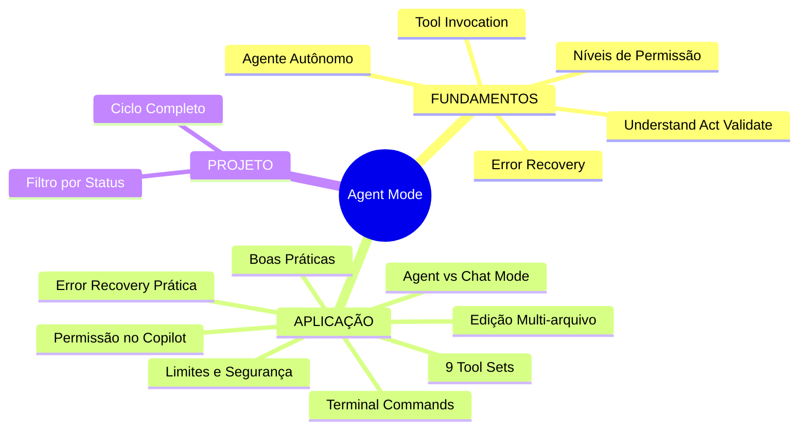
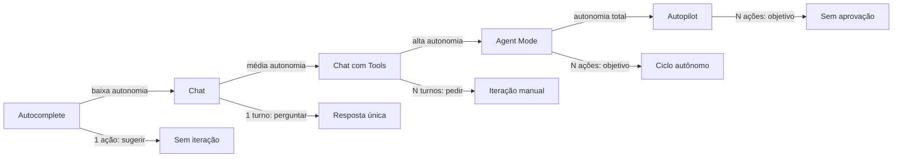
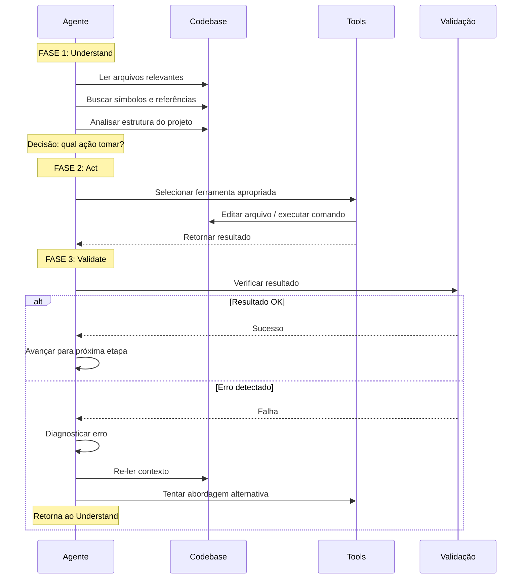
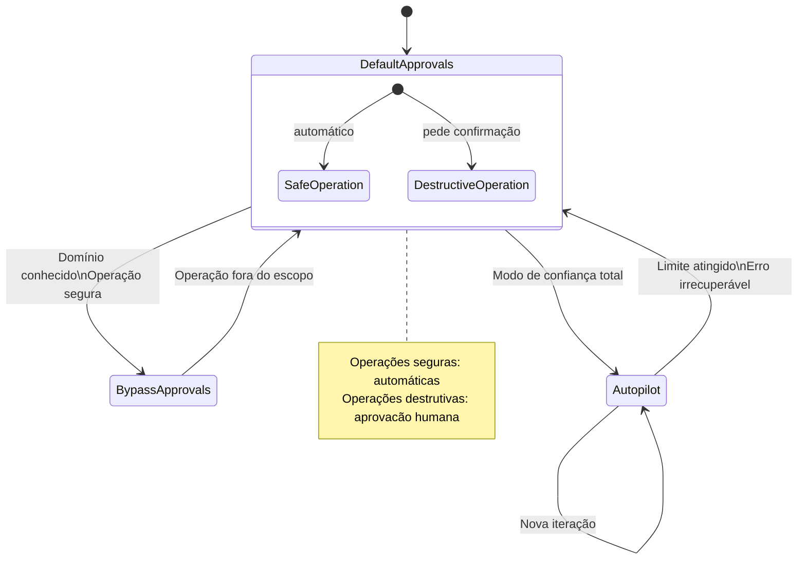
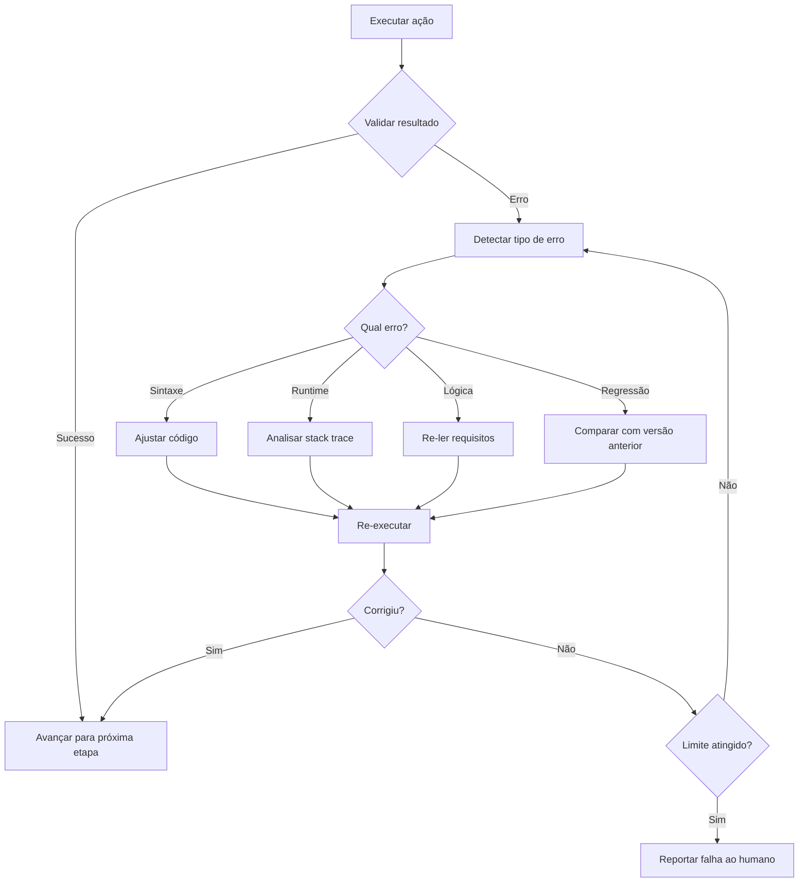
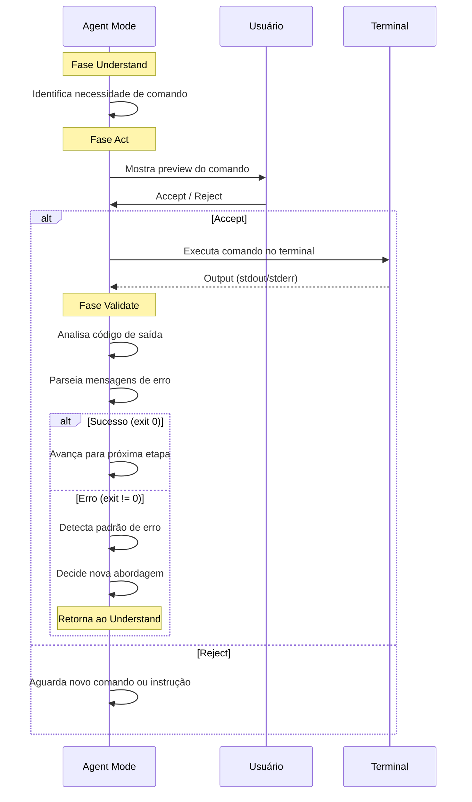
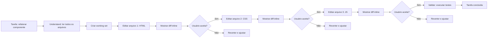

# Curso: Harness do GitHub Copilot e Programação Agêntica com VS Code — Aula 05

## Agent Mode — O Copilot como Agente Autônomo

**Duração estimada:** 120 minutos (65 de leitura + 55 de prática)

**Nível:** Intermediário

**Pré-requisitos:** Aulas 01 a 04 concluídas. VS Code com GitHub Copilot instalado e autenticado. Portal de Projetos Dev funcional (index.html, styles.css, app.js). `.github/copilot-instructions.md` refinado (~60 linhas). `.github/instructions/` com instruções condicionais. `.github/prompts/` com prompt files customizados. Domínio de @mentions e montagem de contexto.

---

## Objetivos de Aprendizagem

Ao final desta aula, você será capaz de:

- [ ] **Explicar** o ciclo Understand → Act → Validate e como ele transforma o Copilot de assistente reativo em agente autônomo
- [ ] **Distinguir** entre Agent Mode e Chat Mode por autonomia, escopo, iteração e necessidade de intervenção humana
- [ ] **Comparar** os três níveis de permissão (Default Approvals, Bypass Approvals, Autopilot) e identificar o cenário adequado para cada um
- [ ] **Classificar** os 9 tool sets built-in por categoria funcional e descrever quando cada um é acionado
- [ ] **Interpretar** o fluxo de terminal commands no Agent Mode — como o Copilot executa comandos, valida o output e detecta erros
- [ ] **Aplicar** o workflow de edição multi-arquivo: working set, diffs inline, Keep/Undo, iteração
- [ ] **Diagnosticar** o ciclo de error recovery do Agent Mode — como o Copilot detecta os próprios erros e tenta corrigi-los
- [ ] **Reconhecer** os limites e restrições de segurança do Agent Mode (content exclusion gap, sandbox, operações bloqueadas)
- [ ] **Formular** prompts eficazes para Agent Mode utilizando as 5 diretrizes de boas práticas
- [ ] **Executar** uma tarefa autônoma completa: pedir ao Copilot para criar um novo componente do Portal de Projetos Dev e observar o ciclo completo de planejamento, execução, validação e correção

---

## Como Usar Esta Aula

Esta aula está organizada em duas partes. A **primeira parte** constrói os fundamentos universais sobre agentes autônomos — conceitos que valem para qualquer ferramenta de coding agent, independentemente de marca ou produto. A **segunda parte** aplica esses conceitos na prática com o Agent Mode do GitHub Copilot no VS Code.

Ao longo do caminho, você encontrará **"Mão na Massa"** (atividades práticas para fazer, não só ler) e **"Quick Checks"** (perguntas rápidas para verificar se entendeu antes de avançar). Ao final, o arquivo separado **Questões de Aprendizagem** traz as tarefas de checkpoint — só avance para a próxima aula quando conseguir completá-las por conta própria.

**Tempo estimado:** 65 minutos de leitura + 55 minutos de prática.

---

## Mapa Mental

Este diagrama mostra todos os conceitos que você vai dominar nesta aula:




---

## Recapitulação das Aulas Anteriores

| Aula | Conceito | Onde aparece nesta aula | Como se conecta |
|---|---|---|---|
| Aula 01 | **8 dimensões da agencialidade** (iniciativa, escopo, ferramentas, etc.) | Seções 1 e 2 | A Seção 1 retoma as dimensões para definir o que torna um agente "autônomo" |
| Aula 02 | **Portal de Projetos Dev** (index.html, styles.css, app.js) | Seção 14 | O portal é o palco da tarefa autônoma principal |
| Aula 03 | **copilot-instructions.md** e instruções condicionais | Seções 6, 13 | As instruções guiam o comportamento do Agent Mode |
| Aula 04 | **@mentions**, **prompt files**, montagem de contexto | Seções 6, 13 | O contexto montado é o ponto de partida do ciclo Understand |

---

**FUNDAMENTOS: Agentes Autônomos e Ciclos de Execução**

> *Os conceitos desta seção são universais — valem para qualquer coding agent, independentemente da ferramenta específica. Na segunda parte, você verá como o Agent Mode do GitHub Copilot implementa cada um deles.*

---

## 1. O que Torna um Agente "Autônomo"

### Além da Reatividade

Você já conhece ferramentas que reagem a comandos: um autocomplete sugere uma linha, um chat responde a uma pergunta. Um **agente autônomo** vai além — ele toma iniciativa, itera em direção a um objetivo e decide quais ações executar sem intervenção humana a cada passo.

Pense na diferença entre um assistente que espera você ditar cada palavra e um estagiário que recebe uma meta e volta com o resultado. O primeiro é **reativo** — só age quando você pede. O segundo é **autônomo** — planeja, executa, verifica e ajusta.

### As Dimensões da Autonomia

Na Aula 01, você viu 8 dimensões que separam o paradigma reativo do agêntico. Três delas são especialmente relevantes aqui:

- **Iniciativa**: o agente decide o próximo passo sem confirmação explícita
- **Iteração**: o agente executa múltiplas ações em sequência até concluir a tarefa
- **Orientação a metas**: o agente recebe um objetivo, não uma lista de passos

Um sistema que apenas completa linhas de código (autocomplete) tem iniciativa zero. Um chat que responde perguntas tem iniciativa baixa — você pergunta, ele responde, e para. Um agente autônomo tem iniciativa alta: ele lê o contexto, decide o que fazer, executa, valida o resultado e, se necessário, tenta novamente.

### O Espectro da Autonomia



**Leitura do diagrama:** conforme a autonomia aumenta, o número de ações por comando cresce e a necessidade de intervenção humana diminui. O Agent Mode (D) marca a transição para o regime verdadeiramente autônomo.

### Por Que Isso Importa

Autonomia muda fundamentalmente como você interage com a ferramenta. Em vez de dar 20 comandos detalhados ("crie um arquivo X", "adicione a função Y", "execute o teste Z"), você dá um único comando de alto nível ("crie um componente de filtro que funcione com os dados do portal"). O agente faz o resto.

Isso economiza tempo, mas também exige confiança — e confiança se constrói entendendo como o agente pensa, o que ele pode fazer e como ele lida com erros. É exatamente isso que esta aula vai ensinar.

### Quick Check 1

**1. Qual a diferença fundamental entre um assistente reativo e um agente autônomo?**
**Resposta:** Um assistente reativo só age quando recebe um comando explícito e executa uma ação de cada vez. Um agente autônomo recebe um objetivo, planeja as ações necessárias, executa em sequência, valida o resultado e se corrige — tudo sem intervenção humana a cada passo.

**2. Em qual extremo do espectro de autonomia o agente decide o próximo passo sem precisar de confirmação humana?**
**Resposta:** No extremo Autopilot — onde a autonomia é total, o agente executa múltiplas ações sem pedir aprovação, limitado apenas por um número máximo de iterações.

---

## 2. O Ciclo Understand → Act → Validate

### O Motor do Agente Autônomo

Todo agente autônomo opera em um loop fundamental de três fases. É o coração do comportamento agêntico — o que separa um script que executa uma sequência fixa de um agente que se adapta ao contexto.



### Fase 1: Understand — Compreender

Na fase **Understand**, o agente constrói um modelo mental do problema. Ele lê arquivos relevantes, busca referências cruzadas, analisa a estrutura do projeto e identifica pontos de impacto.

O que o agente pode fazer nesta fase:
- Ler arquivos do codebase para entender a estrutura existente
- Buscar por símbolos (funções, classes, variáveis) para entender dependências
- Analisar mensagens de erro e logs para diagnosticar problemas
- Listar diretórios para mapear a organização do projeto

O resultado desta fase é uma **decisão**: "qual ferramenta usar e como".

### Fase 2: Act — Agir

Na fase **Act**, o agente executa a ação escolhida. Ele invoca uma ferramenta — pode ser editar um arquivo, criar um novo, executar um comando no terminal, buscar na internet, ou qualquer outra operação disponível.

O agente não age aleatoriamente: cada ação é consequência da análise da fase Understand. Se o contexto mudar (um arquivo foi editado, um erro foi introduzido), a fase Understand é revisitada antes da próxima ação.

### Fase 3: Validate — Validar

Na fase **Validate**, o agente verifica se a ação produziu o resultado esperado. Ele pode:

1. **Verificar sintaxe**: o código gerado é sintaticamente válido?
2. **Executar testes**: os testes passam após a alteração?
3. **Analisar output de terminal**: o comando executado retornou sucesso?
4. **Comparar com o objetivo**: o resultado se alinha com a tarefa original?

Se a validação falha, o agente **não desiste** — ele retorna à fase Understand, relê o contexto com a nova informação (o erro), diagnostica a causa e tenta uma abordagem diferente. Esse ciclo de correção é o que define um agente verdadeiramente autônomo.

### Por Que o Ciclo é Importante

Sem o ciclo Understand → Act → Validate, você teria apenas um executor de comandos — ele faz exatamente o que você pede, mesmo que esteja errado. Com o ciclo, você tem um **parceiro que pensa antes de agir e verifica depois**.

O ciclo também permite que você delegue tarefas complexas com confiança. Você não precisa prever todos os passos — o agente descobre o caminho enquanto executa.

### Quick Check 2

**1. O que acontece se a fase Validate detecta um erro?**
**Resposta:** O agente retorna à fase Understand, relê o contexto com a informação do erro, diagnostica a causa e tenta uma abordagem alternativa. Ele não desiste — itera até resolver ou atingir um limite.

**2. Qual fase do ciclo é responsável por decidir qual ferramenta usar?**
**Resposta:** A fase Understand. É nela que o agente analisa o contexto e decide a melhor ação para alcançar o objetivo.

---

## 3. Modelos de Permissão para Agentes Autônomos

### O Trade-off Fundamental

Autonomia total é poderosa, mas arriscada. Um agente que pode editar qualquer arquivo, executar qualquer comando e acessar qualquer URL sem supervisão pode causar danos — acidentais ou não.

O equilíbrio entre **autonomia** (velocidade, produtividade) e **controle** (segurança, previsibilidade) é gerenciado por modelos de permissão.

### Os Três Níveis Universais



### Nível 1: Default Approvals (Aprovações Padrão)

Neste nível, o agente classifica cada operação como **segura** ou **destrutiva**:

- **Operações seguras** (automáticas): leitura de arquivos, buscas no codebase, consultas a documentação. O agente executa sem perguntar.
- **Operações destrutivas** (requerem aprovação): edição de arquivos, criação de novos arquivos, execução de comandos no terminal, acesso à rede. O agente mostra um preview da ação e espera confirmação.

Vantagem: equilíbrio entre autonomia e controle. Desvantagem: interrupções frequentes para tarefas longas.

### Nível 2: Bypass Approvals (Aprovações Automáticas por Domínio)

Neste nível, você configura uma lista de operações ou domínios que o agente pode executar sem perguntar — mesmo que sejam destrutivas.

Por exemplo: "qualquer comando npm é seguro" ou "edições na pasta /src/components não precisam de aprovação".

Vantagem: fluxo contínuo para tarefas conhecidas. Desvantagem: risco se a configuração for muito permissiva.

### Nível 3: Autopilot (Autônomo Total)

Neste nível, o agente executa tudo sem pedir confirmação — edições, comandos, rede. Não há intervenção humana.

Para segurança, o Autopilot tem dois mecanismos de contenção:
- **Limite de iterações**: o agente para após N iterações (padrão ajustável)
- **Sandbox**: o agente opera em um ambiente isolado do sistema de arquivos real

Vantagem: máxima produtividade para tarefas bem compreendidas. Desvantagem: risco aumentado — requer confiança e verificação posterior.

### Quando Usar Cada Nível

| Cenário | Nível Recomendado | Justificativa |
|---|---|---|
| Explorar um codebase desconhecido | Default Approvals | Você quer ver o que o agente está fazendo |
| Refatorar uma função bem compreendida | Bypass Approvals | A operação é previsível e segura |
| CI/CD pipeline automatizada | Autopilot | Sem supervisão humana (ambiente controlado) |
| Primeira tarefa em um projeto novo | Default Approvals | Você precisa construir confiança gradualmente |
| Instalar dependências conhecidas | Bypass Approvals | npm install é previsível |

### Quick Check 3

**1. Por que Autopilot é mais arriscado que Default Approvals?**
**Resposta:** Porque no Autopilot o agente executa qualquer operação (edições, comandos, rede) sem pedir confirmação humana, enquanto Default Approvals pelo menos requer aprovação para operações destrutivas.

**2. Em qual cenário Bypass Approvals é a melhor escolha?**
**Resposta:** Em cenários onde a operação é bem compreendida e previsível, como executar `npm install` ou editar arquivos de uma pasta específica que você conhece bem.

---

## 4. Tool Invocation — As Mãos do Agente

### A Interface entre o Modelo e o Mundo

Um modelo de linguagem, por si só, é apenas um gerador de texto. Ele não pode ler arquivos, executar comandos ou buscar na internet. Para interagir com o mundo real, ele precisa de **ferramentas** — tool invocation é o mecanismo que permite ao modelo chamar funções externas.

Cada vez que o agente decide agir, ele não edita um arquivo diretamente — ele invoca uma ferramenta que faz a edição por ele. A ferramenta retorna um resultado (sucesso, erro, dados), e o agente usa esse resultado na próxima iteração do ciclo.

### Categorias Funcionais Universais

Todo agente autônomo precisa das mesmas categorias de ferramentas, independentemente da implementação:

| Categoria | O que faz | Exemplos de uso |
|---|---|---|
| **Leitura** | Ler arquivos e diretórios | Entender código existente antes de editar |
| **Edição** | Criar, modificar, excluir arquivos | Implementar uma nova funcionalidade |
| **Busca** | Encontrar referências e padrões | Localizar onde uma função é usada |
| **Execução** | Rodar comandos e scripts | Executar testes, build, linter |
| **Terminal** | Shell interativo | Comandos ad-hoc (git, npm, etc.) |
| **Rede** | Acessar URLs externas | Buscar documentação, APIs |
| **Navegador** | Interagir com páginas web | Testar UI, extrair dados (experimental) |
| **Editor** | Controlar o ambiente de desenvolvimento | Abrir arquivos, executar comandos do editor |
| **Organização** | Gerenciar tarefas e metas | Manter lista de afazeres |

### Como o Agente Decide Qual Ferramenta Usar

A decisão não é aleatória. O modelo analisa:

1. **O objetivo da tarefa**: "preciso criar um arquivo" → ferramenta de edição
2. **O contexto atual**: "acabei de editar um arquivo, preciso verificar" → ferramenta de leitura ou execução
3. **Erros encontrados**: "o teste falhou" → ferramenta de leitura (ler o erro) + ferramenta de execução (rodar novamente)
4. **Disponibilidade**: algumas ferramentas podem estar desabilitadas ou restritas

O agente encadeia ferramentas naturalmente: lê um arquivo para entender, edita para modificar, executa para verificar, lê o resultado da execução para validar.

### Por Que a Categorização Importa

Entender as categorias ajuda você a **prever** o comportamento do agente e **diagnosticar** problemas. Se o agente travou em uma tarefa, saber qual categoria de ferramenta ele precisa usar no próximo passo ajuda você a dar o prompt certo.

### Quick Check 4

**1. Por que um modelo de linguagem precisa de ferramentas para ser um agente autônomo?**
**Resposta:** Porque um modelo de linguagem puro só gera texto — ele não consegue ler arquivos, executar comandos ou acessar a internet. As ferramentas são a interface que permite ao modelo interagir com o mundo real e modificar o ambiente de desenvolvimento.

**2. Em qual categoria funcional se enquadra "executar npm test"?**
**Resposta:** Na categoria Execução (ou Terminal, dependendo da implementação). É uma operação que roda um comando e retorna o resultado para o agente validar.

---

## 5. Recuperação de Erros e Auto-correção

### A Marca de um Agente Maduro

Erros acontecem. O que diferencia um agente maduro de um script ingênuo é a capacidade de **detectar, diagnosticar e corrigir** seus próprios erros sem intervenção humana.

### O Ciclo de Error Recovery



### Tipos de Erro que um Agente Pode Detectar

- **Erro de sintaxe**: o código gerado tem um erro de sintaxe detectado pelo linter ou compilador
- **Erro de runtime**: o código executa mas lança uma exceção
- **Erro de lógica**: o código executa sem erro mas produz resultado incorreto
- **Regressão**: uma alteração quebrou algo que funcionava antes

### Estratégias de Correção

Para cada tipo de erro, o agente aplica uma estratégia diferente:

1. **Re-leitura do contexto**: o agente relê os arquivos envolvidos para entender o que deu errado
2. **Ajuste da abordagem**: se a primeira tentativa falhou, o agente tenta uma abordagem diferente
3. **Consulta a logs/erros**: o agente analisa mensagens de erro, stack traces e saídas de terminal
4. **Iteração progressiva**: o agente tenta uma correção, valida, e se ainda falhar, tenta outra

### Quando o Agente Desiste

Um bom agente sabe seus limites. Ele desiste quando:

- Atinge o número máximo de iterações configurado
- Detecta um erro irrecuperável (ex: a tarefa é impossível com as ferramentas disponíveis)
- Não consegue diagnosticar a causa do erro após múltiplas tentativas

Nesses casos, ele reporta a falha ao humano com o máximo de contexto possível — o que tentou, o que deu errado, qual o estado atual.

### Quick Check 5

**1. Cite três tipos de erro que um agente autônomo pode detectar e corrigir sozinho.**
**Resposta:** Erro de sintaxe (código mal formatado), erro de runtime (exceção em execução) e regressão (algo que funcionava antes foi quebrado por uma alteração).

**2. O que o agente faz quando atinge o limite de iterações sem conseguir corrigir um erro?**
**Resposta:** Ele desiste e reporta a falha ao humano, fornecendo contexto sobre o que tentou, o que deu errado e qual o estado atual do projeto.

---

**APLICAÇÃO: Agent Mode no GitHub Copilot**

> *Agora que você entende os mecanismos universais de agentes autônomos — ciclo Understand→Act→Validate, modelos de permissão, categorias de ferramentas e recuperação de erros — vamos conectá-los à prática com o Agent Mode do GitHub Copilot no VS Code.*

---

## 6. Agent Mode vs. Chat Mode — A Diferença na Prática

### Dois Modos, Duas Filosofias

O GitHub Copilot no VS Code oferece três modos de interação. Você já conhece o **Chat Mode** (Aula 02) e o **Edit Mode** (menção rápida). O **Agent Mode** é o novo integrante — e o mais poderoso.

| Característica | Chat Mode | Edit Mode | Agent Mode |
|---|---|---|---|
| **Autonomia** | Baixa — responde e para | Média — edita um trecho | Alta — executa ciclo completo |
| **Escopo** | Pergunta única | Seleção de código | Tarefa completa |
| **Iteração** | Manual (você pergunta de novo) | Manual | Automática (loop U-A-V) |
| **Ferramentas** | @mentions, leitura | Edição inline | Todos os 9 tool sets |
| **Terminal** | Não executa | Não executa | Executa comandos |
| **Multi-arquivo** | Não | Limitado (seleção) | Sim (working set) |

### Como Ativar o Agent Mode

No VS Code, abra o Copilot Chat (Ctrl+Shift+I ou Cmd+Shift+I). No topo da janela de chat, você verá um seletor de modo. Escolha **Agent**.


Você também pode ativar via comando: **Copilot: Switch to Agent Mode** na paleta de comandos (Ctrl+Shift+P).

### Indicadores Visuais

Quando o Agent Mode está ativo, você verá:

1. **Streaming de edições**: o Copilot mostra em tempo real quais arquivos está editando
2. **Working set**: uma barra lateral mostra os arquivos que o agente está modificando ativamente
3. **Confirmações de terminal**: antes de executar um comando, o Copilot mostra o preview e pede confirmação
4. **Status de iteração**: um indicador mostra em qual iteração do ciclo o agente está

### Mão na Massa 1 — Ativar e Explorar

- [ ] Abra o Copilot Chat no VS Code (Ctrl+Shift+I)
- [ ] No seletor de modo, escolha **Agent**
- [ ] Digite: "explique o que você pode fazer neste projeto"
- [ ] Observe a resposta: note como o agente primeiro lê arquivos (Understand) antes de responder

**Verificação:** A resposta do Copilot deve mencionar a estrutura do seu projeto Portal de Projetos Dev, não ser genérica. Se ele leu os arquivos, o ciclo Understand funcionou.

### Quick Check 6

**1. Qual a principal diferença prática entre Chat Mode e Agent Mode em termos de iteração?**
**Resposta:** No Chat Mode, a iteração é manual — você pergunta, ele responde, e você precisa perguntar de novo. No Agent Mode, a iteração é automática — o agente executa o ciclo Understand→Act→Validate até concluir a tarefa.

**2. Que indicador visual mostra que o Agent Mode está editando múltiplos arquivos?**
**Resposta:** O working set — uma barra lateral que lista os arquivos que o agente está modificando ativamente.

---

## 7. Os 9 Tool Sets Built-in em Detalhe

### O Conjunto Completo de Ferramentas

Na Seção 4, você viu as categorias funcionais universais de ferramentas. Agora vamos ver como o GitHub Copilot as implementa no Agent Mode — são **9 tool sets** com dezenas de ferramentas individuais.

Cada tool set é um grupo de ferramentas relacionadas que o Copilot pode invocar automaticamente com base no contexto e na tarefa.

### Tool Set #edit — Edição de Arquivos

O tool set mais usado. Permite ao Copilot criar, modificar e organizar arquivos no seu projeto.

| Ferramenta | O que faz | Acionada quando... |
|---|---|---|
| `createDirectory` | Cria uma nova pasta | O agente precisa organizar o projeto |
| `createFile` | Cria um novo arquivo com conteúdo | O agente precisa adicionar um componente |
| `editFiles` | Modifica arquivos existentes (diff) | O agente precisa alterar código |
| `editNotebook` | Edita células de Jupyter Notebook | O agente trabalha com notebooks |

### Tool Set #read — Leitura de Arquivos

O tool set que alimenta a fase Understand. Permite ao Copilot ler e analisar o codebase.

| Ferramenta | O que faz | Acionada quando... |
|---|---|---|
| `readFile` | Lê o conteúdo de um arquivo | O agente precisa entender o código |
| `problems` | Lê a lista de problemas do VS Code | O agente verifica erros no workspace |
| `terminalLastCommand` | Lê o último comando executado | O agente analisa output de terminal |
| `terminalSelection` | Lê seleção ativa no terminal | O agente precisa de contexto do terminal |
| `getNotebookSummary` | Resume notebook | O agente trabalha com notebooks |

### Tool Set #search — Busca no Codebase

O tool set de navegação. Permite ao Copilot encontrar referências, arquivos e padrões.

| Ferramenta | O que faz | Acionada quando... |
|---|---|---|
| `codebase` | Busca semântica no workspace | O agente precisa encontrar código relevante |
| `fileSearch` | Busca arquivos por nome | O agente procura um arquivo específico |
| `textSearch` | Busca texto no workspace | O agente procura padrões de código |
| `listDirectory` | Lista conteúdo de diretório | O agente mapeia a estrutura do projeto |
| `changes` | Verifica alterações não salvas | O agente verifica o estado do workspace |
| `usages` | Encontra referências de símbolos | O agente analisa impacto de uma mudança |

### Tool Set #execute — Execução de Tarefas

O tool set que permite ao Copilot agir no ambiente. Inclui execução de comandos e scripts.

| Ferramenta | O que faz | Acionada quando... |
|---|---|---|
| `createAndRunTask` | Cria e executa uma task no VS Code | O agente precisa de um script parametrizado |
| `getTerminalOutput` | Lê output de um terminal | O agente valida resultado de comando |
| `runInTerminal` | Executa comando no terminal | O agente precisa rodar um comando |
| `runNotebookCell` | Executa célula de notebook | O agente trabalha com notebooks |
| `testFailure` | Analisa falha de teste | O agente diagnostica test failure |

### Tool Set #terminal — Shell Interativo

Subconjunto de #execute focado em comandos de shell. Permite ao Copilot executar comandos como npm, git, node, etc.

| Ferramenta | O que faz | Acionada quando... |
|---|---|---|
| `runInTerminal` | Executa comando em terminal integrado | Precisa rodar npm test, git status, etc. |

### Tool Set #web — Acesso à Internet

Permite ao Copilot buscar informações externas.

| Ferramenta | O que faz | Acionada quando... |
|---|---|---|
| `fetch` | Busca conteúdo de uma URL | Precisa consultar documentação ou API |

### Tool Set #vscode — Controle do Editor

Permite ao Copilot interagir com o próprio VS Code — extensões, comandos, configurações.

| Ferramenta | O que faz | Acionada quando... |
|---|---|---|
| `askQuestions` | Faz perguntas ao usuário | O agente precisa de esclarecimento |
| `extensions` | Gerencia extensões | O agente precisa instalar/configurar extensões |
| `getProjectSetupInfo` | Obtém info de setup do projeto | O agente analisa configuração do projeto |
| `installExtension` | Instala extensão | O agente precisa de uma extensão específica |
| `runCommand` | Executa comando do VS Code | O agente precisa abrir/configurar algo no editor |
| `VSCodeAPI` | Acessa API do VS Code | Operações avançadas do editor |

### Tool Set #todos — Lista de Tarefas

Permite ao Copilot gerenciar uma lista de afazeres durante a execução de uma tarefa complexa.

| Ferramenta | O que faz | Acionada quando... |
|---|---|---|
| Gerenciamento de lista | Adicionar, remover, marcar itens | O agente quebra uma tarefa grande em subtarefas |

### Tool Set #browser — Automação Web (Experimental)

O mais novo tool set. Permite ao Copilot interagir com páginas web — útil para testar UIs.

| Ferramenta | O que faz | Acionada quando... |
|---|---|---|
| `openBrowserPage` | Abre URL no navegador | Precisa testar uma página web |
| `navigatePage` | Navega para outra URL | Fluxo de navegação |
| `readPage` | Lê conteúdo da página | Extrair informações |
| `screenshotPage` | Captura screenshot | Verificar aparência visual |
| `clickElement` | Clica em elemento | Interagir com UI |
| `hoverElement` | Passa mouse sobre elemento | Testar hover states |
| `dragElement` | Arrasta elemento | Testar drag-and-drop |
| `typeInPage` | Digita texto em campo | Preencher formulários |
| `handleDialog` | Gerencia diálogos (alert, confirm) | Lidar com popups |
| `runPlaywrightCode` | Executa script Playwright personalizado | Automação avançada |

### Como os Tool Sets Trabalham Juntos

O poder está na **composição**. Em uma única tarefa, o Copilot pode:

1. **#search**: encontrar onde um componente está definido
2. **#read**: ler o arquivo para entender a estrutura
3. **#edit**: modificar o componente para adicionar uma feature
4. **#execute**: rodar os testes para verificar
5. **#terminal**: ler o output dos testes
6. **#read**: ler o erro se os testes falharam
7. **#edit**: corrigir o erro
8. **#execute**: rodar os testes novamente

Tudo isso acontece no ciclo Understand→Act→Validate, sem você precisar dar um comando para cada passo.

### Quick Check 7

**1. Qual tool set o Copilot usaria para encontrar onde uma função específica é chamada no projeto?**
**Resposta:** #search, especificamente a ferramenta `usages` (ou `codebase` para busca semântica), que encontra referências de símbolos no workspace.

**2. Se o Copilot precisa criar um novo arquivo JavaScript, qual tool set ele usa?**
**Resposta:** #edit, especificamente a ferramenta `createFile`, que cria um novo arquivo com conteúdo completo.

---

## 8. Níveis de Permissão no Copilot

### Configuração Prática

Na Seção 3, você aprendeu os três níveis universais de permissão. Vamos ver como configurá-los no Agent Mode do Copilot.

### Default Approvals — O Comportamento Padrão

Por padrão, o Agent Mode opera com **Default Approvals**:

| Operação | Requer confirmação? | Exemplo |
|---|---|---|
| Ler arquivos | Não (automático) | `readFile`, `codebase` |
| Editar arquivos existentes | Sim | `editFiles` |
| Criar novos arquivos | Sim | `createFile`, `createDirectory` |
| Executar comandos no terminal | Sim | `runInTerminal` (mostra preview) |
| Acessar URLs | Sim | `fetch` |
| Abrir navegador | Sim | `openBrowserPage` |

Quando uma operação requer confirmação, o Copilot mostra um preview e você clica em **Accept** ou **Reject**.

### Bypass Approvals — Acelerando o Fluxo

Para acelerar tarefas repetitivas, você pode configurar bypass approvals de duas formas:

**1. Configuração via settings.json:**

```json
{
  "chat.tools.urls.autoApprove": [
    "https://api.github.com/*",
    "https://registry.npmjs.org/*"
  ]
}
```

Isso permite que o Copilot acesse essas URLs sem pedir confirmação.

**2. Comando /yolo (ou /autoApprove):**

Digite `/yolo` no chat do Agent Mode para ativar bypass approvals para a sessão atual. O Copilot executará comandos e edições sem pedir confirmação.

Para desativar: `/disableYolo`.

**Atenção:** `/yolo` é poderoso e perigoso. Use com moderação e apenas quando tiver certeza do que o agente vai fazer.

### Autopilot — Autonomia Total

Para ativar o Autopilot, use o comando:

```
/autopilot --max-autopilot-continues 10
```

Isso permite que o Copilot execute até 10 iterações autônomas sem pedir confirmação.

**Recomendação de segurança:** sempre use Autopilot com um **sandbox** ativo (Seção 12) para evitar danos acidentais ao seu projeto.

### Mão na Massa 2 — Configurar Bypass Approvals

- [ ] Abra as configurações do VS Code (Ctrl+,)
- [ ] Pesquise por "chat.tools.urls.autoApprove"
- [ ] Adicione:
  ```json
  "chat.tools.urls.autoApprove": [
    "https://registry.npmjs.org/*"
  ]
  ```
- [ ] No chat do Agent Mode, digite `/yolo`
- [ ] Confirme que o Copilot indica "Bypass approvals ativo"

**Verificação:** O Copilot deve indicar visualmente que está em modo de bypass approvals. Tente pedir um comando simples como "execute `node --version`" — ele deve executar sem pedir confirmação.

### Quick Check 8

**1. Em que situação você usaria o comando `/yolo`?**
**Resposta:** Quando você confia no agente e precisa de fluxo contínuo sem interrupções — por exemplo, para uma tarefa bem definida e previsível como instalar dependências ou executar uma sequência de comandos conhecida.

**2. Qual configuração permite que o Copilot acesse domínios específicos sem pedir confirmação?**
**Resposta:** A configuração `chat.tools.urls.autoApprove` no settings.json, onde você lista os padrões de URL que o Copilot pode acessar automaticamente.

---

## 9. Terminal Commands no Agent Mode

### O Fluxo Completo

Quando o Copilot decide que precisa executar um comando de terminal, ele segue um fluxo estruturado:



### Como o Copilot Decide Executar um Comando

O Copilot não executa comandos aleatoriamente. Ele decide com base em:

1. **Contexto da tarefa**: "crie um componente e teste" → `npm test` após criar
2. **Análise do projeto**: se detecta package.json, sabe que `npm` está disponível
3. **Tentativas anteriores**: se um comando falhou, pode tentar outro (ex: `npm` → `yarn`)
4. **Instruções do usuário**: se você pediu explicitamente "execute os testes"

### Validação de Output

Após executar o comando, o Copilot:

1. **Lê o código de saída**: exit 0 = sucesso, exit != 0 = erro
2. **Parseia stdout/stderr**: extrai mensagens de erro, warnings, resultados
3. **Detecta padrões conhecidos**: "Error:", "FAIL", "Cannot find module" são gatilhos de erro
4. **Decide próximo passo**: se detectou erro, retorna ao Understand; se sucesso, avança

### Mão na Massa 3 — Executar Comando e Observar

- [ ] No Agent Mode, digite: "execute `npm test` e me mostre o resultado"
- [ ] Observe o preview do comando aparecer antes da execução
- [ ] Clique em **Accept**
- [ ] Observe o output no terminal e como o Copilot analisa o resultado

**Verificação:** O Copilot deve mostrar o resultado dos testes e, se houver falhas, sugerir correções.

### Quick Check 9

**1. O que o Copilot verifica após executar um comando no terminal?**
**Resposta:** Ele verifica o código de saída (exit 0 = sucesso, exit != 0 = erro), parseia stdout/stderr em busca de mensagens de erro conhecidas, e decide se avança ou retorna ao Understand para corrigir.

**2. O que acontece se o usuário clica em Reject no preview do comando?**
**Resposta:** O Copilot não executa o comando e aguarda novas instruções ou um comando diferente. Ele não avança com a execução até receber aprovação.

---

## 10. Edição de Arquivos Multi-arquivo

### O Poder do Working Set

Uma das capacidades mais impressionantes do Agent Mode é editar **múltiplos arquivos simultaneamente** — e gerenciar essas edições de forma inteligente.

Quando o Copilot decide que uma tarefa afeta vários arquivos, ele cria um **working set**: o conjunto de arquivos que está sendo modificado ativamente.

### O Fluxo de Edição Multi-arquivo



### Inline Diffs — Preview Antes de Aplicar

Para cada arquivo editado, o Copilot mostra um **diff inline** — as linhas adicionadas em verde, as removidas em vermelho. Você pode:

- **Keep**: aceitar a alteração como está
- **Undo**: rejeitar a alteração específica
- **Editar manualmente**: modificar a sugestão antes de aceitar

### Iteração no Working Set

O Copilot não apenas edita — ele **revisita** arquivos do working set quando necessário. Exemplo:

1. Edita HTML para adicionar uma div
2. Edita CSS para estilizar a div
3. Executa testes — falham
4. Re-lê o erro — o seletor CSS está errado
5. Volta ao arquivo CSS no working set e corrige
6. Re-executa testes — passam

### Mão na Massa 4 — Refatoração Multi-arquivo

- [ ] No Agent Mode, peça: "refatore o card de projeto no Portal para incluir um badge de status (HTML + CSS + JS)"
- [ ] Observe o working set sendo construído no painel lateral
- [ ] Revise cada diff inline antes de aceitar
- [ ] Se algo estiver errado, clique em Undo no diff específico

**Verificação:** O Portal de Projetos Dev deve mostrar cards com badges de status funcionais. Se algo quebrou, o Agent Mode deve detectar e oferecer correção.

### Quick Check 10

**1. O que é o working set no Agent Mode?**
**Resposta:** É o conjunto de arquivos que o Copilot está modificando ativamente em uma tarefa. Ele aparece em uma barra lateral e permite que você acompanhe quais arquivos estão sendo alterados.

**2. Qual a diferença entre Keep e Undo em um diff inline?**
**Resposta:** Keep aceita a alteração proposta e a mantém no arquivo. Undo rejeita a alteração específica, revertendo o arquivo ao estado anterior apenas naquela parte.

---

## 11. Error Recovery na Prática

### O Ciclo Universal em Ação

Na Seção 5, você viu o ciclo universal de error recovery. Agora vamos ver como o Agent Mode do Copilot implementa esse ciclo na prática.

### Gatilhos de Recovery

O Copilot inicia o ciclo de recovery quando detecta:

1. **Test failure**: um teste existente falhou após uma alteração
2. **Terminal error**: um comando retornou código de saída não-zero
3. **Lint problem**: o VS Code reports problemas de lint nos arquivos editados
4. **Console error**: erro de runtime no console do navegador (via #browser)
5. **Problema de sintaxe**: o arquivo gerado tem erro de sintaxe detectado pelo editor

### Estratégias do Copilot

Quando o Copilot detecta um erro, ele:

1. **Relê o erro**: lê a mensagem de erro completa (stdout/stderr)
2. **Diagnostica a causa**: tenta identificar por que o erro ocorreu
3. **Ajusta o código**: modifica os arquivos relevantes para corrigir
4. **Re-executa**: roda novamente o comando que falhou
5. **Re-valida**: verifica se a correção resolveu

Se a correção falhar, ele tenta novamente (até o limite de iterações).

### Exemplo Real Comentado

```
Usuário: "Adicione um botão de excluir projeto no card"
Copilot: [Lê app.js, index.html, styles.css — Understand]
         [Edita index.html — adiciona botão]
         [Edita app.js — adiciona função de excluir]
         [Edita styles.css — estiliza botão]
         [Executa npm test — Validate]
         
Testes falham: "TypeError: deleteProject is not defined"
         
Copilot: [Lê o erro no terminal — Detecta]
         [Relê app.js — Diagnostica: função exportada com nome errado]
         [Edita app.js — Corrige nome da função]
         [Re-executa npm test — Re-valida]
         
Testes passam.
```

### Mão na Massa 5 — Provocar e Observar Correção

- [ ] Abra um arquivo do Portal (ex: app.js) e introduza um erro intencional: remova um ponto-e-vírgula ou troque um nome de função
- [ ] No Agent Mode, peça: "adicione um novo card de projeto e depois execute os testes"
- [ ] Observe o Copilot:
  - Detectar o erro pré-existente
  - Tentar corrigi-lo
  - Executar os testes
  - Se ainda falhar, tentar novamente

**Verificação:** O Copilot deve perceber o erro, tentar corrigir e executar os testes. Documente quantas iterações ele precisou para corrigir.

### Quick Check 11

**1. Cite três gatilhos que fazem o Copilot iniciar o ciclo de error recovery.**
**Resposta:** Test failure (teste falhou), terminal error (código de saída não-zero), e lint problem (problema de lint detectado pelo VS Code).

**2. O que o Copilot faz se a primeira tentativa de correção falha?**
**Resposta:** Ele tenta novamente com uma abordagem diferente — até o limite de iterações configurado. Se esgotar as tentativas, reporta a falha ao usuário.

---

## 12. Limites e Segurança

### O que o Agent Mode NÃO Faz

Saber os limites é tão importante quanto saber as capacidades. O Agent Mode tem restrições de segurança deliberadas:

| Operação | Bloqueada? | Exceção |
|---|---|---|
| Comandos destrutivos sem bypass | Sim | `/yolo` ativo |
| Acesso a arquivos fora do workspace | Sim | Links simbólicos? Depende da config |
| Acesso a rede não autorizada | Sim | Domínios em `networkFilter` |
| Instalação de extensões sem confirmação | Sim | Apenas com bypass approvals |
| Leitura de arquivos em content exclusion | Sim (idealmente) | **Gap conhecido** |

### Content Exclusion Gap

O **content exclusion** é um recurso do VS Code que permite marcar pastas/arquivos como excluídos do contexto do Copilot. No entanto, o Agent Mode atualmente **não respeita completamente** essas exclusões — ele pode ler arquivos que você marcou como excluídos.

**Mitigação:** se você tem dados sensíveis no workspace, não confie apenas no content exclusion. Use o sandbox descrito abaixo.

### Sandbox — Isolamento do Agente

O Sandbox é o mecanismo principal de segurança do Agent Mode. Ele isola o agente do sistema de arquivos real.

```json
{
  "chat.agent.sandbox.enabled": true
}
```

Com o sandbox ativo:

- **File system isolation**: o agente opera em uma cópia virtual do workspace. Alterações só são aplicadas ao projeto real quando você aprova.
- **Network isolation**: o agente só pode acessar URLs permitidas pelo network filter.

### Network Filter

Controle fino de quais domínios o agente pode acessar:

```json
{
  "chat.agent.networkFilter": {
    "allowedDomains": ["api.github.com", "registry.npmjs.org"],
    "blockedDomains": ["*.internal.company.com"]
  }
}
```

### Operações Bloqueadas na Prática

Mesmo com Autopilot ativo, algumas operações são sempre bloqueadas por segurança:

- `rm -rf /` ou comandos equivalentes
- Acesso a arquivos de configuração do sistema (.ssh, .config)
- Modificação de arquivos que não estão no workspace aberto
- Comandos de rede para domínios não listados no network filter

### Quick Check 12

**1. Qual a limitação conhecida do content exclusion no Agent Mode?**
**Resposta:** O Agent Mode atualmente não respeita completamente as exclusões de conteúdo — ele pode ler arquivos que você marcou como excluídos. A mitigação recomendada é usar o sandbox.

**2. O que o sandbox do Agent Mode isola?**
**Resposta:** O sandbox isola o sistema de arquivos (o agente opera em uma cópia virtual) e a rede (só acessa URLs permitidas pelo network filter).

---

## 13. Boas Práticas para Tarefas no Agent Mode

### Como Escrever Prompts Eficazes

A qualidade do resultado do Agent Mode depende diretamente da qualidade do prompt. Aqui estão cinco diretrizes comprovadas.

### Diretriz 1 — Seja Específico sobre o Resultado Esperado

| Ruim | Bom |
|---|---|
| "Crie um componente de filtro" | "Crie um componente de filtro por status que filtre os cards do dashboard usando um dropdown. O filtro deve atualizar a lista em tempo real sem recarregar a página." |

**Por que funciona:** prompts específicos dão ao agente critérios claros de validação. Ele sabe quando terminou porque pode verificar se o resultado atende aos requisitos.

### Diretriz 2 — Defina o Escopo de Arquivos

| Ruim | Bom |
|---|---|
| "Adicione um badge de status" | "Adicione um badge de status no arquivo `src/components/CardProjeto.js`. Não modifique `index.html` nem `styles.css`." |

**Por que funciona:** restringir o escopo evita que o agente modifique arquivos que não deveriam ser alterados. Isso é essencial em projetos com arquivos compartilhados.

### Diretriz 3 — Especifique Critérios de Validação

| Ruim | Bom |
|---|---|
| "Corrija o componente" | "Corrija o componente de filtro. Depois de modificar, execute `npm test` e garanta que todos os testes passem. Se houver falhas, corrija e re-execute." |

**Por que funciona:** o agente sabe exatamente o que validar e quando parar. Ele não precisa adivinhar se o resultado está correto.

### Diretriz 4 — Forneça Exemplos do Estilo Desejado

| Ruim | Bom |
|---|---|
| "Use o mesmo estilo dos outros componentes" | "Use o mesmo estilo do card de projeto existente em `src/components/CardProjeto.js`. Siga o padrão de `className` e a estrutura de `divs` que está lá." |

**Por que funciona:** referenciar componentes existentes como modelo elimina ambiguidade sobre estilo e padrões de código.

### Diretriz 5 — Use Checkpoints Incrementais

| Ruim | Bom |
|---|---|
| "Crie o portal completo" | "Primeiro, crie a estrutura HTML com os cards. Depois de aprovado, adicione o CSS. Depois, implemente a lógica JS de filtro." |

**Por que funciona:** tarefas incrementais permitem que você valide cada etapa antes de avançar. Se algo der errado, você sabe exatamente em qual etapa.

### Tabela Resumo

| Diretriz | Foco | Exemplo de prompt |
|---|---|---|
| 1. Resultado específico | O que entregar | "Crie um dropdown de status que filtra cards" |
| 2. Escopo definido | Onde mexer | "Apenas no arquivo app.js" |
| 3. Critérios de validação | Como verificar | "Execute os testes depois" |
| 4. Exemplos de estilo | Como fazer | "Siga o padrão do CardProjeto.js" |
| 5. Checkpoints incrementais | Em que ordem | "Primeiro HTML, depois CSS, depois JS" |

### Quick Check 13

**1. Por que prompts específicos (Diretriz 1) produzem melhores resultados no Agent Mode?**
**Resposta:** Porque prompts específicos dão ao agente critérios claros de validação — ele sabe exatamente quando a tarefa está completa porque pode verificar se o resultado atende a cada requisito citado.

**2. Qual diretriz ajuda a evitar que o agente modifique arquivos que não deveriam ser alterados?**
**Resposta:** A Diretriz 2 — definir o escopo de arquivos explicitamente, dizendo quais arquivos podem ou não ser modificados.

---

## 14. Projeto Portal — Primeira Tarefa Autônoma

### Aplicação Integrada de Todos os Conceitos

Chegou o momento de unir tudo o que você aprendeu. Vamos pedir ao Agent Mode para criar um **componente de filtro por status** no Portal de Projetos Dev.

Este componente permitirá filtrar os cards do dashboard por status (Ativo, Concluído, Em Andamento, Pendente) usando um dropdown.

### O Que Observar

Durante a execução, preste atenção em cada fase do ciclo Understand→Act→Validate:

| Fase | O que observar | Pergunta-guia |
|---|---|---|
| **Understand** | Quais arquivos o Copilot leu? | Ele leu index.html, app.js, styles.css? |
| **Act** | Quantos arquivos ele criou/editou? | Criou um novo JS? Editou o HTML? |
| **Validate** | Como ele verificou o resultado? | Executou testes? Mostrou o diff? |
| **Error Recovery** | Teve erro? Como ele corrigiu? | Ele detectou e corrigiu sem você pedir? |
| **Permissão** | Quando ele pediu confirmação? | Pediu para criar arquivo? Executar comando? |
| **Tool Sets** | Quais tool sets ele usou? | Usou #edit? #execute? #search? |

### Mão na Massa 6 — Tarefa Autônoma Principal

**Passo 1: Prepare o prompt**

Digite no Agent Mode:

> "Crie um componente de filtro por status para o Portal de Projetos Dev. Adicione um dropdown no topo do dashboard que filtre os cards por status (Ativo, Concluído, Em Andamento, Pendente). O filtro deve funcionar sem recarregar a página, apenas escondendo/mostrando cards. Siga o estilo existente do portal. Depois de criar, execute os testes (se houver) ou apenas confirme que o código não tem erros de sintaxe."

**Passo 2: Observe o ciclo**

- [ ] O Copilot começa lendo os arquivos do portal (Understand)
- [ ] Ele planeja a abordagem e mostra o working set
- [ ] Ele cria/edita arquivos (Act) — preveja quantos
- [ ] Ele executa um comando de verificação (Validate)
- [ ] Se houver erro, observe a correção automática

**Passo 3: Documente**

Use o checklist abaixo para registrar o que observou:

```
## Observação da Tarefa Autônoma

**Prompt usado:**
[cole o prompt]

**Arquivos lidos (Understand):**
- [arquivo 1]
- [arquivo 2]

**Arquivos criados/editados (Act):**
- [arquivo 1] — [criado/editado]
- [arquivo 2] — [criado/editado]

**Validação (Validate):**
- [ ] Testes executados? Resultado?
- [ ] Erro de sintaxe detectado?
- [ ] Correção automática?

**Permissão:**
- [ ] Pediu confirmação para criar arquivo?
- [ ] Pediu confirmação para executar comando?
- [ ] Usou /yolo?

**Tool sets observados:**
- [ ] #edit
- [ ] #read
- [ ] #search
- [ ] #execute
- [ ] #terminal
- [ ] #web
- [ ] #vscode
```

**Verificação:** Após a execução, o Portal deve exibir um dropdown de status no topo do dashboard. Selecionar um status deve filtrar os cards correspondentes. Se algo estiver errado, peça ao Copilot para corrigir com um prompt específico.

---

## Autoavaliação: Quiz Rápido

**1. Qual é a sequência correta do ciclo fundamental de um agente autônomo?**
**Resposta:**

Understand → Act → Validate. O agente primeiro compreende o contexto, depois age, depois valida o resultado. Se a validação falha, ele retorna ao Understand.

**2. Qual a diferença principal entre Chat Mode e Agent Mode?**
**Resposta:**

O Chat Mode responde perguntas e para — a iteração é manual. O Agent Mode executa o ciclo Understand→Act→Validate automaticamente até concluir a tarefa, podendo editar múltiplos arquivos e executar comandos.

**3. Em qual nível de permissão o Copilot executa comandos sem pedir confirmação?**
**Resposta:**

Autopilot. No Autopilot, todas as operações (edições, comandos, rede) são executadas sem confirmação, limitadas apenas pelo número máximo de iterações.

**4. Qual tool set o Copilot usa para encontrar referências de uma função no codebase?**
**Resposta:**

#search, especificamente as ferramentas `usages` ou `codebase` para busca semântica.

**5. O que o Copilot faz após executar um comando no terminal?**
**Resposta:**

Ele verifica o código de saída (exit 0 = sucesso, exit != 0 = erro), parseia stdout/stderr em busca de mensagens de erro conhecidas, e decide se avança para a próxima etapa ou retorna ao Understand para corrigir.

**6. Qual a função do working set na edição multi-arquivo?**
**Resposta:**

O working set é o conjunto de arquivos que o Copilot está modificando ativamente. Ele aparece em uma barra lateral e permite que você acompanhe quais arquivos estão sendo alterados e revise os diffs individualmente.

**7. Cite dois gatilhos que iniciam o ciclo de error recovery no Agent Mode.**
**Resposta:**

Test failure (um teste falhou após uma alteração) e terminal error (um comando retornou código de saída não-zero).

**8. Qual diretriz de boas práticas ajuda a evitar que o agente modifique arquivos indesejados?**
**Resposta:**

Diretriz 2 — definir o escopo de arquivos explicitamente, dizendo quais arquivos podem ou não ser modificados (ex: "Apenas no arquivo app.js").

---

## Mão na Massa N: Exercícios Graduados

### Exercício 1 (Fácil) — Identificar Tool Sets

Abra o Portal de Projetos Dev no VS Code. No Agent Mode, execute o prompt: "explique a estrutura deste projeto". Observe a resposta e identifique quais tool sets o Copilot usou.

**Gabarito:**

O Copilot provavelmente usou:
- **#read** (`readFile`) para ler index.html, app.js, styles.css
- **#search** (`listDirectory`, `fileSearch`) para mapear a estrutura de diretórios
- **#search** (`codebase`) para busca semântica de dependências entre arquivos

A resposta deve descrever a estrutura do projeto com detalhes específicos do seu código, não uma descrição genérica. Se o Copilot listou os arquivos e descreveu o que cada um faz, o ciclo Understand funcionou corretamente.

### Exercício 2 (Médio) — Prompt Incremental com Checkpoints

Crie uma pequena feature no Portal usando checkpoints incrementais (Diretriz 5):

1. Primeiro prompt: "Adicione uma seção de estatísticas no topo do dashboard em index.html — apenas a estrutura HTML, sem CSS ou JS"
2. Segundo prompt (após aceitar): "Agora estilize a seção de estatísticas em styles.css — use cards com cores diferentes para cada métrica"
3. Terceiro prompt (após aceitar): "Agora implemente a lógica em app.js para calcular as métricas com base nos cards existentes (total de projetos, por status)"

**Gabarito:**

Cada prompt deve resultar em alterações isoladas e verificáveis:

1. **HTML**: uma nova seção `<div class="estatisticas">` com 3-4 cards de métrica aparece no dashboard
2. **CSS**: os cards ganham cores de fundo (ex: azul para total, verde para concluídos), tamanhos e espaçamento consistentes com o estilo existente
3. **JS**: as métricas são calculadas a partir do array de projetos e exibidas nos cards. Se houver erro (ex: seletor errado), o Copilot deve detectar e corrigir

Se em qualquer etapa o resultado não estiver correto, refine o prompt com mais detalhes em vez de aceitar e corrigir depois.

### Desafio (Difícil) — Tarefa Autônoma com Validação e Correção

Peça ao Agent Mode para executar uma tarefa que você sabe que tem um erro sutil:

> "Adicione um campo 'prioridade' (alta, média, baixa) a cada card de projeto no Portal. Permita que o usuário edite a prioridade clicando nela (inline edit). Depois de implementar, execute `npx eslint .` para verificar erros de lint."

**Observação importante:** não avise o Copilot sobre possíveis erros. Deixe ele descobrir e corrigir sozinho.

**Gabarito:**

O que você deve observar:

1. **Understand**: o Copilot lê app.js, index.html, styles.css para entender a estrutura dos cards e como os dados são gerenciados
2. **Act**: ele modifica a estrutura HTML do card, adiciona CSS para o campo de prioridade, e implementa a lógica JS de inline edit
3. **Validate**: executa o linter e detecta erros (ex: variável não usada, falta de ponto-e-vírgula)
4. **Error Recovery**: ele lê os erros do linter, diagnostica cada um e corrige
5. **Re-validate**: executa o linter novamente para confirmar que tudo está limpo

**Critérios de sucesso:**
- O Copilot executou o linter sem você pedir novamente
- Ele corrigiu todos os erros detectados
- A feature funciona no browser (clique na prioridade → edita → confirma com Enter)
- Nenhum arquivo não relacionado foi modificado

---

## Resumo da Aula

### Os 10 Conceitos Fundamentais

1. **Ciclo Understand→Act→Validate**: o motor do agente autônomo — compreender, agir, validar, repetir
2. **Agent Mode vs Chat Mode**: Chat Mode é reativo e manual; Agent Mode é autônomo e iterativo
3. **Níveis de permissão**: Default Approvals (seguro), Bypass Approvals (acelerado), Autopilot (total)
4. **9 Tool Sets**: #edit, #read, #search, #execute, #terminal, #web, #vscode, #todos, #browser
5. **Terminal commands**: preview → accept → execute → validate output → detect errors
6. **Edição multi-arquivo**: working set, inline diffs, Keep/Undo, iteração
7. **Error recovery**: detect → diagnose → correct → re-validate (até o limite)
8. **Limites e segurança**: content exclusion gap, sandbox, network filter, operações bloqueadas
9. **5 Diretrizes de boas práticas**: resultado específico, escopo definido, validação, exemplos, checkpoints
10. **Tarefa autônoma completa**: o ciclo completo aplicado ao Portal de Projetos Dev

### O Que Você Construiu Hoje

- [x] Ativou e explorou o Agent Mode no VS Code
- [x] Configurou bypass approvals para domínios conhecidos
- [x] Executou comandos de terminal via Agent Mode e observou o ciclo
- [x] Praticou edição multi-arquivo com working set e diffs
- [x] Provocou erros e observou o Agent Mode corrigi-los
- [x] Executou uma tarefa autônoma completa no Portal de Projetos Dev

---

## Próxima Aula

**Aula 06: Slash Commands e Workflows de Desenvolvimento**

Agora que você domina o Agent Mode e o ciclo autônomo, a próxima aula vai expandir seu arsenal com os slash commands built-in (/plan, /fix, /tests, /doc, /explain) e os workflows de desenvolvimento — Copilot Edits com working set avançado, checkpoints para rollback e as técnicas de iteração produtiva.

---

## Referências

### Documentação Oficial

- [GitHub Docs — Agent Mode in VS Code](https://docs.github.com/en/copilot/using-github-copilot/asking-github-copilot-questions-in-your-ide)
- [VS Code Docs — Agents Overview](https://code.visualstudio.com/docs/agents/overview)
- [GitHub Copilot CLI — Autopilot](https://docs.github.com/en/copilot/concepts/agents/copilot-cli/autopilot)
- [Copilot SDK Hooks — onPreToolUse](https://docs.github.com/en/copilot/how-tos/copilot-sdk/features/hooks)

### Ferramentas

- [VS Code — GitHub Copilot Extension](https://marketplace.visualstudio.com/items?itemName=GitHub.copilot)
- [GitHub Copilot Chat Extension](https://marketplace.visualstudio.com/items?itemName=GitHub.copilot-chat)

### Artigos para Aprofundamento

- [Understanding AI Agents: From Reactive to Autonomous](https://github.blog/ai/understanding-ai-agents/)
- [Best Practices for GitHub Copilot Agent Mode](https://docs.github.com/en/copilot/using-github-copilot/best-practices-for-using-copilot)

---

## FAQ

**P: O Agent Mode funciona offline?**
R: Não. O Agent Mode requer conexão com a internet para se comunicar com os servidores do GitHub Copilot. O autocomplete offline (via modelo local) não está disponível para Agent Mode.

**P: Posso usar Agent Mode com qualquer plano do Copilot?**
R: Agent Mode está disponível nos planos Copilot Pro, Pro+ e Max. O plano Free tem acesso limitado ao Chat Mode, sem Agent Mode.

**P: Quantas iterações o Agent Mode executa antes de parar?**
R: Depende da configuração. O padrão é 5 iterações no Default Approvals. No Autopilot, você define o limite com `--max-autopilot-continues`.

**P: O Agent Mode pode deletar arquivos?**
R: Sim, se for necessário para a tarefa, mas sempre pede confirmação (a menos que bypass approvals ou Autopilot estejam ativos).

**P: Como faço para cancelar o Agent Mode no meio de uma execução?**
R: Clique no botão **Cancel** ao lado do indicador de progresso, ou pressione Escape no chat. O agente interrompe a execução atual.

**P: O Agent Mode respeita o .gitignore?**
R: Não diretamente. Ele respeita as configurações de content exclusion e sandbox, mas não o .gitignore para leitura de arquivos. Se um arquivo está no .gitignore mas não no content exclusion, o Agent Mode pode lê-lo.

**P: Posso usar Agent Mode em projetos com monorepo?**
R: Sim. O Agent Mode trabalha com o workspace aberto no VS Code. Se você abrir a raiz do monorepo, ele tem acesso a todos os subprojetos. O working set mostra claramente quais arquivos ele está editando.

**P: O Agent Mode custa mais créditos que o Chat Mode?**
R: Sim, porque cada iteração do ciclo Understand→Act→Validate consome tokens de entrada (ler arquivos) e saída (gerar edições). Tarefas complexas com múltiplas iterações consomem mais créditos.

**P: O Agent Mode funciona com outras linguagens além de JavaScript?**
R: Sim. O Agent Mode é independente de linguagem — funciona com Python, TypeScript, Java, Go, Ruby, Rust, C#, PHP e dezenas de outras. Os tool sets são os mesmos.

**P: Como compartilho minha configuração de Agent Mode com o time?**
R: As configurações (settings.json, chat.tools.urls.autoApprove, networkFilter) podem ser versionadas no repositório do projeto em `.vscode/settings.json`.

---

## Glossário

| Termo | Definição |
|---|---|
| **Agent Mode** | Modo do Copilot no VS Code onde o agente executa o ciclo Understand→Act→Validate autonomamente (ver Seção 6) |
| **Autopilot** | Nível máximo de permissão onde o agente executa todas as operações sem confirmação humana (ver Seção 8) |
| **Bypass Approvals** | Nível de permissão intermediário onde operações específicas são aprovadas automaticamente (ver Seção 8) |
| **Content Exclusion** | Recurso do VS Code para marcar arquivos/pastas como excluídos do contexto do Copilot (ver Seção 12) |
| **Default Approvals** | Nível padrão de permissão: operações seguras são automáticas, destrutivas requerem confirmação (ver Seção 8) |
| **Diff Inline** | Visualização das alterações propostas pelo Copilot, com linhas adicionadas em verde e removidas em vermelho (ver Seção 10) |
| **Error Recovery** | Ciclo de detecção, diagnóstico, correção e re-validação de erros pelo agente (ver Seção 11) |
| **Inline Diff** | *Vide Diff Inline* |
| **Sandbox** | Mecanismo de isolamento que restringe o acesso do agente ao sistema de arquivos e rede (ver Seção 12) |
| **Tool Set** | Grupo de ferramentas relacionadas que o Copilot pode invocar (ex: #edit, #search). 9 tool sets no total (ver Seção 7) |
| **Working Set** | Conjunto de arquivos que o agente está modificando ativamente em uma tarefa (ver Seção 10) |
| **/yolo** | Comando para ativar bypass approvals na sessão atual do Agent Mode (ver Seção 8) |