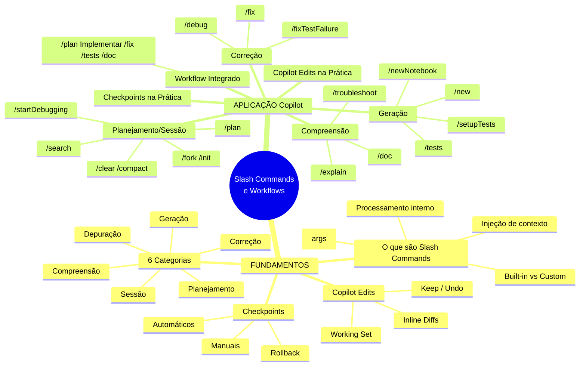
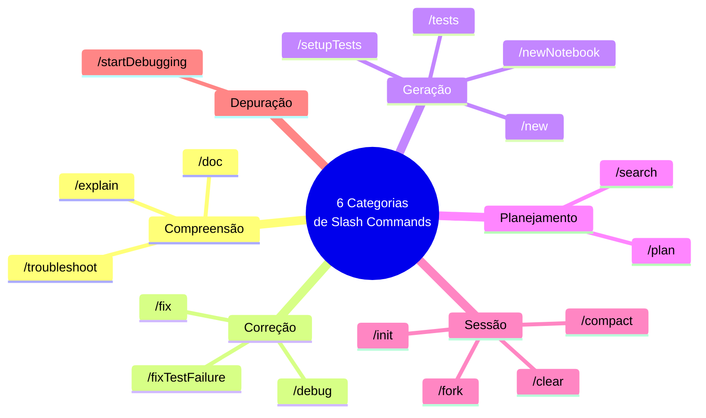
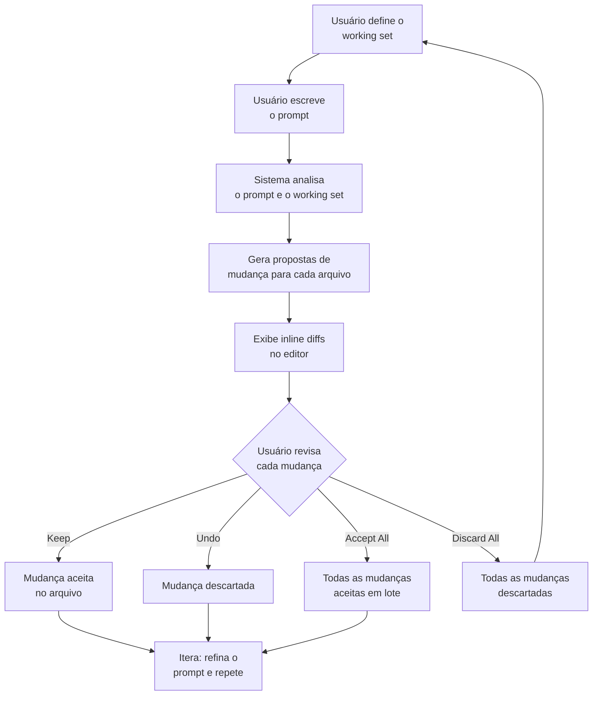
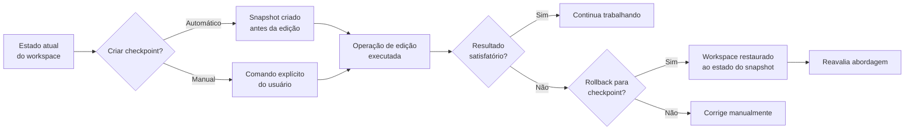
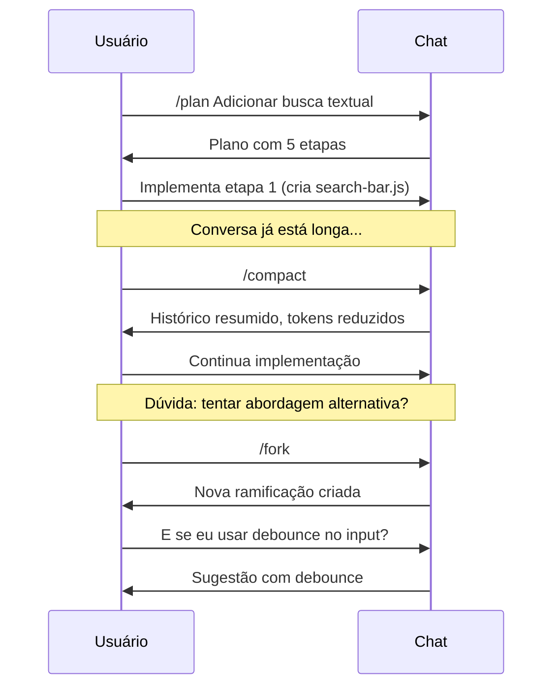
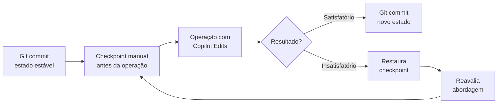

# Harness do GitHub Copilot e Programação Agêntica com VS Code — Aula 06

## Slash Commands e Workflows de Desenvolvimento

**Duração estimada:** 90 minutos (45 de leitura + 45 de prática)
**Nível:** Intermediário
**Pré-requisitos:** Aulas 01 a 05 concluídas. Copilot instalado e autenticado (Aula 02). `.github/copilot-instructions.md` configurado (Aula 03). Domínio de @mentions, @workspace e prompt files (Aula 04). Experiência com Agent Mode e o ciclo Understand→Act→Validate (Aula 05). Portal de Projetos Dev com cards, filtro por status e estrutura base.

---

## Objetivos de Aprendizagem

Ao final desta aula, você será capaz de:

- [ ] **Classificar** os slash commands do Copilot em 6 categorias (compreensão, correção, geração, planejamento, sessão, depuração) e **explicar** o propósito de cada uma
- [ ] **Explicar** o funcionamento interno dos slash commands como atalhos que injetam contexto e instruções pré-formatadas no prompt do modelo
- [ ] **Aplicar** comandos de compreensão (/explain, /doc, /troubleshoot) para analisar código existente e gerar documentação automática
- [ ] **Diagnosticar** e corrigir problemas com comandos de correção (/fix, /fixTestFailure, /debug), entendendo quando cada um é apropriado
- [ ] **Gerar** código e cobertura de testes com comandos de geração (/tests, /setupTests, /new, /newNotebook), selecionando o comando certo para cada cenário
- [ ] **Planejar** features com /plan antes de implementar, transformando requisitos abstratos em passos concretos
- [ ] **Gerenciar** sessões de desenvolvimento com /clear, /compact, /fork e /init, mantendo o contexto do Copilot limpo e relevante
- [ ] **Usar** Copilot Edits para edições multi-arquivo com working set explícito, revisando inline diffs com Keep/Undo
- [ ] **Criar e restaurar** checkpoints como estratégia de rollback durante edições complexas
- [ ] **Integrar** slash commands em um workflow completo de desenvolvimento: /plan → implementação → /fix → /tests → /doc

---

## Como Usar Esta Aula

Esta aula está organizada em duas partes. A **primeira parte** constrói os fundamentos universais — o que são slash commands, como se categorizam, o paradigma de edição multi-arquivo e o conceito de checkpoints. Estes conceitos valem para qualquer ambiente de desenvolvimento assistido por IA. A **segunda parte** aplica cada um desses conceitos na prática com o GitHub Copilot no VS Code, usando o Portal de Projetos Dev como laboratório.

Ao longo do caminho, você encontrará **Quick Checks** (verificação rápida a cada seção) e **Mão na Massa** (atividades práticas para executar no seu editor). Ao final, o arquivo separado **Questões de Aprendizagem** traz as tarefas de checkpoint — só avance para a Aula 07 quando conseguir completá-las por conta própria.

**Tempo estimado:** 45 minutos de leitura + 45 minutos de prática.
**Dica:** Tenha o VS Code com o Portal de Projetos Dev aberto durante a segunda parte. Você usará o Chat, o Agent Mode e o Copilot Edits ao longo das atividades.

---

## Mapa Mental

Este diagrama mostra todos os conceitos que você vai dominar nesta aula:




---

## Recapitulação das Aulas 01 a 05

| Aula | Conceito | Onde aparece nesta aula | Como se conecta |
|---|---|---|---|
| Aula 01 | **Coding agent** e ciclo de decisão | Seções 1-2 — O agente como processador de comandos | Slash commands são atalhos que alimentam o ciclo de decisão |
| Aula 01 | **8 dimensões da agencialidade** | Seções 3, 8 — Iniciativa, ferramentas, aprovação | Copilot Edits dá controle granular; Agent Mode dá autonomia |
| Aula 02 | **Modos Ask/Edit/Agent do Chat** | Seções 5-11 — Slash commands operam dentro de cada modo | Cada modo tem acesso a diferentes comandos |
| Aula 03 | **copilot-instructions.md** e .instructions.md | Seções 1, 5-8 — Instruções guiam como os comandos operam | Comandos como /fix e /tests respeitam suas instruções |
| Aula 04 | **@mentions, @workspace, prompt files** | Seções 5-8 — Slash commands complementam @mentions | @workspace + /explain = entender código; /doc gera docs |
| Aula 04 | **Prompts customizados** (.github/prompts/) | Seção 1 — Slash commands custom vs built-in | Seus prompts /comando são slash commands customizados |
| Aula 05 | **Agent Mode** e Understand→Act→Validate | Seções 3, 9-11 — Copilot Edits como alternativa de controle | Edit mode (controle) vs Agent mode (autonomia) |
| Aula 05 | **Tool sets e permissões** | Seções 6, 10 — Cada comando acessa tools específicas | /fix usa #edit; /startDebugging usa #execute |

---

**FUNDAMENTOS: Workflows de Desenvolvimento e Automação de Tarefas**

> *Os conceitos desta seção são universais — valem para qualquer ambiente de desenvolvimento assistido por IA, independentemente da ferramenta específica. Use as analogias com editores e terminais que você já conhece como âncoras. Na segunda parte, você verá como o GitHub Copilot implementa cada um deles.*

---

## 1. O que São Slash Commands e Por Que Eles Existem

Você já conhece o padrão: toda vez que precisa pedir ao seu coding agent para explicar um trecho de código, você escreve "Explique o que este código faz, linha por linha, destacando os padrões usados e por que cada parte está ali". Depois de algumas interações, você percebe que está digitando a mesma estrutura de prompt repetidamente.

**Slash commands** resolvem exatamente esse problema.

### O que é um slash command?

Um **slash command** é um atalho de teclado para um prompt pré-formatado. Quando você digita `/comando`, o sistema expande esse comando em um conjunto completo de instruções e contexto que é enviado ao modelo. Em vez de escrever três parágrafos explicando o que quer, você digita duas palavras.

### A anatomia de um slash command

```
/comando [argumentos opcionais]
```

A barra (`/`) sinaliza ao sistema que o que vem a seguir não é texto comum, mas um comando. O nome do comando identifica qual ação executar. Os argumentos opcionais refinam o escopo.

Exemplos:
- `/explain` — "explique o código selecionado"
- `/doc` — "gere documentação para o código selecionado"
- `/tests` — "gere testes para o código selecionado"

### Como o sistema processa o comando

```mermaid
flowchart LR
    A[Usuário digita /explain] --> B{Sistema reconhece<br/>o comando?}
    B -->|Sim| C[Expande em prompt<br/>pré-formatado]
    B -->|Não| D[Trata como texto<br/>comum no chat]
    C --> E[Instruções injetadas:<br/>"Explique o código selecionado<br/>linha por linha, destacando<br/>padrões e propósito"]
    E --> F[Contexto adicional:<br/>código selecionado +<br/>arquivo ativo + instruções]
    F --> G[Modelo processa e<br/>gera resposta]
```


O processo tem três etapas:

1. **Reconhecimento:** o sistema identifica que `/explain` é um comando válido, não texto comum
2. **Expansão:** o comando é substituído por um template de prompt completo, com instruções específicas sobre o que fazer e como formatar a resposta
3. **Contextualização:** o template é combinado com o contexto atual — código selecionado, arquivo ativo, instruções do projeto — e enviado ao modelo

### A diferença entre prompt natural e slash command

Sem slash command, você escreve:

> "Pode explicar o que essa função faz? Ela recebe uns parâmetros, filtra alguma coisa, não entendi bem a lógica. Se puder mostrar linha por linha, agradeço."

Com `/explain`, o sistema envia internamente algo como:

> "Analise o código selecionado e forneça uma explicação detalhada: (1) propósito geral da função/classe, (2) explicação linha por linha, (3) padrões e técnicas utilizados, (4) fluxo de dados, (5) possíveis problemas ou melhorias. Formate a resposta com seções claras e destaque trechos relevantes."

A diferença não é só de tamanho — é de **qualidade e consistência**. O slash command garante que o modelo receba instruções precisas toda vez, sem depender de como você formula o prompt naquele momento.

### Slash commands built-in vs customizados

Existem duas origens para slash commands:

**Built-in:** comandos nativos da ferramenta, disponíveis sem qualquer configuração. Cada sistema de coding agent oferece seu próprio conjunto. São mantidos pela equipe do produto e atualizados com novas versões.

**Customizados:** comandos que você mesmo cria para tarefas específicas do seu projeto. Na Aula 04, você criou prompts customizados em `.github/prompts/` — cada um deles se torna um `/comando` que você pode usar no Chat. A diferença é que os built-in são genéricos (servem para qualquer projeto) enquanto os customizados são específicos do seu contexto.

### Por que usar slash commands?

Três razões principais:

**Consistência:** toda vez que você usa `/explain`, o modelo recebe as mesmas instruções de formato e profundidade. Não depende do seu humor ou do quanto você digitou.

**Velocidade:** um comando de duas palavras substitui 3-4 frases de prompt. Em uma sessão de desenvolvimento com dezenas de interações, a economia de tempo é significativa.

**Contexto injetado:** o slash command não só substitui o texto — ele **injeta contexto adicional** que você não precisaria digitar. O `/fix` não só diz "corrija o código" — ele instrui o modelo a analisar sintaxe, lógica, más práticas e vulnerabilidades, e a explicar a causa raiz de cada problema.

### Quick Check 1

**1. O que diferencia um slash command de um prompt digitado manualmente?**
**Resposta:** Um slash command é um atalho que expande para um template de instruções pré-formatado, garantindo que o modelo receba o mesmo conjunto de instruções precisas toda vez. Um prompt manual depende da formulação do usuário naquele momento — qualidade e completude variam.

**2. Quais são as três etapas do processamento interno de um slash command?**
**Resposta:** (1) Reconhecimento — o sistema identifica que o texto é um comando válido; (2) Expansão — o comando é substituído por um template de prompt completo; (3) Contextualização — o template é combinado com o contexto atual (código selecionado, arquivo ativo, instruções do projeto) e enviado ao modelo.

---

## 2. Mapa Mental — As 6 Categorias de Slash Commands

Existem dezenas de slash commands disponíveis em um coding agent moderno. Memorizar cada um individualmente é ineficiente. Em vez disso, aprenda as **categorias** — os comandos se agrupam naturalmente pelo tipo de tarefa que executam.

### As 6 categorias




### 1. Compreensão — "Me ajude a entender"

Comandos que transformam código existente em conhecimento. Você usa quando encontra um trecho que não entende, precisa documentar algo que já funciona, ou está investigando um comportamento estranho.

- `/explain` — explica o código selecionado linha por linha
- `/doc` — gera documentação (JSDoc, docstrings, comentários)
- `/troubleshoot` — diagnostica problemas a partir de logs e sintomas

### 2. Correção — "Me ajude a consertar"

Comandos que identificam e corrigem problemas. Você usa quando o código não compila, um teste falha, ou o comportamento está errado.

- `/fix` — propõe correções para problemas no código selecionado
- `/fixTestFailure` — analisa a saída do test runner e corrige código ou teste
- `/debug` — sugere breakpoints, variáveis para inspecionar e hipóteses

### 3. Geração — "Crie algo para mim"

Comandos que produzem código novo. Você usa quando precisa criar um arquivo do zero, adicionar testes a código existente, ou configurar uma ferramenta.

- `/tests` — gera testes unitários para o código selecionado
- `/setupTests` — configura o framework de testes no projeto
- `/new` — cria um novo arquivo com scaffold inicial
- `/newNotebook` — cria um notebook para prototipagem

### 4. Planejamento — "Pense antes de agir"

Comandos que estruturam o processo. Você usa antes de começar a implementar, para evitar retrabalho.

- `/plan` — transforma um objetivo em passos concretos
- `/search` — busca semântica no workspace por padrões e implementações

### 5. Sessão — "Gerencie nossa conversa"

Comandos que controlam o estado da conversa com o agente. Você usa para limpar contexto, reduzir tokens, ou explorar alternativas.

- `/clear` — limpa o histórico da conversa
- `/compact` — resume o histórico, reduzindo tokens
- `/fork` — cria uma ramificação para explorar alternativas
- `/init` — inicializa uma nova sessão com contexto do workspace

### 6. Depuração — "Execute e inspecione"

Comandos que integram com ferramentas de execução e depuração. Você usa quando precisa depurar ativamente com breakpoints e inspeção de variáveis.

- `/startDebugging` — inicia uma sessão de depuração interativa

### Por que aprender as categorias antes dos comandos?

As categorias são **estáveis** — os comandos individuais podem mudar, ser renomeados ou substituídos entre versões, mas as categorias (compreender, corrigir, gerar, planejar, gerenciar sessão, depurar) permanecem. Quando você encontra um comando novo, pergunte: "em que categoria ele se encaixa?" — isso já diz muito sobre como usá-lo.

### Quick Check 2

**1. Em que categoria está o comando que gera testes unitários? E o comando que explica código?**
**Resposta:** `/tests` está na categoria **Geração** (cria algo novo). `/explain` está na categoria **Compreensão** (ajuda a entender algo existente).

**2. Por que "Sessão" é uma categoria separada de "Planejamento"?**
**Resposta:** Porque resolvem problemas diferentes. Comandos de Planejamento estruturam **o que** fazer antes de executar. Comandos de Sessão gerenciam **o estado da conversa** com o agente — limpar histórico, reduzir contexto, criar ramificações. Um planeja o trabalho; o outro mantém a ferramenta funcionando bem.

---

## 3. Edição Multi-Arquivo como Paradigma de Desenvolvimento

Até agora, você viu duas formas de interagir com um coding agent: o **Chat** (você pergunta, ele responde) e o **Agent Mode** (você delega, ele executa autonomamente). Existe um terceiro modo, que ocupa o espaço entre os dois: a **edição multi-arquivo com aprovação granular**.

### O problema que a edição multi-arquivo resolve

No Chat, cada resposta é texto — você copia, cola, ajusta. É rápido para perguntas e respostas, mas ineficiente para mudanças que afetam múltiplos arquivos. No Agent Mode, o agente decide o que editar — você aprova ou não o resultado final, mas não controla quais arquivos serão afetados.

A edição multi-arquivo resolve ambos os problemas: você **escolhe exatamente quais arquivos podem ser modificados** (o working set), o agente **mostra cada mudança inline** (diff lado a lado), e você **aprova ou rejeita cada mudança individualmente** (Keep/Undo).

### O fluxo da edição multi-arquivo




### Working set — O conjunto de arquivos editáveis

O **working set** é o coração do paradigma. Diferente do Agent Mode, onde o agente decide quais arquivos modificar, aqui **você** escolhe. Isso dá controle explícito sobre o escopo da edição.

O working set inclui:
- **Arquivos para editar:** os que você quer que o agente modifique
- **Arquivos de referência:** os que o agente pode ler (mas não modificar) para entender o contexto

Boa prática: inclua apenas os arquivos que precisam ser alterados + alguns de referência. Exclua arquivos gerados, node_modules e binários.

### Inline diffs — A visualização das mudanças

Quando o agente propõe uma mudança, o editor mostra um **diff inline** — o código original de um lado, o código proposto do outro, com destaque visual para linhas adicionadas, removidas e modificadas.

Isso permite que você:
- Veja exatamente o que mudou antes de aprovar
- Compare lado a lado sem sair do editor
- Identifique mudanças inesperadas ou acidentais

### Keep/Undo — A aprovação granular

Cada mudança no diff pode ser:
- **Keep:** aceita a mudança e aplica ao arquivo
- **Undo:** rejeita a mudança e mantém o original

Você também pode aceitar ou rejeitar tudo em lote:
- **Accept All:** aceita todas as mudanças de uma vez
- **Discard All:** rejeita todas as mudanças

Keep/Undo é para quando você quer controle linha a linha. Accept All/Discard All é para quando a confiança está alta e você quer acelerar.

### Edit mode vs Agent mode

| Aspecto | Edit Mode | Agent Mode |
|---|---|---|
| Quem escolhe os arquivos? | Usuário (working set) | Agente (decide com base no prompt) |
| Controle granular | Sim — Keep/Undo por mudança | Não — aprova o resultado final |
| Autonomia | Baixa — usuário guia | Alta — agente executa e corrige |
| Melhor para | Mudanças precisas em arquivos conhecidos | Tarefas exploratórias em código desconhecido |
| Risco de mudanças inesperadas | Baixo (working set limitado) | Moderado (agente pode surpreender) |

### Quick Check 3

**1. Qual a diferença entre Edit Mode e Agent Mode em termos de quem define o working set?**
**Resposta:** No Edit Mode, é o **usuário** quem define explicitamente o working set — ele escolhe quais arquivos podem ser modificados. No Agent Mode, é o **agente** quem decide quais arquivos modificar com base na interpretação do prompt. Edit Mode dá controle; Agent Mode dá autonomia.

**2. Em que situação você usaria Accept All em vez de Keep/Undo individual?**
**Resposta:** Quando a confiança na mudança é alta — por exemplo, uma alteração simples em um arquivo único, um refactor bem conhecido, ou uma mudança gerada por um comando especializado como /doc (que só adiciona comentários). Keep/Undo individual é melhor para mudanças complexas com múltiplos arquivos onde você quer revisar cada alteração.

---

## 4. Checkpoints como Rede de Segurança

Coding agents podem fazer mudanças profundas no seu workspace — especialmente no Agent Mode e no Edit Mode. Um prompt mal formulado ou uma interpretação equivocada pode resultar em dezenas de arquivos alterados incorretamente. **Checkpoints** são sua rede de segurança.

### O que é um checkpoint?

Um **checkpoint** é um snapshot do estado do workspace em um dado momento. Ele captura o conteúdo de todos os arquivos relevantes, permitindo que você retorne a esse estado posteriormente.

Pense como um "save state" de videogame: antes de enfrentar um chefão, você salva. Se morrer, volta ao save e tenta de novo. Checkpoints são seus saves antes de operações arriscadas com o coding agent.

### Checkpoints automáticos vs manuais

**Automáticos:** o sistema cria checkpoints automaticamente antes de cada operação de edição — antes de aplicar um /fix, antes de uma rodada do Agent Mode, antes de processar um prompt no Edit Mode. Você não precisa fazer nada; o snapshot está lá caso precise.

**Manuais:** você cria explicitamente com um comando de sessão (como `/session checkpoints` ou similar). Útil antes de operações que você sabe que são arriscadas — refatorações grandes, mudanças que afetam muitos arquivos, experimentos com configurações.

### O fluxo de checkpoints




### Estratégia de checkpoints

Checkpoints automáticos já protegem você contra a maioria dos cenários. Mas em situações específicas, criar checkpoints manuais faz toda a diferença:

- **Antes de refatorações que afetam 3+ arquivos:** o risco de efeito colateral indesejado é maior
- **Antes de experimentos com agentes autônomos:** você não sabe exatamente o que o agente vai fazer
- **Antes de mudanças em arquivos de configuração:** um erro pode quebrar o pipeline inteiro
- **Em momentos de "deu certo, não mexa":** quando você chegou a um estado estável e quer garantir um ponto de retorno

### Limitação importante

Checkpoints são **locais à sessão** — eles existem apenas enquanto o editor está aberto. Fechar e reabrir o editor descarta todos os checkpoints. Eles **não substituem Git commits**.

Use checkpoints como **camada de segurança adicional**, não como sistema de versionamento. O fluxo ideal:

1. Faça Git commits frequentes (a cada funcionalidade completa)
2. Use checkpoints dentro da sessão para proteção entre commits
3. Checkpoints protegem contra erros do agente; Git protege contra perda de trabalho

### Quick Check 4

**1. Qual a diferença entre um checkpoint automático e um checkpoint manual?**
**Resposta:** O checkpoint automático é criado pelo sistema antes de cada operação de edição — você não precisa fazer nada. O checkpoint manual é criado por você explicitamente (via comando de sessão), normalmente antes de operações que você identifica como arriscadas.

**2. Por que checkpoints não substituem Git commits?**
**Resposta:** Porque checkpoints são efêmeros — existem apenas durante a sessão atual do editor. Fechar o editor os descarta. Git commits são permanentes — ficam no repositório e podem ser acessados por qualquer pessoa, a qualquer momento, em qualquer máquina. Checkpoints protegem contra erros do agente na sessão atual; Git protege contra perda permanente de trabalho.

---

**APLICAÇÃO: Slash Commands e Copilot Edits no GitHub Copilot**

> *Agora que você entende os fundamentos — o que são slash commands, como se categorizam, o paradigma de edição multi-arquivo e os checkpoints — vamos conectar cada conceito à prática com o GitHub Copilot no VS Code. Você usará o Portal de Projetos Dev como laboratório para dominar cada comando e fluxo.*

---

## 5. Comandos de Compreensão — /explain, /doc, /troubleshoot

Os comandos de compreensão transformam código existente em conhecimento. Você os usa quando se depara com um trecho que não entende, precisa documentar o que já funciona, ou está investigando um comportamento estranho.

### /explain — "O que este código faz?"

O `/explain` é seu intérprete pessoal. Selecione um trecho de código e digite `/explain` — o Copilot analisa o código e produz uma explicação estruturada.

**O que ele faz:**
- Analisa o código selecionado (função, classe, bloco)
- Explica o propósito geral
- Percorre linha por linha destacando o que cada parte faz
- Identifica padrões, algoritmos e fluxo de dados
- Aponta possíveis problemas ou ambiguidades

**Como usar:**
1. Selecione o código no editor (pode ser um trecho ou arquivo inteiro)
2. No Chat, digite `/explain`
3. Opcional: adicione contexto extra — `/explain focando no fluxo de dados`

**Exemplo com o Portal de Projetos Dev:**

Selecione a função de filtro do seu portal e use `/explain`. O Copilot produzirá algo como:

> "Esta função `filtrarProjetos` recebe um parâmetro `status` e filtra o array de projetos. Ela percorre cada projeto, compara o status, e retorna apenas os que correspondem. O fluxo é: (1) obtém a lista de projetos do estado, (2) aplica o filtro, (3) atualiza a lista exibida."

### /doc — "Documente este código"

O `/doc` gera documentação automática no formato adequado à linguagem do arquivo. Selecione uma função ou classe e use `/doc` — o Copilot adiciona JSDoc (JavaScript), docstrings (Python), Javadoc (Java), ou o formato equivalente.

**O que ele gera:**
- Descrição da função/classe
- Documentação de parâmetros (nome, tipo, descrição)
- Documentação do valor de retorno
- Exceções que podem ser lançadas
- Exemplo de uso (em alguns formatos)

**Como usar:**
1. Selecione a função, método ou classe
2. No Chat, digite `/doc`
3. O Copilot insere a documentação no formato adequado

**Dica:** `/doc` funciona melhor quando você tem boas instruções de estilo no `copilot-instructions.md`. Se você definiu "Use JSDoc para funções públicas", o `/doc` seguirá esse padrão.

### /troubleshoot — "Diagnostique este problema"

O `/troubleshoot` é seu assistente de diagnóstico. Diferente do `/explain` (que entende código), o `/troubleshoot` analisa **problemas** — erros de runtime, comportamentos inesperados, logs de erro, stack traces.

**O que ele faz:**
- Analisa logs de erro e stack traces
- Identifica causas prováveis
- Sugere passos de investigação
- Recomenda correções quando aplicável

**Como usar:**
1. Copie o erro/log/stack trace
2. No Chat, digite `/troubleshoot` seguido do erro
3. Ou cole o erro primeiro e depois digite `/troubleshoot`

**Exemplo:**
```
/troubleshoot TypeError: Cannot read properties of undefined (reading 'status')
```

O Copilot analisará o erro e sugerirá causas: "O objeto `projeto` está undefined. Verifique se o array `projetos` foi carregado antes de acessar `projeto.status`. Possível causa: chamada assíncrona sem await."

### Quando usar cada um

| Comando | Use quando | Não use quando |
|---|---|---|
| `/explain` | Você quer **entender** o código | O código é trivial (ex: uma linha) |
| `/doc` | Você precisa **documentar** código que já entende | O código vai mudar em breve (docs desatualizadas) |
| `/troubleshoot` | Você tem um **erro ou comportamento estranho** | O problema é um bug óbvio de sintaxe |

### Mão na Massa 1 — Compreensão no Portal

- [ ] Abra o arquivo de filtro do Portal de Projetos Dev (aquele que você criou na Aula 05 com Agent Mode)
- [ ] Selecione a função de filtragem e use `/explain` no Chat
- [ ] Identifique se a explicação corresponde ao que você espera
- [ ] Use `/doc` na mesma função para gerar JSDoc
- [ ] Verifique se o formato segue as instruções de estilo do projeto
- [ ] Se houver algum tratamento de erro, use `/troubleshoot` para simular um diagnóstico

**Verificação:** você deve ter a função documentada com JSDoc e uma explicação clara do fluxo de filtragem.

### Quick Check 5

**1. Qual a diferença entre /explain e /doc?**
**Resposta:** `/explain` produz uma explicação em linguagem natural para você ler — propósito, fluxo, padrões. `/doc` gera documentação técnica no formato da linguagem (JSDoc, docstrings) — parâmetros, retorno, exceções. Um é para **você entender**; o outro é para **o código se documentar**.

**2. Em que cenário /troubleshoot é mais útil que /explain?**
**Resposta:** Quando você já sabe o que o código faz (ou deveria fazer) mas ele está se comportando de forma inesperada. `/troubleshoot` analisa logs, stack traces e sintomas para diagnosticar a causa raiz. `/explain` só explica o código como está escrito — não diagnostica problemas.

---

## 6. Comandos de Correção — /fix, /fixTestFailure, /debug

Os comandos de correção identificam e resolvem problemas. Cada um é especializado em um tipo de cenário: bugs visíveis, falhas de teste e depuração interativa.

### /fix — "Corrija este código"

O `/fix` analisa o código selecionado e propõe correções. Ele não apenas corrige — ele **explica a causa raiz** do problema.

**O que ele detecta:**
- Erros de sintaxe
- Bugs de lógica
- Más práticas e code smells
- Vulnerabilidades de segurança
- Problemas de desempenho

**Como usar:**
1. Selecione o código com problema
2. Digite `/fix` no Chat
3. O Copilot mostra a correção e explica o porquê

**Exemplo com o Portal:**

```javascript
// Código com bug
function filtrarProjetos(status) {
    return projetos.filter(projeto => {
        projeto.status === status
    })
}
```

Selecione e use `/fix`. O Copilot corrigirá para:

```javascript
function filtrarProjetos(status) {
    return projetos.filter(projeto => {
        return projeto.status === status
    })
}
```

E explicará: "O método `filter` espera que o callback retorne um valor booleano. Sem `return`, a arrow function retorna `undefined`, que é falsy — todos os itens são removidos."

**Anti-padrão:** nunca aceite uma correção do `/fix` sem entender o que mudou e por quê. A correção pode estar errada, ou pode corrigir o sintoma mas não a causa.

### /fixTestFailure — "Corrija esta falha de teste"

O `/fixTestFailure` é especializado em falhas de teste. Diferente do `/fix` (que analisa o código-fonte), este comando analisa a **saída do test runner** — o log de falha — e decide onde está o erro: no código-fonte, no teste, ou em ambos.

**Como usar:**

1. Execute os testes e capture a saída com erro
2. Copie o log de falha
3. No Chat, cole o log e digite `/fixTestFailure`
4. O Copilot analisa a saída e propõe correções

**O que ele faz:**
- Identifica qual asserção falhou e por quê
- Analisa se o erro está no código-fonte, no teste, ou em ambos
- Propõe a correção adequada
- Explica o raciocínio

### /debug — "Ajude-me a depurar"

O `/debug` é seu parceiro de depuração interativa. Diferente do `/fix` (que corrige automaticamente), o `/debug` **sugere passos de investigação** — breakpoints, variáveis a inspecionar, hipóteses a testar.

**Como usar:**
1. No Chat, descreva o bug ou comportamento inesperado
2. Use `/debug` para obter sugestões de como investigar
3. Siga as sugestões: adicione breakpoints, inspecione variáveis, teste hipóteses

**O que ele sugere:**
- Onde colocar breakpoints
- Quais variáveis inspecionar em cada ponto
- Hipóteses sobre a causa raiz
- Próximos passos na investigação

### Comparação entre os comandos de correção

```mermaid
flowchart TD
    subgraph Problemas
        P1["Bug visível no código<br/>(sintaxe, lógica)"]
        P2["Teste falhou<br/>(saída do test runner)"]
        P3["Bug complexo<br/>(precisa investigar)"]
    end

    P1 --> C1[/fix]
    P2 --> C2[/fixTestFailure]
    P3 --> C3[/debug]

    C1 --> R1["Correção + explicação<br/>da causa raiz"]
    C2 --> R2["Análise do log de falha<br/>correção do código ou teste"]
    C3 --> R3["Sugestões de breakpoints<br/>hipóteses e passos"]
```


### Mão na Massa 2 — Correção no Portal

- [ ] Introduza um bug no filtro do Portal (ex: remova um `return`, inverta uma condição)
- [ ] Selecione o código com bug e use `/fix`
- [ ] Revise a correção proposta e a explicação da causa raiz
- [ ] Aceite a correção e verifique se o bug foi resolvido
- [ ] Crie um teste simples para o filtro (pode ser um esboço)
- [ ] Introduza uma falha no teste e execute-o
- [ ] Capture a saída de erro e use `/fixTestFailure`

**Verificação:** o filtro volta a funcionar após o `/fix`. A falha de teste é diagnosticada e corrigida pelo `/fixTestFailure`.

### Quick Check 6

**1. Qual a diferença entre /fix e /debug?**
**Resposta:** `/fix` analisa o código selecionado e **propõe a correção diretamente**, explicando a causa raiz. `/debug` **sugere passos de investigação** — breakpoints, variáveis a inspecionar, hipóteses — sem necessariamente propor a correção. Use `/fix` para bugs já identificados; use `/debug` para bugs que você ainda precisa entender.

**2. Em que situação /fixTestFailure é preferível a /fix?**
**Resposta:** Quando você tem a saída de um test runner com falha. `/fixTestFailure` analisa o log do teste e decide se o erro está no código-fonte, no teste, ou em ambos. `/fix` só analisa o código selecionado e não tem acesso ao contexto da execução do teste.

---

## 7. Comandos de Geração — /tests, /setupTests, /new, /newNotebook

Os comandos de geração criam código novo. Cada um atende um tipo diferente de necessidade: testes, configuração de infraestrutura de testes, scaffolds de arquivos e notebooks de experimentação.

### /tests — "Gere testes para este código"

O `/tests` gera testes unitários para o código selecionado ou o arquivo ativo. Ele detecta automaticamente o framework de teste do projeto.

**O que ele gera:**
- Casos de teste para o caminho feliz
- Casos para edge cases (valores limite, entradas vazias, nulos)
- Casos de erro (exceções, falhas)
- Mocks e fixtures quando apropriado

**Como usar:**
1. Abra o arquivo que você quer testar (ou selecione uma função)
2. No Chat, digite `/tests`
3. O Copilot cria um arquivo de teste no local apropriado

**Exemplo com o Portal:**
```
Selecione a função `filtrarProjetos` e digite /tests
```

O Copilot gera um arquivo `filtrarProjetos.test.js` com casos como:
- Retorna todos os projetos quando status é "todos"
- Retorna apenas projetos "Em Andamento"
- Retorna array vazio quando nenhum projeto corresponde
- Não modifica o array original

### /setupTests — "Configure o framework de testes"

O `/setupTests` configura a infraestrutura de testes do zero. Útil quando você está começando um novo projeto ou adicionando testes a um projeto que nunca teve.

**O que ele faz:**
- Detecta a stack do projeto (JavaScript, TypeScript, React, etc.)
- Sugere o framework adequado (Jest, Vitest, Mocha, pytest, JUnit)
- Cria arquivos de configuração (`jest.config.js`, `.babelrc`, `tsconfig.json` para testes)
- Instala dependências necessárias
- Cria um teste de exemplo para verificar se a configuração funciona

**Quando usar /tests vs /setupTests:**

| Cenário | Comando |
|---|---|
| Projeto já tem framework de teste configurado | `/tests` |
| Projeto nunca teve testes | `/setupTests` primeiro, depois `/tests` |
| Você quer testar um arquivo específico | `/tests` |
| Precisa migrar de framework de teste | `/setupTests` |

### /new — "Crie um novo arquivo"

O `/new` cria um novo arquivo com scaffold inicial — imports, estrutura básica e placeholders.

**Como usar:**
```
/new um componente de barra de busca em JavaScript
```

O Copilot cria um arquivo `search-bar.js` na pasta apropriada com:
- Estrutura da classe ou função
- Imports necessários
- Esqueleto dos métodos principais
- Comentários indicando onde completar

**Dica:** Seja específico no comando. `/new filter` pode gerar algo genérico. `/new função de filtro por status em JavaScript` gera algo mais próximo do que você precisa.

### /newNotebook — "Crie um notebook"

O `/newNotebook` cria um notebook no formato do VS Code (.ipynb ou similar) para experimentação interativa. Útil para:
- Prototipagem rápida de algoritmos
- Análise exploratória de dados
- Documentação interativa com código executável
- Testes de conceito antes de implementar no código principal

### Mão na Massa 3 — Geração no Portal

- [ ] Selecione a função de filtro do Portal e use `/tests` para gerar cobertura de testes
- [ ] Verifique o arquivo de teste gerado: cobre caminho feliz, edge cases e erros?
- [ ] Execute os testes (se o framework já estiver configurado)
- [ ] Use `/new` para criar um novo componente para o Portal: uma barra de busca textual
- [ ] Verifique o scaffold gerado: imports, estrutura, placeholders

**Verificação:** você tem um arquivo de teste para o filtro e um scaffold de componente de busca.

### Quick Check 7

**1. Qual a diferença entre /tests e /setupTests?**
**Resposta:** `/setupTests` configura a infraestrutura de testes do zero — instala dependências, cria arquivos de configuração, define o framework. `/tests` gera casos de teste para código existente, assumindo que a infraestrutura já está pronta. Use `/setupTests` uma vez por projeto; use `/tests` muitas vezes, para cada função ou arquivo.

**2. Em que cenário /newNotebook é mais útil que /new?**
**Resposta:** Quando você quer prototipar ou experimentar antes de escrever código definitivo. `/newNotebook` cria um ambiente interativo onde você pode executar células, ver resultados intermediários e iterar rapidamente. `/new` cria um arquivo de código definitivo, pronto para ser integrado ao projeto.

---

## 8. Comandos de Planejamento e Sessão — /plan, /search, /clear, /compact, /fork, /init, /startDebugging

Estes comandos não produzem código diretamente — eles estruturam **como** você trabalha. São os comandos de orquestração do seu workflow.

### /plan — "Pense antes de agir"

O `/plan` é talvez o comando mais importante para features complexas. Em vez de começar a implementar e descobrir no meio do caminho que faltou algo, você usa `/plan` para obter um roteiro antes de escrever uma linha de código.

**O que ele gera:**
- Objetivo da feature
- Arquivos que precisam ser criados ou modificados
- Ordem das etapas de implementação
- Dependências entre etapas
- Possíveis problemas ou considerações

**Como usar:**
```
/plan Adicionar busca textual no Portal de Projetos

Quero uma barra de busca que filtre projetos por nome e descrição, em tempo real, sem recarregar a página.
```

O Copilot produz um plano como:

> **Feature:** Busca textual no Portal de Projetos
> 
> **Arquivos a criar:**
> - `js/search-bar.js` — componente de busca
> 
> **Arquivos a modificar:**
> - `index.html` — adicionar input de busca no header
> - `js/app.js` — conectar busca ao estado global
> - `css/styles.css` — estilizar a barra de busca
> 
> **Etapas:**
> 1. Criar componente search-bar.js com input e evento onInput
> 2. Adicionar input no HTML
> 3. Conectar ao estado global em app.js
> 4. Estilizar com CSS
> 5. Testar integração com filtro de status existente

**Anti-padrão:** usar `/plan` para tarefas triviais como "criar um arquivo vazio". `/plan` é para features que envolvem múltiplos arquivos e decisões.

### /search — "Encontre no workspace"

O `/search` é uma busca semântica no workspace. Diferente de uma busca textual (que encontra strings exatas), a busca semântica entende o **significado** do que você procura.

```
/search como o filtro de status acessa a lista de projetos
```

Retorna:
- O arquivo onde o estado global é gerenciado
- A função que expõe a lista de projetos
- O componente que consome essa lista

### Comandos de sessão

**/clear — Limpar histórico**

Limpa todo o histórico da conversa atual. Útil quando:
- Você terminou uma tarefa e vai começar outra não relacionada
- O Copilot está "contaminado" por contexto de uma conversa anterior
- Você quer começar do zero sem fechar o Chat

**/compact — Compactar histórico**

Resume o histórico da conversa, reduzindo o consumo de tokens. Diferente do `/clear` (que apaga tudo), o `/compact` preserva:
- Decisões importantes
- Contexto essencial
- Arquivos referenciados

E descarta:
- Repetições
- Idas e vindas
- Mensagens de confirmação

Use `/compact` quando a conversa está longa e o Copilot começa a "esquecer" o início da conversa.

**/fork — Ramificar conversa**

Cria uma ramificação da conversa atual no ponto atual. Útil para:
- Explorar uma abordagem alternativa sem perder a conversa original
- Comparar soluções diferentes para o mesmo problema
- Experimentar sem risco de perder o progresso

**/init — Nova sessão**

Inicializa uma nova sessão com contexto fresco do workspace. Equivalente a fechar e reabrir o Chat, mas sem sair do editor. Útil quando você quer começar completamente do zero.

### /startDebugging — Depuração interativa

Diferente do `/debug` (que sugere hipóteses), o `/startDebugging` **inicia uma sessão de depuração real** no VS Code:

1. Abre o depurador integrado
2. Define breakpoints sugeridos
3. Inicia a execução
4. Mostra variáveis e pilha de chamadas

### Workflow típico com comandos de sessão




### Mão na Massa 4 — Planejamento e Sessão no Portal

- [ ] Use `/plan` para planejar a feature de busca textual que você começou com `/new` na seção anterior
- [ ] Analise o plano gerado: cobre todos os arquivos necessários?
- [ ] Após algumas interações longas, use `/compact` para resumir o histórico
- [ ] Verifique se o Copilot ainda lembra do contexto essencial após o compact
- [ ] Use `/clear` entre tarefas não relacionadas
- [ ] Experimente `/fork` para explorar uma variação de implementação sem perder a conversa original

**Verificação:** você tem um plano detalhado para a feature de busca e sabe usar os comandos de sessão para manter o contexto gerenciável.

### Quick Check 8

**1. Em que situação você deve usar /plan em vez de começar a implementar diretamente?**
**Resposta:** Quando a tarefa envolve múltiplos arquivos ou tem decisões de design a serem tomadas. `/plan` força você a pensar na estrutura antes de codificar, evitando retrabalho. Para tarefas triviais (corrigir um bug de uma linha), `/plan` é desnecessário.

**2. Qual a diferença entre /clear e /compact?**
**Resposta:** `/clear` **apaga** todo o histórico da conversa — o Copilot "esquece" tudo. `/compact` **resume** o histórico, reduzindo tokens mas preservando decisões e contexto importantes. Use `/clear` entre tarefas não relacionadas; use `/compact` quando a conversa está longa mas você ainda precisa do contexto.

---

## 9. Copilot Edits na Prática — Working Set, Inline Diffs, Keep/Undo

Na Seção 3, você aprendeu o paradigma conceitual da edição multi-arquivo. Agora vamos aplicá-lo com o Copilot Edits no VS Code.

### Selecionando o working set

O **working set** é o conjunto de arquivos que o Copilot pode modificar. Você o define antes de escrever o prompt.

**Como selecionar:**
1. Abra o Copilot Edits (atalho: `Ctrl+Shift+I` ou clique em "Copilot Edits" na barra lateral)
2. No campo "Working Set", clique em "Add Files"
3. Selecione os arquivos que podem ser modificados
4. Opcional: adicione arquivos de referência (read-only)

**O que incluir no working set:**

- **Inclua:** arquivos que serão modificados + arquivos de referência para contexto
- **Exclua:** node_modules, arquivos gerados, binários, arquivos de configuração que não devem mudar

**Boa prática:** Para uma feature como a busca textual, seu working set pode ser:
- `js/search-bar.js` (novo — será criado)
- `index.html` (modificado — adicionar input)
- `js/app.js` (modificado — conectar ao estado)
- `css/styles.css` (modificado — estilizar)

E como referência (read-only):
- `js/filter.js` (para entender o padrão de filtro existente)

### Escrevendo prompts eficazes

O prompt para Copilot Edits deve especificar **o que mudar** e **onde**:

**Bom:**
```
Add a search bar to the Portal de Projetos. In index.html, add an input field
in the header. In js/search-bar.js, create the search component with debounce.
In js/app.js, connect the search to the project filtering. In css/styles.css,
add styles for the search bar matching the existing design system.
```

**Ruim:**
```
Adicionar busca no portal
```

Um prompt eficaz para Copilot Edits tem três partes:
1. **O que:** a mudança desejada (adicionar busca textual)
2. **Onde:** quais arquivos modificar e o que fazer em cada um
3. **Como:** referências a padrões existentes (como o filtro de status)

### Revisando inline diffs

Após enviar o prompt, cada arquivo modificado mostra um **diff inline**. Ao revisar:

1. **Verifique o escopo:** apenas os arquivos do working set foram modificados?
2. **Verifique a completude:** cada arquivo foi alterado corretamente? Nenhum ficou pela metade?
3. **Verifique remoções acidentais:** código funcional foi removido por engano?
4. **Verifique a consistência:** as mudanças seguem as instruções e o estilo do projeto?

### Keep/Undo vs Accept All/Discard All

Cada arquivo no diff tem botões individuais:

| Ação | Quando usar |
|---|---|
| **Keep** (individual) | A mudança está correta — aceita apenas este arquivo |
| **Undo** (individual) | A mudança está errada — descarta apenas este arquivo |
| **Accept All** | Todas as mudanças estão corretas — aceita em lote |
| **Discard All** | Nada está certo — descarta tudo e repensa a abordagem |

**Estratégia recomendada:** para mudanças que afetam 2-3 arquivos, revise cada diff individualmente e use Keep/Undo. Para mudanças confiantes em arquivo único, Accept All é seguro.

### Iteração — O ciclo de melhoria

Raramente o primeiro prompt produz o resultado exato que você quer. O fluxo real é:

1. Envie o prompt
2. Reveja os diffs
3. Ajuste: aceite o que está bom, descarte o que não está
4. Refine: escreva um novo prompt com instruções mais específicas
5. Repita até o resultado satisfatório

Cada iteração adiciona contexto — o Copilot sabe o que você aceitou e rejeitou, e ajusta as próximas sugestões.

### Mão na Massa 5 — Copilot Edits no Portal

- [ ] Abra o Copilot Edits no VS Code
- [ ] Defina o working set para a feature de busca: `index.html`, `js/search-bar.js` (criar), `js/app.js`, `css/styles.css`, com `js/filter.js` como referência
- [ ] Escreva um prompt detalhado: "Add a search bar that filters projects by name and description in real-time. Follow the existing filter pattern in filter.js."
- [ ] Após o Copilot processar, revise cada diff individualmente
- [ ] Aceite as mudanças corretas, descarte as incorretas
- [ ] Se algo não ficou perfeito, refine o prompt e repita
- [ ] Pratique Accept All em uma iteração onde você está confiante

**Verificação:** o Portal agora tem uma barra de busca funcional que filtra projetos por nome e descrição, integrada ao filtro de status existente.

### Quick Check 9

**1. O que você deve incluir no working set do Copilot Edits?**
**Resposta:** Os arquivos que serão **modificados** (editáveis) + arquivos de **referência** (read-only) que ajudam o Copilot a entender o contexto. Exclua node_modules, arquivos gerados e binários.

**2. Quando você deve usar Accept All em vez de Keep/Undo individual?**
**Resposta:** Quando a confiança na mudança é alta — edições simples em arquivo único, mudanças geradas por comandos especializados (/doc só adiciona comentários), ou após várias iterações onde as mudanças anteriores foram aceitas sem problemas. Keep/Undo individual é para mudanças complexas com vários arquivos onde você quer revisar cada alteração.

---

## 10. Checkpoints na Prática — Criar, Restaurar, Estratégia de Rollback

Na Seção 4, você aprendeu o conceito de checkpoints. Agora vamos aplicá-los na prática com o Copilot.

### Criando checkpoints manuais

Antes de operações arriscadas, crie um checkpoint manual:

```
/session checkpoints
```

Este comando tira um snapshot do estado atual do workspace. Você pode dar um nome descritivo:

```
/session checkpoints antes-da-refatoracao-filtro
```

### Visualizando checkpoints

Para ver a lista de checkpoints disponíveis e seus timestamps:

```
/session checkpoints list
```

Cada checkpoint aparece com:
- Nome/descrição (se você forneceu)
- Timestamp de criação
- Número de arquivos no snapshot

### Restaurando um checkpoint

Se o resultado de uma operação não ficou bom:

```
/session checkpoints restore <nome-ou-id>
```

O workspace inteiro retorna ao estado do snapshot — todos os arquivos, como estavam no momento do checkpoint.

### Estratégia de rollback

**Quando criar checkpoints manuais:**

| Situação | Risco | Ação |
|---|---|---|
| Refatoração que afeta 3+ arquivos | Alto — mudanças podem cascatear | Crie checkpoint manual |
| Primeira vez usando uma ferramenta | Moderado — você não sabe o que esperar | Crie checkpoint manual |
| Antes de /fix em código crítico | Baixo (checkpoint automático já existe) | Confie no automático |
| Experimentos com configurações | Alto — pode quebrar o projeto | Crie checkpoint manual |
| Depois de um estado "deu certo" | Baixo — quer garantir um ponto de retorno | Crie checkpoint manual |

**Quando NÃO confiar apenas em checkpoints:**

- Checkpoints são **locais à sessão**: fechar o VS Code os descarta
- Checkpoints não são compartilhados com o time
- Checkpoints não têm mensagens de commit descritivas

### Integração checkpoints + Git

O fluxo ideal:

1. **Antes de começar:** Git commit do estado atual
2. **Antes de operação arriscada:** checkpoint manual
3. **Execute a operação** (Copilot Edits, Agent Mode, /fix)
4. **Resultado satisfatório?** → Git commit
5. **Resultado insatisfatório?** → Restaure checkpoint → reavalie




### Mão na Massa 6 — Checkpoints no Portal

- [ ] Antes de fazer qualquer mudança, crie um checkpoint manual com `/session checkpoints`
- [ ] Faça uma edição complexa via Copilot Edits (ex: refatore a barra de busca que você criou)
- [ ] Se o resultado não ficou bom, restaure o checkpoint com `/session checkpoints restore`
- [ ] Verifique se o workspace voltou exatamente ao estado anterior
- [ ] Repita o processo: crie checkpoint, edite, restaure

**Verificação:** você sabe criar, listar e restaurar checkpoints. Entende que são proteção intra-sessão e não substituem Git commits.

### Quick Check 10

**1. Quando você deve criar um checkpoint manual mesmo com checkpoints automáticos ativos?**
**Resposta:** Antes de operações de alto risco que você identifica proativamente: refatorações que afetam 3+ arquivos, mudanças em configurações, experimentos com Agent Mode, ou quando você acabou de atingir um estado estável e quer garantir um ponto de retorno.

**2. Por que checkpoints não substituem a necessidade de Git commits?**
**Resposta:** Checkpoints são efêmeros — desaparecem quando você fecha o VS Code. Eles protegem contra erros do agente na sessão atual. Git commits são permanentes — protegem contra perda de trabalho, permitem colaboração em time, e têm mensagens descritivas que documentam o histórico do projeto.

---

## 11. Workflow Integrado — Do Planejamento à Documentação

O verdadeiro poder dos slash commands não está em usá-los isoladamente, mas em **encadeá-los** em um fluxo coerente. Cada comando alimenta o próximo.

### O workflow canônico

```mermaid
flowchart LR
    A[/plan] --> B[Implementação<br/>com Copilot Edits]
    B --> C[/fix]
    C --> D[/tests]
    D --> E[/doc]
    E --> F[Git commit]
```


**1. /plan — Planeje antes de codificar**

Antes de tocar no código, use `/plan` para definir:
- O que será construído
- Quais arquivos serão afetados
- Em que ordem
- Quais decisões de design precisam ser tomadas

**2. Implementação com Copilot Edits**

Siga o plano usando Copilot Edits (Edit Mode):
- Defina o working set com os arquivos do plano
- Implemente etapa por etapa
- Use Keep/Undo para controle granular

**3. /fix — Corrija problemas**

Após a implementação, podem surgir bugs:
- Use `/fix` para problemas visíveis no código
- Execute testes manuais e capture erros
- Use `/fixTestFailure` para falhas em testes

**4. /tests — Gere cobertura de testes**

Com o código funcionando:
- Selecione as novas funções e use `/tests`
- Revise os testes gerados
- Execute e verifique que passam

**5. /doc — Documente o que foi construído**

Para finalizar:
- Selecione as novas funções e use `/doc`
- Gere JSDoc, docstrings ou comentários
- Verifique se a documentação está consistente

**6. Git commit**

Feche o ciclo com um commit descritivo.

### Variações do workflow

Nem todo cenário segue o fluxo linear. Aqui estão variações comuns:

**Feature nova:**
```
/plan → /new (scaffold) → Copilot Edits → /fix → /tests → /doc
```

**Bug complexo:**
```
/troubleshoot → /debug → /fix → /fixTestFailure → /tests
```

**Refatoração:**
```
Checkpoint manual → /explain (entender código atual) → /plan → Copilot Edits → /fix → /tests
```

### Anti-padrões de workflow

1. **Pular o /plan:** começar a implementar sem planejamento leva a retrabalho. Você descobre no meio do caminho que faltou um arquivo, que a abordagem não funciona, que o design está errado.
2. **Aceitar /fix sem revisar:** a correção pode estar errada, incompleta, ou pode introduzir novos bugs. Sempre entenda o que mudou e por quê.
3. **Gerar /tests sem revisar:** testes gerados por IA podem testar a coisa errada, ter asserções frouxas demais, ou ignorar edge cases importantes.
4. **Pular /doc:** código sem documentação gera dívida técnica de conhecimento. O `/doc` leva segundos; a falta de documentação pode custar horas de investigação no futuro.
5. **Não fazer Git commit:** confiar apenas em checkpoints é arriscado. Checkpoints são temporários; Git commits são permanentes.

### Mão na Massa 7 — Workflow Completo no Portal

**Desafio:** Adicione uma feature completa ao Portal de Projetos Dev usando o workflow integrado.

- [ ] **/plan:** Planeje a feature "Ordenação de projetos por nome, data ou status" — defina quais arquivos modificar e a ordem
- [ ] **Implementação:** Use Copilot Edits com working set para implementar seguindo o plano
- [ ] **/fix:** Corrija problemas que aparecerem durante ou após a implementação
- [ ] **/tests:** Gere testes para a nova funcionalidade de ordenação
- [ ] **/doc:** Documente as novas funções
- [ ] **Git commit:** `git commit -m "feat(portal): ordenação de projetos por nome, data e status"`

**Verificação:** O portal agora ordena projetos. Há testes para a ordenação. As funções estão documentadas. Tudo versionado em Git.

### Quick Check 11

**1. Qual a ordem correta do workflow canônico e por quê?**
**Resposta:** /plan → Implementar → /fix → /tests → /doc. Primeiro você planeja (saber o que fazer), depois implementa, depois corrige bugs (que sempre aparecem), depois testa (para garantir que não quebrou nada), e finalmente documenta (para deixar o conhecimento registrado). Inverter a ordem (ex: /tests antes de /fix) não faz sentido porque você testaria código com bugs.

**2. Qual anti-padrão de workflow é o mais prejudicial a longo prazo e por quê?**
**Resposta:** Pular o /doc. Código sem documentação gera dívida técnica de conhecimento — ninguém sabe por que uma decisão foi tomada, como uma função deve ser usada, quais são as pré-condições. Com o tempo, o código se torna "legado" simplesmente porque ninguém entende mais como ele funciona. O /doc leva segundos para gerar; a falta dele pode custar horas ou dias de investigação no futuro.

---

## Autoavaliação: Quiz Rápido

**1. Em qual categoria de slash command está o comando /plan?**
**Resposta:** Na categoria **Planejamento**. Comandos de planejamento estruturam o processo antes da execução, transformando objetivos em passos concretos.

**2. Qual a diferença entre /explain e /doc?**
**Resposta:** `/explain` produz uma explicação em linguagem natural para o desenvolvedor ler e entender o código. `/doc` gera documentação técnica no formato da linguagem (JSDoc, docstrings) para inserir no código-fonte.

**3. Em que cenário você deve usar /fixTestFailure em vez de /fix?**
**Resposta:** Quando você tem a saída de um test runner com falha. `/fixTestFailure` analisa o log do teste e decide se o erro está no código-fonte, no teste, ou em ambos. `/fix` só analisa o código selecionado.

**4. Qual a diferença entre /tests e /setupTests?**
**Resposta:** `/setupTests` configura a infraestrutura de testes do zero (framework, dependências, configuração). `/tests` gera casos de teste para código existente, assumindo infraestrutura pronta.

**5. O que define o working set no Copilot Edits e quem o define?**
**Resposta:** O working set é o conjunto de arquivos que podem ser modificados durante uma sessão de edição. É definido pelo **usuário** (diferente do Agent Mode, onde o agente decide).

**6. Qual a diferença entre checkpoints e Git commits?**
**Resposta:** Checkpoints são snapshots locais à sessão — desaparecem ao fechar o editor. Git commits são permanentes, versionados, compartilháveis com o time. Checkpoints protegem contra erros do agente; Git protege contra perda de trabalho.

**7. Qual a ordem correta do workflow canônico de desenvolvimento?**
**Resposta:** /plan → Implementar → /fix → /tests → /doc → Git commit.

**8. Qual anti-padrão de workflow é usar /fix sem revisar a correção?**
**Resposta:** O anti-padrão de aceitar correções cegamente. A correção pode estar errada, incompleta, ou pode introduzir novos bugs. Sempre entenda o que mudou e por quê antes de aceitar.

---

## Mão na Massa: Exercícios Graduados

**Exercício 1 (Fácil) — Explorando Comandos de Compreensão**

Abra o Portal de Projetos Dev. Selecione a função de filtragem de projetos no arquivo JavaScript correspondente. Execute os seguintes comandos:

1. Use `/explain` para entender o fluxo completo da função
2. Use `/doc` para gerar JSDoc para a função
3. Verifique se a documentação gerada segue o formato do `copilot-instructions.md`

**Gabarito:**

O `/explain` deve produzir uma explicação que descreve: (1) a função recebe um parâmetro `status` (string), (2) acessa o array global de projetos, (3) aplica o método `filter()` para selecionar apenas os projetos que correspondem ao status, (4) retorna o array filtrado. Se a função foi criada pelo Agent Mode na Aula 05, a explicação também pode mencionar a integração com o estado global e a atualização da lista exibida.

O `/doc` deve gerar um comentário JSDoc como:

```javascript
/**
 * Filtra a lista de projetos pelo status informado.
 * @param {string} status - O status para filtrar ("todos", "em-andamento", "concluido", "pendente")
 * @returns {Array} Array de projetos que correspondem ao status
 */
```

Verifique se o formato corresponde ao definido no `copilot-instructions.md` (seção Convenções: "JSDoc em funções públicas").

---

**Exercício 2 (Médio) — Ciclo Completo de Correção**

Introduza um bug intencional no Portal de Projetos Dev e pratique o ciclo de correção:

1. Altere a função de filtro: remova a palavra-chave `return` dentro do `filter()` (bug comum)
2. Use `/fix` para corrigir o bug
3. Leia a explicação da causa raiz fornecida pelo Copilot
4. Crie um teste simples e introduza uma falha
5. Capture a saída do test runner e use `/fixTestFailure`

**Gabarito:**

Bug introduzido: remover `return` no callback do `filter()`.

```javascript
// Com bug
function filtrarProjetos(status) {
    return projetos.filter(projeto => {
        projeto.status === status  // faltou o return
    })
}
```

O `/fix` deve detectar que o callback da arrow function está retornando `undefined` (porque não há `return` explícito) e corrigir para `return projeto.status === status`.

O `/fixTestFailure` deve analisar a saída do test runner. Por exemplo, se o teste espera 3 projetos com status "Em Andamento" e recebe 0 (porque `filter` com callback `undefined` remove todos), o comando deve identificar que o erro está no código-fonte (callback sem return) e não no teste.

---

**Desafio (Difícil) — Workflow Integrado no Portal**

Execute o workflow completo de desenvolvimento no Portal de Projetos Dev:

1. **/plan:** Planeje a feature "Contador de projetos por status" — um componente que mostra quantos projetos existem em cada status (ex: "3 Em Andamento, 5 Concluídos, 2 Pendentes")
2. **Implementação:** Use Copilot Edits (Edit Mode) para implementar seguindo o plano. Defina o working set com os arquivos necessários
3. **Checkpoint:** Crie um checkpoint manual antes de começar a implementação
4. **/fix:** Após implementar, teste e corrija problemas com `/fix`
5. **/tests:** Gere testes para o novo componente com `/tests`
6. **/doc:** Documente as novas funções com `/doc`
7. **Rollback opcional:** Se algo der errado, restaure o checkpoint e reavalie

**Gabarito:**

O workflow completo deve produzir:

1. **Plano** (/plan): O Copilot sugere criar `js/status-counter.js`, modificar `index.html` para adicionar o contador no header ou sidebar, modificar `css/styles.css` para estilizar, e conectar em `js/app.js`.

2. **Implementação** (Copilot Edits): O working set deve incluir os arquivos do plano. O prompt deve especificar: "Create a status counter component that reads the projects array and displays the count per status (e.g., '3 Em Andamento, 5 Concluídos'). Use the same project data structure from app.js."

3. **Checkpoint:** `/session checkpoints antes-do-contador` deve criar o snapshot com sucesso.

4. **/fix:** Se houver bugs (ex: contador não atualiza quando o filtro muda), `/fix` deve identificar e corrigir.

5. **/tests:** Gera testes para a função de contagem: "retorna contagem zero para array vazio", "conta corretamente quando há múltiplos status", "não modifica o array original".

6. **/doc:** Gera JSDoc para as novas funções do contador.

---

## Resumo da Aula

### Os 6 Conceitos Fundamentais

1. **Slash commands** são atalhos de teclado que expandem para prompts pré-formatados, injetando contexto e instruções precisas no modelo com um único comando
2. **6 categorias** organizam os 17+ comandos built-in: Compreensão, Correção, Geração, Planejamento, Sessão e Depuração — cada categoria resolve um tipo de problema
3. **Copilot Edits** é o paradigma de edição multi-arquivo com working set explícito (você escolhe os arquivos), inline diffs (visualização lado a lado) e Keep/Undo (aprovação granular)
4. **Checkpoints** são snapshots do workspace que permitem rollback — automáticos (antes de cada edição) ou manuais (comando explícito)
5. **Comandos de sessão** (/clear, /compact, /fork, /init) gerenciam o contexto da conversa, evitando contaminação e saturação de tokens
6. **O workflow canônico** (/plan → implementar → /fix → /tests → /doc → Git commit) integra todos os comandos em um fluxo coerente de desenvolvimento

### O Que Você Construiu Hoje

- [x] Usou `/explain` e `/doc` para entender e documentar o filtro do Portal
- [x] Corrigiu bugs com `/fix` e falhas de teste com `/fixTestFailure`
- [x] Gerou testes com `/tests` e scaffolds com `/new`
- [x] Planejou uma feature com `/plan`
- [x] Gerenciou sessões com `/clear`, `/compact` e `/fork`
- [x] Usou Copilot Edits com working set e Keep/Undo
- [x] Criou e restaurou checkpoints
- [x] Executou o workflow integrado completo no Portal de Projetos Dev

---

## Próxima Aula

**Aula 07: Agent Skills — Conhecimento Sob Demanda**

Você dominou os slash commands e fluxos de trabalho — atalhos que tornam o desenvolvimento mais rápido e consistente. Na próxima aula, você vai aprender sobre **Agent Skills**: conhecimento injetável que só consome tokens quando ativado. Diferente das instruções (sempre carregadas) e dos slash commands (atalhos de prompt), skills são módulos de conhecimento especializado que o Copilot carrega sob demanda — como ter uma enciclopédia que você só abre quando precisa.

---

## Referências

### Documentação Oficial

- [GitHub Copilot Chat Cheat Sheet](https://docs.github.com/en/copilot/reference/chat-cheat-sheet) — lista oficial de slash commands
- [VS Code Docs — Copilot Edits](https://code.visualstudio.com/docs/copilot/chat/copilot-edits) — documentação oficial do Copilot Edits
- [GitHub Docs — Using Copilot Edits](https://docs.github.com/en/copilot/using-github-copilot/asking-github-copilot-questions-in-your-ide) — guia de uso
- [VS Code Docs — Review AI-generated code edits](https://code.visualstudio.com/docs/copilot/chat/review-code-edits) — Keep/Undo e aprovação
- [GitHub Copilot CLI Best Practices](https://docs.github.com/en/copilot/how-tos/copilot-cli/cli-best-practices) — /session checkpoints, /clear, /compact

### Artigos para Aprofundamento

- [GitHub Blog — Copilot Edits: Edit multiple files at once](https://github.blog/news-insights/product-news/github-copilot-edits/) — anúncio e visão geral
- [VS Code Blog — Copilot Edits GA](https://code.visualstudio.com/blogs/2025/02/copilot-edits) — post de lançamento com exemplos detalhados

---

## FAQ

**P: Os slash commands funcionam em todos os modos (Ask, Edit, Agent)?**
R: A maioria funciona no Ask e no Edit. Comandos como `/fix` e `/tests` funcionam melhor no Edit. No Agent Mode, o Copilot decide autonomamente, então slash commands direcionais como `/plan` podem ser menos efetivos — o agente já planeja por conta própria.

**P: Posso criar meus próprios slash commands?**
R: Sim. Na Aula 04 você criou prompts customizados em `.github/prompts/`. Cada prompt vira um `/comando` no Chat. A diferença é que seus comandos usam instruções que você escreveu, enquanto os built-in usam instruções da equipe do Copilot.

**P: O Copilot Edits tem alguma limitação de tamanho de working set?**
R: Sim. Working sets muito grandes (20+ arquivos) podem saturar o contexto. O Copilot pode "esquecer" arquivos no meio do conjunto. Mantenha o working set focado: 3-7 arquivos no máximo, incluindo referências.

**P: Quantos checkpoints posso ter?**
R: Não há limite explícito, mas checkpoints consomem espaço em disco. Na prática, você raramente precisa de mais de 5-10 por sessão. O importante não é quantidade, mas quando criar: antes de operações de alto risco.

**P: O /compact realmente reduz o consumo de tokens?**
R: Sim. O Copilot resume o histórico, mantendo decisões e contexto essenciais. A redução varia conforme o tamanho da conversa, mas tipicamente reduz 40-60% dos tokens. Você sente a diferença quando o Copilot volta a responder rapidamente após o comando.

**P: Preciso instalar algo para usar o /tests?**
R: O `/tests` detecta o framework de teste do projeto. Se o projeto não tem framework configurado, ele pode sugerir um — nesse caso, use `/setupTests` primeiro. O Copilot não instala nada automaticamente; ele gera o código e a configuração.

**P: Qual a diferença entre /fix e /debug na prática?**
R: `/fix` analisa o código selecionado e aplica a correção. É tipo "diagnóstico e cirurgia". `/debug` ajuda você a investigar: sugere breakpoints, variáveis para monitorar, hipóteses. É tipo "exame e diagnóstico" — a cirurgia fica para depois.

**P: Como o Copilot sabe qual framework de teste usar no /tests?**
R: Ele detecta pelo `package.json` (dependências de teste), arquivos de configuração existentes (`jest.config.js`, `.babelrc`), e pelo tipo de arquivo. Se não encontrar nenhum indício, pergunta qual framework você quer usar.

**P: O que acontece se eu usar /fix em código que não tem erro?**
R: O `/fix` analisa o código e, se não encontrar problemas, informa que não há o que corrigir. Em alguns casos, pode sugerir melhorias de qualidade (code smells, más práticas) mesmo sem bugs — isso não é um falso positivo, é uma oportunidade de melhoria.

**P: O workflow canônico funciona para qualquer tipo de tarefa?**
R: Não. O workflow canônico (/plan → implementar → /fix → /tests → /doc) é ideal para **features novas** ou **refatorações**. Para bugs pontuais, o workflow é mais curto: /debug → /fix → /tests. Para tarefas exploratórias, pode ser só /search → /explain. Adapte o fluxo ao tamanho e natureza da tarefa.

---

## Glossário

| Termo | Definição |
|---|---|
| **Slash command** | Atalho que expande para um prompt pré-formatado, injetando contexto e instruções no modelo (Ver Seção 1) |
| **Working set** | Conjunto de arquivos que podem ser modificados em uma sessão de Copilot Edits, definido pelo usuário (Ver Seções 3 e 9) |
| **Inline diff** | Visualização lado a lado do código original vs proposto, dentro do editor (Ver Seções 3 e 9) |
| **Keep/Undo** | Ações para aceitar ou rejeitar mudanças individuais em um diff (Ver Seções 3 e 9) |
| **Checkpoint** | Snapshot do workspace que permite rollback para um estado anterior (Ver Seções 4 e 10) |
| **Rollback** | Restauração do workspace a um checkpoint anterior (Ver Seções 4 e 10) |
| **/plan** | Comando que transforma um objetivo em passos concretos antes de implementar (Ver Seção 8) |
| **/compact** | Comando que resume o histórico da conversa, reduzindo consumo de tokens (Ver Seção 8) |
| **/fix** | Comando que analisa e corrige problemas no código selecionado (Ver Seção 6) |
| **/fixTestFailure** | Comando que analisa a saída de falha de teste e propõe correções (Ver Seção 6) |
| **/tests** | Comando que gera testes unitários para o código selecionado (Ver Seção 7) |
| **/doc** | Comando que gera documentação no formato da linguagem (JSDoc, docstrings) (Ver Seção 5) |
| **Workflow canônico** | Fluxo de desenvolvimento: /plan → implementar → /fix → /tests → /doc → Git commit (Ver Seção 11) |
```
