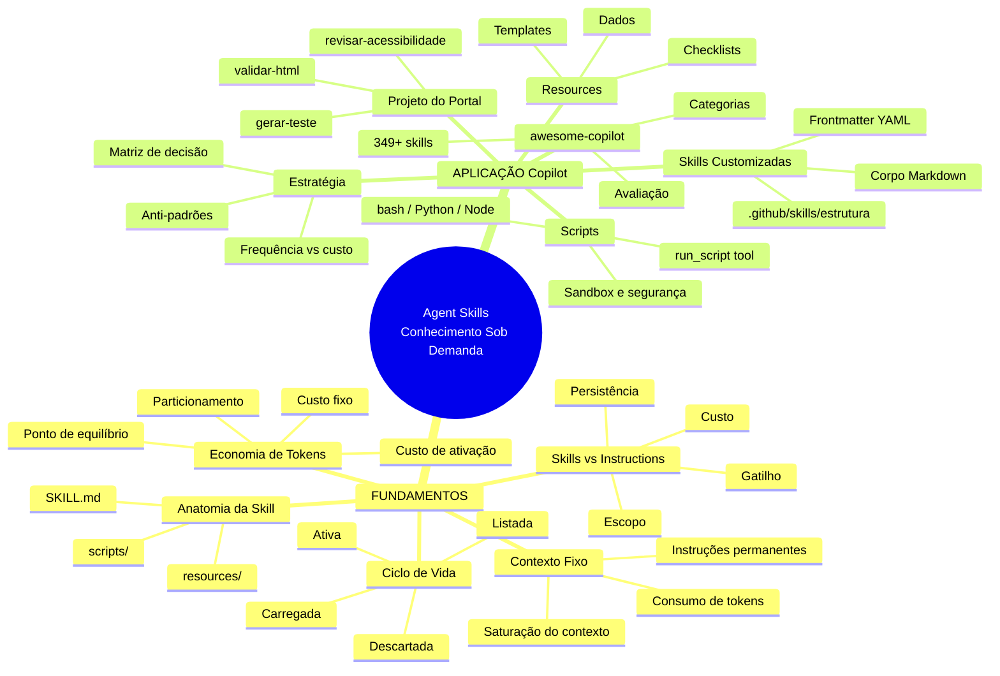
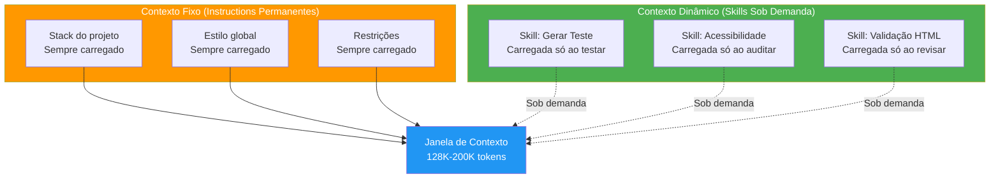
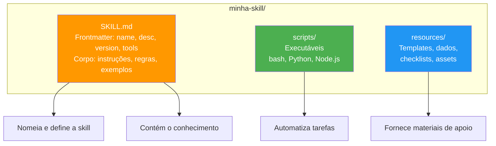
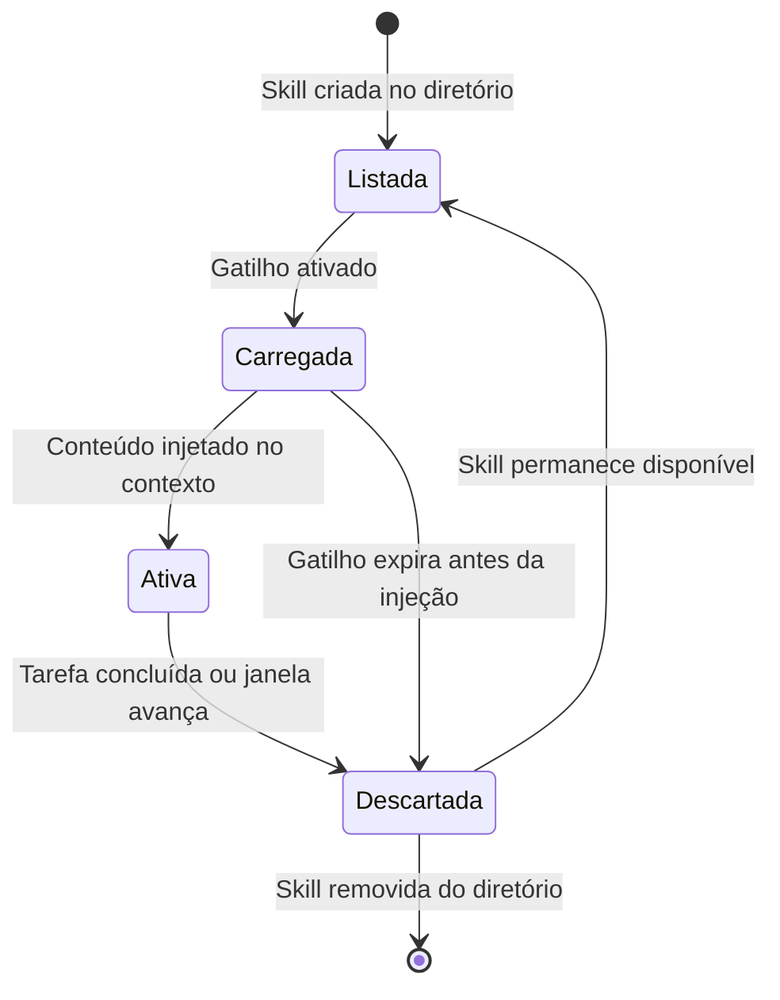
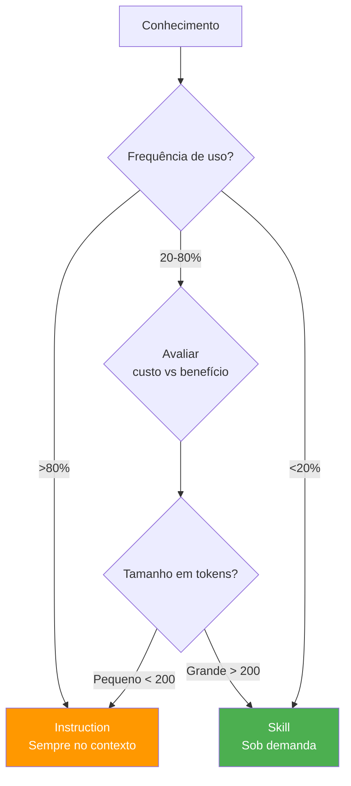
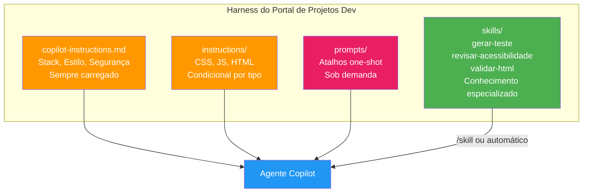

# Harness do GitHub Copilot e Programação Agêntica com VS Code — Aula 07

## Agent Skills — Conhecimento Sob Demanda

**Duração estimada:** 120 minutos (55 de leitura + 65 de prática)
**Nível:** Intermediário-Avançado
**Pré-requisitos:** Aulas 01-06 concluídas. VS Code com GitHub Copilot instalado e autenticado. Git configurado. Node.js instalado. Harness existente com `copilot-instructions.md`, `.github/instructions/` com condicionais, `.github/prompts/` com slash commands customizados, e Portal de Projetos Dev funcional com `index.html`, `styles.css` e `app.js`.

---

## Objetivos de Aprendizagem

Ao final desta aula, você será capaz de:

- [ ] **Distinguir** skills de instructions — explicar a diferença fundamental entre conhecimento injetável sob demanda e regras permanentemente carregadas no contexto
- [ ] **Descrever** a anatomia completa de uma skill: `SKILL.md` com frontmatter YAML, diretório `scripts/` com executáveis, `resources/` com templates e dados
- [ ] **Explicar** o ciclo de vida de uma skill: listada (disponível no sistema) → carregada (ativada por `/skill` ou automaticamente) → ativa (no contexto do agente) → descartada (fora da janela de contexto)
- [ ] **Calcular** a economia de tokens do modelo de carregamento condicional — comparar o custo de instructions permanentes vs skills sob demanda em cenários reais de uso
- [ ] **Criar** uma skill customizada completa: `SKILL.md` com frontmatter válido + scripts executáveis em bash, Python ou Node.js
- [ ] **Incorporar** scripts em skills — entender o que pode ser executado, os limites de segurança e como o agente invoca scripts durante a execução
- [ ] **Empacotar** recursos (templates, dados, configurações) dentro de uma skill usando o diretório `resources/`
- [ ] **Explorar** o ecossistema awesome-copilot — descobrir, avaliar e reutilizar skills do catálogo de 349+ skills comunitárias
- [ ] **Decidir** estrategicamente entre criar uma skill, usar instructions, ou combinar ambos — com base no tipo de conhecimento, frequência de uso e custo de tokens
- [ ] **Construir** três skills customizadas para tarefas recorrentes do Portal de Projetos Dev: `gerar-teste`, `revisar-acessibilidade` e `validar-html` — integrando-as ao harness progressivo

---

## Como Usar Esta Aula

Esta aula está organizada em duas partes. A **primeira parte** constrói os fundamentos de sistemas de conhecimento modular para coding agents — conceitos universais que valem para qualquer ferramenta, independentemente de IDE, provedor ou ecossistema. A **segunda parte** aplica esses conceitos na prática com o GitHub Copilot, criando skills customizadas no seu harness.

Ao longo do caminho, você encontrará seções **"Mão na Massa"** (para fazer, não só ler) e **"Quick Check"** (para verificar se entendeu antes de avançar). Ao final, o arquivo separado **Questões de Aprendizagem** traz as tarefas de checkpoint — só avance para a próxima aula quando conseguir completá-las por conta própria.

**Tempo estimado:** 55 minutos de leitura + 65 minutos de prática.
**Dica:** Tenha o VS Code com o Portal de Projetos Dev aberto durante a segunda parte. Você criará as skills dentro do `.github/skills/` do seu projeto.

---

## Mapa Mental

Este diagrama mostra todos os conceitos que você vai dominar nesta aula:




---

## Recapitulação das Aulas 01 a 06

| Aula | Conceito | Onde aparece nesta aula | Como se conecta |
|---|---|---|---|
| Aula 01 | **Modelo mental de harness** (Seção 7) | PARTE 1 + PARTE 2 — Skills são o quarto pilar do harness | Instructions + tools + contexto + skills = harness completo |
| Aula 02 | **Semente do harness** (Seção 8) | Seção 6 — Skills rodam sobre a mesma base de arquivos | O `.github/` que você criou agora recebe `.github/skills/` |
| Aula 03 | **Instructions permanentes** (Seções 2, 6, 7) | Seções 1-2, 10 — Skills complementam, não substituem | Você decide o que fica como instruction e o que vira skill |
| Aula 04 | **Prompt files** (Seção 5) | Seção 10 — Prompts são one-shot; skills são persistentes | Do atalho descartável para o conhecimento reutilizável |
| Aula 05 | **Agent Mode** (Seção 4) | Seções 4, 7 — Agent Mode invoca skills automaticamente | Skills dão conhecimento especializado ao agente autônomo |
| Aula 06 | **Slash Commands** (Seções 4-6) | Seções 9-10 — `/skill` é um novo comando no seu arsenal | Do comando genérico para o conhecimento especializado |

---

**FUNDAMENTOS: Sistemas de Conhecimento Modular para Agentes**

> *Os conceitos desta parte são universais — valem para qualquer coding agent, independentemente de IDE, provedor ou ecossistema. Você aprenderá por que agentes precisam de conhecimento modular, como skills diferem de instructions fixas, e qual o modelo mental por trás do carregamento condicional de conhecimento. Na segunda parte, você verá como o GitHub Copilot implementa cada um desses mecanismos.*

---

## 1. O Problema do Contexto Fixo

### O dilema de todo sistema de instruções

Você tem, depois da Aula 06, aproximadamente 60 linhas de `copilot-instructions.md` + 3 arquivos condicionais em `.github/instructions/` + 3 prompt files em `.github/prompts/`. Seu harness está robusto — o Copilot sabe o stack do projeto, o estilo de código, as convenções arquiteturais, as restrições de segurança.

Mas você já notou um problema: **quanto mais regras você adiciona, mais lento o agente fica para responder?**

Não é impressão. É física do contexto.

### O contexto do agente é finito

Um coding agent recebe, a cada interação, um pacote de informações que cabe na **janela de contexto** do modelo — tipicamente 128K a 200K tokens (dependendo do modelo). Dentro dessa janela cabem:

- O **system prompt** do agente (5-10K tokens)
- As **instruções permanentes** (seu `copilot-instructions.md` + condicionais ativos)
- As **definições das tools** disponíveis
- O **contexto do workspace** (arquivos abertos, seleção, @mentions)
- O **histórico da conversa**
- O **seu prompt atual**

Cada um desses componentes compete por espaço na janela. Instruções permanentes — mesmo quando irrelevantes para a tarefa atual — **consomem uma fatia fixa desse espaço em TODA interação**.

### O dilema

```
Mais instruções = melhor governança, mas menor espaço para o que importa
Menos instruções = mais espaço, mas agente genérico e imprevisível
```

Este é o dilema central de todo sistema de instruções: você quer regras suficientes para governar o agente, mas não tantas que saturem o contexto a ponto de degradar a performance e a coerência das respostas.

### O problema piora com o tamanho do projeto

Um projeto pequeno (5 arquivos, 2K linhas) cabe quase inteiro na janela de contexto. Instruções de 500 tokens são uma fração pequena. Mas conforme o projeto cresce — 50 arquivos, 50K linhas, múltiplas pastas, configurações, testes — a competição por contexto se intensifica:

- O historico da conversa ocupa mais espaço
- Os @mentions precisam de mais tokens para descrever arquivos
- As tools retornam mais resultados nas buscas
- Você precisa de mais instruções para cobrir mais áreas do projeto

Nesse cenário, instruções permanentes que antes eram "grátis" (porque ocupavam 2% da janela) passam a custar caro (10%, 15%, 20%).

### A solução emergente: conhecimento modular injetável

A resposta ao dilema não é "pare de adicionar instruções" — é **separar o conhecimento que SEMPRE precisa estar lá do conhecimento que só é relevante EM MOMENTOS ESPECÍFICOS**.

Instruções permanentes continuam sendo a base: stack, estilo global, restrições de segurança, comunicação. Mas o conhecimento especializado — "como gerar um teste Jest para este componente", "como auditar acessibilidade segundo WCAG", "como validar HTML semântico" — não precisa estar no contexto o tempo todo. Ele pode ser **carregado sob demanda**.

> *Pense como uma mochila de viagem: você não carrega o guia turístico do Japão no bolso todos os dias — só quando vai ao Japão. O que você carrega sempre são os itens essenciais: documentos, dinheiro, celular. Instruções são os documentos; skills são os guias turísticos.*




### Quick Check 1

**1. Se você tem 200 linhas de instructions mas só 20 são relevantes para a tarefa atual, qual o desperdício aproximado de tokens?**
**Resposta:** Assumindo ~5 tokens por linha (valor médio para Markdown com bullets e código), são 200 × 5 = 1000 tokens carregados, mas apenas 20 × 5 = 100 tokens úteis. O desperdício é de 900 tokens por interação — 90% do espaço ocupado é irrelevante para aquela tarefa.

**2. Por que o problema do contexto fixo piora com projetos maiores e instruções mais detalhadas?**
**Resposta:** Porque dois fatores crescem simultaneamente: (1) o projeto maior significa mais arquivos, mais contexto de workspace, mais hits das tools de busca — tudo compete pela janela; (2) instruções mais detalhadas ocupam mais tokens. A soma dos dois acelera a saturação do contexto, especialmente em projetos com múltiplos domínios (frontend, backend, testes, DevOps) que exigem instruções para cada área.

---

## 2. Skills vs Instructions — A Diferença Fundamental

### Dois paradigmas de conhecimento

Todo sistema de conhecimento para coding agents se divide em dois paradigmas fundamentais. Eles não são concorrentes — são complementares. Cada um resolve um problema diferente.

**Instructions: conhecimento persistente**

Instruções são **regras permanentemente carregadas no contexto do agente**. Elas estão lá em toda interação, desde o início da sessão até o fim. Não importa se você está editando HTML, debugando JavaScript ou revisando CSS — as instruções estão presentes.

Características:
- **Persistência:** sempre ativas, do início ao fim da sessão
- **Custo:** pagam o preço de tokens a cada interação, mesmo quando irrelevantes
- **Escopo:** globais — aplicam-se a todo o projeto
- **Governança:** definem a identidade e as regras fundamentais do projeto

**Skills: conhecimento injetável sob demanda**

Skills são **pacotes de conhecimento que só são carregados quando ativados**. Eles ficam "dormindo" no sistema de arquivos até que um gatilho os acione — o usuário invoca `/skill nome`, o agente detecta relevância, ou o contexto do arquivo ativa o carregamento.

Características:
- **Persistência:** zero — só entram no contexto quando chamadas
- **Custo:** zero quando inativas; custo de ativação (tokens da skill) quando carregadas
- **Escopo:** específico — cada skill cobre um domínio ou procedimento
- **Expertise:** conhecimento especializado, procedimental, tutorial

### A metáfora central

> *Instructions são o **sistema operacional** do agente — está sempre rodando, gerencia os recursos básicos, define as regras do sistema. Skills são os **aplicativos** que você abre quando precisa — o editor de texto, o navegador, a calculadora. O sistema operacional não vem com todos os aplicativos abertos ao mesmo tempo — isso consumiria memória demais.*

### Tabela comparativa: 7 dimensões

| Dimensão | Instructions | Skills |
|---|---|---|
| **Persistência** | Sempre ativas, toda sessão | Zero persistência — carregadas sob demanda |
| **Escopo** | Global (vale para todo o projeto) | Específico (um domínio, uma tarefa) |
| **Gatilho** | Automático (início da sessão) | Explícito (`/skill nome`) ou contexto |
| **Custo de tokens** | Fixo: (tamanho) × (interações) | Variável: zero quando inativa, (tamanho) quando ativa |
| **Granularidade** | Regras, restrições, identidade | Procedimentos, tutoriais, conhecimento especializado |
| **Versionamento** | Único arquivo ou conjunto fixo | Múltiplas skills, cada uma versionada independentemente |
| **Reusabilidade** | Específica do projeto | Portátil entre projetos (se genérica) |

### Quando usar cada um

- **Use instructions para:** stack do projeto, estilo de código global, convenções arquiteturais, restrições de segurança, regras de comunicação — tudo que é "sempre verdade" sobre o projeto
- **Use skills para:** como gerar testes, como auditar acessibilidade, como validar HTML, como configurar deploy, como debuggar memory leaks — conhecimento que é "às vezes verdade"

**Regra prática:** se você usaria uma checklist para fazer aquela tarefa, provavelmente é uma skill. Se você usaria uma placa na parede do escritório, provavelmente é uma instruction.

### Quick Check 2

**1. Qual paradigma você usaria para "regras de nomenclatura de variáveis"? E para "como escrever testes de acessibilidade com axe-core"?**
**Resposta:** "Regras de nomenclatura de variáveis" é **instruction** — é uma regra global do projeto que deve valer em toda interação. "Como escrever testes de acessibilidade com axe-core" é **skill** — é conhecimento especializado que só é relevante quando você está escrevendo testes de acessibilidade.

**2. Por que a metáfora "SO vs aplicativos" é útil mas imperfeita?**
**Resposta:** É útil porque captura a essência da diferença (sempre rodando vs sob demanda). É imperfeita porque, em um sistema operacional, aplicativos consomem recursos mesmo quando minimizados. Skills não consomem NADA quando inativas — é como se o aplicativo só existisse na memória enquanto você o usa e desaparecesse completamente quando fechado.

---

## 3. Anatomia de uma Skill

### A estrutura canônica

Toda skill, independentemente da ferramenta ou ecossistema que a implementa, segue uma estrutura canônica de três componentes:

```
minha-skill/
—S—�—ÆSKILL.md          # Metadados + conhecimento (OBRIGAT–RIO)
—S—�—Æscripts/          # Executáveis (OPCIONAL)
—   —S—�—Æsetup.sh
—   ——�—Ævalidar.py
——�—Æresources/        # Assets estáticos (OPCIONAL)
    —S—�—Ætemplate.js
    ——�—Æchecklist.md
```

Cada componente tem uma responsabilidade clara e separada:

**`SKILL.md`** — O arquivo principal. Contém:
- **Frontmatter YAML:** metadados que o sistema usa para indexar, versionar e ativar a skill (nome, descrição, versão, ferramentas necessárias, modelo recomendado)
- **Corpo Markdown:** o conhecimento em si — instruções, procedimentos, exemplos, regras específicas da skill

**`scripts/`** — Executáveis que o agente pode invocar durante a execução da skill:
- Scripts de geração (criam boilerplate a partir de template)
- Scripts de validação (verificam se o output segue regras)
- Scripts de transformação (convertem formatos, aplicam lint)

**`resources/`** — Assets estáticos que a skill carrega junto:
- Templates de arquivo (ponto de partida para geração)
- Dados de exemplo (fixtures, datasets mock)
- Configurações (checklists, regras, padrões)

### Anatomia detalhada do `SKILL.md`

```markdown
---
name: minha-skill
description: "Faz X coisa específica quando Y condição ocorre"
version: "1.0.0"
tools:
  - read
  - write
  - run_script
model: claude-sonnet-4
---

# Minha Skill

## Propósito

Descrição do que esta skill faz, quando usar e quando não usar.

## Procedimento

Passos detalhados que o agente deve seguir quando esta skill está ativa.

## Regras

Regras específicas do domínio coberto pela skill.

## Exemplos

Exemplos de input e output esperados.
```

### Analogia com npm packages

Se você já usou Node.js, a estrutura de uma skill vai soar familiar:

| Componente da Skill | Equivalente em npm | Propósito |
|---|---|---|
| `SKILL.md` (frontmatter) | `package.json` | Metadados: nome, versão, dependências |
| `scripts/` | `src/` | Código executável |
| `resources/` | `assets/` ou `templates/` | Arquivos estáticos |
| Versionamento semântico | `version` em package.json | `major.minor.patch` |




### Quick Check 3

**1. Qual a diferença entre o que vai no corpo do SKILL.md e o que vai em um script?**
**Resposta:** O corpo do SKILL.md contém conhecimento declarativo e instruções que o agente **lê e interpreta** — procedimentos, regras, exemplos. O script contém código executável que o agente **invoca e executa** — o script faz algo (gera um arquivo, valida um output), enquanto o SKILL.md diz ao agente como e quando usar o script.

**2. Por que o frontmatter YAML é obrigatório — não bastaria um README no lugar?**
**Resposta:** O frontmatter não é "documentação" — é metadado **legível por máquina**. O sistema precisa de `name`, `description`, `version`, `tools` e `model` para indexar a skill, decidir quando ativá-la, saber quais ferramentas liberar e qual modelo usar. Um README é legível por humanos, mas não fornece os dados estruturados que o sistema precisa para gerenciar a skill automaticamente.

---

## 4. Ciclo de Vida de uma Skill

### Os 4 estágios

Toda skill, desde o momento em que é registrada até o momento em que é removida do contexto, atravessa exatamente 4 estágios. Conhecê-los é essencial para entender quando e como uma skill afeta seu agente.

**1. Listada**
A skill existe no sistema de arquivos, em um local reconhecido pelo agente. Ela está **disponível** — o agente sabe que ela existe, mas ela não ocupa contexto nem recursos.

*O que acontece:* o diretório da skill é escaneado na inicialização ou quando o sistema detecta mudanças no diretório de skills. O frontmatter YAML é lido e indexado.

**2. Carregada**
Um gatilho ativa a skill — o conteúdo do `SKILL.md` é lido e preparado para injeção no contexto. A skill ainda não está ativa, mas está pronta para ser injetada.

*Gatilhos possíveis:*
- **Explícito:** o usuário invoca `/skill nome-da-skill` ou equivalente
- **Semântico:** o agente infere que o contexto atual (arquivo aberto, tarefa em andamento) é relevante para a skill
- **Contextual:** o padrão de arquivo ou conversa ativa uma regra de associação

**3. Ativa**
O conteúdo da skill é **injetado no contexto do agente** — o `SKILL.md`, os scripts disponíveis e os resources passam a fazer parte do espaço de trabalho do modelo. O agente pode ler as instruções da skill, invocar scripts e referenciar resources.

*O que muda:*
- O token count da sessão aumenta no tamanho da skill
- As tools declaradas no frontmatter (ex: `run_script`) são liberadas
- O agente "sabe" o que a skill ensina

**4. Descartada**
A skill é removida do contexto. Isso acontece quando:
- A tarefa que ativou a skill é concluída
- A janela de contexto avança (nova conversa, novo turno longo)
- Outra skill é carregada e o sistema precisa liberar espaço
- A sessão termina

*O que acontece:*
- O conteúdo da skill deixa de ocupar tokens no contexto
- Scripts e resources não estão mais acessíveis
- O agente "esquece" o conhecimento especializado




### Analogia com `import` em Python

Quando você programa em Python e escreve `import json`, o módulo `json` só carrega na memória naquele momento. Antes do `import`, o módulo existe no disco (listado) mas não ocupa RAM. Depois do `import`, ele está disponível (ativo). Quando a função termina, o módulo permanece em memória até o fim do script (diferente de uma skill, que é descartada).

Uma analogia melhor é com **context managers**:

```python
with open("skill.md") as skill:  # Carregada
    conteudo = skill.read()       # Ativa
# Aqui o arquivo foi fechado    # Descartada
```

A skill só "existe" dentro do bloco onde foi carregada. Fora dele, zero overhead.

### Quick Check 4

**1. O que acontece com os scripts de uma skill quando ela é descartada?**
**Resposta:** Os scripts deixam de estar acessíveis. Se a skill for carregada novamente em outra interação, os scripts são re-indexados a partir do estado atual do sistema de arquivos — qualquer modificação feita no diretório desde o último descarte será refletida.

**2. Qual a diferença entre o agente "inferir" que uma skill é relevante e o usuário invocá-la explicitamente?**
**Resposta:** Na invocação explícita, o usuário tem controle total — decide quando e qual skill ativar. Na inferência, o agente toma a decisão com base no contexto, o que pode levar a falsos positivos (ativar uma skill irrelevante) ou falsos negativos (não ativar uma skill necessária). A inferência é conveniente; a invocação explícita é precisa.

---

## 5. Economia de Tokens — O Modelo de Carregamento Condicional

### O custo do conhecimento no contexto

Agora que você entende o que são skills e como vivem, vamos quantificar o problema. A economia de tokens não é teoria abstrata — é o que determina se seu agente responde em 2 segundos ou em 20.

**O custo das instructions permanentes:**

```
Custo_fixo = tamanho_das_instructions × numero_de_interacoes
```

Cada instruction, por menor que seja, é paga em todas as interações. Uma instruction de 300 tokens em 100 interações/dia = 30.000 tokens/dia consumidos. Repetidos todo dia.

**O custo das skills sob demanda:**

```
Custo_skill = (tamanho_da_skill × frequencia_de_ativacao) + (overhead_de_injecao × ativacoes)
```

A skill custa zero quando inativa. Quando ativada, paga seu tamanho + um pequeno overhead de injeção (tipicamente 5-10% do tamanho).

### Tabela comparativa: 3 cenários

Vamos comparar instructions vs skills em três cenários de frequência de uso. Assuma:
- Instruction: 500 tokens
- Skill equivalente: 600 tokens (um pouco maior por incluir exemplos e procedimentos)
- Overhead de injeção da skill: 50 tokens (10%)

| Cenário | Frequência | Custo Instruction (30 dias) | Custo Skill (30 dias) | Economia |
|---|---|---|---|---|
| **Alta frequência** | 80% das interações (80/dia) | 500 × 80 × 30 = 1.200.000 | (600+50) × 80 × 30 = 1.560.000 | **Skill é 30% MAIS CARA** |
| **Média frequência** | 20% das interações (20/dia) | 500 × 20 × 30 = 300.000 | (600+50) × 20 × 30 = 390.000 | **Skill é 30% MAIS CARA** |
| **Baixa frequência** | 5% das interações (5/dia) | 500 × 5 × 30 = 75.000 | (600+50) × 5 × 30 = 97.500 | **Skill é 30% MAIS CARA** |

Espere — a skill parece sempre mais cara? Isso porque o exemplo acima está incompleto. O cálculo real não é "instruction vs skill para o mesmo conhecimento". É **instruction vs (instruction SEM aquela regra + skill com aquela regra)** .

O verdadeiro cálculo: quando você move conhecimento das instructions para uma skill, as instructions **diminuem de tamanho**. Você não adiciona 600 tokens ao total — você troca 500 tokens fixos por 0 tokens (quando a skill está inativa) + 650 tokens (quando está ativa).

**Cálculo corrigido:**

| Cenário | Instruções originais | Instruções sem regra | Skill quando ativa | Custo total (30 dias) |
|---|---|---|---|---|
| Alta freq (80%) | 500K × 2400 = 1.200.000 | 0 | 650 × 2400 = 1.560.000 | 1.560.000 (pior) |
| Média freq (20%) | 500K × 600 = 300.000 | 0 | 650 × 600 = 390.000 | 390.000 (pior) |
| Baixa freq (5%) | 500K × 150 = 75.000 | 0 | 650 × 150 = 97.500 | 97.500 (pior) |

Ainda parece que instruction sempre ganha? Isso porque o cálculo acima ignora o **custo de oportunidade** — o espaço no contexto que as instructions ocupam e que poderia ser usado para:

- Mais histórico de conversa (melhor coerência)
- Arquivos maiores no contexto (melhor análise)
- Respostas mais longas do modelo (melhor qualidade)

E também ignora o **efeito de escala**: quando você move MÚLTIPLAS regras de baixa frequência para skills, a economia se acumula.

### Cenário realista

Suponha seu harness com:
- Instructions base: 700 tokens (stack, estilo, segurança, comunicação)
- Regra de testes: 300 tokens (5% das interações)
- Regra de acessibilidade: 400 tokens (3% das interações)
- Regra de validação HTML: 350 tokens (4% das interações)
- Regra de deploy: 500 tokens (2% das interações)

**Cenário A — Tudo como instruction (antes):**
- Instructions: 700 + 300 + 400 + 350 + 500 = 2.250 tokens fixos por interação
- Custo diário (100 interações): 225.000 tokens
- Custo mensal: 6.750.000 tokens

**Cenário B — Regras de baixa frequência como skills (depois):**
- Instructions: 700 tokens fixos
- Skills: 0 tokens quando inativas
- Custo diário das skills (ativadas nas % correspondentes):
  - Testes (5%): 5 × (300+30) = 1.650
  - Acessibilidade (3%): 3 × (400+40) = 1.320
  - Validação HTML (4%): 4 × (350+35) = 1.540
  - Deploy (2%): 2 × (500+50) = 1.100
  - Skills total/dia: 5.610
- Custo base (700 × 100): 70.000
- Custo diário total: 75.610 tokens
- Custo mensal: 2.268.300 tokens

**Economia: 6.750.000 - 2.268.300 = 4.481.700 tokens/mês (66% de redução)**

### Estratégia de particionamento

Com base nos cálculos, uma estratégia prática emerge:

| Frequência de uso | Onde colocar | Exemplo |
|---|---|---|
| >80% das interações | Instructions | Stack, estilo, segurança |
| 20-80% | Avaliar caso a caso | Convenções arquiteturais complexas |
| <20% | Skill | Testes, acessibilidade, deploy, validação |

**Regra prática:** se o conhecimento é usado em menos de 1 a cada 5 interações, é candidato a skill. Se é usado em mais de 4 a cada 5 interações, é instruction.




### Quick Check 5

**1. Se uma instruction de 500 tokens é usada em 100 interações/dia e uma skill equivalente de 600 tokens é usada em 10 interações/dia, qual a economia diária da skill?**
**Resposta:** Instruction: 500 × 100 = 50.000 tokens/dia. Skill: 0 tokens (quando inativa, 90 interações) + 650 × 10 = 6.500 tokens (quando ativa, 10 interações). Skill: 6.500 tokens/dia. Economia: 50.000 - 6.500 = 43.500 tokens/dia (87% de redução).

**2. Por que o overhead de injeção importa mesmo para skills pequenas?**
**Resposta:** O overhead (5-10%) é o custo de preparar e injetar o conteúdo no contexto — não é opcional. Para uma skill de 100 tokens, 10 tokens de overhead são 10% a mais. Para uma skill de 2000 tokens, 200 tokens de overhead são significativos. Em cenários de altíssima frequência, o overhead pode fazer a skill ser mais cara que a instruction equivalente.

---

**APLICAÇÃO: Agent Skills no GitHub Copilot**

> *Agora que você entende os mecanismos universais de conhecimento modular — o problema do contexto fixo (Seção 1), a diferença entre skills e instructions (Seção 2), a anatomia de uma skill (Seção 3), o ciclo de vida (Seção 4) e a economia de tokens (Seção 5) — vamos conectá-los à prática com o GitHub Copilot. Você vai criar skills customizadas no seu harness, explorar o ecossistema awesome-copilot, e — como peça central do projeto — construir três skills para tarefas recorrentes do Portal de Projetos Dev.*

---

## 6. Criando Skills Customizadas no Copilot

### A estrutura no Copilot

O GitHub Copilot segue exatamente a estrutura canônica que você estudou na Seção 3, com uma localização específica:

```
.github/skills/<nome-da-skill>/
—S—�—ÆSKILL.md
—S—�—Æscripts/
——�—Æresources/
```

O diretório `.github/skills/` é onde o Copilot procura por skills. Cada subdiretório é uma skill. O nome do diretório (em kebab-case) é o identificador da skill.

### Frontmatter específico do Copilot

O frontmatter YAML do Copilot tem campos obrigatórios e opcionais:

```yaml
---
name: gerar-teste
description: "Gera boilerplate de teste Jest para componentes do portal"
version: "1.0.0"
tools:
  - read
  - write
  - run_script
model: claude-sonnet-4
---
```

| Campo | Obrigatório? | Propósito |
|---|---|---|
| `name` | Sim | Identificador único da skill (kebab-case) |
| `description` | Sim | Resumo do que a skill faz (aparece na listagem) |
| `version` | Sim | Versionamento semântico (major.minor.patch) |
| `tools` | Não | Lista de ferramentas que a skill pode usar (read, write, run_script, etc.) |
| `model` | Não | Modelo recomendado para executar esta skill |

### Corpo Markdown da skill

O corpo do `SKILL.md` contém as instruções que o agente segue quando a skill está ativa. Diferente das instructions, que são regras, o corpo de uma skill é **conhecimento procedimental** — passos, exemplos, contexto especializado.

```markdown
# Skill: Gerar Teste Jest

## Propósito

Gera boilerplate de teste Jest para componentes do Portal de Projetos Dev.
Use quando precisar criar testes para cards, filtros ou outros componentes.

## Quando usar

- Após criar um novo módulo JavaScript em `js/`
- Antes de fazer merge de uma branch com novo componente
- Quando o coverage atual está abaixo de 80%

## Procedimento

1. Leia o arquivo do componente para entender sua estrutura
2. Identifique os exports e funções públicas
3. Crie o arquivo `.test.js` correspondente
4. Use o template em `resources/template-teste-jest.js` como base
5. Invoke `scripts/gerar-boilerplate.js` com o nome do componente

## Regras

- Cada `describe` deve corresponder a um componente
- Cada `it` deve testar um comportamento específico
- Testes de renderização: smoke test + props + edge cases
- Mock de `localStorage` quando o componente persiste dados
```

### Boas práticas

1. **Nomenclatura kebab-case**: `gerar-teste`, `revisar-acessibilidade`, `validar-html`
2. **Versionamento semântico**: comece com `1.0.0`, incremente `major` quando mudar comportamento, `minor` quando adicionar funcionalidade, `patch` para correções
3. **Documentação interna**: o corpo do `SKILL.md` deve ser auto-contido — um desenvolvedor (ou outro agente) deve entender o propósito e uso da skill sem precisar de contexto externo
4. **Campo `tools`** restrinja ao mínimo necessário: `tools: [read]` se a skill só precisa ler arquivos, adicione `write` e `run_script` apenas quando necessário

### Mão na Massa — Crie sua primeira skill

- [ ] Crie a estrutura de diretórios:

```bash
mkdir -p .github/skills/gerar-teste/scripts
mkdir -p .github/skills/gerar-teste/resources
```

- [ ] Crie `.github/skills/gerar-teste/SKILL.md` com o frontmatter e corpo mostrados acima
- [ ] Verifique o arquivo:

```bash
cat .github/skills/gerar-teste/SKILL.md
```

**Verificação:** O diretório `.github/skills/` existe com a subpasta `gerar-teste/` contendo `SKILL.md`. O frontmatter tem `name`, `description`, `version`, `tools` e `model` preenchidos.

### Quick Check 6

**1. Por que o campo `tools` no frontmatter é importante?**
**Resposta:** O campo `tools` restringe as ferramentas que o agente pode usar quando a skill está ativa. Uma skill com `tools: [read]` só pode ler arquivos — não pode modificar nada. Isso é uma camada de segurança: mesmo que o SKILL.md instrua o agente a editar algo, as tools não permitem. Skills sem campo `tools` herdam as ferramentas padrão do agente.

**2. Qual a diferença entre uma skill com `tools: [read, write]` e uma com `tools: [read]`?**
**Resposta:** A primeira pode ler E modificar arquivos — ideal para skills de geração de código ou refatoração. A segunda só pode ler — ideal para skills de auditoria, revisão ou consulta. A escolha entre elas depende do propósito: uma skill de "revisar acessibilidade" provavelmente só precisa ler; uma skill de "gerar teste" precisa escrever o arquivo de teste.

---

## 7. Scripts em Skills — Execução Automatizada

### O que pode ser executado

Skills podem conter scripts executáveis que o agente invoca durante a execução. Os formatos suportados são:

| Linguagem | Extensão | Quando usar |
|---|---|---|
| **bash** | `.sh` | Operações de sistema, manipulação de arquivos, pipelines |
| **Python** | `.py` | Análise de dados, validação complexa, automação com bibliotecas |
| **Node.js** | `.js`, `.mjs` | Geração de código, manipulação de JSON, integração com o projeto |

### Como o agente invoca um script

Quando a skill está ativa e o agente decide que precisa executar um script, ele usa a tool interna `run_script`. O fluxo é:

1. O agente identifica qual script executar (baseado no SKILL.md ou decisão própria)
2. O agente invoca `run_script` com o caminho do script e argumentos
3. O sistema executa o script em ambiente controlado
4. O output (stdout/stderr) retorna ao agente
5. O agente processa o resultado e decide o próximo passo

### Limites de segurança

Scripts em skills operam sob restrições de segurança projetadas para evitar danos acidentais:

- **Sandbox**: o script não tem acesso à rede externa por padrão
- **Timeout**: execução limitada a um período (tipicamente 30-60 segundos)
- **Filesystem**: acesso apenas ao workspace do projeto (não a arquivos do sistema)
- **Sem interatividade**: o script não pode pedir input do usuário durante a execução

### Padrões comuns de scripts

**1. Script de geração** — cria um arquivo a partir de parâmetros

```javascript
// scripts/gerar-boilerplate.js
// Uso: node scripts/gerar-boilerplate.js NomeDoComponente
const fs = require('fs');
const nome = process.argv[2];

if (!nome) {
  console.error('Uso: node gerar-boilerplate.js NomeDoComponente');
  process.exit(1);
}

const template = `import { ${nome} } from './${nome}';

describe('${nome}', () => {
  beforeEach(() => {
    // Setup comum aqui
  });

  it('deve renderizar sem erros', () => {
    // Smoke test
    expect(() => ${nome}()).not.toThrow();
  });

  it('deve aceitar props corretamente', () => {
    // Teste de props
  });

  it('deve lidar com edge cases', () => {
    // Casos limite
  });
});
`;

const filename = `${nome}.test.js`;
fs.writeFileSync(filename, template);
console.log(`Arquivo de teste criado: ${filename}`);
```

**2. Script de validação** — verifica se algo segue regras

```bash
#!/bin/bash
# scripts/validar-estrutura.sh
# Verifica se os diretórios obrigatórios existem

ERRORS=0

for dir in "js" "css" "assets"; do
  if [ ! -d "$dir" ]; then
    echo "ERRO: Diretório '$dir' não encontrado"
    ERRORS=$((ERRORS + 1))
  fi
done

if [ $ERRORS -eq 0 ]; then
  echo "OK: Estrutura de diretórios válida"
else
  echo "Falha: $ERRORS erro(s) encontrado(s)"
  exit 1
fi
```

**3. Script de transformação** — converte formatos

```python
#!/usr/bin/env python3
# scripts/extrair-cores.py
# Extrai cores definidas em CSS para análise

import re
import sys
from collections import Counter

if len(sys.argv) < 2:
    print("Uso: python extrair-cores.py arquivo.css")
    sys.exit(1)

with open(sys.argv[1]) as f:
    css = f.read()

cores = re.findall(r'#[0-9a-fA-F]{3,8}|rgba?\([^)]+\)|hsla?\([^)]+\)', css)

print(f"Total de cores encontradas: {len(cores)}")
for cor, count in Counter(cores).most_common(10):
    print(f"  {cor}: {count}x")
```

### Mão na Massa — Adicione um script à skill

- [ ] Crie o arquivo `.github/skills/gerar-teste/scripts/gerar-boilerplate.js` com o conteúdo do script de geração mostrado acima
- [ ] Torne-o executável:

```bash
chmod +x .github/skills/gerar-teste/scripts/gerar-boilerplate.js
```

- [ ] Teste o script manualmente:

```bash
node .github/skills/gerar-teste/scripts/gerar-boilerplate.js ProjectCard
```

**Verificação:** O comando deve criar um arquivo `ProjectCard.test.js` na pasta atual com o boilerplate de teste. Delete o arquivo após verificar.

### Quick Check 7

**1. Por que scripts em skills têm sandbox restrito por padrão?**
**Resposta:** Segurança. Um script malicioso ou com bug poderia deletar arquivos, enviar dados para servidores externos ou comprometer o sistema. O sandbox limita o script ao workspace atual, bloqueia rede externa e impõe timeout — contendo danos potenciais. Mesmo skills que você cria podem ter bugs inesperados.

**2. Como o agente decide se deve usar o conhecimento do SKILL.md ou invocar um script?**
**Resposta:** O SKILL.md instrui o agente sobre QUANDO usar o script. Uma skill bem escrita inclui no corpo algo como "Use o script `scripts/gerar-boilerplate.js` para criar o boilerplate. Se o script falhar, siga o template manualmente a partir do `resources/template-teste-jest.js`." A decisão é do agente baseada nas instruções — scripts são para automação; SKILL.md é para conhecimento.

---

## 8. Resources — Templates e Dados Embutidos

### O diretório `resources/`

O diretório `resources/` contém arquivos estáticos que a skill carrega junto. Eles não são executados como scripts — são **lidos** pelo agente ou usados como template para geração.

Tipos comuns de resources:

- **Templates:** arquivos de ponto de partida para geração de código
- **Dados:** exemplos, fixtures, datasets de referência
- **Configurações:** regras, checklists, padrões de qualidade
- **Assets:** imagens, diagramas referenciados pela skill

### Como referenciar resources

Dentro do `SKILL.md`, o agente referencia resources por caminho relativo à raiz da skill:

```markdown
## Procedimento

1. Carregue o template de teste em `resources/template-teste-jest.js`
2. Substitua os placeholders {{NOME}} e {{FUNCOES}} pelos valores do componente
3. Salve como `<Nome>.test.js` no diretório `js/tests/`
```

### Padrão template + substituição

Este é o padrão mais comum: o `SKILL.md` instrui o agente a ler um template, substituir placeholders e gerar um arquivo final.

**Template:** `resources/template-teste-jest.js`

```javascript
/**
 * Testes para {{NOME}} — Portal de Projetos Dev
 * Gerado automaticamente pela skill gerar-teste
 */

import { {{NOME}} } from '../{{CAMINHO}}';

describe('{{NOME}}', () => {
  let fixture;

  beforeEach(() => {
    fixture = {{CRIAR_FIXTURE}};
  });

  it('deve renderizar sem erros', () => {
    expect(() => {{NOME}}(fixture)).not.toThrow();
  });

  it('deve aceitar parâmetros obrigatórios', () => {
    const resultado = {{NOME}}(fixture);
    {{VALIDAR_OBRIGATORIOS}}
  });

  it('deve lidar com valores vazios', () => {
    const resultado = {{NOME}}({});
    {{VALIDAR_VAZIO}}
  });

  it('deve lidar com valores extremos', () => {
    const resultado = {{NOME}}(fixture);
    {{VALIDAR_EXTREMOS}}
  });
});
```

**Resource de apoio:** `resources/wcag-checklist.md`

```markdown
# Checklist WCAG 2.1 AA — Portal de Projetos Dev

## Perceivable (Perceptível)

- [ ] Todas as imagens têm `alt` descritivo
- [ ] Vídeos têm legendas ou transcrições
- [ ] Conteúdo apresentado em mais de uma modalidade (texto + cor)

## Operable (Operável)

- [ ] Navegação por teclado em todos os elementos interativos
- [ ] Foco visível em todos os elementos
- [ ] Sem conteúdo piscante > 3Hz

## Understandable (Compreensível)

- [ ] Idioma definido no `<html lang="pt-BR">`
- [ ] Rótulos associados a campos de formulário
- [ ] Mensagens de erro claras e descritivas

## Robust (Robusto)

- [ ] HTML semântico com landmarks (`<header>`, `<main>`, `<nav>`)
- [ ] Atributos ARIA usados corretamente
```

### Mão na Massa — Crie resources para as skills

- [ ] Crie `.github/skills/gerar-teste/resources/template-teste-jest.js` com o template mostrado acima
- [ ] Crie `.github/skills/revisar-acessibilidade/resources/wcag-checklist.md` com o checklist WCAG mostrado acima
- [ ] Verifique a estrutura:

```bash
ls -la .github/skills/gerar-teste/resources/
ls -la .github/skills/revisar-acessibilidade/resources/
```

**Verificação:** Cada diretório `resources/` contém pelo menos um arquivo. O template tem placeholders `{{NOME}}`, `{{CAMINHO}}`, etc. O checklist tem seções WCAG organizadas pelos 4 princípios (Perceivable, Operable, Understandable, Robust).

### Quick Check 8

**1. Qual a vantagem de ter templates em `resources/` em vez de embuti-los no corpo do SKILL.md?**
**Resposta:** (1) Separação de responsabilidades: o SKILL.md contém instruções/comportamento; resources contêm dados/templates. (2) Reusabilidade: o mesmo template pode ser referenciado por múltiplas skills. (3) Manutenção: atualizar o template não exige modificar o SKILL.md. (4) Tamanho: um template longo não polui o frontmatter ou as instruções da skill.

**2. Como resources interagem com scripts durante a execução?**
**Resposta:** Um padrão comum é: (1) o script lê um resource como template, (2) processa os placeholders com dados do contexto, (3) gera o arquivo final. O resource fornece a estrutura base; o script automatiza a substituição. Por exemplo, `gerar-boilerplate.js` lê `resources/template-teste-jest.js`, substitui `{{NOME}}` pelo nome do componente, e escreve o arquivo `.test.js`.

---

## 9. awesome-copilot — O Ecossistema de Skills

### O repositório

O repositório [awesome-copilot](https://github.com/github/awesome-copilot) é o catálogo oficial da comunidade GitHub Copilot. Ele reúne skills criadas e curadas pela comunidade — mais de 349 (e crescendo) no momento desta aula.

Cada skill no catálogo é um link para um repositório GitHub que contém uma skill seguindo a estrutura canônica (`SKILL.md` + opcionais scripts/ e resources/).

### Categorias principais

O catálogo organiza skills por categorias. As principais são:

| Categoria | Tipos de skill | Exemplos |
|---|---|---|
| **Frontend** | React, Vue, CSS, acessibilidade | "Gerar componente React com TS" |
| **Backend** | Node.js, Python, APIs, databases | "Criar endpoint REST com validação" |
| **DevOps** | CI/CD, Docker, Terraform, deploy | "Gerar Dockerfile multi-stage" |
| **Dados** | SQL, pandas, visualização | "Escrever query SQL otimizada" |
| **Segurança** | OWASP, auditoria, SAST | "Auditar dependências vulneráveis" |
| **Documentação** | README, JSDoc, API docs | "Gerar documentação OpenAPI" |
| **Testes** | Jest, Vitest, Playwright, Cypress | "Criar teste E2E de login" |

### Como descobrir skills relevantes

1. **Navegue por categoria** — o README do awesome-copilot agrupa skills por categoria. Se você precisa de uma skill de acessibilidade, vá direto para a seção de Frontend.
2. **Busque por palavra-chave** — use a busca do GitHub no repositório: `site:github.com/github/awesome-copilot acessibilidade` ou `site:github.com/github/awesome-copilot jest`.
3. **Verifique a data de atualização** — skills abandonadas há mais de 6 meses podem estar desatualizadas em relação ao comportamento atual do Copilot.

### Como avaliar uma skill antes de usar

Nem toda skill no catálogo é boa. Antes de adicioná-la ao seu harness, avalie:

1. **Qualidade do SKILL.md**: o frontmatter está completo (name, description, version)? As instruções são claras e específicas?
2. **Data de atualização**: foi modificada nos últimos 6 meses? Skills do início de 2025 podem não funcionar com as versões mais recentes do Copilot.
3. **Comunidade**: tem estrelas? Issues abertas? Pull requests? Uma skill com 0 estrelas e 0 forks não significa que é ruim — pode ser nova ou de nicho — mas uma com 50+ estrelas passou pelo escrutínio de outros desenvolvedores.
4. **Segurança**: os scripts são auditáveis? Fazem chamadas externas? Skills que executam scripts de download ou instalação merecem atenção redobrada.
5. **Tamanho**: skills muito pequenas (< 10 linhas de SKILL.md) podem ser genéricas demais. Skills muito grandes (> 500 linhas) podem ser complexas demais para manter.

### Mão na Massa — Explore o awesome-copilot

- [ ] Acesse [github.com/github/awesome-copilot](https://github.com/github/awesome-copilot) no seu navegador
- [ ] Navegue pela seção "Frontend" (ou "Frontend Development") — encontre pelo menos 2 skills relacionadas a acessibilidade ou HTML semântico
- [ ] Para cada skill escolhida, avalie:
  - Qualidade do SKILL.md
  - Data da última atualização
  - Número de estrelas/forks
  - Segurança dos scripts (se houver)
- [ ] Documente sua seleção em uma anotação rápida (arquivo opcional, mental ou físico)
- [ ] Se encontrar uma skill que pareça diretamente útil para o Portal de Projetos Dev, considere adaptá-la no lugar de criar do zero

**Verificação:** Você identificou pelo menos 2 skills do catálogo e consegue explicar por que cada uma seria (ou não) útil para o seu projeto.

### Quick Check 9

**1. Por que a data da última modificação é um critério importante para escolher uma skill?**
**Resposta:** O ecossistema do Copilot evolui rapidamente — novas ferramentas, mudanças no formato do SKILL.md, novos campos de frontmatter. Uma skill não atualizada há mais de um ano pode usar campos obsoletos, instruções que não funcionam mais, ou scripts que quebram com versões atuais do Node.js/Python. Prefira skills atualizadas nos últimos 6 meses.

**2. Se você encontra duas skills que fazem a mesma coisa, como decide qual usar?**
**Resposta:** Avalie em ordem: (1) qualidade do SKILL.md — qual tem instruções mais claras e específicas? (2) Atualização — qual é mais recente? (3) Comunidade — qual tem mais estrelas e contribuidores? (4) Segurança — qual tem scripts mais transparentes? (5) Tamanho — qual tem o escopo mais adequado (nem muito genérica, nem muito complexa)? Se ainda assim empatar, escolha a que você entende melhor — uma skill que você não entende é uma caixa-preta no seu harness.

---

## 10. Estratégia — Skills vs Instructions vs Prompts

### Os 3 mecanismos de conhecimento no Copilot

Seu harness tem três mecanismos para transmitir conhecimento ao agente:

| Mecanismo | Persistência | Custo | Quando usar |
|---|---|---|---|
| **Instructions** | Sempre carregado | Fixo por interação | Stack, estilo, segurança, regras globais |
| **Skills** | Sob demanda | Zero quando inativo | Conhecimento especializado, procedimentos |
| **Prompts** | One-shot (digita e esquece) | Apenas naquela interação | Interações pontuais, experimentação |

### Matriz de decisão com 3 fatores

Para decidir onde colocar cada conhecimento, use esta matriz:

| Frequência | Especificidade | Custo de tokens | Recomendação |
|---|---|---|---|
| Alta (>80%) | Genérico | Baixo | **Instruction** |
| Alta (>80%) | Específico | Médio | **Instruction** (ou skill se for muito grande) |
| Média (20-80%) | Genérico | Médio | **Skill** (simples) |
| Média (20-80%) | Específico | Alto | **Skill** (bem documentada) |
| Baixa (<20%) | Genérico | Baixo | **Skill** (ou prompt) |
| Baixa (<20%) | Específico | Alto | **Skill** (ideal) |
| One-shot | Qualquer | Qualquer | **Prompt** (não persista) |

**Regra prática:**

- Instructions = conhecimento que você quer que o agente SIGA SEMPRE
- Skills = conhecimento que você quer que o agente SAIBA QUANDO PRECISAR
- Prompts = conhecimento que você DESCREVE NA HORA

### Anti-padrões

**1. Skill que deveria ser instruction**
Conhecimento usado em 90%+ das interações, mas colocado em skill. O desenvolvedor precisa invocar `/skill` toda hora. Frustrante e ineficiente.
*Correção:* se você perceber que invoca a mesma skill em quase toda interação, mova o conhecimento para instructions.

**2. Instruction que deveria ser skill**
Conhecimento especializado de 400 tokens usado em 2% das interações, mas colocado em instructions. Ocupa espaço no contexto em 98% das interações em que é irrelevante.
*Correção:* se você percebe que uma instruction raramente é relevante para a tarefa atual, mova para skill.

**3. Prompt que deveria ser skill**
Procedimento repetido manualmente no chat toda vez. Por exemplo, você sempre digita "verifique se este HTML segue as boas práticas de acessibilidade" quando vai revisar um arquivo.
*Correção:* crie uma skill com esse conhecimento. Um comando `/skill` substitui 3 parágrafos de prompt.

**4. Skill duplicada no awesome-copilot**
Você cria uma skill do zero sem verificar se já existe no catálogo. Alguém já fez, testou e refinou.
*Correção:* antes de criar, busque no awesome-copilot. Adapte se necessário, mas não reinvente.

### Mão na Massa — Aplique a matriz ao seu harness

- [ ] Liste os conhecimentos que estão atualmente como instructions no seu harness
- [ ] Para cada um, aplique a matriz de decisão:
  - Qual a frequência de uso?
  - Qual a especificidade?
  - Qual o custo de tokens?
- [ ] Identifique pelo menos 1 instruction candidata a virar skill
- [ ] Identifique pelo menos 1 skill (das que você criará) que poderia virar instruction se o uso aumentar
- [ ] Anote suas decisões — elas guiarão a Seção 11

**Verificação:** Você tem uma lista com pelo menos 3 conhecimentos classificados segundo a matriz de decisão, com justificativa para cada classificação.

### Quick Check 10

**1. Você tem um guia de "como debugar memory leaks em Node.js" com 400 tokens. O time encontra memory leaks ~2x por sprint. É skill ou instruction?**
**Resposta:** **Skill.** Frequência de uso é muito baixa (~2 vezes a cada 2 semanas = ~10% das interações). O conhecimento é específico (debug de memory leaks, não é uma regra global). Como skill, ocupa zero contexto 90% do tempo. Como instruction, pagaria 400 tokens fixos em todas as interações — desperdício.

**2. Qual o risco de transformar instructions existentes em skills sem testar?**
**Resposta:** Se uma instruction que estava SEMPRE ativa for movida para uma skill, o agente pode se comportar de forma inesperada nas interações em que a skill NÃO está ativa. Por exemplo, se você move "use CSS Grid para layouts" para uma skill e esquece de ativá-la, o Copilot pode gerar Flexbox em arquivos CSS sem aviso. Sempre teste: ative a skill, verifique o comportamento, desative e verifique se o comportamento volta ao anterior.

---

## 11. Projeto — Skills para o Portal de Projetos Dev

### A peça do projeto progressivo

Chegou o momento de integrar tudo que você aprendeu nesta aula. Você vai construir **três skills customizadas** para o Portal de Projetos Dev, cada uma resolvendo um problema específico do seu harness.

### Skill 1: `gerar-teste`

**Propósito:** Gerar boilerplate de teste Jest para componentes do portal.

**Estrutura final:**
```
.github/skills/gerar-teste/
—S—�—ÆSKILL.md
—S—�—Æscripts/
—   ——�—Ægerar-boilerplate.js
——�—Æresources/
    ——�—Ætemplate-teste-jest.js
```

**Conteúdo do `SKILL.md`:**

```markdown
---
name: gerar-teste
description: "Gera boilerplate de teste Jest para componentes do Portal de Projetos Dev"
version: "1.0.0"
tools:
  - read
  - write
  - run_script
model: claude-sonnet-4
---

# Skill: Gerar Teste Jest

## Propósito

Gera automaticamente arquivos de teste Jest para componentes do Portal.
Use após criar ou modificar um módulo JavaScript em `js/`.

## Procedimento

1. Identifique o componente a ser testado (pelo nome ou arquivo selecionado)
2. Leia o arquivo do componente para entender exports e funções públicas
3. Execute o script de geração: `node scripts/gerar-boilerplate.js NomeDoComponente`
4. Se o script falhar, use o template manualmente:
   - Copie `resources/template-teste-jest.js`
   - Substitua os placeholders {{NOME}}, {{CAMINHO}}, etc.
   - Salve como `NomeDoComponente.test.js`

## Regras de teste

- Cada `describe` corresponde a um componente/função
- Cada `it` testa UM comportamento específico
- Cubra: smoke test, parâmetros obrigatórios, valores vazios, edge cases
- Mock de `localStorage` quando o componente usar persistência
- NÃO testar funções internas/privadas — teste a interface pública
```

**Script:** `scripts/gerar-boilerplate.js` (criado na Seção 7)
**Template:** `resources/template-teste-jest.js` (criado na Seção 8)

### Skill 2: `revisar-acessibilidade`

**Propósito:** Auditar HTML e CSS do portal contra critérios WCAG 2.1 AA.

**Estrutura final:**
```
.github/skills/revisar-acessibilidade/
—S—�—ÆSKILL.md
—S—�—Æscripts/
—   ——�—Ævalidar-contraste.js
——�—Æresources/
    ——�—Æwcag-checklist.md
```

**Conteúdo do `SKILL.md`:**

```markdown
---
name: revisar-acessibilidade
description: "Audita HTML/CSS do portal contra critérios WCAG 2.1 AA"
version: "1.0.0"
tools:
  - read
  - run_script
model: claude-sonnet-4
---

# Skill: Revisar Acessibilidade

## Propósito

Auditar o Portal de Projetos Dev quanto à conformidade com WCAG 2.1 nível AA.
Use antes de cada deploy ou pull request que modifique HTML/CSS.

## Procedimento

1. Leia o arquivo HTML a ser auditado
2. Leia os arquivos CSS associados
3. Execute o script de validação de contraste:
   `node scripts/validar-contraste.js css/styles.css`
4. Compare cada item do checklist em `resources/wcag-checklist.md`
5. Para cada item não conforme, sugira a correção específica

## Critérios de aceitação

- “& Todas as imagens têm `alt` descritivo
- “& Navegação por teclado funcional em todos os elementos
- “& Contraste de cores ÉÆ4.5:1 para texto normal, ÉÆ3:1 para texto grande
- “& Landmarks HTML5: `<header>`, `<main>`, `<nav>`, `<footer>`
- “& Foco visível em todos os elementos interativos
```

**Script:** `scripts/validar-contraste.js`

```javascript
// scripts/validar-contraste.js
// Uso: node scripts/validar-contraste.js arquivo.css
const fs = require('fs');

function hexToRgb(hex) {
  const result = /^#?([a-f\d]{2})([a-f\d]{2})([a-f\d]{2})$/i.exec(hex);
  return result ? {
    r: parseInt(result[1], 16),
    g: parseInt(result[2], 16),
    b: parseInt(result[3], 16)
  } : null;
}

function luminance(r, g, b) {
  const [rs, gs, bs] = [r, g, b].map(c => {
    c = c / 255;
    return c <= 0.03928 ? c / 12.92 : Math.pow((c + 0.055) / 1.055, 2.4);
  });
  return 0.2126 * rs + 0.7152 * gs + 0.0722 * bs;
}

function contrastRatio(hex1, hex2) {
  const c1 = hexToRgb(hex1);
  const c2 = hexToRgb(hex2);
  if (!c1 || !c2) return null;
  const l1 = luminance(c1.r, c1.g, c1.b);
  const l2 = luminance(c2.r, c2.g, c2.b);
  const lighter = Math.max(l1, l2);
  const darker = Math.min(l1, l2);
  return (lighter + 0.05) / (darker + 0.05);
}

// Cores comuns do portal
const pairs = [
  ['#ffffff', '#333333'],   // Branco + texto escuro
  ['#4caf50', '#ffffff'],   // Verde + texto branco
  ['#ff9800', '#ffffff'],   // Laranja + texto branco
  ['#f44336', '#ffffff'],   // Vermelho + texto branco
  ['#2196f3', '#ffffff'],   // Azul + texto branco
];

console.log('=== Auditoria de Contraste WCAG ===\n');
pairs.forEach(([fg, bg]) => {
  const ratio = contrastRatio(fg, bg);
  if (ratio === null) return;
  const pass = ratio >= 4.5;
  const level = ratio >= 4.5 ? (ratio >= 7 ? 'AAA' : 'AA') : 'FAIL';
  console.log(`  ${fg} sobre ${bg}: ${ratio.toFixed(2)}:1 [${level}]`);
  if (!pass) {
    console.log('    Ú�️  Não atinge WCAG AA (mínimo 4.5:1)');
  }
});
```

### Skill 3: `validar-html`

**Propósito:** Validar HTML do portal quanto a semântica, estrutura e boas práticas.

**Estrutura final:**
```
.github/skills/validar-html/
—S—�—ÆSKILL.md
—S—�—Æscripts/
—   ——�—Ævalidar-semantica.js
——�—Æresources/
    —S—�—Æregras-html-semantico.md
    ——�—Ætemplate-pagina-acessivel.html
```

**Conteúdo do `SKILL.md`:**

```markdown
---
name: validar-html
description: "Valida HTML semântico, estrutura de landmarks e boas práticas de acessibilidade"
version: "1.0.0"
tools:
  - read
  - write
model: claude-sonnet-4
---

# Skill: Validar HTML

## Propósito

Validar arquivos HTML do Portal de Projetos Dev quanto a:
- Semântica correta dos elementos HTML5
- Estrutura de landmarks (header, main, nav, footer)
- Hierarquia de headings (h1-h6)
- Boas práticas de acessibilidade

## Procedimento

1. Leia o arquivo HTML a ser validado
2. Verifique cada regra em `resources/regras-html-semantico.md`
3. Se encontrar não conformidades, sugira correções
4. Para páginas novas, use `resources/template-pagina-acessivel.html` como base

## Regras de validação

- Ì `<div>` para navegação → “& `<nav>`
- Ì `<div>` para rodapé → “& `<footer>`
- Ì `<span>` ou `<div>` para botão → “& `<button>`
- Ì Múltiplos `<h1>` na mesma página → “& Um único `<h1>`
- Ì Pular níveis de heading → “& Hierarquia contínua (h1→h2→h3)
- Ì Imagem sem `alt` → “& `alt` descritivo em toda ``
- Ì Formulário sem `<label>` → “& Todo `<input>` tem `<label>` associado
```

**Resource:** `resources/regras-html-semantico.md`

```markdown
# Regras de HTML Semântico — Portal de Projetos Dev

## Estrutura de Página

| Elemento | Uso Correto | Uso Incorreto |
|---|---|---|
| `<header>` | Cabeçalho da página ou seção | `<div class="header">` |
| `<nav>` | Navegação principal | `<div class="nav">` |
| `<main>` | Conteúdo principal (único por página) | `<div id="content">` |
| `<section>` | Agrupamento temático de conteúdo | `<div class="section">` |
| `<article>` | Conteúdo independente (card, post) | `<div class="card">` |
| `<footer>` | Rodapé da página ou seção | `<div class="footer">` |

## Headings

- Um único `<h1>` por página (título principal)
- Hierarquia contínua: não pule de `<h2>` para `<h4>`
- Headings descrevem o conteúdo da seção, não o visual

## Acessibilidade

- Toda `` tem `alt` (vazio `alt=""` para decorativas, descritivo para informativas)
- Todo `<input>` tem `<label>` correspondente
- Botões usam `<button>`, não `<div>` ou `<span>` com JavaScript
- Atributo `lang="pt-BR"` no `<html>`
```

### Integração com o harness existente

Após criar as 3 skills, seu harness fica assim:

```
.github/
—S—�—Æcopilot-instructions.md           # Base: stack, estilo, segurança (~60 linhas)
—S—�—Æinstructions/                      # Condicionais por tipo de arquivo
—   —S—�—Æcss.instructions.md
—   —S—�—Æjs.instructions.md
—   ——�—Æhtml.instructions.md
—S—�—Æprompts/                           # Atalhos one-shot
—   —S—�—Ægerar-cards.prompt.md
—   —S—�—Æestilizar-componentes.prompt.md
—   ——�—Ævalidar-dados.prompt.md
——�—Æskills/                            # Conhecimento especializado
    —S—�—Ægerar-teste/
    —   —S—�—ÆSKILL.md
    —   —S—�—Æscripts/gerar-boilerplate.js
    —   ——�—Æresources/template-teste-jest.js
    —S—�—Ærevisar-acessibilidade/
    —   —S—�—ÆSKILL.md
    —   —S—�—Æscripts/validar-contraste.js
    —   ——�—Æresources/wcag-checklist.md
    ——�—Ævalidar-html/
        —S—�—ÆSKILL.md
        —S—�—Æscripts/validar-semantica.js
        —S—�—Æresources/regras-html-semantico.md
        ——�—Æresources/template-pagina-acessivel.html
```




### Mão na Massa — Construa as 3 skills do portal

Siga esta ordem — cada skill adiciona complexidade:

**Skill 1: `gerar-teste`**

- [ ] Crie `.github/skills/gerar-teste/SKILL.md` (já feito na Seção 6 — refine se necessário)
- [ ] Crie `.github/skills/gerar-teste/scripts/gerar-boilerplate.js` (já feito na Seção 7)
- [ ] Crie `.github/skills/gerar-teste/resources/template-teste-jest.js` (já feito na Seção 8)
- [ ] Teste: peça ao Copilot "Use a skill gerar-teste para criar um teste para o componente ProjectCard"
- [ ] Verifique se o arquivo `.test.js` foi gerado com a estrutura correta

**Skill 2: `revisar-acessibilidade`**

- [ ] Crie `.github/skills/revisar-acessibilidade/SKILL.md` com o conteúdo da seção
- [ ] Crie `.github/skills/revisar-acessibilidade/scripts/validar-contraste.js`
- [ ] Crie `.github/skills/revisar-acessibilidade/resources/wcag-checklist.md` (já feito na Seção 8)
- [ ] Teste o script: `node .github/skills/revisar-acessibilidade/scripts/validar-contraste.js`
- [ ] Teste: peça ao Copilot para revisar a acessibilidade do `index.html`

**Skill 3: `validar-html`**

- [ ] Crie `.github/skills/validar-html/SKILL.md` com o conteúdo da seção
- [ ] Crie `.github/skills/validar-html/resources/regras-html-semantico.md`
- [ ] Crie `.github/skills/validar-html/resources/template-pagina-acessivel.html`
- [ ] Teste: peça ao Copilot para validar o HTML do portal

**Commit final:**

```bash
git add .github/skills/
git commit -m "feat(harness): adiciona skills gerar-teste, revisar-acessibilidade e validar-html"
```

**Verificação final:** você tem 3 diretórios dentro de `.github/skills/`, cada um com `SKILL.md` e pelo menos um subdiretório (`scripts/` e/ou `resources/`). O Copilot reconhece as skills e as lista quando você digita `/skill` no chat.

### Quick Check 11

**1. Como a skill `revisar-acessibilidade` complementa as instructions condicionais de HTML e CSS?**
**Resposta:** As instructions condicionais (criadas na Aula 03) definem regras de geração — "use HTML semântico", "inclua alt nas imagens". A skill `revisar-acessibilidade` **audita** o código já gerado contra critérios WCAG. Uma previne problemas na geração; a outra detecta problemas no resultado. Juntas, formam um ciclo completo: instructions governam a criação; skills auditam o produto final.

**2. Se você tivesse que criar uma quarta skill para o portal, qual seria e por quê?**
**Resposta:** (Resposta aberta — exemplos possíveis:) "Skill de **performance** — que audita tamanho de assets, número de requisições e sugere otimizações." "Skill de **estilo consistente** — que verifica se o CSS segue o design system definido." "Skill de **i18n** — que prepara o portal para múltiplos idiomas." O importante é que a skill cubra um conhecimento especializado, de frequência baixa a média, que não justifica estar em instructions.

---

## Autoavaliação: Quiz Rápido

**1. Qual a diferença fundamental entre skills e instructions?**
**Resposta:**

Skills são conhecimento injetável sob demanda — só ocupam contexto quando ativadas. Instructions são regras permanentemente carregadas — ocupam contexto em toda interação. Skills são para conhecimento especializado ("como fazer"); instructions são para regras globais ("o que seguir").

**2. Liste os 4 estágios do ciclo de vida de uma skill.**
**Resposta:**

Listada (disponível no sistema) → Carregada (gatilho ativado) → Ativa (conteúdo injetado no contexto) → Descartada (removida do contexto).

**3. Qual a estrutura canônica de diretórios de uma skill?**
**Resposta:**

```
<nome-skill>/
—S—�—ÆSKILL.md       # Metadados (frontmatter) + conhecimento (corpo)
—S—�—Æscripts/       # Executáveis (bash, Python, Node.js)
——�—Æresources/     # Assets estáticos (templates, dados, checklists)
```

**4. Quais linguagens são suportadas para scripts em skills?**
**Resposta:**

bash (`.sh`), Python (`.py`) e Node.js (`.js`, `.mjs`). Scripts executam em sandbox restrito: sem rede externa, timeout configurável, acesso apenas ao workspace.

**5. Calcule a economia de tokens para uma skill de 500 tokens usada em 5% das interações (100 interações/dia, 30 dias).**
**Resposta:**

Instruction: 500 × 100 × 30 = 1.500.000 tokens. Skill: 0 tokens (95% do tempo) + (500+50) × 5 × 30 = 82.500 tokens. Economia: 1.417.500 tokens/mês (94,5% de redução).

**6. Qual a principal limitação de segurança de scripts em skills?**
**Resposta:**

Scripts executam em sandbox restrito — sem acesso à rede externa, com timeout, e acesso limitado ao workspace do projeto. Isso impede que scripts maliciosos ou com bugs causem danos fora do projeto.

**7. O que significa o campo `tools: [read]` no frontmatter de uma skill?**
**Resposta:**

A skill só pode usar a ferramenta de leitura — pode ler arquivos, mas não pode modificá-los, executar scripts ou acessar o terminal. Skills de auditoria e revisão usam `tools: [read]` como camada adicional de segurança.

**8. Como decidir se um conhecimento deve ser instruction ou skill? Use a matriz de 3 fatores.**
**Resposta:**

Três fatores: (1) Frequência de uso — alta (>80%) = instruction, baixa (<20%) = skill. (2) Especificidade — genérico = instruction, específico = skill. (3) Custo de tokens — conhecimento grande e raramente usado = skill ideal. A regra prática: instructions para o que o agente deve SEMPRE seguir; skills para o que o agente deve SABER QUANDO PRECISAR.

---

## Mão na Massa: Exercícios Graduados

**Exercício 1 (Fácil) — Diagnosticar: skill ou instruction?**

Para cada cenário abaixo, decida se o conhecimento deve ser uma instruction ou uma skill. Justifique.

a) "Use camelCase para variáveis e PascalCase para classes."
b) "Para gerar um novo componente React, siga: (1) crie o arquivo, (2) exporte a função, (3) adicione PropTypes."
c) "Nunca commit secrets, tokens ou senhas no repositório."
d) "O deploy deve seguir: (1) rodar testes, (2) buildar, (3) enviar para produção via CI/CD."
e) "Prefira CSS Grid para layouts de página e Flexbox para componentes de linha única."

**Gabarito:**

a) **Instruction** — regra de estilo global, relevante em toda interação de código.
b) **Skill** — procedimento de geração, usado apenas quando se cria um novo componente (baixa frequência).
c) **Instruction** — regra de segurança, deve valer em TODA interação, sem exceção.
d) **Skill** — procedimento de deploy, usado raramente (algumas vezes por sprint). Conhecimento especializado e procedimental.
e) **Instruction** — regra de estilo/stack, relevante sempre que o Copilot gera CSS. Se o projeto for grande e a regra muito longa, poderia ser skill condicional para arquivos CSS.

---

**Exercício 2 (Médio) — Crie uma skill para lint automatizado**

Uma skill completa para automatizar lint de CSS: `SKILL.md` + script + resource.

a) Crie `.github/skills/lint-css/SKILL.md` com frontmatter (name: lint-css, desc: "Audita arquivos CSS contra regras de boas práticas", tools: [read, write])
b) Crie `scripts/verificar-boas-praticas.js` que lê um arquivo CSS e verifica:
   - Uso de variáveis CSS (deve ter pelo menos algumas)
   - Ausência de `!important`
   - Cores em hexadecimal minúsculo
c) Crie `resources/boas-praticas-css.md` com checklist de 5 itens

**Gabarito:**

Estrutura esperada:

```
.github/skills/lint-css/
—S—�—ÆSKILL.md
—S—�—Æscripts/verificar-boas-praticas.js
——�—Æresources/boas-praticas-css.md
```

Exemplo do `scripts/verificar-boas-praticas.js`:

```javascript
const fs = require('fs');
const css = fs.readFileSync(process.argv[2], 'utf8');
const issues = [];

if (!css.includes('--')) issues.push('Ì Nenhuma variável CSS (--*) encontrada');
if (css.includes('!important')) issues.push('Ì Uso de !important detectado');
const hexUpper = css.match(/#[A-F0-9]{3,8}/g);
if (hexUpper) issues.push(`Ì ${hexUpper.length} cor(es) em hexadecimal maiúsculo`);

if (issues.length === 0) console.log('“& Nenhum problema encontrado');
else issues.forEach(i => console.log(i));
```

---

**Desafio (Difícil) — Projete o sistema de skills completo para o Portal**

Analise o Portal de Projetos Dev e decida quais conhecimentos viram skills, quais ficam como instructions e quais viram prompts. Implemente 2 deles.

**Cenário:** Você tem o Portal funcional (index.html, styles.css, app.js) e precisa decidir a arquitetura de conhecimento para os seguintes cenários:

1. Regras de nomenclatura de CSS (kebab-case)
2. Como criar um novo card de projeto com animação
3. Como auditar performance (tamanho de assets, número de requisições)
4. Stack do projeto (HTML5, CSS3, JS vanilla)
5. Como gerar documentação em Markdown para um componente
6. Proibição de uso de eval() e frameworks externos
7. Como configurar lint para JavaScript
8. Padrão de comentários (JSDoc em funções públicas)

**Tarefa:**
a) Classifique cada cenário como Instruction / Skill / Prompt
b) Para os itens classificados como Skill, crie o `SKILL.md` (pelo menos 2)
c) Para um deles, adicione um script e um resource

**Gabarito:**

Classificação esperada:
1. Instruction (regra de estilo global)
2. Skill (procedimento especializado de baixa frequência)
3. Skill (conhecimento especializado)
4. Instruction (stack do projeto)
5. Skill (procedimento de geração)
6. Instruction (restrição de segurança)
7. Skill (conhecimento de configuração)
8. Instruction (convenção global)

Para as skills (2, 3, 5, 7), o aluno deve criar pelo menos 2 SKILL.md completos com frontmatter + corpo + (opcional) scripts e resources. O importante é demonstrar a aplicação da matriz de decisão e a implementação seguindo a estrutura canônica.

---

## Resumo da Aula

### Os 10 Conceitos Fundamentais

1. **Contexto fixo**: instructions permanentes consomem tokens em TODA interação, mesmo quando irrelevantes — o problema que skills resolvem.
2. **Skills vs Instructions**: skills são conhecimento injetável sob demanda; instructions são regras permanentemente carregadas. Complementares, não concorrentes.
3. **Anatomia da skill**: `SKILL.md` (frontmatter + corpo) + `scripts/` (executáveis) + `resources/` (assets estáticos).
4. **Ciclo de vida**: listada → carregada → ativa → descartada. A skill só ocupa contexto no estágio "ativa".
5. **Economia de tokens**: skills eliminam o custo fixo de conhecimento raramente usado. Economia típica de 60-90% para conhecimento de baixa frequência.
6. **Criação no Copilot**: `.github/skills/<nome>/SKILL.md` com frontmatter (name, description, version, tools, model) e corpo Markdown.
7. **Scripts**: bash, Python e Node.js executados via `run_script` em sandbox restrito (sem rede, timeout, workspace limitado).
8. **Resources**: templates, checklists, dados — referenciados por caminho relativo dentro da skill.
9. **awesome-copilot**: 349+ skills catalogadas por categoria. Avalie qualidade, atualização e segurança antes de usar.
10. **Estratégia**: matriz de 3 fatores (frequência, especificidade, custo) para decidir entre instruction, skill ou prompt.

### O Que Você Construiu Hoje

- [x] 3 skills customizadas em `.github/skills/`: `gerar-teste`, `revisar-acessibilidade`, `validar-html`
- [x] Cada skill com `SKILL.md` com frontmatter válido
- [x] Scripts executáveis (Node.js) nas skills de teste e acessibilidade
- [x] Resources (templates e checklists) nas 3 skills
- [x] Harness expandido: instructions + prompts + skills
- [x] Conhecimento do ecossistema awesome-copilot

---

## Próxima Aula

**Aula 08: Custom Agents e Subagentes**

Agora que você tem skills especializadas no seu harness, o próximo passo é criar **agentes especializados** que usam essas skills. Na Aula 08, você vai definir agentes customizados em `.github/agents/*.agent.md`, cada um com tools, modelo e instruções próprias. Você também vai praticar delegação com `runSubagent` — um agente pede ajuda a outro. Seu harness ganha não apenas conhecimento sob demanda (skills), mas também capacidade de raciocínio distribuído (subagentes).

---

## Referências

### Documentação Oficial

- [GitHub Copilot — Agent Skills](https://docs.github.com/en/copilot/building-copilot-extensions/building-agent-skills) — guia oficial de criação de skills
- [Anatomy of a Copilot Skill](https://docs.github.com/en/copilot/building-copilot-extensions/anatomy-of-a-copilot-skill) — estrutura detalhada do SKILL.md
- [Copilot Skill Specification](https://docs.github.com/en/copilot/building-copilot-extensions/reference/copilot-skill-specification) — referência completa do frontmatter

### Ferramentas

- [awesome-copilot](https://github.com/github/awesome-copilot) — catálogo de 349+ skills comunitárias
- [VS Code — Using Skills](https://code.visualstudio.com/docs/copilot/copilot-skills) — como usar skills no VS Code

### Artigos para Aprofundamento

- [Building Effective Agent Skills](https://docs.github.com/en/copilot/building-copilot-extensions/best-practices-for-building-agent-skills) — boas práticas da documentação oficial
- [Token Economy for Coding Agents](https://docs.github.com/en/copilot/using-github-copilot/optimizing-copilot) — otimização de uso de tokens
- [Awesome Copilot Skills Guide](https://github.com/github/awesome-copilot) — leia o README para entender as categorias e como contribuir

---

## FAQ

**P: Uma skill pode chamar outra skill?**
R: Não diretamente. Skills são independentes — cada uma é carregada separadamente no contexto do agente. O agente pode ter múltiplas skills ativas simultaneamente, mas uma skill não invoca outra. Isso é proposital: evita dependências circulares e mantém cada skill autocontida.

**P: Skills funcionam no modo Chat Ask ou só no Agent Mode?**
R: Skills funcionam em QUALQUER modo do Copilot que tenha acesso ao contexto — Ask, Edit e Agent. No modo Ask, a skill adiciona conhecimento que o Copilot usa para responder perguntas. No modo Agent, a skill também pode disparar scripts e ferramentas. A diferença é que o Agent Mode pode executar scripts (via `run_script`), enquanto Ask e Edit se limitam ao conhecimento do SKILL.md.

**P: Quantas skills posso ter ativas ao mesmo tempo?**
R: Não há um limite explícito, mas cada skill ativa consome tokens. Se você ativar 10 skills de 500 tokens cada, são 5.000 tokens adicionais no contexto — o que pode degradar performance. A boa prática é ativar apenas as skills necessárias para a tarefa atual. O carregamento automático tenta minimizar isso, mas a invocação explícita (`/skill`) dá controle total a você.

**P: Minha skill não aparece quando digito `/skill` no chat. O que fazer?**
R: Verifique: (1) o diretório está em `.github/skills/<nome>/` (não esqueça o `s` em `skills`). (2) O `SKILL.md` tem frontmatter YAML válido com `name` e `description`. (3) O arquivo não tem erros de YAML (use um validador online se necessário). (4) Reinicie o VS Code — o Copilot escaneia skills na inicialização.

**P: Posso usar variáveis de ambiente dentro de scripts de skills?**
R: Não diretamente — scripts executam em sandbox sem acesso a variáveis de ambiente do sistema. Se precisar de configuração, passe como argumento do script ou inclua os valores no `SKILL.md` como instrução para o agente.

**P: Qual a diferença entre uma skill e um prompt file?**
R: Prompt files (`.github/prompts/*.prompt.md`) são atalhos one-shot — você invoca `/comando` e o prompt é injetado na conversa atual, sem persistência. Skills são conhecimento estruturado e persistente — têm frontmatter, ciclo de vida, scripts e resources. Prompts desaparecem após a conversa; skills permanecem no sistema de arquivos até serem removidas.

**P: Preciso de internet para usar skills que tenho no meu harness?**
R: Não. Skills são locais — os arquivos estão no seu repositório. O que requer internet é a inferência do modelo Copilot (que roda nos servidores do GitHub). Os scripts executam localmente, no seu ambiente.

**P: Como versionar skills?**
R: Skills são versionadas com o repositório (estão em `.github/skills/`). O campo `version` no frontmatter é para versionamento semântico interno. Use commits para registrar mudanças: `git add .github/skills/ && git commit -m "feat(skills): adiciona validação de contraste na skill de acessibilidade"`.

**P: Skills do awesome-copilot podem quebrar meu projeto?**
R: Depende. Skills que só contêm `SKILL.md` (sem scripts) são seguras — adicionam conhecimento, não executam código. Skills com scripts exigem auditoria: leia o script antes de incluir, verifique se não faz chamadas externas ou operações destrutivas. O sandbox do Copilot limita danos, mas não confie cegamente.

**P: Posso compartilhar minhas skills com outras pessoas?**
R: Sim. Como skills são arquivos dentro do repositório, qualquer pessoa com acesso ao repositório pode usá-las. Você também pode publicar skills no awesome-copilot via pull request — contribua com a comunidade!

---

## Glossário

| Termo | Definição |
|---|---|
| **Skill** | Pacote de conhecimento injetável sob demanda, composto por `SKILL.md`, `scripts/` e `resources/`. (Ver seções 2-3) |
| **SKILL.md** | Arquivo principal da skill com frontmatter YAML (metadados) e corpo Markdown (conhecimento). (Ver seção 3) |
| **Frontmatter** | Bloco YAML no topo do `SKILL.md` com campos `name`, `description`, `version`, `tools`, `model`. (Ver seção 3) |
| **Ciclo de vida** | Os 4 estágios de uma skill: listada → carregada → ativa → descartada. (Ver seção 4) |
| **Listada** | Primeiro estágio — skill existe no diretório, indexada pelo sistema, mas sem ocupar contexto. (Ver seção 4) |
| **Ativa** | Terceiro estágio — skill injetada no contexto do agente, scripts e resources acessíveis. (Ver seção 4) |
| **Descartada** | Quarto estágio — skill removida do contexto, libera tokens, scripts não estão mais acessíveis. (Ver seção 4) |
| **Token economy** | Modelo de custo de tokens: instructions pagam custo fixo por interação; skills pagam apenas quando ativas. (Ver seção 5) |
| **Custo de ativação** | Tokens consumidos ao carregar uma skill: tamanho da skill + overhead de injeção (~10%). (Ver seção 5) |
| **Ponto de equilíbrio** | Frequência de uso em que o custo fixo da instruction iguala o custo variável da skill. (Ver seção 5) |
| **Script** | Executável (bash, Python, Node.js) dentro de `scripts/` que o agente invoca via `run_script`. (Ver seção 7) |
| **run_script** | Tool interna do Copilot que executa scripts em sandbox restrito (sem rede, timeout, workspace limitado). (Ver seção 7) |
| **Resource** | Asset estático em `resources/`: templates, checklists, dados de exemplo, configurações. (Ver seção 8) |
| **awesome-copilot** | Repositório comunitário com 349+ skills catalogadas por categoria. (Ver seção 9) |
| **Matriz de decisão** | Framework de 3 fatores (frequência, especificidade, custo) para escolher entre instruction, skill ou prompt. (Ver seção 10) |
| **Sandbox** | Ambiente de execução restrito para scripts: sem rede externa, timeout configurável, filesystem limitado ao workspace. (Ver seção 7) |
```
