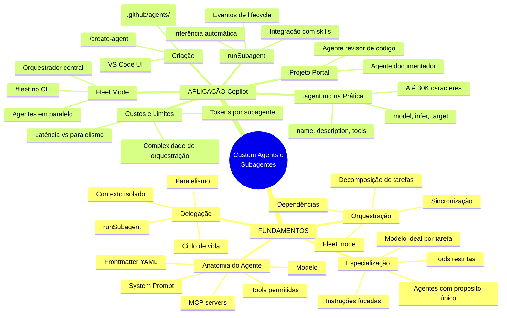
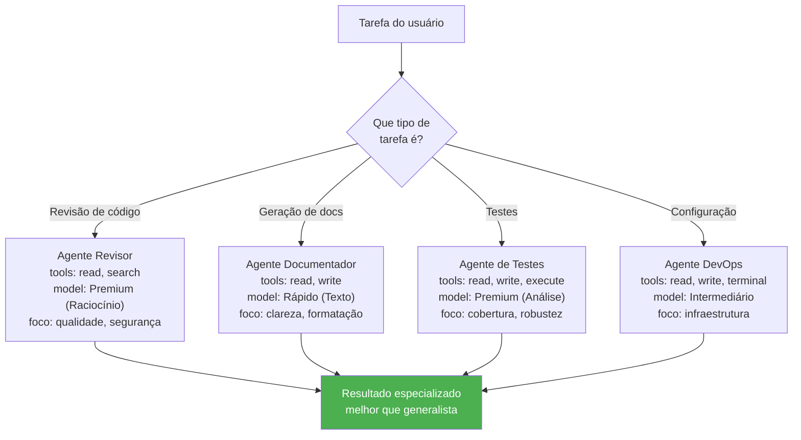
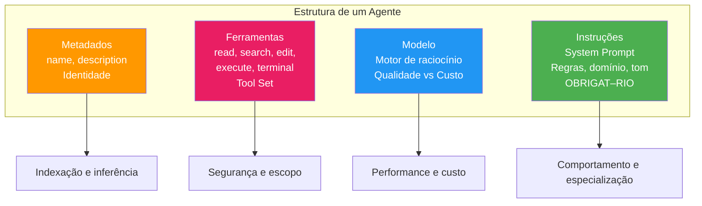
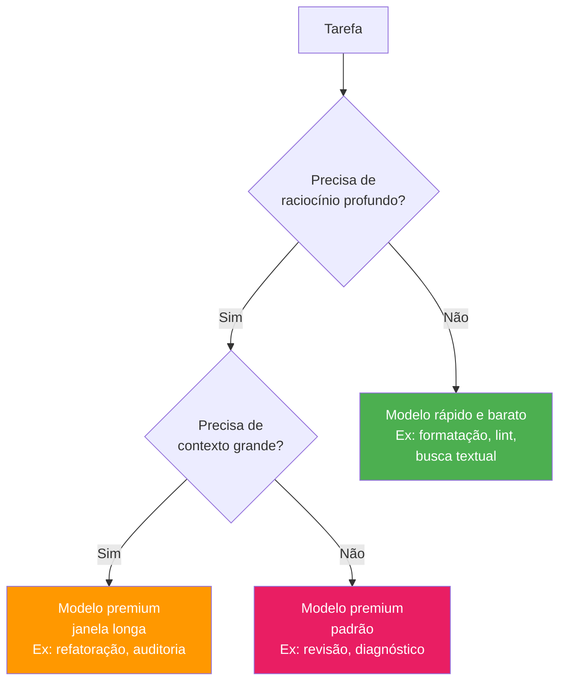
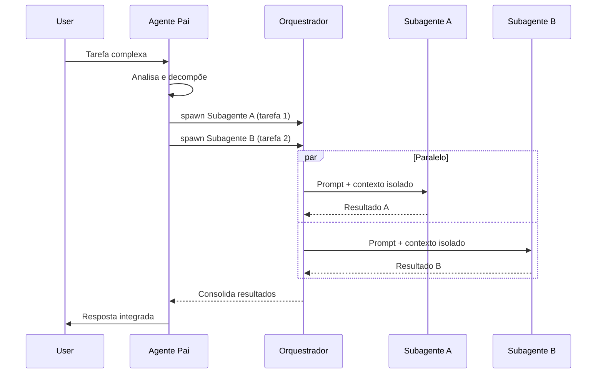
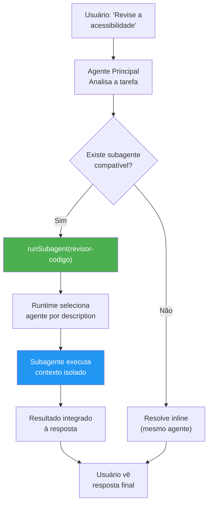
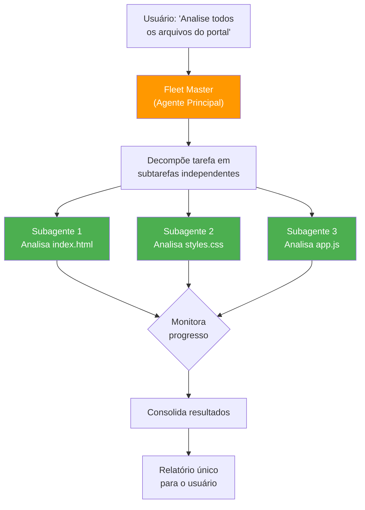

# Harness do GitHub Copilot e Programação Agêntica com VS Code — Aula 08

## Custom Agents e Subagentes — Especialização e Orquestração de Agentes

**Duração estimada:** 90 minutos (50 de leitura + 40 de prática)
**Nível:** Intermediário
**Pré-requisitos:** Aulas 01-07 concluídas. VS Code com GitHub Copilot instalado e autenticado. Git configurado. Harness existente com `copilot-instructions.md`, `.github/instructions/` com condicionais, `.github/prompts/` com slash commands customizados, `.github/skills/` com skills gerar-teste, revisar-acessibilidade e validar-html. Portal de Projetos Dev funcional com `index.html`, `styles.css` e `app.js`.

---

## Objetivos de Aprendizagem

Ao final desta aula, você será capaz de:

- [ ] **Explicar** o que são Custom Agents, por que criar agentes especializados e como eles diferem de skills e instructions
- [ ] **Descrever** a anatomia completa de um arquivo `.agent.md`: frontmatter YAML (`name`, `description`, `tools`, `model`, `infer`, `mcp-servers`, `target`) e o system prompt em Markdown
- [ ] **Definir** o tool set de um agente — restringir ferramentas com `tools: [...]` e compreender as implicações de segurança e escopo de cada restrição
- [ ] **Selecionar** o modelo ideal para cada agente com base na natureza da tarefa (latência vs qualidade vs custo)
- [ ] **Criar** Custom Agents via `/create-agent` e manualmente em `.github/agents/*.agent.md`
- [ ] **Demonstrar** o uso de subagentes e delegação via `runSubagent`: contexto isolado, ciclo de vida (selected → started → completed/failed → deselected), inferência automática de agente compatível
- [ ] **Comparar** os padrões de delegação — quando spawnar um subagente vs resolver inline — considerando tokens, latência e complexidade
- [ ] **Explicar** o Fleet mode como orquestração multi-agente: decomposição de prompts, paralelismo, gerenciamento de dependências entre subagentes
- [ ] **Avaliar** os custos e limites de agentes customizados: tokens por subagente, latência acumulada, complexidade de orquestração, limite de 30.000 caracteres no prompt
- [ ] **Construir** dois agentes especialistas para o harness do Portal de Projetos Dev — um revisor de código e um gerador de documentação — cada um com tools, modelo e instruções específicas

---

## Como Usar Esta Aula

Esta aula está organizada em duas partes. A **primeira parte** constrói os fundamentos da especialização de agentes — conceitos universais que valem para qualquer sistema agêntico, independentemente de ferramenta ou ecossistema. A **segunda parte** aplica esses conceitos na prática com Custom Agents do GitHub Copilot, criando agentes especializados no seu harness, explorando delegação com `runSubagent` e orquestração com Fleet mode.

Ao longo do caminho, você encontrará seções **"Mão na Massa"** (para fazer, não só ler) e **"Quick Check"** (para verificar se entendeu antes de avançar). Ao final, o arquivo separado **Questões de Aprendizagem** traz as tarefas de checkpoint — só avance para a próxima aula quando conseguir completá-las por conta própria.

**Tempo estimado:** 50 minutos de leitura + 40 minutos de prática.
**Dica:** Tenha o VS Code com o Portal de Projetos Dev aberto durante a segunda parte. Você criará os agentes dentro de `.github/agents/` do seu projeto.

---

## Mapa Mental

Este diagrama mostra todos os conceitos que você vai dominar nesta aula:




---

## Recapitulação da Aula 07

| Aula | Conceito | Onde aparece nesta aula | Como se conecta |
|---|---|---|---|
| Aula 05 (Agent Mode) | Tools e tool sets (`#edit`, `#read`, `#search`, `#execute`) | Seções 4, 7 | Agents herdam e restringem os mesmos tool sets |
| Aula 06 (Workflows) | Slash commands `/create-*` | Seções 5, 6 | `/create-agent` é o comando de criação de agentes |
| Aula 07 (Agent Skills) | Anatomia de SKILL.md, ciclo de vida | Seções 6, 10 | Agents podem usar skills existentes (ex: `revisar-acessibilidade`) |

---

**FUNDAMENTOS: Especialização e Orquestração de Agentes**

> *Os conceitos desta parte são universais — valem para qualquer sistema de agentes, independentemente da ferramenta, IDE ou ecossistema específico. Você aprenderá por que especializar agentes, a anatomia que todo agente compartilha, como restringir ferramentas e modelos, e como a delegação entre agentes funciona como padrão de design. Na segunda parte, você verá como o GitHub Copilot implementa cada um desses mecanismos.*

---

## 1. Por que Agentes Especializados?

### O problema do agente generalista

Você já trabalhou com um colega que "sabe de tudo um pouco mas não é especialista em nada"? Ele pode ajudar com qualquer tarefa, mas raramente entrega a melhor solução. Agentes de IA têm o mesmo problema.

Um **agente generalista** tem acesso a todas as ferramentas do sistema, carrega todo o conhecimento disponível, usa o modelo mais potente para tudo — e, como resultado, sofre de três problemas crônicos:

**Contexto poluído.** Como o agente carrega instruções genéricas para cobrir todos os cenários possíveis, seu contexto fica cheio de regras irrelevantes para a tarefa atual. Quando você pede "revise este HTML", o agente tem na cabeça regras de CSS, regras de segurança, regras de deploy — 80% do contexto é desperdiçado.

**Decisões dispersas.** Sem um foco claro, o agente oscila entre abordagens. Uma hora sugere uma solução elegante, na outra faz algo genérico demais. A falta de diretrizes específicas para o domínio da tarefa produz resultados inconsistentes.

**Custo elevado de tokens.** O mesmo modelo potente processa tudo — desde uma consulta simples de formatação até uma análise complexa de arquitetura. Você paga o custo do modelo premium mesmo para tarefas que um modelo mais rápido e barato resolveria com qualidade superior.

### O princípio da especialização

Agentes especializados seguem uma cadeia causal simples:

```
Propósito Único → Tools Certas → Instruções Precisas → Melhor Resultado
```

Cada elo da cadeia é uma decisão de design:

| Elo | Pergunta guia | Exemplo |
|---|---|---|
| **Propósito único** | Qual tarefa específica este agente resolve? | Revisar código, não "ajudar no desenvolvimento" |
| **Tools certas** | Quais ferramentas são estritamente necessárias? | `read` + `search`, não acesso total ao terminal |
| **Instruções precisas** | Que conhecimento de domínio o agente precisa? | Regras de acessibilidade WCAG, não "boas práticas gerais" |
| **Modelo adequado** | Qual modelo entrega o melhor custo-benefício? | Modelo rápido e barato para tarefas textuais, premium para raciocínio complexo |

### A analogia da equipe de especialistas

Pense em uma equipe de desenvolvimento bem estruturada. Você não tem um único desenvolvedor que faz tudo — você tem:

- Um **revisor de código** que só analisa pull requests, focado em qualidade e segurança
- Um **redator técnico** que só escreve documentação, focado em clareza e completude
- Um **engenheiro de QA** que só escreve e executa testes, focado em cobertura e robustez

Cada um tem ferramentas específicas (o revisor só precisa ler código, o QA precisa executar testes), conhecimento profundo no seu domínio, e um modelo mental ajustado à sua função. Um time de agentes especializados funciona da mesma forma — cada um sabe exatamente o que fazer, com quais ferramentas e com que nível de autonomia.

### Dimensões de especialização

Ao projetar um agente especializado, você define quatro dimensões:

1. **Escopo da tarefa**: o que o agente faz e, tão importante quanto, o que ele NÃO faz
2. **Ferramentas necessárias**: o conjunto mínimo de capacidades para executar a tarefa
3. **Conhecimento de domínio**: as regras, padrões e convenções específicas da área
4. **Nível de autonomia**: o quanto o agente decide por conta própria vs consulta o usuário




### Quick Check 1

**1. Por que um agente especialista tende a produzir melhores resultados que um generalista para tarefas de domínio específico?**
**Resposta:** Porque o especialista tem (1) contexto enxuto — apenas as instruções relevantes para aquela tarefa, (2) tools restritas — só as ferramentas necessárias, o que reduz alucinações e ações incorretas, (3) instruções precisas — conhecimento de domínio focado em vez de regras genéricas, e (4) modelo adequado — nem mais potente (caro) nem menos (incapaz) do que a tarefa exige.

**2. Cite duas dimensões pelas quais um agente pode ser especializado.**
**Resposta:** Duas das quatro: (1) escopo da tarefa — o que o agente faz e não faz, (2) ferramentas necessárias — conjunto mínimo de capacidades, (3) conhecimento de domínio — regras específicas da área, (4) nível de autonomia — decisão própria vs consulta ao usuário.

---

## 2. Anatomia de um Agente: Estrutura e Propriedades

### A definição universal de um agente

Antes de olhar para qualquer implementação específica, todo agente — independentemente da plataforma — é definido por quatro elementos essenciais. Pense neles como o DNA do agente: sem qualquer um deles, o agente não existe como entidade autônoma.

### Os quatro elementos essenciais

**1. Metadados de identidade.** Nome, descrição e propósito declarado. É como a "carteira de identidade" do agente — o que ele é, para que serve, quando deve ser usado. O sistema usa esses metadados para indexar, listar e — em sistemas mais avançados — inferir automaticamente qual agente delegar para cada tarefa.

**2. Ferramentas (tool set).** O conjunto de capacidades que o agente pode invocar. Um agente de leitura só pode ler arquivos; um agente de edição pode modificar código; um agente de execução pode rodar comandos. A restrição de ferramentas é o principal mecanismo de segurança e especialização. Sem restrição, o agente tem acesso a tudo — e pode fazer coisas que você não quer que ele faça.

**3. Modelo.** O motor de raciocínio que processa as instruções e gera respostas. Modelos diferentes têm perfis diferentes de latência, qualidade e custo. Um modelo pequeno e rápido é ideal para tarefas de formatação; um modelo grande e premium é necessário para análise complexa de múltiplos arquivos. A escolha do modelo é um trade-off direto entre qualidade da resposta e custo operacional.

**4. Instruções (system prompt).** O contrato comportamental do agente. É onde você define o tom, as regras de domínio, os limites de ação, o formato da resposta, e todo o conhecimento especializado que o agente precisa. As instruções são o que diferencia um revisor de código superficial de um revisor que entende as convenções específicas do seu projeto.

### Propriedades opcionais

Além dos quatro elementos essenciais, agentes podem ter propriedades adicionais:

- **Servidores MCP**: fontes externas de dados e ferramentas que o agente pode consultar
- **Inferência automática**: se o sistema pode delegar tarefas a este agente automaticamente
- **Ambiente-alvo**: onde o agente pode operar (editor, terminal, API, etc.)




### O system prompt como contrato

O system prompt não é "documentação" — é um contrato comportamental. Ele define:

- **O que o agente DEVE fazer**: regras obrigatórias, procedimentos fixos
- **O que o agente PODE fazer**: opções, alternativas, caminhos de decisão
- **O que o agente NÃO DEVE fazer**: limites, proibições, restrições
- **Como o agente DEVE responder**: formato, tom, nível de detalhe

Um system prompt bem escrito é específico, acionável e testável. Ele responde a perguntas como: "o que acontece se o arquivo não existir?", "devo perguntar antes de modificar?", "qual o formato do relatório de saída?"

| Elemento | Obrigatório? | Propósito |
|---|---|---|
| Nome | Sim | Identificar o agente |
| Descrição | Sim | Explicar propósito (usado para inferência) |
| Ferramentas | Não | Restringir capacidades (padrão: todas) |
| Modelo | Não | Motor de raciocínio (padrão: herda do sistema) |
| Instruções | Sim | Comportamento, regras, conhecimento de domínio |
| MCP servers | Não | Fontes externas de dados |
| Inferência | Não | Permitir delegação automática (padrão: sim) |
| Ambiente-alvo | Não | Onde o agente opera (padrão: todos) |

### Quick Check 2

**1. Quais são as quatro propriedades essenciais que definem um agente? Qual delas é a única obrigatória?**
**Resposta:** As quatro essenciais são: metadados (nome+descrição), ferramentas (tool set), modelo e instruções (system prompt). A única OBRIGAT–RIA são as instruções — sem elas o agente não tem comportamento definido. Na prática, nome+descrição também são funcionalmente obrigatórios para que o sistema possa referenciar o agente.

**2. Qual a diferença entre o que vai nos metadados (frontmatter) e o que vai no system prompt (corpo)?**
**Resposta:** Os metadados (frontmatter) são dados estruturados que o sistema lê para indexar, listar e gerenciar o agente — são legíveis por máquina. O system prompt (corpo) é conhecimento semântico que o modelo lê para definir comportamento — é legível por humanos (e pelo modelo). Metadados dizem ao sistema "quem" é o agente; o prompt diz ao modelo "como" o agente se comporta.

---

## 3. Tool Set e Modelo: Restrições e Seleção

### Por que restringir ferramentas?

Se você dá todas as ferramentas a um agente, ele pode fazer tudo — inclusive o que você não quer. Um agente de revisão com acesso ao terminal pode, em teoria, modificar permissões de arquivos ou executar scripts arbitrários. Não porque ele seja malicioso, mas porque o modelo pode alucinar uma sequência de ações que inclua comandos destrutivos.

A restrição de ferramentas segue o **princípio do menor privilégio**: cada agente deve ter apenas as ferramentas estritamente necessárias para executar sua tarefa. Isso traz três benefícios:

1. **Segurança**: reduz a superfície de dano potencial. Um agente sem `terminal` não pode executar comandos destrutivos.
2. **Qualidade**: o agente não tenta resolver problemas com ferramentas inadequadas. Sem `edit`, ele não tenta "corrigir" código — apenas relata problemas.
3. **Previsibilidade**: o comportamento do agente fica mais restrito e, portanto, mais previsível. Você sabe o que ele pode e não pode fazer.

### Categorias de restrição

| Categoria | Tools | Exemplo de agente | O que pode fazer |
|---|---|---|---|
| **Read-only** | `read` | Revisor de documentação | Ler arquivos, analisar, relatar |
| **Leitura + busca** | `read`, `search` | Auditor de segurança | Ler arquivos, buscar padrões no projeto |
| **Leitura + edição** | `read`, `search`, `edit` | Gerador de código | Ler, modificar e criar arquivos |
| **Leitura + edição + execução** | `read`, `search`, `edit`, `execute` | Engenheiro de QA | Ler, modificar e executar scripts |
| **Acesso total** | Todas (padrão) | Agente generalista | Qualquer operação no workspace |

O que acontece quando um agente tenta usar uma ferramenta não permitida? O sistema bloqueia a ação e retorna um erro. O agente recebe uma mensagem como "Ferramenta 'edit' não está disponível para este agente" e precisa ajustar sua abordagem — ou relatar a limitação ao usuário.

### Seleção de modelo: o triângulo latência × qualidade × custo

Cada modelo de linguagem tem um perfil diferente neste triângulo. Não existe modelo "melhor" — existe o modelo mais adequado para cada tarefa.

| Perfil de tarefa | Modelo recomendado | Por quê |
|---|---|---|
| Formatação, lint, correções simples | Rápido e barato | Tarefas previsíveis, baixa complexidade |
| Geração de documentação textual | Rápido e barato | Texto não exige raciocínio profundo |
| Revisão de código (qualidade) | Premium | Precisa entender contexto e intenção |
| Refatoração multi-arquivo | Premium | Raciocínio complexo, dependências entre arquivos |
| Análise de segurança | Premium | Falsos negativos têm custo alto |
| Geração de testes | Intermediário | Equilíbrio entre qualidade e velocidade |

### Heurísticas práticas de seleção

1. **Tarefas determinísticas** (formatação, lint, busca) → modelos rápidos e baratos
2. **Tarefas analíticas** (revisão, auditoria, diagnóstico) → modelos premium
3. **Tarefas criativas** (geração de código, documentação) → modelos intermediários
4. **Tarefas que exigem contexto grande** (refatoração multi-arquivo) → modelos com janela longa
5. **Dúvida?** Comece com um modelo intermediário e suba para premium se a qualidade não atingir o esperado




### Quick Check 3

**1. Um agente de revisão de documentação deve ter acesso à ferramenta `terminal`. Justifique.**
**Resposta:** Não. Revisão de documentação envolve apenas ler arquivos (`.md`, `.txt`, `.html`) e analisar o conteúdo textual. O terminal não é necessário — e representa risco desnecessário. O princípio do menor privilégio diz que o agente deve ter APENAS `read` (e talvez `search` para encontrar arquivos). Qualquer ferramenta além do necessário é superfície de ataque.

**2. Para uma tarefa de refatoração complexa que envolve 15 arquivos, qual perfil de modelo é mais adequado: rápido e barato ou premium e mais lento? Por quê?**
**Resposta:** Premium e mais lento. Refatoração multi-arquivo exige (1) janela de contexto grande para carregar todos os arquivos, (2) raciocínio sobre dependências entre arquivos, (3) compreensão da arquitetura geral, não apenas de trechos isolados. Um modelo rápido tende a produzir refatorações superficiais ou inconsistentes entre arquivos. O custo extra do modelo premium é justificado pela correção do resultado.

---

## 4. Delegação e Subagentes: Mecanismo Universal

### O padrão de delegação agêntica

Um dos padrões mais poderosos em sistemas multi-agente é a **delegação**: um agente principal recebe uma tarefa complexa, a decompõe em subtarefas e as distribui para agentes especializados (subagentes). Cada subagente executa sua parte de forma isolada e retorna o resultado ao agente principal, que consolida e apresenta a resposta final.

### Por que delegar?

Três razões principais:

1. **Especialização**: cada subagente pode ser um especialista em sua área. O agente de revisão de acessibilidade entende WCAG; o agente de documentação sabe formatar Markdown. Nenhum agente generalista consegue igualar a profundidade de múltiplos especialistas.

2. **Isolamento de contexto**: cada subagente opera com seu próprio contexto — apenas as instruções, ferramentas e modelo definidos para ele. O ruído de um domínio não contamina a execução do outro.

3. **Paralelismo**: subagentes independentes podem executar simultaneamente, reduzindo o tempo total (tempo de parede) da tarefa.

### Contexto isolado

Quando um subagente é spawnado, ele não herda o histórico completo da conversa do agente principal. Ele recebe apenas:

- O **prompt da tarefa** (o que fazer)
- O **contexto mínimo** necessário (arquivos, dados, parâmetros)
- Suas **próprias instruções** e **ferramentas**

Isso é proposital: o subagente não precisa saber o que foi discutido antes. Ele precisa executar sua tarefa com foco total. O resultado é que cada subagente opera como uma "ilha" de contexto — limpa, focada e eficiente.

### Ciclo de vida da delegação

O ciclo de vida completo de um subagente tem cinco estágios:

1. **Seleção**: o agente principal (ou o runtime) identifica qual subagente é mais adequado para a subtarefa, analisando a descrição do agente contra a tarefa
2. **Inicialização**: o subagente é criado com seu contexto isolado — instruções, ferramentas e modelo carregados
3. **Execução**: o subagente executa a tarefa, usando suas ferramentas e seguindo suas instruções
4. **Conclusão ou Falha**: o subagente completa a tarefa com sucesso ou encontra um erro e reporta
5. **Reintegração**: o resultado é retornado ao agente principal, que incorpora na resposta consolidada




### Comunicação pai-filho

A comunicação entre agente pai e subagente é deliberadamente limitada:

- **Entrada**: o pai envia um prompt descritivo + qualquer contexto mínimo necessário (arquivos, dados)
- **Saída**: o subagente retorna um resultado estruturado (texto, arquivos modificados, relatório)
- **Sem canal lateral**: subagentes não se comunicam entre si — toda coordenação passa pelo pai

Esse design intencional mantém cada subagente simples e focado. A complexidade de coordenação fica com o agente pai, que é o "cérebro" da operação.

### Quick Check 4

**1. Qual a principal vantagem do contexto isolado em subagentes?**
**Resposta:** O contexto isolado impede que o ruído de outras tarefas contamine a execução do subagente. Cada subagente recebe apenas as instruções, ferramentas e dados relevantes para sua subtarefa — sem histórico de conversa, sem regras de outros domínios, sem distrações. Isso produz resultados mais focados e reduz o desperdício de tokens com informações irrelevantes.

**2. O que acontece com o resultado de um subagente após sua conclusão?**
**Resposta:** O resultado é retornado ao agente principal, que o incorpora na resposta consolidada. O subagente é então descartado — seu contexto é liberado, seus tokens são recuperados. O agente principal pode usar o resultado imediatamente, combiná-lo com resultados de outros subagentes, ou passá-lo como entrada para outro subagente (encadeamento sequencial).

---

**APLICAÇÃO: Custom Agents no GitHub Copilot**

> *Agora que você entende os fundamentos universais da especialização de agentes (Seção 1), a anatomia que todo agente compartilha (Seção 2), como restringir ferramentas e escolher modelos (Seção 3), e como a delegação funciona como padrão de design (Seção 4) — vamos conectar tudo à prática com o GitHub Copilot. Você vai criar Custom Agents no seu harness, praticar delegação com `runSubagent`, explorar Fleet mode e construir dois agentes especialistas para o Portal de Projetos Dev.*

---

## 5. Custom Agents no Copilot: `.agent.md` na Prática

### O que são Custom Agents no Copilot?

Custom Agents são agentes definidos pelo usuário através de arquivos `.agent.md` no diretório `.github/agents/`. Cada arquivo define um agente completo com:

- **Frontmatter YAML**: metadados que o Copilot usa para indexar, listar e inferir delegação
- **Corpo Markdown**: o system prompt que define o comportamento, regras e conhecimento do agente

O Copilot descobre automaticamente todos os arquivos `.agent.md` em `.github/agents/` e os disponibiliza no seletor de agentes do Copilot Chat e no Agent Mode.

### Localização e descoberta

```
.github/agents/
—S—�—Ærevisor-codigo.agent.md
——�—Ægerador-docs.agent.md
```

O nome do arquivo (sem extensão) é usado como identificador do agente. Você pode substituir pelo campo `name` no frontmatter.

### Anatomia completa do frontmatter YAML

```yaml
---
name: revisor-codigo
description: "Revisa código JavaScript/HTML do Portal de Projetos Dev quanto a qualidade, acessibilidade e boas práticas"
tools:
  - read
  - search
model: claude-sonnet-4
infer: true
target: vscode
---
```

| Campo | Obrigatório | Descrição |
|---|---|---|
| `name` | Não | Nome de exibição (padrão: nome do arquivo sem `.agent.md`) |
| `description` | **Sim** | Descrição usada para listagem e inferência automática |
| `tools` | Não | Array de ferramentas permitidas (padrão: todas) |
| `model` | Não | Modelo de IA do agente (padrão: herda do agente principal) |
| `infer` | Não | Se o agente pode ser delegado automaticamente (padrão: `true`) |
| `mcp-servers` | Não | Servidores MCP que o agente pode consultar |
| `target` | Não | Ambiente-alvo: `vscode` ou `github-copilot` (padrão: ambos) |

### O campo `description` é o mais importante

O campo `description` não é apenas documentação — é o mecanismo de **inferência automática**. Quando o Copilot precisa delegar uma tarefa a um subagente, ele analisa as descriptions de todos os agentes disponíveis e seleciona o mais compatível. Uma descrição vaga ou genérica faz o agente nunca ser selecionado; uma descrição precisa e específica maximiza as chances de delegação correta.

**Descrição boa:** "Revisa código JavaScript/HTML do Portal de Projetos Dev quanto a qualidade, acessibilidade e boas práticas. Analisa semântica HTML, contraste de cores e performance de carregamento."

**Descrição ruim:** "Ajuda com revisão de código."

### O corpo Markdown como system prompt

O corpo do arquivo contém o system prompt do agente, com até **30.000 caracteres**. É aqui que você define o comportamento completo:

```markdown
# Agente: Revisor de Código

## Propósito
Este agente revisa código do Portal de Projetos Dev, focando em qualidade, acessibilidade e conformidade com WCAG 2.1 AA.

## Regras de revisão
- Analise semântica HTML: verifique landmarks, headings, hierarquia
- Verifique acessibilidade: contraste, alt text, navegação por teclado
- Identifique más práticas de JavaScript: variáveis globais, eval(), manipulação direta do DOM sem verificação
- NÃO modifique arquivos — apenas reporte problemas com sugestões de correção

## Formato de saída
Para cada arquivo revisado, produza:
### Arquivo: [nome]
- Severidade: ßÆCrítico / ßxÆModerado / ßÆSugestão
- **Problema**: descrição
- **Localização**: linha X
- **Sugestão**: como corrigir

## Skills disponíveis
Este agente pode usar as seguintes skills do harness:
- `/revisar-acessibilidade` para auditoria WCAG detalhada
- `/validar-html` para validação de semântica HTML
```

### Exemplo completo: agente "Bug Fixer"

```markdown
---
name: corretor-bugs
description: "Analisa logs de erro e stack traces para diagnosticar e corrigir bugs em JavaScript. Usa read, search e edit para encontrar e aplicar correções."
tools:
  - read
  - search
  - edit
model: claude-opus-4
infer: false
---

# Agente: Corretor de Bugs

## Propósito
Diagnosticar e corrigir bugs em código JavaScript a partir de logs de erro, stack traces ou descrições do usuário.

## Procedimento
1. Receba a descrição do erro ou stack trace
2. Busque no código por arquivos relevantes usando `search`
3. Leia os arquivos para entender o contexto
4. Identifique a causa raiz do bug
5. Proponha e aplique a correção usando `edit`
6. Verifique se a correção não introduz novos problemas

## Regras
- Sempre entenda a causa raiz antes de corrigir (não trate sintomas)
- Prefira correções mínimas: mude apenas o necessário
- Após corrigir, sugira um teste que previna a regressão
- Se não conseguir diagnosticar, reporte o que descobriu e peça ajuda

## Limitações
- Este agente NÃO executa código ou scripts
- Este agente NÃO modifica arquivos de configuração sem permissão explícita
```

### Mão na Massa 1 — Criando seu primeiro Custom Agent

- [ ] Abra o diretório `.github/agents/` no seu projeto (crie com `mkdir -p .github/agents`)
- [ ] Crie o arquivo `.github/agents/revisor-codigo.agent.md`
- [ ] Configure o frontmatter:
  ```yaml
  ---
  name: revisor-codigo
  description: "Revisa código JavaScript/HTML do Portal de Projetos Dev quanto a qualidade, acessibilidade e boas práticas"
  tools:
    - read
    - search
  model: claude-sonnet-4
  ---
  ```
- [ ] Escreva o system prompt com instruções específicas para revisão de código (use o exemplo da seção como base)
- [ ] Salve o arquivo e recarregue o Copilot (atalho: `Ctrl+Shift+P` → "Developer: Reload Window")
- [ ] **Verificação**: digite `@` no Copilot Chat — o agente "revisor-codigo" deve aparecer na lista de agentes disponíveis

### Quick Check 5

**1. Se você omitir o campo `tools` no frontmatter, quais ferramentas o agente terá acesso?**
**Resposta:** O agente terá acesso a TODAS as ferramentas disponíveis no sistema — o mesmo conjunto do agente generalista. Isso inclui `read`, `search`, `edit`, `execute` e `terminal`. É o comportamento padrão por segurança (o agente não fica sem ferramentas), mas vai contra o princípio do menor privilégio. Sempre restrinja `tools` ao mínimo necessário.

**2. Qual o limite de caracteres para o system prompt de um Custom Agent?**
**Resposta:** 30.000 caracteres (aproximadamente 7.500-10.000 tokens, dependendo do conteúdo). Esse limite é generoso o suficiente para instruções detalhadas, regras de domínio, exemplos e formatação de saída. Se o prompt ultrapassar esse limite, o Copilot emitirá um erro. Uma boa prática é manter entre 2.000 e 10.000 caracteres — suficiente para instruções completas sem desperdiçar contexto.

---

## 6. Subagentes no Copilot: `runSubagent` e Delegação

### A ferramenta `runSubagent`

No GitHub Copilot, a delegação é implementada através da ferramenta `runSubagent`, que faz parte do tool set `#agent`. Quando um agente tem esta ferramenta disponível, ele pode spawnar subagentes para executar subtarefas específicas.

### Como funciona

1. O agente principal recebe uma tarefa complexa
2. Ele identifica subtarefas que podem ser delegadas
3. Para cada subtarefa, ele invoca `runSubagent` com:
   - A descrição da tarefa
   - O contexto mínimo necessário (arquivos, dados)
4. O runtime analisa a descrição contra os agentes disponíveis e seleciona o mais compatível
5. O subagente executa em contexto isolado com suas próprias ferramentas, modelo e instruções
6. O resultado retorna ao agente principal

### Inferência automática

Quando `infer: true` no frontmatter do agente, o runtime do Copilot automaticamente analisa a descrição do agente contra a tarefa e seleciona o mais compatível. É como um "mecanismo de busca" de agentes:

```
Tarefa: "Revise a acessibilidade do index.html"
→ Runtime busca agentes com description contendo "acessibilidade"
→ Encontra agente "revisor-codigo" (description contém "acessibilidade")
→ Seleciona e delega
```

Uma descrição precisa é o que alimenta este mecanismo. Se o agente "revisor-codigo" tem description "Revisa código e acessibilidade", ele será encontrado. Se a description for "Ajuda com código", o runtime pode não associá-lo à tarefa de acessibilidade.

### Eventos de lifecycle

O Copilot expõe eventos que permitem acompanhar o ciclo de vida de um subagente:

| Evento | Quando ocorre | O que significa |
|---|---|---|
| `subagent.selected` | Runtime escolhe o agente | "Encontrei um candidato para esta tarefa" |
| `subagent.started` | Subagente começa a executar | "O subagente recebeu o contexto e começou" |
| `subagent.completed` | Subagente termina com sucesso | "Tarefa concluída, resultado disponível" |
| `subagent.failed` | Subagente encontra erro | "Algo deu errado — o subagente reporta o erro" |
| `subagent.deselected` | Subagente é removido do contexto | "Contexto liberado, subagente não está mais ativo" |

Estes eventos aparecem no log do Copilot Chat (ícone de engrenagem ou painel de saída) e são úteis para depurar delegações que não funcionam como esperado.

### Exemplo prático

No Copilot Chat, você pode pedir:

> "Revise a qualidade do código do portal usando o agente revisor"

O Copilot analisa o prompt, identifica que existe um agente com descrição compatível (`revisor-codigo`), seleciona-o como subagente e delega a tarefa. O resultado aparece integrado na resposta.

Para delegação paralela:

> "Revise o index.html e gere documentação para o app.js simultaneamente"

Neste caso, o Copilot pode spawnar dois subagentes em paralelo — um revisor para o HTML e um documentador para o JS — desde que ambos os agentes existam no harness.




### Mão na Massa 2 — Delegando tarefas a subagentes

- [ ] Certifique-se de que você criou o agente `revisor-codigo.agent.md` (Mão na Massa 1)
- [ ] No Copilot Chat, peça: "Revise a acessibilidade do index.html usando o agente revisor"
- [ ] Observe o log de eventos: abra o painel de saída do Copilot (`Ctrl+Shift+U`) e veja se aparecem eventos `subagent.selected`, `subagent.started`, `subagent.completed`
- [ ] Teste delegação paralela: "Revise acessibilidade e valide o HTML do index.html simultaneamente"
- [ ] **Verificação**: O Copilot delegou a tarefa ao agente revisor. O log mostra os eventos do ciclo de vida do subagente.

### Quick Check 6

**1. O que determina qual Custom Agent será selecionado automaticamente para uma tarefa?**
**Resposta:** O campo `description` do frontmatter. O runtime do Copilot analisa a description de cada agente disponível e calcula a similaridade semântica com a tarefa solicitada. O agente com description mais compatível é selecionado. Uma description precisa e específica maximiza as chances de seleção correta.

**2. O subagente tem acesso ao histórico completo da conversa do agente principal? Por quê?**
**Resposta:** Não. O subagente recebe apenas o prompt da tarefa e o contexto mínimo necessário (arquivos, dados). Ele NÃO herda o histórico completo da conversa. Isso é intencional: (1) isola o contexto — o subagente não se distrai com informações irrelevantes, (2) economiza tokens — o histórico não é duplicado para cada subagente, (3) mantém cada subagente focado exclusivamente na sua tarefa.

---

## 7. Fleet Mode: Orquestração Multi-Agente

### O que é Fleet Mode?

Fleet mode é um padrão de orquestração onde um agente central (o "fleet master") recebe uma tarefa complexa, a decompõe em subtarefas independentes e as distribui para múltiplos subagentes executando em paralelo. É como um maestro regendo uma orquestra — cada músico (subagente) toca sua parte, e o maestro (fleet master) coordena o conjunto.

### Como funciona

1. **Decomposição**: o fleet master analisa o prompt e identifica subtarefas independentes
2. **Distribuição**: cada subtarefa é atribuída a um subagente (escolhido por inferência automática)
3. **Paralelismo**: os subagentes executam simultaneamente, cada um em seu contexto isolado
4. **Sincronização**: o fleet master monitora o progresso de cada subagente
5. **Consolidação**: quando todos os subagentes concluem, o fleet master consolida os resultados




### Como ativar Fleet Mode

No Copilot CLI, o comando `/fleet` dispara o Fleet mode:

```bash
gh copilot
# Dentro do CLI interativo:
/fleet Analise index.html, styles.css e app.js em paralelo e reporte problemas
```

O Fleet mode também pode ser acionado pelo agente principal no Copilot Chat quando ele identifica que a tarefa se beneficia de paralelismo — sem comando explícito, o próprio agente decide usar Fleet mode.

### Dependências entre subtarefas

Nem toda tarefa pode ser paralelizada. Fleet mode funciona melhor quando as subtarefas são **independentes**:

| Tipo de dependência | Pode paralelizar? | Exemplo |
|---|---|---|
| Independentes | “& Sim | Revisar HTML, CSS e JS (arquivos distintos) |
| Sequenciais (output A → input B) | Ì Não | Gerar documentação das correções sugeridas pela revisão |
| Parcialmente dependentes | Ú�️ Parcial | Audit logs de 3 serviços (paralelo), depois consolidar (sequencial) |

### Casos de uso ideais

- **Revisão de múltiplos componentes**: cada componente é revisado por um subagente diferente
- **Migração de dados**: arquivos independentes são processados em paralelo
- **Testes em múltiplos ambientes**: cada ambiente recebe um subagente dedicado
- **Geração de documentação**: múltiplos arquivos são documentados simultaneamente

### Casos que NÃO se beneficiam

- Tarefas estritamente sequenciais (passo 2 depende do resultado do passo 1)
- Tarefas que exigem contexto global (um único agente precisa ver tudo)
- Tarefas muito pequenas (o overhead de orquestração supera o ganho de paralelismo)

### Mão na Massa 3 — Experimentando Fleet mode

- [ ] Abra o terminal e execute `gh copilot` para iniciar o CLI interativo
- [ ] Use o comando: `/fleet Analise index.html, styles.css e app.js em paralelo e reporte problemas de qualidade e segurança`
- [ ] Observe a saída: o fleet master deve mostrar a decomposição da tarefa e a execução paralela
- [ ] **Verificação**: a saída mostra que três subagentes foram spawnados (um para cada arquivo) e o relatório consolidado foi gerado com seções para HTML, CSS e JS

### Quick Check 7

**1. Qual a diferença entre usar `runSubagent` manualmente e usar Fleet mode?**
**Resposta:** `runSubagent` é a ferramenta individual para delegar uma subtarefa a um subagente — o agente principal decide quando, para quem e como delegar. Fleet mode é um padrão de orquestração que automatiza a decomposição, distribuição, paralelismo e consolidação — o fleet master gerencia todo o ciclo. Em resumo: `runSubagent` é o mecanismo; Fleet mode é a estratégia que usa esse mecanismo em escala.

**2. Que tipo de tarefa NÃO se beneficia de Fleet mode?**
**Resposta:** Tarefas sequenciais onde o output de uma subtarefa é input de outra (ex: revisar código → gerar docs das correções), tarefas que exigem visão global do projeto (ex: refatorar arquitetura), e tarefas muito pequenas ou simples onde o overhead de orquestração supera o ganho de paralelismo (ex: corrigir uma única tag HTML).

---

## 8. Custos, Limites e Padrões de Delegação

### O custo real dos subagentes

Cada subagente que você spawna tem um custo em tokens. Não é apenas o custo do modelo — é o custo do **contexto adicional** que cada subagente carrega:

```
Custo_total = Custo_agente_principal + Σ(Custo_subagente_i)
Onde:
  Custo_subagente_i = (system_prompt_i + contexto_i + resposta_i) × modelo_i
```

Em termos práticos:

| Cenário | Tokens estimados | Latência |
|---|---|---|
| Agente principal resolve inline | ~5.000 tokens | 2-5s |
| Agente principal + 1 subagente | ~10.000 tokens | 3-8s |
| Agente principal + 3 subagentes em paralelo | ~20.000 tokens | 4-10s (paralelo) |
| Fleet mode com 5 subagentes | ~35.000 tokens | 6-15s (paralelo) |

O paralelismo reduz o **tempo de parede** (wall clock), mas os **tokens totais** são maiores porque cada subagente tem seu próprio contexto.

### Tabela de decisão: spawnar subagente vs resolver inline

| Situação | Recomendação | Critérios |
|---|---|---|
| Tarefa especializada + agente correspondente existe | **Spawn** | Aproveita a especialização do subagente |
| Tarefa simples + sem agente correspondente | **Inline** | Overhead de spawn supera benefício |
| Múltiplas tarefas independentes | **Fleet mode** | Paralelismo reduz tempo total |
| Tarefa encadeada (output A é input de B) | **Sequencial** | Dependência impede paralelismo |
| Tarefa que exige contexto global | **Inline** | Subagente não vê o quadro completo |
| Tarefa crítica de segurança | **Spawn (isolado)** | Isolamento reduz risco de contaminação |

### Heurísticas práticas

1. **Tarefa especializada + agente correspondente existe → spawn**: se você tem um agente "analisador-segurança", use-o para análise de segurança. Para isso servem os agentes especializados.
2. **Tarefa simples + sem agente correspondente → inline**: corrigir uma variável com nome errado não precisa de subagente.
3. **Múltiplas tarefas independentes → fleet mode**: revisar 5 arquivos CSS independentes é o caso ideal para paralelismo.
4. **Tarefa encadeada (output de A é input de B) → sequencial**: não adianta paralelizar se o resultado de um é necessário para o outro.
5. **Dúvida? → inline primeiro**: comece sem subagentes. Se perceber que o agente principal está sobrecarregado ou produzindo resultados genéricos, migre para agentes especializados.

### Limites conhecidos

- **System prompt**: máximo de 30.000 caracteres por agente
- **Número de subagentes simultâneos**: limitado pelo runtime (tipicamente 5-10, depende da capacidade do modelo)
- **Tokens totais**: somatório de todos os contextos ativos não pode exceder a capacidade do runtime
- **Latência acumulada**: cada subagente adiciona latência de inicialização (tipicamente 1-3s)

### Boas práticas

1. **Nomes descritivos**: `revisor-codigo` em vez de `agente1` — o nome é usado para inferência
2. **Descrições precisas**: descreva EXATAMENTE o que o agente faz — a description alimenta o mecanismo de seleção automática
3. **Tools mínimas**: restrinja ao conjunto estritamente necessário
4. **Modelo adequado**: não use o modelo mais caro para tarefas simples
5. **Teste a inferência**: depois de criar um agente, teste se ele é selecionado automaticamente para a tarefa certa

### Quick Check 8

**1. Você precisa revisar 5 arquivos CSS e 3 arquivos JavaScript. É melhor usar fleet mode ou processar sequencialmente? Justifique.**
**Resposta:** Fleet mode. São 8 arquivos independentes entre si — a revisão de um não depende do resultado da revisão de outro. Fleet mode pode spawnar subagentes em paralelo (revisores CSS e JS), reduzindo o tempo total de parede. Se processado sequencialmente, o tempo seria a soma das revisões individuais. Com fleet mode, o tempo é aproximadamente o da revisão mais longa + overhead de consolidação.

**2. Cite uma situação em que NÃO vale a pena criar um Custom Agent dedicado.**
**Resposta:** Quando a tarefa é simples, genérica e de altíssima frequência — por exemplo, "formatar arquivo JSON". O agente generalista já faz isso bem, sem necessidade de instruções especializadas. Criar um agente dedicado adicionaria complexidade (mais um arquivo para manter) sem ganho perceptível. Regra prática: se o agente generalista resolve em 1-2 interações, não vale a pena criar um agente especializado.

---

## 9. Projeto: Agentes Especialistas para o Portal

### A peça do projeto progressivo

Você já tem skills em `.github/skills/` (Aula 07). Agora você vai construir **dois agentes especializados** em `.github/agents/` que integram essas skills. Seu harness ganha não apenas conhecimento sob demanda (skills), mas capacidade de raciocínio distribuído (agentes especializados que delegam entre si).

### Estado do harness após esta aula

```
.github/
—S—�—Æcopilot-instructions.md           # Base: stack, estilo, segurança
—S—�—Æinstructions/                      # Condicionais por tipo de arquivo
—   —S—�—Æcss.instructions.md
—   —S—�—Æjs.instructions.md
—   ——�—Æhtml.instructions.md
—S—�—Æprompts/                           # Atalhos one-shot
—   —S—�—Ægerar-card.prompt.md
—   —S—�—Æestilizar.prompt.md
—   ——�—Ævalidar-dados.prompt.md
—S—�—Æskills/                            # Conhecimento especializado (Aula 07)
—   —S—�—Ægerar-teste/
—   —S—�—Ærevisar-acessibilidade/
—   ——�—Ævalidar-html/
——�—Æagents/                            # Agentes especializados (Aula 08)
    —S—�—Ærevisor-codigo.agent.md
    ——�—Ægerador-docs.agent.md
```

### Mão na Massa 4 — Criando o Agente Revisor de Código

**Dificuldade: Fácil | Duração: 10 minutos**

- [ ] Crie o arquivo `.github/agents/revisor-codigo.agent.md`
- [ ] Adicione o frontmatter:
  ```yaml
  ---
  name: revisor-codigo
  description: "Revisa código JavaScript/HTML do Portal de Projetos Dev quanto a qualidade, acessibilidade e boas práticas. Analisa semântica HTML, contraste de cores, performance e segurança."
  tools:
    - read
    - search
  model: claude-sonnet-4
  ---
  ```
- [ ] Escreva o system prompt com:
  - Propósito e escopo do agente
  - Regras de revisão: semântica HTML, acessibilidade WCAG, segurança JS
  - Formato de saída: severidade, problema, localização, sugestão
  - Referência às skills do harness: `/revisar-acessibilidade`, `/validar-html`
  - Instrução explícita: NÃO modificar arquivos, apenas reportar
- [ ] Salve o arquivo

**Verificação:** Peça ao Copilot: "Revise o index.html usando o agente revisor" — o agente deve ser selecionado e produzir um relatório de revisão.

### Mão na Massa 5 — Criando o Agente Gerador de Documentação

**Dificuldade: Fácil | Duração: 10 minutos**

- [ ] Crie o arquivo `.github/agents/gerador-docs.agent.md`
- [ ] Adicione o frontmatter:
  ```yaml
  ---
  name: gerador-docs
  description: "Gera documentação em Markdown para componentes e módulos JavaScript do Portal de Projetos Dev. Produz READMEs, JSDoc e documentação de API."
  tools:
    - read
    - search
    - edit
  model: gpt-4o
  ---
  ```
- [ ] Escreva o system prompt com:
  - Propósito: gerar documentação técnica clara e completa
  - Formato padrão: título, descrição, pré-requisitos, uso, API, exemplos
  - Regras de formatação: Markdown válido, links para arquivos do projeto, exemplos de código com syntax highlighting
  - Instrução: após gerar a documentação, salvar como `README.md` ou `<nome-do-modulo>-docs.md`
  - Referência ao agente revisor: "Se houver relatório de revisão disponível, incorpore as sugestões na documentação"
- [ ] Salve o arquivo

**Verificação:** Peça ao Copilot: "Use o agente documentador para gerar documentação do app.js" — o agente deve ler o arquivo e produzir documentação em Markdown.

### Mão na Massa 6 — Orquestrando os Dois Agentes

**Dificuldade: Médio | Duração: 15 minutos**

Agora você vai orquestrar os dois agentes em sequência: primeiro o revisor analisa o código, depois o documentador gera a documentação incorporando as sugestões da revisão.

- [ ] No Copilot Chat, peça: "Usando o agente revisor, analise `index.html`. Depois, usando o agente documentador, gere documentação para as melhorias sugeridas."
- [ ] Observe a sequência: primeiro o agente revisor é spawnado (revisão), depois o agente documentador (documentação das melhorias)
- [ ] Note que a ordem é **encadeada** (não paralela) — o output da revisão é input da documentação
- [ ] **Verificação**: Ambos os agentes executaram e produziram resultados. A documentação gerada reflete as sugestões da revisão (se o revisor apontou "falta alt text", a documentação deve incluir "adicione alt descritivo às imagens").

---

## Autoavaliação: Quiz Rápido

**1. Qual a diferença fundamental entre um agente generalista e um agente especializado?**
**Resposta:**

Um agente generalista tem acesso a todas as ferramentas, carrega todo o conhecimento disponível e usa o modelo mais potente para tudo — resultando em contexto poluído, decisões dispersas e alto custo de tokens. Um agente especializado tem propósito único, tools restritas ao necessário, instruções precisas de domínio e modelo adequado à tarefa — produzindo melhores resultados com menor custo.

**2. Liste os campos obrigatórios e opcionais do frontmatter de um `.agent.md`.**
**Resposta:**

Obrigatório: `description`. Opcionais: `name` (padrão: nome do arquivo), `tools` (padrão: todas), `model` (padrão: herda do sistema), `infer` (padrão: true), `mcp-servers` (padrão: nenhum), `target` (padrão: todos).

**3. O que acontece se um Custom Agent tentar usar uma ferramenta não listada em `tools`?**
**Resposta:**

O sistema bloqueia a ação e retorna um erro como "Ferramenta 'edit' não está disponível para este agente". O agente precisa ajustar sua abordagem — ou reportar a limitação ao usuário e pedir alternativas.

**4. Como o Copilot decide qual Custom Agent delegar uma tarefa automaticamente?**
**Resposta:**

O runtime analisa o campo `description` de cada agente disponível e calcula a similaridade semântica com a tarefa solicitada. O agente com description mais compatível é selecionado. O campo `description` é o principal mecanismo de inferência.

**5. Explique o ciclo de vida completo de um subagente, da seleção à reintegração do resultado.**
**Resposta:**

(1) Seleção — runtime identifica o agente mais compatível pela description. (2) Inicialização — subagente é criado com contexto isolado (instruções, ferramentas, modelo). (3) Execução — subagente executa a tarefa. (4) Conclusão ou Falha — subagente completa ou reporta erro. (5) Reintegração — resultado retorna ao agente principal, que incorpora na resposta.

**6. Fleet mode é adequado para tarefas encadeadas (output de A é input de B)? Justifique.**
**Resposta:**

Não. Fleet mode paraleliza subtarefas independentes. Em tarefas encadeadas, o output de A é necessário como input de B — paralelizar não faz sentido porque B não pode começar antes de A terminar. Tarefas encadeadas devem ser executadas sequencialmente pelo mesmo agente ou por subagentes em série.

**7. Cite duas heurísticas para decidir entre spawnar um subagente e resolver inline.**
**Resposta:**

(1) Tarefa especializada + agente correspondente existe → spawn (aproveita a especialização). (2) Tarefa simples + sem agente correspondente → inline (overhead de spawn supera o benefício). Outras possíveis: tarefas independentes → fleet mode; tarefa encadeada → sequencial.

**8. Por que o contexto de um subagente é isolado do agente principal? Qual a vantagem?**
**Resposta:**

O contexto isolado impede contaminação entre domínios. Cada subagente recebe apenas as instruções, ferramentas e dados relevantes para sua subtarefa. As vantagens são: (1) foco — o subagente não se distrai com informações irrelevantes, (2) economia — o histórico da conversa principal não é duplicado, (3) segurança — um subagente não tem acesso a informações de outros contextos.

---

## Mão na Massa: Exercícios Graduados

**Exercício 1 (Fácil) — Criando um Agente Simples**

Crie um Custom Agent chamado "corretor-ortografico" que apenas lê arquivos e sugere correções de texto. Defina tools apropriadas e um system prompt enxuto.

**Gabarito:**

```markdown
---
name: corretor-ortografico
description: "Revisa ortografia e gramática em arquivos Markdown, HTML e texto. Apenas lê arquivos e sugere correções — não modifica nada."
tools:
  - read
model: gpt-4o
---

# Agente: Corretor Ortográfico

## Propósito
Revisar ortografia e gramática em arquivos de texto, Markdown e HTML. Não modifica arquivos — apenas reporta problemas.

## Regras
- Leia o arquivo solicitado com a ferramenta `read`
- Identifique erros ortográficos, gramaticais e de pontuação
- Produza um relatório em Markdown com:
  - Localização (linha + contexto)
  - Erro encontrado
  - Correção sugerida
- NÃO modifique o arquivo original

## Formato de saída
```markdown
# Revisão Ortográfica: [arquivo]

## Erros Encontrados
1. **Linha X**: [texto com erro] → [correção sugerida]
2. ...
```
```

**Exercício 2 (Médio) — Agente com Restrição de Ferramentas**

Crie um agente "analisador-seguranca" com acesso apenas a `read` e `search`. No prompt, instrua-o a analisar `app.js` em busca de más práticas de segurança (XSS, innerHTML, eval) e gerar um relatório em Markdown — sem editar nada, pois ele não tem ferramenta `edit`.

**Gabarito:**

```markdown
---
name: analisador-seguranca
description: "Analisa código JavaScript em busca de vulnerabilidades de segurança: XSS, innerHTML, eval(), variáveis globais e dados sensíveis expostos."
tools:
  - read
  - search
model: claude-sonnet-4
---

# Agente: Analisador de Segurança

## Propósito
Identificar más práticas de segurança em código JavaScript. Este agente APENAS lê e busca — não modifica arquivos.

## Procedimento
1. Use `search` para encontrar padrões suspeitos: `innerHTML`, `eval(`, `document.write`, `localStorage` sem validação
2. Leia os arquivos relevantes com `read` para entender o contexto
3. Para cada vulnerabilidade encontrada, documente:
   - **Severidade**: Crítico / Alto / Médio / Baixo
   - **Localização**: arquivo + linha
   - **Problema**: descrição da vulnerabilidade
   - **Impacto**: o que um atacante poderia fazer
   - **Correção sugerida**: como resolver (apenas sugestão, não edite)

## Regras
- NÃO use a ferramenta `edit` — você não tem acesso
- NÃO execute código — apenas análise estática
- Se encontrar um falso positivo, documente como "investigar" em vez de ignorar

## Padrões a buscar
- Ì `innerHTML` → “& `textContent` ou `innerText`
- Ì `eval()` → “& funções de parse seguras
- Ì Variáveis globais implícitas → “& `let`, `const`, `'use strict'`
- Ì Dados sensíveis em `localStorage` sem criptografia
- Ì Concatenação em queries SQL ou HTML
```

**Desafio (Difícil) — Orquestração com Fleet Mode**

Crie três agentes: "revisor-html", "revisor-css" e "revisor-js". Use Fleet mode para revisar `index.html`, `styles.css` e `app.js` simultaneamente. Cada agente deve usar o modelo mais adequado à sua linguagem. Após a execução, consolide os três relatórios em um único documento `REVIEW.md`.

**Gabarito:**

Crie três arquivos `.agent.md`:

**`.github/agents/revisor-html.agent.md`:**
```markdown
---
name: revisor-html
description: "Revisa arquivos HTML quanto a semântica, acessibilidade e boas práticas. Verifica landmarks, headings, alt text e formulários."
tools:
  - read
  - search
model: gpt-4o
---

# Agente: Revisor HTML
## Propósito
Analisar arquivos HTML e reportar problemas de semântica, acessibilidade e estrutura.
## Formato de saída
### HTML: [arquivo]
- Problemas encontrados com severidade e localização
## Regras
- NÃO modificar arquivos
- Referenciar a skill validar-html quando aplicável
```

**`.github/agents/revisor-css.agent.md`:**
```markdown
---
name: revisor-css
description: "Revisa arquivos CSS quanto a boas práticas, consistência e performance. Verifica variáveis CSS, especificidade e cores."
tools:
  - read
  - search
model: gpt-4o
---

# Agente: Revisor CSS
## Propósito
Analisar arquivos CSS e reportar problemas de estilo, performance e consistência.
```

**`.github/agents/revisor-js.agent.md`:**
```markdown
---
name: revisor-js
description: "Revisa código JavaScript quanto a qualidade, segurança e performance. Verifica variáveis globais, vulnerabilidades e padrões de código."
tools:
  - read
  - search
model: claude-sonnet-4
---

# Agente: Revisor JavaScript
## Propósito
Analisar código JavaScript e reportar problemas de qualidade e segurança.
```

**Execução:** No terminal, use `/fleet`:
```bash
gh copilot
/fleet Revise index.html, styles.css e app.js em paralelo usando os agentes especialistas. Consolide os resultados em REVIEW.md
```

**Premissas do desafio:**
- Cada agente opera isoladamente em seu arquivo — não compartilham contexto entre si
- O Fleet master coordena a execução paralela e consolida os relatórios
- O modelo do revisor JS é premium (análise de segurança complexa); HTML e CSS usam modelo rápido (análise estrutural)
- A consolidação pode ser feita pelo Fleet master ou por um quarto agente "consolidador" que apenas mescla os outputs

---

## Resumo da Aula

### Os 10 Conceitos Fundamentais

1. **Especialização**: agentes com propósito único, tools restritas, instruções focadas e modelo adequado produzem melhores resultados que generalistas.
2. **Anatomia do agente**: quatro elementos essenciais — metadados (nome+descrição), ferramentas (tool set), modelo e instruções (system prompt). Instruções são o único obrigatório.
3. **Princípio do menor privilégio**: cada agente deve ter apenas as ferramentas estritamente necessárias. `tools: [read]` para revisão, `tools: [read, edit, execute]` para QA.
4. **Seleção de modelo**: o triângulo latência × qualidade × custo. Tarefas simples → modelo rápido; raciocínio complexo → modelo premium.
5. **Delegação com subagentes**: agente pai spawna subagentes com contexto isolado. Ciclo de vida: seleção → inicialização → execução → conclusão/falha → reintegração.
6. **Contexto isolado**: subagente não herda histórico do pai — recebe apenas prompt + contexto mínimo. Foco, economia e segurança.
7. **Custom Agents no Copilot**: arquivos `.agent.md` em `.github/agents/` com frontmatter YAML (`description` obrigatório) e corpo Markdown (até 30K caracteres).
8. **Inferência automática**: o runtime seleciona o agente mais compatível analisando o campo `description` contra a tarefa.
9. **Fleet mode**: orquestração multi-agente com decomposição de tarefas, paralelismo e consolidação. Ideal para tarefas com múltiplas subtarefas independentes.
10. **Padrões de delegação**: heuristicas para decidir entre spawn (tarefa especializada + agente existe), inline (tarefa simples), fleet mode (múltiplas independentes) e sequencial (encadeadas).

### O Que Você Construiu Hoje

- [x] Agente `revisor-codigo.agent.md` em `.github/agents/` com tools `read`+`search` e instruções de revisão
- [x] Agente `gerador-docs.agent.md` em `.github/agents/` com tools `read`+`search`+`edit` e instruções de documentação
- [x] Capacidade de delegar tarefas entre agentes usando `runSubagent`
- [x] Experiência com Fleet mode para orquestração paralela
- [x] Harness expandido: instructions + prompts + skills + agents

---

## Próxima Aula

**Aula 09: MCP — Model Context Protocol**

Agora que você tem skills especializadas e agentes customizados no seu harness, o próximo passo é conectar seus agentes a **fontes externas de dados e ferramentas**. Na Aula 09, você vai aprender sobre o Model Context Protocol (MCP) — o padrão aberto que permite agentes consultarem bancos de dados, APIs, sistemas de arquivos remotos e praticamente qualquer serviço externo. Seus agentes deixam de operar apenas no workspace local e passam a interagir com o ecossistema completo de desenvolvimento.

---

## Referências

### Documentação Oficial

- [GitHub Copilot — Custom Agents](https://docs.github.com/en/copilot/building-copilot-extensions/building-custom-agents) — guia oficial de criação de Custom Agents
- [Anatomy of a Custom Agent](https://docs.github.com/en/copilot/building-copilot-extensions/anatomy-of-a-custom-agent) — estrutura detalhada do `.agent.md`
- [VS Code — Agents Overview](https://code.visualstudio.com/docs/agents/overview) — visão geral de agentes no VS Code
- [Copilot Agent Mode](https://code.visualstudio.com/docs/copilot/agent-mode) — documentação do Agent Mode

### Ferramentas

- [awesome-copilot](https://github.com/github/awesome-copilot) — catálogo de skills e exemplos de agente
- [Copilot CLI](https://docs.github.com/en/copilot/using-github-copilot/using-github-copilot-in-the-command-line) — documentação do CLI, incluindo `/fleet`

### Artigos para Aprofundamento

- [Building Effective Custom Agents](https://docs.github.com/en/copilot/building-copilot-extensions/best-practices-for-building-custom-agents) — boas práticas da documentação oficial
- [Multi-Agent Orchestration Patterns](https://docs.github.com/en/copilot/using-github-copilot/multi-agent-orchestration) — padrões de orquestração multi-agente

---

## FAQ

**P: Qual a diferença entre um Custom Agent e uma skill?**
R: Uma skill é um pacote de conhecimento que o agente carrega sob demanda — o foco é no CONHECIMENTO (regras, procedimentos, exemplos). Um Custom Agent é um agente completo, com identidade própria, ferramentas próprias, modelo próprio e comportamento definido — o foco é no COMPORTAMENTO. Skills são o que o agente SABE; Custom Agents são QUEM o agente É.

**P: Quantos Custom Agents posso ter no harness?**
R: Não há limite explícito, mas cada agente é um arquivo em `.github/agents/`. Ter dezenas de agentes pode tornar a inferência automática mais lenta (o runtime precisa analisar todas as descriptions). Uma boa prática é ter entre 3 e 10 agentes especializados. Se precisar de mais, reavalie se alguns podem ser consolidados.

**P: Um Custom Agent pode chamar outro Custom Agent?**
R: Sim, através da ferramenta `runSubagent`. O agente principal pode delegar subtarefas a outros agentes, que executam em contexto isolado e retornam o resultado. É assim que a orquestração multi-agente funciona na prática.

**P: Custom Agents consomem tokens mesmo quando não estão ativos?**
R: Não. Custom Agents são apenas arquivos de definição em `.github/agents/`. Eles só consomem tokens quando são carregados como subagentes ou quando o usuário os seleciona explicitamente no Copilot Chat. Fora isso, o custo é zero.

**P: Meu Custom Agent não aparece na lista do Copilot Chat. O que fazer?**
R: Verifique: (1) o arquivo está em `.github/agents/` (com `s` no final) e tem extensão `.agent.md`. (2) O frontmatter YAML é válido — use um validador online se necessário. (3) O campo `description` está preenchido. (4) Recarregue o VS Code (`Ctrl+Shift+P` → "Developer: Reload Window").

**P: Qual modelo devo usar para um agente de revisão de código?**
R: Modelos premium (como Claude Opus ou equivalente) são mais adequados para revisão de código, pois oferecem melhor compreensão de contexto e raciocínio sobre implicações de segurança e arquitetura. Modelos rápidos podem perder problemas sutis ou produzir revisões superficiais.

**P: Fleet mode funciona no VS Code ou só no CLI?**
R: Fleet mode pode ser acionado tanto no Copilot Chat (VS Code) quanto no Copilot CLI (`/fleet`). No Chat, o agente principal decide automaticamente quando usar Fleet mode com base na complexidade da tarefa. No CLI, o comando `/fleet` dispara explicitamente.

**P: Preciso criar um agente para cada tarefa?**
R: Não. Crie agentes para tarefas que se beneficiam de especialização — revisão de código, documentação, testes, análise de segurança. Tarefas simples e genéricas (formatação, busca, perguntas rápidas) podem ficar com o agente generalista. A regra prática: se o agente generalista faz bem em 1-2 interações, não precisa de agente especializado.

**P: Como depurar uma delegação que não funciona?**
R: (1) Verifique se o agente destino tem `infer: true` (padrão). (2) Verifique se a `description` do agente é precisa e contém palavras-chave relevantes para a tarefa. (3) Abra o log do Copilot (painel de saída) e observe os eventos de subagente. (4) Se o agente não for selecionado, refine a description e teste novamente.

**P: Posso usar um Custom Agent fora do VS Code?**
R: Custom Agents definidos em `.github/agents/` funcionam no Copilot Chat do VS Code e no Copilot CLI. Para usar agentes no GitHub.com (pull requests, issues), é necessário configurar o target como `github-copilot` no campo `target` do frontmatter.

---

## Glossário

| Termo | Definição |
|---|---|
| **Custom Agent** | Agente definido pelo usuário via arquivo `.agent.md` com frontmatter YAML e system prompt. (Ver seções 5-6) |
| **.agent.md** | Arquivo de definição de agente no diretório `.github/agents/`. Contém metadados (frontmatter) e instruções (corpo Markdown). (Ver seção 5) |
| **Frontmatter** | Bloco YAML no topo do `.agent.md` com campos `name`, `description`, `tools`, `model`, `infer`, `mcp-servers`, `target`. (Ver seção 5) |
| **Tool set** | Conjunto de ferramentas que um agente pode usar. Definido no campo `tools` do frontmatter. (Ver seções 3-4) |
| **runSubagent** | Ferramenta do Copilot que spawna um subagente para executar uma subtarefa em contexto isolado. (Ver seção 6) |
| **Subagente** | Agente filho spawnado por um agente principal, com contexto isolado, ferramentas próprias e modelo próprio. (Ver seções 4, 6) |
| **Contexto isolado** | Princípio de que um subagente não herda o histórico do agente principal — recebe apenas o prompt + contexto mínimo. (Ver seção 4) |
| **Inferência automática** | Mecanismo que seleciona automaticamente o agente mais compatível para uma tarefa baseado no campo `description`. (Ver seção 6) |
| **Fleet mode** | Padrão de orquestração multi-agente com decomposição de tarefas, execução paralela e consolidação de resultados. (Ver seção 7) |
| **Fleet master** | Agente central no Fleet mode que coordena decomposição, distribuição, monitoramento e consolidação. (Ver seção 7) |
| **Delegação** | Padrão onde um agente principal transfere uma subtarefa para um subagente. (Ver seções 4, 6) |
| **Ciclo de vida do subagente** | Sequência de eventos: selected → started → completed/failed → deselected. (Ver seção 6) |
