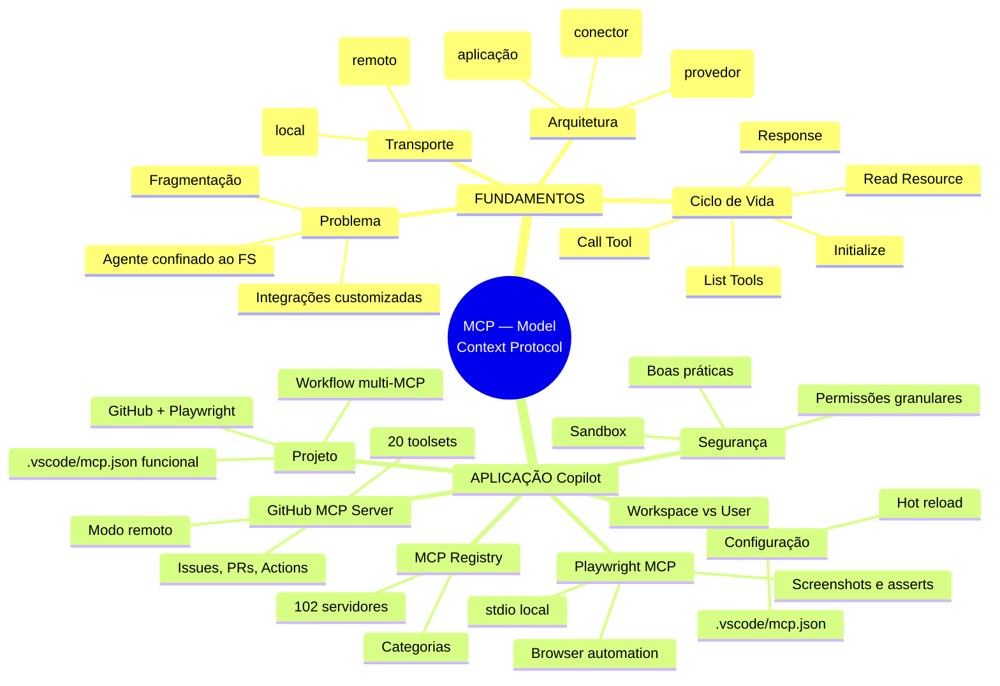
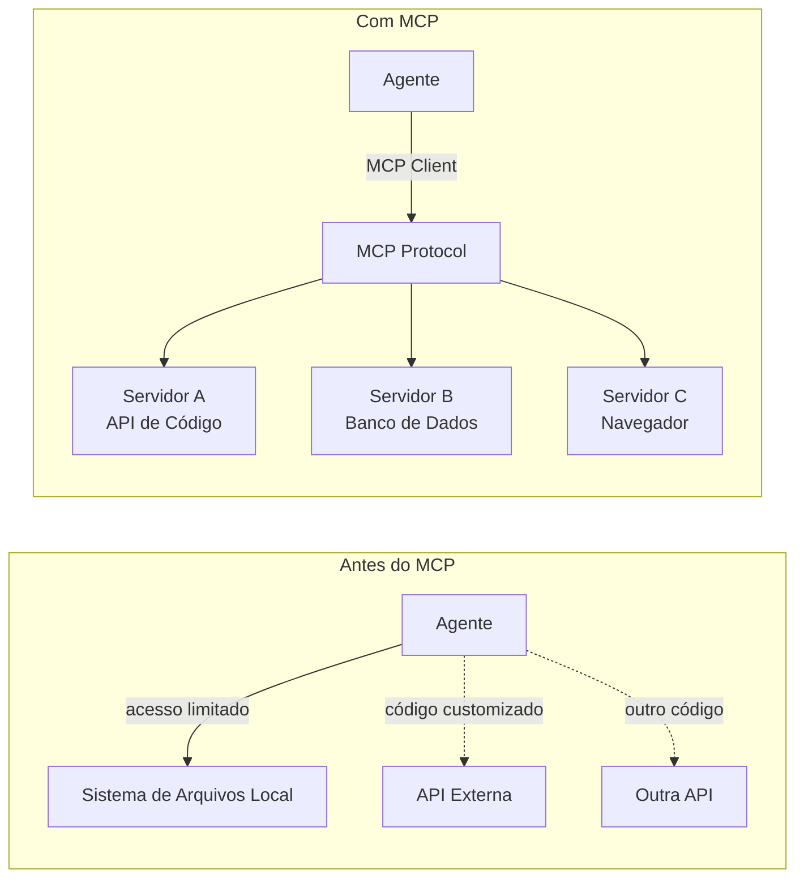
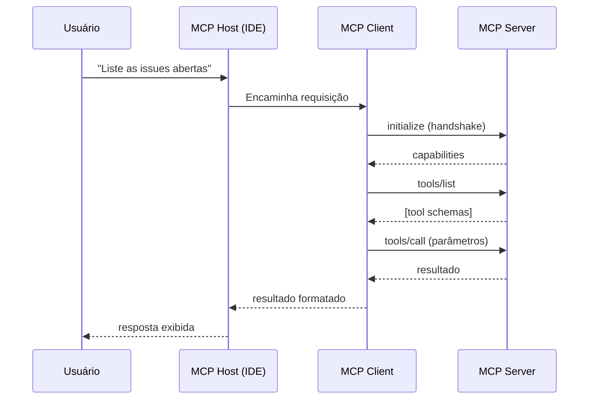
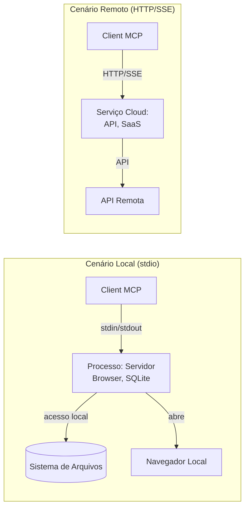
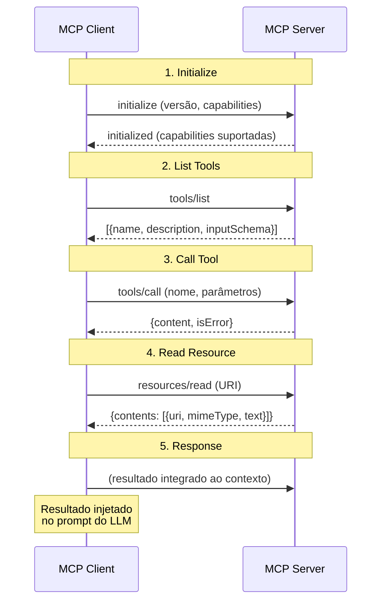
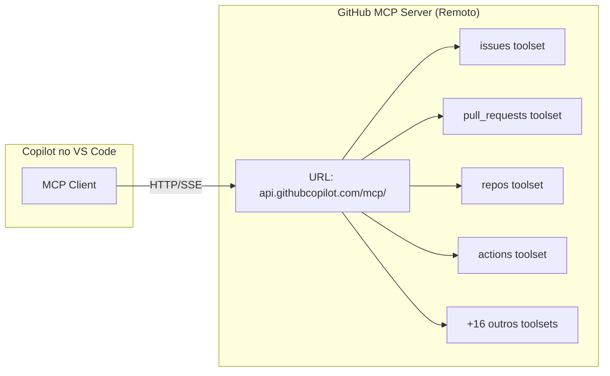
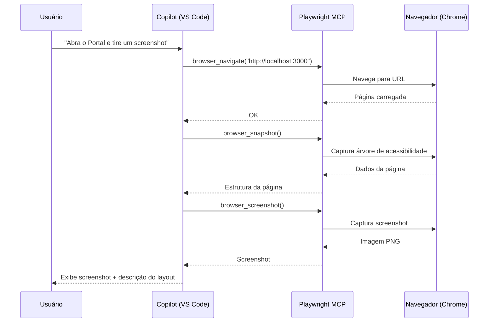
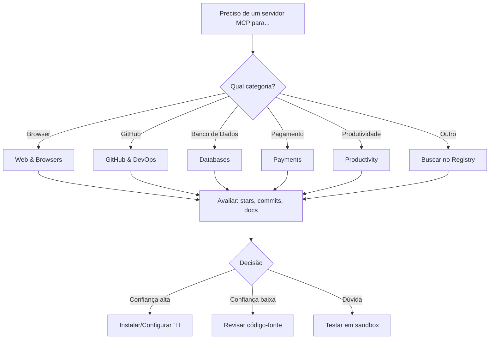
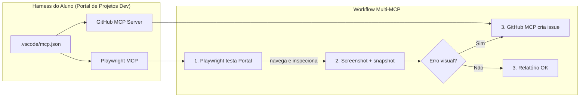

# Harness do GitHub Copilot e Programação Agêntica com VS Code — Aula 09

## MCP — Model Context Protocol no Copilot

**Duração estimada:** 90 minutos (55 de leitura + 35 de prática)
**Nível:** Intermediário
**Pré-requisitos:** Aulas 01-08 concluídas. VS Code com GitHub Copilot instalado e autenticado. Git e GitHub CLI (`gh`) configurados e autenticados. Node.js e `npx` instalados. Chrome ou Chromium disponível. Harness existente com `copilot-instructions.md`, `.github/skills/`, `.github/agents/` e Portal de Projetos Dev funcional.

---

## Objetivos de Aprendizagem

Ao final desta aula, você será capaz de:

- [ ] **Explicar** o problema que o MCP resolve — conectar agentes de IA a dados e ferramentas externas, superando a limitação do sistema de arquivos local
- [ ] **Descrever** a arquitetura cliente-servidor do MCP — Host, Client e Server — e o papel de cada componente no fluxo de comunicação
- [ ] **Comparar** os dois mecanismos de transporte — stdio (processo local) vs HTTP/SSE (servidor remoto) — e decidir qual usar em cada cenário
- [ ] **Traçar** o ciclo de vida completo de uma interação MCP: initialize, list tools, call tool, read resource e response
- [ ] **Configurar** servidores MCP no Copilot via `.vscode/mcp.json`, especificando type, url, command, args e env conforme o servidor
- [ ] **Mapear** os 20 toolsets do GitHub MCP Server e seus casos de uso
- [ ] **Conectar** o Playwright MCP para automação de browser
- [ ] **Explorar** o MCP Registry (102 servidores curados em github.com/mcp) — categorias e critérios de avaliação
- [ ] **Avaliar** os riscos de segurança do MCP — permissões granulares, sandbox e boas práticas de mitigação
- [ ] **Integrar** GitHub MCP Server e Playwright MCP ao harness do Portal de Projetos Dev, executando tarefas reais que expandem o alcance do Copilot além do sistema de arquivos local

---

## Como Usar Esta Aula

Esta aula está organizada em duas partes. A **primeira parte** constrói os fundamentos de protocolos de extensão para coding agents — conceitos universais que valem para qualquer ferramenta, independentemente de IDE, provedor ou ecossistema. A **segunda parte** aplica esses conceitos na prática com o GitHub Copilot, configurando servidores MCP reais e expandindo o alcance do seu harness.

Ao longo do caminho, você encontrará seções **"Mão na Massa"** (para fazer, não só ler) e **"Quick Check"** (para verificar se entendeu antes de avançar). Ao final, o arquivo separado **Questões de Aprendizagem** traz as tarefas de checkpoint — só avance para a próxima aula quando conseguir completá-las por conta própria.

**Tempo estimado:** 55 minutos de leitura + 35 minutos de prática.
**Dica:** Tenha o VS Code com o Portal de Projetos Dev aberto durante a segunda parte. Você criará o `.vscode/mcp.json` dentro do diretório do projeto.

---

## Mapa Mental

Este diagrama mostra todos os conceitos que você vai dominar nesta aula:




---

## Recapitulação das Aulas Anteriores

| Aula | Conceito | Onde aparece nesta aula | Como se conecta |
|---|---|---|---|
| Aula 01 | **Paradigma agêntico** (8 dimensões) | Seção 1 — Por que o MCP existe | O MCP expande a dimensão "ferramentas" do agente |
| Aula 02 | **Setup do Copilot** e `copilot-instructions.md` | Seção 5 — Configuração | O `.vscode/mcp.json` coexiste com o harness existente |
| Aula 03 | **Custom Instructions** condicionais | Seção 5 — Configuração | Instructions + MCP = conhecimento + ferramentas |
| Aula 04 | **@mentions e contexto** | Seção 1 — Alcance do agente | MCP adiciona dados externos ao contexto |
| Aula 05 | **Agent Mode** ciclo Understand→Act→Validate | Seção 10 — Projeto | O ciclo se aplica a ferramentas MCP também |
| Aula 06 | **Slash commands** /plan, /fix, /tests | Seção 10 — Workflow integrado | MCP amplia o que o Copilot pode executar |
| Aula 07 | **Agent Skills** em `.github/skills/` | Seções 6-7 — Servidores MCP | Skills são conhecimento; MCPs são ferramentas |
| Aula 08 | **Custom Agents** e delegação com runSubagent | Seções 9-10 — Segurança e Projeto | Agents + MCP = agentes com acesso ao mundo real |

---

**FUNDAMENTOS: Protocolos de Extensão para Agentes de IA**

> *Os conceitos desta seção são universais — valem para qualquer protocolo de extensão, independentemente do provedor de IA, editor ou ferramenta específica. Na segunda parte, você verá como o Copilot implementa cada um deles.*

---

## 1. Por que o MCP Existe?

### O Problema do Agente Confinado

Um agente de IA, por padrão, só enxerga o que está no seu contexto de entrada: o histórico da conversa, o código-fonte do projeto e algumas ferramentas built-in. Ele não consegue acessar uma issue no GitHub, consultar um banco de dados, navegar em uma página web ou disparar um workflow de CI/CD.

> *Um coding agent sem acesso a serviços externos é como um programador sem acesso à internet — capaz, mas terrivelmente limitado.*

Antes do MCP, cada integração exigia código customizado. Você queria que o agente lesse issues? Precisava escrever um plugin, configurar uma API, tratar autenticação, parsear respostas. O resultado: fragmentação de soluções, retrabalho entre projetos e nenhum padrão comum.

### A Solução: Um Protocolo Universal

O **Model Context Protocol (MCP)** , proposto em 2024 como padrão aberto e adotado por Microsoft, Google, OpenAI e outros, resolve exatamente isso. Ele define um padrão aberto para agentes de IA descobrirem e chamarem ferramentas externas — um "USB-C para agentes de IA".




No cenário "antes", o agente tem acesso a um único sistema (o filesystem local) e cada integração externa exige implementação sob medida. No cenário "com MCP", o agente se conecta a um ecossistema de servidores padronizados — cada servidor expõe suas capacidades de forma consistente, e o agente as descobre dinamicamente.

**Por que um padrão é melhor que integrações customizadas?**

- **Descoberta dinâmica:** o agente pergunta "o que você oferece?" e o servidor responde com a lista de ferramentas disponíveis. Sem código fixo.
- **Schema uniforme:** toda ferramenta é descrita com JSON Schema — nome, descrição, parâmetros, tipos. O agente sabe exatamente como chamá-la.
- **Troca de servidores:** você substitui um servidor por outro compatível sem mudar o código do agente.
- **Ecossistema:** centenas de servidores prontos — de APIs de código a serviços de pagamento.

### Quick Check 1

**1. Qual problema central o MCP resolve para coding agents?**
**Resposta:** O agente por padrão só acessa o sistema de arquivos local e o contexto da conversa. MCP permite que ele se conecte a ferramentas e dados externos (APIs, bancos, navegadores) através de um protocolo padronizado.

**2. Por que um protocolo padrão é melhor que integrações customizadas?**
**Resposta:** Porque elimina fragmentação: descoberta dinâmica de ferramentas, schema uniforme (JSON Schema), intercambiabilidade de servidores e um ecossistema crescente de servidores prontos.

---

## 2. Arquitetura Cliente-Servidor

### Os Três Atores do Ecossistema MCP

A arquitetura do MCP tem três componentes distintos, cada um com responsabilidades claras:

- **MCP Host:** a aplicação que embarca o agente de IA. É o ambiente onde o usuário interage com o agente — uma IDE, um editor de texto, um chat desktop. O host gerencia a vida útil das conexões MCP, mas não fala diretamente com os servidores.
- **MCP Client:** o conector que vive dentro do host. Cada host pode ter um ou mais clients MCP. O client é quem estabelece e gerencia as conexões com os servidores — ele negocia capacidades, envia requisições e recebe respostas.
- **MCP Server:** o provedor de ferramentas e dados. Cada servidor expõe um conjunto de capacidades (tools, resources, prompts) que o client pode descobrir e invocar. O servidor roda como um processo separado — local (stdio) ou remoto (HTTP/SSE).




O fluxo começa quando o usuário faz uma pergunta que requer uma ferramenta externa. O host percebe que precisa de um servidor MCP e aciona o client. O client estabelece a conexão, descobre as ferramentas disponíveis, invoca a mais adequada e retorna o resultado ao host, que o apresenta ao usuário.

**Importante:** o agente de IA (LLM) não chama o servidor diretamente. Ele decide *qual ferramenta chamar*, mas a *execução* da chamada passa pelo client MCP, que gerencia a conexão, serializa os parâmetros e lida com erros.

### Quick Check 2

**1. Qual a diferença entre MCP Host e MCP Client?**
**Resposta:** O Host é a aplicação que embarca o agente (ex: uma IDE). O Client é o componente dentro do host que gerencia as conexões com servidores MCP. O host "possui" o client; o client "fala" com os servidores.

**2. Onde vive o MCP Server — dentro ou fora do processo do agente?**
**Resposta:** Fora. O servidor roda como um processo separado — seja local (subprocesso do host) ou remoto (serviço HTTP). O agente nunca executa código do servidor no seu próprio processo.

---

## 3. Mecanismos de Transporte

### Dois Caminhos para Comunicar

O MCP define dois mecanismos de transporte para a comunicação entre client e server. Cada um tem trade-offs distintos de latência, segurança e complexidade.

### stdio — Comunicação Local via Processo Filho

No transporte **stdio**, o host inicia o servidor MCP como um subprocesso e se comunica com ele via stdin/stdout. O client envia mensagens JSON-RPC pelo stdin do processo filho; o servidor responde pelo stdout.

**Quando usar stdio:**
- O servidor precisa acessar recursos locais (sistema de arquivos, banco local, hardware)
- A latência de rede não é aceitável
- O servidor processa dados sensíveis que não devem sair da máquina
- Ferramentas de build, linters, bancos de dados locais

**Vantagens:** latência zero de rede, isolamento natural (processo separado), sem dependência de conectividade.
**Desvantagens:** servidor precisa estar instalado localmente, consome recursos da máquina do usuário.

### HTTP/SSE — Comunicação Remota via Serviço Web

No transporte **HTTP/SSE**, o servidor MCP roda como um serviço web acessível por URL. O client usa HTTP para enviar requisições e Server-Sent Events (SSE) para receber streaming de respostas.

**Quando usar HTTP/SSE:**
- O servidor é um serviço SaaS (GitHub, Stripe, Notion)
- Múltiplos usuários compartilham o mesmo servidor
- O servidor requer autenticação centralizada (OAuth, tokens de API)
- O servidor é pesado demais para rodar localmente

**Vantagens:** sem instalação local, acesso a serviços cloud, escalabilidade centralizada.
**Desvantagens:** latência de rede, dependência de conectividade, superfície de ataque maior.

### Tabela Comparativa

| Critério | stdio | HTTP/SSE |
|---|---|---|
| Latência | Zero (IPC local) | Dependente de rede |
| Instalação | Requer instalação local | Nenhuma (URL apenas) |
| Isolamento | Processo filho isolado | Conexão de saída |
| Autenticação | Variáveis de ambiente | Token, OAuth, headers |
| Recursos | Consome CPU/RAM local | Servidor compartilhado |
| Ideal para | DBs locais, build tools, linters | APIs cloud, serviços SaaS |
| Exemplo | Servidor de Browser Local, Servidor SQLite | Servidor de API Cloud, Servidor SaaS |




### Quick Check 3

**1. Quando você escolheria stdio em vez de HTTP/SSE para um servidor MCP?**
**Resposta:** Quando o servidor precisa acessar recursos locais (navegador, sistema de arquivos, banco local), quando a latência de rede não é aceitável, ou quando os dados são sensíveis demais para sair da máquina.

**2. Qual a principal vantagem do HTTP/SSE sobre stdio?**
**Resposta:** Não requer instalação local — o servidor roda como serviço cloud. Basta configurar a URL e autenticação. Ideal para APIs SaaS como GitHub, Stripe, Notion.

---

## 4. Ciclo de Vida de uma Interação MCP

### As 5 Etapas de Toda Chamada MCP

Cada interação entre um client MCP e um servidor segue um ciclo de vida bem definido. Entender essas etapas é fundamental para configurar, depurar e otimizar servidores MCP.




### Etapa 1: Initialize (Handshake)

O client envia uma mensagem `initialize` com a versão do protocolo que suporta e suas capacidades. O servidor responde com sua própria versão e as capacidades que implementa. Se as versões forem incompatíveis, a conexão é rejeitada.

**O que pode dar errado:** versões incompatíveis do protocolo, capabilities não suportadas que o client tenta usar.

### Etapa 2: List Tools (Descoberta)

O client pergunta "o que você oferece?" com `tools/list`. O servidor retorna um array de schemas JSON descrevendo cada ferramenta: nome, descrição, parâmetros (nome, tipo, obrigatório, descrição).

**O que pode dar errado:** servidor lento para listar ferramentas (centenas de tools), schemas malformados.

### Etapa 3: Call Tool (Execução)

O client invoca `tools/call` com o nome da ferramenta e os parâmetros. O servidor executa a operação e retorna o resultado — que pode ser texto, JSON, binário (imagem, áudio), ou um erro.

**O que pode dar errado:** timeout de execução, parâmetros inválidos, erro interno no servidor.

### Etapa 4: Read Resource (Acesso a Dados)

Além de ferramentas (ações), servidores MCP podem expor **resources** (dados). O client usa `resources/read` com uma URI para acessar conteúdo gerenciado pelo servidor — como o conteúdo de um arquivo remoto, o resultado de uma query, ou um snapshot de estado.

**O que pode dar errado:** URI inválida, permissão negada, recurso não encontrado.

### Etapa 5: Response (Integração ao Contexto)

O resultado retorna ao client, que o formata e injeta no contexto do LLM. O agente agora tem os dados necessários para responder ao usuário ou decidir o próximo passo.

### Ciclo Completo na Prática

Um único comando do usuário pode disparar múltiplos ciclos MCP. Por exemplo: "Analise as issues abertas do repositório e crie um relatório" → 1º ciclo (lista issues) → análise → 2º ciclo (lê detalhes de cada issue) → formata relatório.

### Quick Check 4

**1. Em que etapa o agente descobre quais ferramentas estão disponíveis?**
**Resposta:** Na etapa 2 (List Tools), através do comando `tools/list`. O servidor retorna o schema JSON de cada ferramenta disponível.

**2. O que acontece se o servidor não suportar uma capability solicitada no initialize?**
**Resposta:** O servidor informa na resposta do `initialize` quais capabilities suporta. O client deve respeitar essa resposta e não tentar usar capabilities não suportadas. Se a capability for essencial, o client pode encerrar a conexão.

---

**APLICAÇÃO: MCP no Copilot com GitHub e Playwright**

> *Agora que você entende os fundamentos do MCP — arquitetura, transporte e ciclo de vida — vamos conectá-los à prática com o GitHub Copilot no VS Code, configurando servidores reais que expandem o alcance do seu harness.*

---

## 5. Configuração no Copilot — `.vscode/mcp.json`

### O Ponto Único de Configuração

No GitHub Copilot, a configuração de servidores MCP é feita através do arquivo `.vscode/mcp.json` no diretório `.vscode/` do seu projeto. Este é o **ponto único de configuração** — você declara todos os servidores MCP aqui, e o Copilot gerencia as conexões automaticamente.

### Estrutura do Arquivo

```json
{
  "servers": {
    "nome-logico-do-servidor": {
      "type": "stdio",
      "command": "npx",
      "args": ["@playwright/mcp@latest"],
      "env": {
        "VARIÁVEL": "valor"
      }
    },
    "outro-servidor": {
      "type": "http",
      "url": "https://api.exemplo.com/mcp/",
      "headers": {
        "Authorization": "Bearer ${input:meu_token}"
      }
    }
  },
  "inputs": [
    {
      "type": "promptString",
      "id": "meu_token",
      "description": "Token de acesso",
      "password": true
    }
  ]
}
```

**Campos por servidor:**

| Campo | Tipo | Obrigatório | Descrição |
|---|---|---|---|
| `type` | `"stdio"` ou `"http"` | Sim | Define o mecanismo de transporte |
| `url` | string | Para HTTP | URL do endpoint MCP remoto |
| `command` | string | Para stdio | Comando para iniciar o servidor local |
| `args` | string[] | Opcional | Argumentos do comando |
| `env` | object | Opcional | Variáveis de ambiente do servidor |
| `headers` | object | Opcional | Headers HTTP (apenas para type http) |

### Escopo: Workspace vs Usuário

- **Workspace** (`.vscode/mcp.json`): versionado com o projeto, compartilhado com o time. Ideal para servidores específicos do projeto, como GitHub MCP Server.
- **Usuário** (`~/.copilot/mcp.json`): configuração pessoal, não versionada. Ideal para servidores locais de uso pessoal, como Playwright MCP.

O Copilot combina ambos os escopos — servidores declarados nos dois arquivos são carregados simultaneamente.

### Hot Reload

Uma das vantagens mais práticas: **hot reload**. Você edita o `.vscode/mcp.json` com o VS Code aberto, e o Copilot detecta as mudanças automaticamente em segundos. Não precisa reiniciar o editor nem recarregar a janela.

> *Isso significa que você pode adicionar, remover ou modificar servidores MCP em tempo real, enquanto trabalha.*

### Mão na Massa 1 — Criar `.vscode/mcp.json`

**Dificuldade: Fácil | Duração: 3 minutos**

- [ ] Abra o terminal no diretório do seu Portal de Projetos Dev
- [ ] Crie o diretório `.vscode/` se ele não existir: `mkdir -p .vscode`
- [ ] Crie o arquivo `.vscode/mcp.json` com o conteúdo mínimo:

```json
{
  "servers": {}
}
```

**Verificação:** O arquivo existe em `.vscode/mcp.json` e tem JSON válido. Teste com `cat .vscode/mcp.json | python -m json.tool` (ou equivalente).

### Quick Check 5

**1. Qual campo define se um servidor MCP é local (stdio) ou remoto (HTTP)?**
**Resposta:** O campo `type`. `"type": "stdio"` para servidor local, `"type": "http"` para servidor remoto.

**2. O que acontece quando você edita `.vscode/mcp.json` com o VS Code aberto?**
**Resposta:** O Copilot detecta as mudanças automaticamente via hot reload — não precisa reiniciar o editor. Os servidores adicionados/removidos são atualizados em segundos.

---

## 6. GitHub MCP Server — 20 Toolsets

### O Servidor que Conecta o Copilot ao GitHub

O **GitHub MCP Server** é o servidor oficial da GitHub que expõe as capacidades da plataforma GitHub como ferramentas MCP. Com ele, seu Copilot pode ler issues, criar pull requests, disparar Actions, consultar alertas de segurança e muito mais — tudo diretamente do chat.

**Modo de operação:** remoto (HTTP/SSE). O servidor roda na infraestrutura da GitHub. Você não instala nada — só configura a URL e a autenticação.

### Configuração no `.vscode/mcp.json`

```json
{
  "servers": {
    "github": {
      "type": "http",
      "url": "https://api.githubcopilot.com/mcp/"
    }
  }
}
```

**Autenticação:** o GitHub MCP Server usa sua sessão do Copilot (já autenticada no VS Code). Se você precisa de um token separado, pode usar o campo `headers` com autenticação Bearer.

### Os 20 Toolsets

O GitHub MCP Server expõe **20 toolsets** (categorias de ferramentas), cada um com múltiplas tools individuais. Você pode controlar quais toolsets estão disponíveis via variável de ambiente `GITHUB_TOOLSETS` ou pelo configurador do servidor.

| # | Toolset | Descrição | Exemplo de Uso |
|---|---|---|---|
| 1 | `context` | Contexto do usuário e repositório | "Quem sou eu?" "Qual repositório estou vendo?" |
| 2 | `repos` | Gerenciar repositórios | Listar, criar, buscar repositórios |
| 3 | `issues` | Gerenciar issues | Criar, listar, comentar, fechar issues |
| 4 | `pull_requests` | Gerenciar pull requests | Criar, revisar, mergear PRs |
| 5 | `actions` | GitHub Actions | Disparar workflows, ver logs, status |
| 6 | `code_security` | Code Scanning | Listar e consultar alertas de segurança |
| 7 | `code_quality` | Qualidade de código | Ferramentas de análise estática |
| 8 | `dependabot` | Dependabot | Gerenciar alerts de dependências |
| 9 | `discussions` | GitHub Discussions | Criar e listar discussões |
| 10 | `gists` | GitHub Gists | Criar e gerenciar gists |
| 11 | `git` | Operações Git baixo nível | Blobs, trees, refs |
| 12 | `labels` | Labels | Gerenciar labels de issues/PRs |
| 13 | `notifications` | Notificações | Listar e marcar notificações |
| 14 | `orgs` | Organizações | Informações de organização |
| 15 | `projects` | GitHub Projects | Gerenciar projects (beta) |
| 16 | `secret_protection` | Proteção de segredos | Push protection, scan de secrets |
| 17 | `security_advisories` | Security Advisories | Consultar advisories de segurança |
| 18 | `stargazers` | Stargazers | Listar stargazers de repositórios |
| 19 | `users` | Usuários | Informações de usuários |
| 20 | `copilot` | Copilot | Métricas e configurações do Copilot |

**Toolsets remotos adicionais:** além dos 20 acima, o modo remoto também expõe `copilot_spaces` e `github_support_docs_search`.

### Controle de Toolsets

Você pode limitar quais toolsets o GitHub MCP Server expõe, reduzindo a superfície de acesso:

```json
{
  "servers": {
    "github": {
      "type": "http",
      "url": "https://api.githubcopilot.com/mcp/",
      "headers": {
        "X-MCP-Toolsets": "issues,pull_requests,repos,context"
      }
    }
  }
}
```

Isso limita o servidor a apenas 4 toolsets — ideal quando o agente só precisa de issues, PRs, repositórios e contexto.

### Modo Read-Only

Para operações exclusivamente de leitura, use o path `/mcp/x/issues/readonly`:

```json
{
  "servers": {
    "github-readonly": {
      "type": "http",
      "url": "https://api.githubcopilot.com/mcp/issues/readonly"
    }
  }
}
```




### Mão na Massa 2 — Primeiro Comando GitHub MCP

**Dificuldade: Fácil | Duração: 5 minutos**

- [ ] Adicione o GitHub MCP Server ao `.vscode/mcp.json`:

```json
{
  "servers": {
    "github": {
      "type": "http",
      "url": "https://api.githubcopilot.com/mcp/"
    }
  }
}
```

- [ ] Abra o chat do Copilot no VS Code
- [ ] Digite: "Liste as issues abertas deste repositório" (seu repositório local)
- [ ] Observe o Copilot descobrir a ferramenta de issues e chamá-la

**Verificação:** O Copilot responde com a lista de issues (pode ser vazia se não houver issues). No output do chat, você vê algo como "ßÆUsando ferramenta: issue_list" ou indicativo similar de chamada MCP.

### Quick Check 6

**1. Como você limitaria o GitHub MCP Server para acessar apenas issues e PRs (não actions, nem repos)?**
**Resposta:** Configurando o header `X-MCP-Toolsets` no `.vscode/mcp.json`: `"X-MCP-Toolsets": "issues,pull_requests"`. Isso restringe o servidor a apenas esses toolsets.

**2. O GitHub MCP Server usa transporte stdio ou HTTP/SSE? Por quê?**
**Resposta:** Usa HTTP/SSE (remoto) porque é um serviço SaaS da GitHub. Não requer instalação local, usa a autenticação já existente do Copilot, e é compartilhado por milhões de usuários.

---

## 7. Playwright MCP — Automação de Browser

### O Servidor que Dá Olhos ao Copilot

O **Playwright MCP** é o servidor oficial da Microsoft que permite ao Copilot controlar um navegador real. Com ele, seu agente pode navegar por páginas web, clicar em elementos, preencher formulários, capturar screenshots e executar JavaScript no contexto da página.

**Modo de operação:** stdio (local). O servidor roda como um processo local que controla uma instância do Chromium, Firefox ou WebKit.

### Configuração no `.vscode/mcp.json`

```json
{
  "servers": {
    "playwright": {
      "type": "stdio",
      "command": "npx",
      "args": ["@playwright/mcp@latest"]
    }
  }
}
```

**Pré-requisito:** Node.js e `npx` instalados (você já tem desde a Aula 07). Chrome ou Chromium instalado (o Playwright usa a instalação do sistema ou baixa a própria).

### Ferramentas Principais

| Tool | Descrição | Exemplo de Uso |
|---|---|---|
| `browser_navigate` | Navegar para uma URL | "Abra o portal de projetos" |
| `browser_click` | Clicar em um elemento | "Clique no botão 'Adicionar Projeto'" |
| `browser_hover` | Passar mouse sobre elemento | "Passe o mouse sobre o card para ver opções" |
| `browser_fill_form` | Preencher múltiplos campos | "Preencha o formulário com os dados do projeto" |
| `browser_press_key` | Pressionar tecla | "Pressione Enter" |
| `browser_snapshot` | Capturar árvore de acessibilidade | "O que está visível na página agora?" |
| `browser_screenshot` | Capturar screenshot | "Tire um print da página" |
| `browser_evaluate` | Executar JavaScript | "Execute um script para contar os cards" |
| `browser_resize` | Redimensionar viewport | "Simule viewport de mobile (375x667)" |
| `browser_close` | Fechar navegador | "Feche o navegador" |

### Casos de Uso no Desenvolvimento

- **Testar o Portal de Projetos Dev:** navegar, verificar se os cards carregam, clicar em filtros
- **Verificar responsividade:** redimensionar viewport e capturar screenshots em diferentes resoluções
- **Validar formulários:** preencher dados, submeter, verificar mensagens de erro/sucesso
- **Screenshots de regressão:** capturar estado visual antes e depois de mudanças
- **Debug visual:** abrir a página, inspecionar elementos, ler console errors




### Mão na Massa 3 — Primeiro Screenshot com Playwright MCP

**Dificuldade: Médio | Duração: 8 minutos**

- [ ] Adicione o Playwright MCP ao `.vscode/mcp.json`:

```json
{
  "servers": {
    "github": {
      "type": "http",
      "url": "https://api.githubcopilot.com/mcp/"
    },
    "playwright": {
      "type": "stdio",
      "command": "npx",
      "args": ["@playwright/mcp@latest"]
    }
  }
}
```

- [ ] Certifique-se de que seu Portal de Projetos Dev está rodando (abra o `index.html` no navegador ou sirva com `npx serve .`)
- [ ] No chat do Copilot, digite: "Use o Playwright para abrir o Portal de Projetos Dev no navegador, tire um screenshot e descreva o layout que você vê"
- [ ] Observe: o Copilot vai chamar `browser_navigate`, depois `browser_snapshot` (para entender a página), depois `browser_screenshot`

**Verificação:** O Copilot responde com uma descrição do layout e o screenshot. Você vê a janela do navegador abrir e fechar automaticamente (ou permanece aberta, dependendo da configuração do Playwright).

### Quick Check 7

**1. O Playwright MCP usa stdio ou HTTP/SSE? Por que isso importa para testes locais?**
**Resposta:** Usa stdio. Isso importa porque o Playwright precisa controlar um navegador local (processo na sua máquina). Comunicação via stdin/stdout é mais rápida que HTTP e não requer configurar servidor web.

**2. Que ferramenta Playwright você usaria para verificar se um botão está visível na página?**
**Resposta:** `browser_snapshot` — captura a árvore de acessibilidade da página, que inclui todos os elementos visíveis, seus papéis (role) e estados. O Copilot pode então analisar se o botão está presente na árvore.

---

## 8. MCP Registry — O Ecossistema de Servidores

### O Catálogo Curado da Comunidade

O **MCP Registry** (github.com/mcp) é um catálogo curado de servidores MCP mantido pela comunidade. Em junho de 2026, o Registry lista **102 servidores** organizados por categoria — do GitHub ao Stripe, do Supabase ao Playwright.

### Categorias e Exemplos

| Categoria | Quantidade | Exemplos Notáveis |
|---|---|---|
| Web & Browsers | 7 | Playwright, Chrome DevTools, Firecrawl |
| GitHub & DevOps | 9 | GitHub MCP Server, Azure DevOps, Terraform, Vercel |
| Code & Development | 10 | Context7, Serena, Nuxt, Svelte |
| Code Quality | 8 | Sentry, SonarQube, Snyk, Codacy |
| AI & ML | 3 | Hugging Face, Azure AI Foundry |
| Productivity | 6 | Notion, Atlassian, Todoist, Monday |
| Design | 3 | Figma, Miro |
| Databases | 8 | Supabase, MongoDB, Elasticsearch, Neon |
| Payments | 5 | Stripe, Intercom, Amplitude |
| Outros | 43 | Markitdown (156k ‘&), Unity, Desktop Commander |

### Como Descobrir Novos Servidores

1. Acesse **github.com/mcp** — o hub central com busca e categorias
2. Navegue por categoria no menu lateral
3. Avalie cada servidor por:
   - **Stars no GitHub:** indicador de adoção e confiança
   - **Frequência de commits:** servidor ativo ou abandonado?
   - **Documentação:** tem README claro? Exemplos de configuração?
   - **Licença:** permite uso comercial?
   - **Dependências:** quantas e quais dependências externas?

### Fluxograma de Decisão




### Quick Check 8

**1. Quantos servidores o MCP Registry cataloga atualmente e em qual URL?**
**Resposta:** 102 servidores (em junho de 2026), em github.com/mcp.

**2. Cite 3 critérios para avaliar se um servidor MCP externo é confiável.**
**Resposta:** (1) Número de stars no GitHub (adoção da comunidade); (2) Frequência de commits (manutenção ativa); (3) Clareza da documentação e exemplos de configuração.

---

## 9. Segurança no MCP

### Riscos de Conectar Agentes a Serviços Externos

Conectar seu agente de IA a serviços externos expande o alcance — mas também introduz riscos. Um servidor MCP malicioso ou mal configurado pode:

- Exfiltrar código-fonte ou dados sensíveis
- Executar comandos não autorizados na sua máquina
- Vazar tokens de API e credenciais
- Manipular o agente para agir em seu nome sem seu conhecimento

### Mecanismos de Mitigação do MCP

| Risco | Mitigação | Como Implementar |
|---|---|---|
| Servidor malicioso | **Sandbox por transporte** | Servidores stdio rodam como processos filhos isolados, sem acesso à rede por padrão |
| Acesso excessivo | **Toolsets granulares** | Limitar toolsets do GitHub MCP via `X-MCP-Toolsets` |
| Escrita não autorizada | **Modo read-only** | Usar path `/mcp/x/issues/readonly` para acesso somente leitura |
| Vazamento de tokens | **Inputs seguros** | Usar `${input:variavel}` no lugar de colocar tokens no `env` |
| Schema inválido | **Validação JSON Schema** | O host valida parâmetros antes de enviar ao servidor |
| Dados sensíveis no contexto | **Content exclusion** | Arquivos sensíveis excluídos com `.copilot/exclude` |

### Boas Práticas de Segurança

1. **Nunca coloque tokens diretamente no campo `env`.** Use `${input:variavel}` combinado com `inputs` no `.vscode/mcp.json`. O valor é solicitado ao usuário e nunca fica hardcoded no arquivo versionado.

2. **Prefira servidores oficiais e verificados.** O GitHub MCP Server (github/github-mcp-server) e Playwright MCP (microsoft/playwright-mcp) são mantidos por suas respectivas empresas. Servidores de terceiros exigem revisão de código-fonte.

3. **Limite toolsets ao necessário.** Se seu agente só precisa ler issues, não dê acesso a `actions`, `repos` ou `secret_protection`. Use o header `X-MCP-Toolsets` para restringir.

4. **Use tokens com escopo mínimo.** Crie tokens de acesso pessoal com apenas as permissões necessárias para a tarefa. Não use tokens com escopo `repo` completo se o agente só precisa ler issues.

5. **Revise servidores stdio.** Servidores locais têm acesso ao sistema de arquivos. Antes de instalar um servidor stdio de terceiros, revise seu código-fonte (se open source) ou opte por servidores oficiais.

6. **Mantenha servidores atualizados.** Assim como qualquer dependência, servidores MCP podem conter vulnerabilidades. Use `@latest` ou versões específicas testadas.

### Vetores de Ataque Específicos

- **Exfiltração de código:** servidor malicioso que, ao receber uma requisição, envia o contexto inteiro para um endpoint externo
- **Injeção de ferramentas:** servidor que declara tools que não implementa, apenas para coletar parâmetros
- **Escalação de privilégio:** servidor stdio com command injection via argumentos não sanitizados
- **Vazamento em logs:** servidor que loga parâmetros das chamadas, incluindo tokens ou dados sensíveis

### Quick Check 9

**1. Por que você NUNCA deve colocar tokens diretamente no campo `env` do `.vscode/mcp.json`?**
**Resposta:** Porque `.vscode/mcp.json` é versionado (compartilhado no repositório). Tokens hardcoded vazam para o Git e para outros membros do time. Use `${input:variavel}` para solicitar o token interativamente sem versioná-lo.

**2. Qual a diferença de superfície de ataque entre um servidor stdio e um HTTP/SSE?**
**Resposta:** Um servidor stdio roda como processo local e tem acesso direto ao sistema de arquivos e recursos da máquina — maior risco se for malicioso. Um servidor HTTP/SSE é remoto e acessível via rede — menor risco local, mas maior risco de exfiltração de dados (tudo que o agente envia viaja pela rede).

---

## 10. Projeto — Conectando MCP ao Portal de Projetos Dev

### A Peça do Harness

Esta é a peça do **projeto progressivo** da Aula 09. Você vai conectar **dois servidores MCP** ao seu harness existente e executar um workflow integrado que demonstra o poder do Copilot expandido.

### O Que Você Vai Construir

1. `.vscode/mcp.json` com GitHub MCP Server + Playwright MCP
2. Workflow integrado: Playwright testa o Portal → GitHub MCP cria issue se encontrar problema

### Passo 1: Configurar Ambos os Servidores

Abra seu `.vscode/mcp.json` e substitua o conteúdo pelo config completo com ambos os servidores:

```json
{
  "servers": {
    "github": {
      "type": "http",
      "url": "https://api.githubcopilot.com/mcp/"
    },
    "playwright": {
      "type": "stdio",
      "command": "npx",
      "args": ["@playwright/mcp@latest"]
    }
  }
}
```

### Passo 2: Verificar a Conexão

- [ ] Salve o arquivo. O Copilot detecta as mudanças via hot reload.
- [ ] No chat, pergunte: "Quais servidores MCP estão disponíveis?"
- [ ] O Copilot deve responder listando os dois servidores configurados

### Passo 3: Testar GitHub MCP

- [ ] No chat, digite: "Liste as issues abertas deste repositório usando o GitHub MCP Server"
- [ ] Verifique se o Copilot encontra e lista as issues (ou informa que não há issues)
- [ ] Tente criar uma issue: "Crie uma issue no repositório com o título 'Teste MCP Aula 09' e descrição 'Issue criada via GitHub MCP Server'"

**Verificação:** A issue aparece em github.com no repositório.

### Passo 4: Testar Playwright MCP

- [ ] Certifique-se de que o Portal de Projetos Dev está aberto ou servido localmente
- [ ] No chat, digite: "Use o Playwright para abrir o Portal, verifique quantos cards de projeto estão visíveis e tire um screenshot"
- [ ] O Copilot navega, inspeciona a página e captura o screenshot

**Verificação:** Screenshot exibido no chat com a descrição dos cards.

### Passo 5: Workflow Integrado (Desafio)

- [ ] No chat, digite: "Use o Playwright para verificar se o dashboard do Portal de Projetos Dev carrega corretamente. Se encontrar algum erro visual ou elemento quebrado, crie uma issue no GitHub documentando o problema."

**O que deve acontecer:**
1. Copilot usa Playwright MCP → navega para o Portal
2. Copilot usa `browser_snapshot` + `browser_screenshot` → inspeciona a página
3. Se detectar problema → Copilot usa GitHub MCP → cria issue descrevendo o problema
4. Se não detectar problema → Copilot informa que está tudo OK

**Verificação:** Issue criada (se problema detectado) ou relatório "tudo OK" no chat.




---

## Autoavaliação: Quiz Rápido

**1. Qual a diferença fundamental entre uma Agent Skill (Aula 07) e um MCP Server?**
**Resposta:**

Skills fornecem **conhecimento injetável** — instruções, templates, scripts que o agente carrega sob demanda. MCP Servers fornecem **ferramentas executáveis** — chamadas de API, operações em serviços externos, controle de navegador. Skills respondem "como fazer"; MCPs respondem "o que fazer externamente".

**2. O que acontece se o `type` no `.vscode/mcp.json` for `"http"` mas o campo `url` estiver faltando?**
**Resposta:**

O Copilot reporta um erro de configuração. O campo `url` é obrigatório quando `type` é `"http"`. O servidor não será carregado até que a URL seja fornecida.

**3. Por que o GitHub MCP Server usa HTTP/SSE enquanto o Playwright MCP usa stdio?**
**Resposta:**

O GitHub MCP Server é um serviço SaaS que milhões de usuários acessam — não faria sentido instalar localmente. O Playwright MCP precisa controlar um navegador na sua máquina — a comunicação local via stdio é mais rápida e não requer configurar um servidor web.

**4. Em que etapa do ciclo de vida MCP o servidor informa quais capabilities ele suporta?**
**Resposta:**

Na etapa 1 (Initialize). O client envia suas capabilities, o servidor responde com as capabilities que suporta. Se houver incompatibilidade, a conexão é rejeitada.

**5. Quantos toolsets o GitHub MCP Server oferece e como você limita quais estão ativos?**
**Resposta:**

20 toolsets (mais 2 remotos adicionais). Você limita com o header `X-MCP-Toolsets` no `.vscode/mcp.json` ou com a variável de ambiente `GITHUB_TOOLSETS` no servidor local.

**6. Qual ferramenta do Playwright MCP você usaria para entender a estrutura de uma página sem precisar de um screenshot?**
**Resposta:**

`browser_snapshot` — captura a árvore de acessibilidade da página, listando todos os elementos visíveis, seus papéis, estados e textos. É mais leve que screenshot e fornece dados estruturados que o LLM pode processar.

**7. Cite duas boas práticas de segurança ao configurar servidores MCP.**
**Resposta:**

(1) Nunca colocar tokens diretamente no campo `env` ou `headers` — usar `${input:nome}` com `inputs` no `.vscode/mcp.json`. (2) Limitar toolsets ao mínimo necessário com `X-MCP-Toolsets` em vez de expor todos os toolsets.

---

## Mão na Massa 4: Exercícios Graduados

**Exercício 1 (Fácil) — Mapa de Toolsets**

Usando o GitHub MCP Server configurado, peça ao Copilot para listar todas as ferramentas disponíveis. Identifique a qual toolset cada ferramenta pertence e crie uma tabela com 5 exemplos.

**Gabarito:**

No chat do Copilot, pergunte: "Liste todas as ferramentas disponíveis no GitHub MCP Server com seus respectivos toolsets". O Copilot deve responder com uma lista. Exemplo parcial:

| Tool | Toolset | Descrição |
|---|---|---|
| `issues_list` | issues | Lista issues de um repositório |
| `issues_create` | issues | Cria uma nova issue |
| `pull_requests_list` | pull_requests | Lista pull requests |
| `repos_list` | repos | Lista repositórios do usuário |
| `actions_list_workflows` | actions | Lista workflows do Actions |

Cada toolset contém múltiplas tools. O total de tools no GitHub MCP Server é superior a 60.

**Exercício 2 (Médio) — Issue Automatizada**

Usando o GitHub MCP Server, crie uma issue no repositório do Portal de Projetos Dev com:
- Título: "Adicionar filtro por data nos cards"
- Descrição: "Sugestão de funcionalidade: permitir filtrar projetos por data de criação"
- Label: "enhancement"
- Verifique no github.com que a issue foi criada corretamente

**Gabarito:**

Passo a passo:

1. No chat do Copilot, digite (ou similar, adaptando ao seu contexto):
   "Usando o GitHub MCP Server, crie uma issue no repositório atual com título 'Adicionar filtro por data nos cards', descrição 'Sugestão de funcionalidade: permitir filtrar projetos por data de criação', e label 'enhancement'."

2. O Copilot chama a ferramenta `issues_create` (ou equivalente) com os parâmetros:
   - `title`: "Adicionar filtro por data nos cards"
   - `body`: "Sugestão de funcionalidade: permitir filtrar projetos por data de criação"
   - `labels`: ["enhancement"]

3. O Copilot confirma a criação e retorna o URL da issue.

4. Verificação: abra `https://github.com/seu-usuario/seu-repo/issues` e confirme que a issue aparece com o label "enhancement".

**Desafio (Difícil) — Workflow Multi-MCP com Detecção de Problemas**

Crie um workflow onde o Playwright MCP abre o Portal de Projetos Dev, conta o número de cards visíveis, verifica se todos os cards têm título e descrição não vazios, e usa o GitHub MCP Server para criar uma issue documentando qualquer card inconsistente encontrado.

**Gabarito:**

Passo a passo:

1. No chat do Copilot, instrua (adaptando para seu contexto):
   "Use o Playwright para abrir o Portal de Projetos Dev. Conte quantos cards existem. Para cada card, verifique se o título e a descrição não estão vazios. Se encontrar algum card inconsistente, crie uma issue no GitHub usando o GitHub MCP Server documentando o problema."

2. O Copilot executa a sequência:
   - Chama `browser_navigate` para abrir o Portal
   - Chama `browser_snapshot` para obter a árvore de acessibilidade
   - Analisa a árvore para contar cards e verificar títulos/descrições
   - Se detectar inconsistência, chama `issues_create` no GitHub MCP Server

3. Resultado esperado:
   ```
   Resultado da inspeção do Portal:
   - Total de cards encontrados: 4
   - Cards com título e descrição OK: 3
   - Cards inconsistentes: 1 (Card "Projeto Beta" sem descrição)
   
   Issue criada: "Card inconsistente no Portal: Projeto Beta sem descrição"
   URL: https://github.com/seu-usuario/seu-repo/issues/5
   ```

**Premissas para o Desafio:**
- O Portal de Projetos Dev está servido localmente (via `npx serve` ou abrindo o HTML)
- Você tem permissão de escrita no repositório
- O Playwright MCP está configurado e funcional
- O GitHub MCP Server está configurado e autenticado

---

## Resumo da Aula

### Os 10 Conceitos Fundamentais

1. **MCP (Model Context Protocol)**: padrão aberto que conecta agentes de IA a dados e ferramentas externas — o "USB-C para agentes"
2. **Arquitetura cliente-servidor**: Host (aplicação que embarca o agente) → Client (conector) → Server (provedor de ferramentas)
3. **Transporte stdio**: comunicação via stdin/stdout de processo filho — ideal para servidores locais (Playwright, bancos locais)
4. **Transporte HTTP/SSE**: comunicação remota via HTTP — ideal para serviços cloud (GitHub MCP Server, Stripe)
5. **Ciclo de vida MCP**: Initialize → List Tools → Call Tool → Read Resource → Response — 5 etapas que governam toda interação
6. **`.vscode/mcp.json`**: ponto único de configuração de servidores MCP no Copilot — com hot reload e escopo workspace/user
7. **GitHub MCP Server**: 20 toolsets que expõem toda a plataforma GitHub como ferramentas MCP — issues, PRs, Actions, code security, etc.
8. **Playwright MCP**: automação de navegador — navegação, screenshots, assertions visuais, execução JS
9. **MCP Registry**: catálogo de 102 servidores curados em github.com/mcp — descubra, avalie e configure
10. **Segurança MCP**: permissões granulares, sandbox por transporte, validação de schema, content exclusion e boas práticas de tokens

### O Que Você Construiu Hoje

- [x] `.vscode/mcp.json` funcional no seu projeto
- [x] GitHub MCP Server configurado e testado (issues, PRs)
- [x] Playwright MCP configurado e testado (navegação, screenshot)
- [x] Workflow multi-MCP integrado ao Portal de Projetos Dev
- [x] Compreensão dos mecanismos de transporte e ciclo de vida MCP

---

## Próxima Aula

**Aula 10: Hooks, Plugins e Extensões**

Agora que seu Copilot tem acesso a ferramentas externas via MCP, a próxima aula vai mostrar como interceptar cada etapa do ciclo de vida do agente com **hooks de lifecycle** (PreToolUse, PostToolUse, SessionStart) e como empacotar todo o seu harness — skills, agents, MCPs e hooks — como um **Agent Plugin** distribuível. Você vai transformar seu harness de um conjunto de configurações em um produto empacotado.

---

## Referências

### Documentação Oficial

- [GitHub Docs — About MCP](https://docs.github.com/en/copilot/concepts/about-mcp) — Documentação oficial do GitHub sobre MCP no Copilot
- [MCP Specification (Anthropic)](https://modelcontextprotocol.io) — Especificação oficial do Model Context Protocol
- [VS Code Docs — MCP Servers](https://code.visualstudio.com/docs/agents/mcp) — Configuração de MCP no VS Code

### Ferramentas

- [GitHub MCP Server](https://github.com/github/github-mcp-server) — Repositório oficial do servidor MCP da GitHub (30k+ stars)
- [Playwright MCP](https://github.com/microsoft/playwright-mcp) — Repositório oficial do servidor MCP da Microsoft (34k+ stars)
- [MCP Registry](https://github.com/mcp) — Catálogo curado de servidores MCP (102 servidores)

### Artigos para Aprofundamento

- [Model Context Protocol: The New Standard for AI Tool Integration](https://modelcontextprotocol.io) — Documentação completa do protocolo
- [GitHub MCP Server Toolsets Documentation](https://docs.github.com/en/copilot/concepts/about-mcp) — Toolsets, modos e configuração
- [awesome-copilot](https://github.com/github/awesome-copilot) — 500+ recursos para GitHub Copilot

---

## FAQ

**P: O MCP funciona apenas com o GitHub Copilot?**
R: Não. MCP é um padrão aberto adotado por várias plataformas: Claude Desktop, ChatGPT, Cursor, Windsurf, VS Code (não só Copilot) e outras. O que muda é o local de configuração (`.vscode/mcp.json` no VS Code, `claude_desktop_config.json` no Claude).

**P: Posso usar MCP sem conexão com a internet?**
R: Depende do servidor. Servidores stdio (como Playwright MCP) funcionam offline — comunicação local. Servidores HTTP/SSE (como GitHub MCP Server) exigem internet.

**P: Quantos servidores MCP posso configurar ao mesmo tempo?**
R: Não há limite documentado. Na prática, cada servidor consome recursos (memória, processos). Configure apenas os que você usa ativamente.

**P: O `.vscode/mcp.json` é versionado? Devo commitá-lo?**
R: Sim, o arquivo é versionado normalmente. **Mas** evite colocar tokens/credenciais nele. Use `${input:variavel}` para valores sensíveis.

**P: O GitHub MCP Server funciona com GitHub Enterprise?**
R: Sim. Configure a URL para `https://copilot-api.sua-empresa.ghe.com/mcp` e use autenticação Bearer com token PAT.

**P: Preciso instalar o Playwright (`npx playwright install`) para usar o Playwright MCP?**
R: O Playwright MCP baixa o Chromium automaticamente na primeira execução. Você só precisa do Chrome/Chromium instalado no sistema.

**P: O MCP substitui as Agent Skills (Aula 07)?**
R: Não. Skills fornecem conhecimento injetável (como fazer). MCP fornece ferramentas executáveis (o que fazer externamente). São complementares — um agente pode usar ambos simultaneamente.

**P: Como faço para depurar se um servidor MCP não está funcionando?**
R: Verifique (1) se o JSON do `.vscode/mcp.json` é válido, (2) se o comando/servidor está instalado (para stdio), (3) se a URL está acessível (para HTTP), (4) se a autenticação está correta, (5) o log do Copilot no VS Code (Help → Toggle Developer Tools → Console).

**P: O que acontece se o servidor MCP demorar muito para responder?**
R: O Copilot tem um timeout configurável (padrão ~30s). Se o servidor exceder, a chamada falha e o Copilot informa o erro. Para servidores lentos, aumente o timeout no config.

**P: Existe risco de um servidor MCP acessar dados que não deveria?**
R: Sim. Por isso as boas práticas de segurança: limite toolsets, use tokens com escopo mínimo, revise servidores de terceiros, e nunca coloque tokens no arquivo versionado.

---

## Glossário

| Termo | Definição |
|---|---|
| **MCP (Model Context Protocol)** | Protocolo aberto para conectar agentes de IA a ferramentas e dados externos. (Ver seções 1-4) |
| **MCP Host** | Aplicação que embarca o agente de IA e gerencia as conexões MCP (ex: VS Code, Claude Desktop). (Ver seção 2) |
| **MCP Client** | Componente dentro do host que estabelece e gerencia conexões com servidores MCP. (Ver seção 2) |
| **MCP Server** | Provedor de ferramentas e dados que o client pode descobrir e invocar. (Ver seção 2) |
| **stdio** | Mecanismo de transporte via stdin/stdout de processo filho — comunicação local. (Ver seção 3) |
| **HTTP/SSE** | Mecanismo de transporte remoto via HTTP com Server-Sent Events para streaming. (Ver seção 3) |
| **JSON-RPC** | Protocolo de chamada remota usado pelo MCP para comunicação entre client e server. (Ver seção 4) |
| **Toolset** | Conjunto de ferramentas relacionadas em um servidor MCP (ex: "issues" toolset do GitHub MCP). (Ver seção 6) |
| **Tool** | Função executável exposta por um servidor MCP — descrita por JSON Schema. (Ver seção 4) |
| **Resource** | Dado gerenciado por um servidor MCP, acessível por URI. (Ver seção 4) |
| **MCP Registry** | Catálogo curado de servidores MCP em github.com/mcp (102 servidores). (Ver seção 8) |
| **Sandbox** | Isolamento de processo que limita o que um servidor MCP pode acessar. (Ver seção 9) |
| **Hot reload** | Capacidade do Copilot detectar mudanças no `.vscode/mcp.json` sem reiniciar o editor. (Ver seção 5) |
