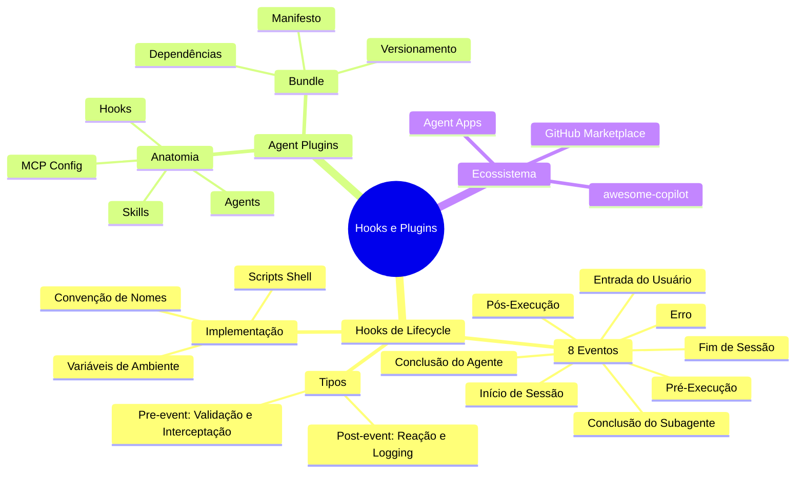
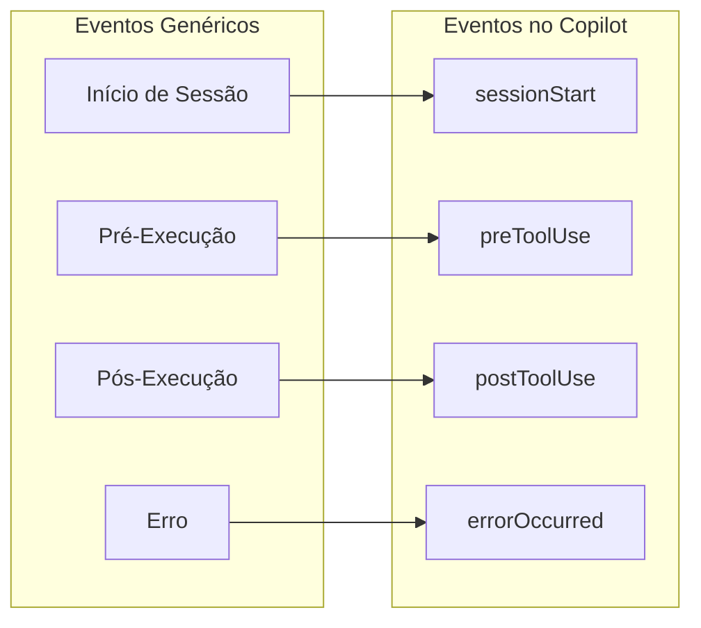
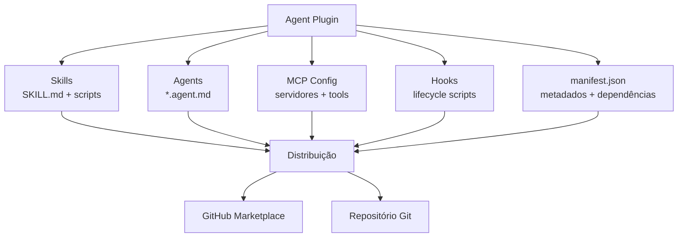

# Curso: Harness do GitHub Copilot e Programação Agêntica com VS Code — Aula 10

## Hooks, Plugins e Extensões no Copilot

**Duração estimada:** 90 minutos (45 de leitura + 45 de prática)

**Nível:** Intermediário

**Pré-requisitos:** Aulas 01-09 do módulo; VS Code com Copilot instalado e autenticado; Node.js; projeto Portal de Projetos Dev com estrutura até Aula 09

---

## Objetivos de Aprendizagem

Ao final desta aula, você será capaz de:

- [ ] **Descrever** o ciclo de vida de execução de um agente e onde hooks se inserem
- [ ] **Identificar** os 8 eventos de lifecycle (sessionStart, sessionEnd, userPromptSubmitted, preToolUse, postToolUse, agentStop, subagentStop, errorOccurred)
- [ ] **Diferenciar** hooks pre-event (validação) e post-event (reação/logging)
- [ ] **Criar** scripts de hook em shell para interceptar eventos de lifecycle
- [ ] **Configurar** hooks no diretório `.github/hooks/` com convenção de nomenclatura
- [ ] **Construir** hooks de validação (ex: lint no postToolUse) e logging (ex: log de sessão no sessionEnd)
- [ ] **Definir** o que são Agent Plugins e como empacotam skills + agents + MCP + hooks
- [ ] **Estruturar** um Agent Plugin completo como bundle distribuível com manifest.json
- [ ] **Explorar** o GitHub Marketplace e o awesome-copilot para Agent Apps e Plugins
- [ ] **Aplicar** hooks e empacotar um plugin no contexto do Portal de Projetos Dev

---

## Como Usar Esta Aula

Esta aula está organizada em duas partes. A **primeira parte** constrói os fundamentos universais de hooks de lifecycle e extensibilidade agêntica — conceitos que transcendem qualquer ferramenta específica. A **segunda parte** aplica esses conceitos na prática com GitHub Copilot: criação de hooks no `.github/hooks/`, empacotamento de Agent Plugins e exploração do ecossistema de extensões.

Ao longo do caminho, você encontrará seções **"Mão na Massa"** (para fazer, não só ler) e **"Quick Check"** (para verificar se entendeu antes de avançar). Ao final, o arquivo separado **Questões de Aprendizagem** traz as tarefas de checkpoint — só avance para a próxima aula quando conseguir completá-las por conta própria.

**Tempo estimado:** 45 minutos de leitura + 45 minutos de prática.

---

## Mapa Mental

Este diagrama mostra todos os conceitos que você vai dominar nesta aula:




---

## Recapitulação das Aulas 01-09

| Aula | Conceito | Onde aparece nesta aula | Como se conecta |
|---|---|---|---|
| Aula 05 | Agent Mode: ciclo Understand→Act→Validate | Seções 2.2 e 2.3 | Hooks interceptam o mesmo ciclo que o Agent Mode automatiza |
| Aula 07 | Agent Skills: SKILL.md + scripts | Seção 5.1 | Skills são um dos componentes empacotáveis em Agent Plugins |
| Aula 08 | Custom Agents e Subagentes | Seções 5.1 e 2.4 | Agentes custom são outro componente dos plugins; subagentes têm hook próprio |
| Aula 09 | MCP: servidores e configuração | Seção 5.1 | Servidores MCP são o terceiro componente empacotável nos plugins |

---

**FUNDAMENTOS: Mecanismos Universais de Hooks e Extensibilidade**

> *Os conceitos desta seção são universais — valem para qualquer sistema agêntico com ciclo de execução, independentemente da ferramenta específica. Na segunda parte, você verá como o GitHub Copilot implementa cada um deles.*

---

## 1. O Ciclo de Vida de um Agente e os Pontos de Interceptação

### 1.1 O que é um Hook de Lifecycle

Um **hook de lifecycle** é um ponto de interceptação no ciclo de execução de um agente — um "gancho" onde você pode injetar lógica customizada antes ou depois de eventos-chave. Pense neles como os *event listeners* do mundo agêntico.

Todo agente que executa tarefas passa por um ciclo previsível: nasce (inicia sessão), recebe comandos, decide ações, executa ferramentas, talvez delegue a subagentes, comete erros e eventualmente termina. Hooks permitem que você reaja a cada uma dessas transições.

```mermaid
statediagram
  state "Sessão Inicia" as inicio_sessao
  state "Usuário Envia Comando" as comando_usuario
  state "Ferramenta vai Executar" as pre_ferramenta
  state "Ferramenta Executou" as pos_ferramenta
  state "Agente Conclui Iteração" as fim_agente
  state "Subagente Conclui" as fim_subagente
  state "Erro Ocorre" as erro
  state "Sessão Termina" as fim_sessao

  [*] --> inicio_sessao
  inicio_sessao --> comando_usuario
  comando_usuario --> pre_ferramenta
  pre_ferramenta --> pos_ferramenta
  pos_ferramenta --> comando_usuario
  pos_ferramenta --> fim_agente
  pre_ferramenta --> fim_subagente
  fim_agente --> comando_usuario
  fim_agente --> fim_sessao
  fim_sessao --> [*]
  comando_usuario --> erro
  pre_ferramenta --> erro
  pos_ferramenta --> erro
  erro --> comando_usuario
  erro --> fim_sessao
```


### 1.2 As Duas Famílias de Hooks: Pre-Event e Post-Event

Hooks se dividem em duas famílias, cada uma com responsabilidades distintas:

| Família | Quando executa | Propósito | Pode bloquear a ação? |
|---|---|---|---|
| **Pre-event** | Antes da ação | Validar, transformar ou bloquear | Sim |
| **Post-event** | Depois da ação | Reagir, registrar, limpar | Não |

**Pre-event hooks** são guardiões — executam ANTES da ação e podem impedi-la. Exemplo: um hook que verifica se o comando shell contém `rm -rf /` e o bloqueia.

**Post-event hooks** são observadores — executam DEPOIS da ação e registram o que aconteceu. Exemplo: um hook que roda um linter nos arquivos modificados.

### Quick Check 1

**1. Qual a diferença fundamental entre hooks pre-event e post-event?**
**Resposta:** Pre-event hooks executam ANTES da ação e podem bloqueá-la (validação/interceptação). Post-event hooks executam DEPOIS da ação e apenas reagem ou registram — não podem desfazer o que já ocorreu.

**2. Por que um hook de erro é classificado como post-event mesmo ocorrendo durante a execução?**
**Resposta:** Porque o hook é disparado AP–S o erro já ter ocorrido — ele reage ao erro, não o previne. É um mecanismo de observação e recuperação, não de prevenção.

---

## 2. Os 8 Eventos Universais de Lifecycle

Nesta seção, você conhecerá os 8 eventos de lifecycle que todo sistema agêntico bem projetado expõe. Eles estão organizados em três categorias: eventos de sessão, eventos de comando e ferramenta, e eventos de ciclo interno.

### 2.1 Eventos de Sessão: Início e Fim

**Evento de Início de Sessão** é disparado quando uma sessão do agente é iniciada. É o momento de:
- Carregar configurações específicas do ambiente
- Inicializar recursos temporários (arquivos de log, diretórios de trabalho)
- Registrar metadados da sessão (timestamp, workspace, branch)

**Evento de Fim de Sessão** é disparado quando a sessão termina (normalmente ou por timeout). É o momento de:
- Salvar logs e métricas agregadas da sessão
- Limpar recursos temporários
- Enviar notificações de conclusão

### 2.2 Evento de Entrada do Usuário

Disparado quando o usuário envia um comando ou prompt. É o único evento que intercepta a interação HUMANO → AGENTE (os demais interceptam AGENTE → FERRAMENTA ou AGENTE → SUBAGENTE). Permite:
- Validar a entrada antes de chegar ao modelo (ex: verificar se contém informações sensíveis)
- Transformar a entrada (ex: adicionar contexto automaticamente)
- Registrar o comando para auditoria

### 2.3 Eventos de Pré e Pós Execução de Ferramenta

**Pré-Execução de Ferramenta:** disparado ANTES de qualquer ferramenta ser executada. Permite:
- Bloquear ferramentas perigosas em produção
- Modificar parâmetros (ex: forçar modo simulado em comandos destrutivos)
- Exigir confirmação humana para ações sensíveis

**Pós-Execução de Ferramenta:** disparado DEPOIS da execução bem-sucedida de uma ferramenta. Permite:
- Executar validações automáticas (lint, testes, type-check)
- Registrar uso de ferramentas para telemetria
- Disparar ações em cadeia

### 2.4 Eventos de Conclusão: Agente e Subagente

**Conclusão do Agente:** disparado quando o agente principal conclui uma tarefa ou iteração. Permite:
- Verificar se o objetivo da tarefa foi atingido
- Consolidar artefatos produzidos na iteração

**Conclusão do Subagente:** disparado quando um subagente delegado termina. Como subagentes têm contexto isolado, este hook permite capturar o resultado da delegação antes que ele seja retornado ao agente principal.

### 2.5 Evento de Erro

Disparado quando qualquer erro ocorre durante a sessão — falha de ferramenta, timeout, erro de rede, exceção no modelo. Permite:
- Registrar stack traces para debugging
- Tentar recuperação automática (ex: retry com backoff)
- Alertar o usuário com mensagem amigável

### Quick Check 2

**1. Qual evento você usaria para impedir que uma ferramenta perigosa seja executada?**
**Resposta:** O evento de pré-execução de ferramenta — é o único que executa ANTES da ferramenta e pode bloqueá-la condicionalmente.

**2. Qual a diferença entre a conclusão do agente e o fim da sessão?**
**Resposta:** A conclusão do agente ocorre ao final de cada iteração/tarefa (pode acontecer várias vezes na mesma sessão). O fim de sessão ocorre apenas uma vez, quando a sessão inteira termina.

---

## 3. Anatomia Universal de um Hook

### 3.1 Convenção de Nomenclatura

Hooks são scripts que residem em um diretório de configuração do projeto. O nome do arquivo determina qual evento ele intercepta:

```
.hooks/
—S—�—Æinicio_sessao.sh
—S—�—Æfim_sessao.sh
—S—�—Æcomando_usuario.sh
—S—�—Æpre_ferramenta.sh
—S—�—Æpos_ferramenta.sh
—S—�—Æfim_agente.sh
—S—�—Æfim_subagente.sh
——�—Æerro.sh
```

### 3.2 Contrato do Script

Cada script de hook recebe informações do evento via **variáveis de ambiente**. O contrato básico:

- **Exit code 0**: hook executou com sucesso, ação prossegue normalmente
- **Exit code ÉÆ0** (apenas para pre-event hooks): hook bloqueia a ação
- **stdout**: capturado como log (aparece no output do agente)
- **stderr**: capturado como erro

### 3.3 Exemplo Mínimo: Hook de Pós-Execução com Validação

```bash
#!/bin/bash
# .hooks/pos_ferramenta.sh
# Executa validação após a execução de uma ferramenta

echo "[hook:pos_ferramenta] Ferramenta executada: $FERRAMENTA_NOME"
echo "[hook:pos_ferramenta] Validando resultados..."

# Simula validação — em produção, rodaria um linter
if [[ "$FERRAMENTA_NOME" == "escrever_arquivo" ]]; then
  echo "[hook:pos_ferramenta] Validação concluída sem erros."
fi
```

### Quick Check 3

**1. Como o hook sinaliza que deve bloquear uma ação?**
**Resposta:** Retornando exit code diferente de 0. Isso só funciona para hooks pre-event — hooks post-event não podem bloquear ações.

**2. Onde a saída de stdout do hook aparece?**
**Resposta:** No output do agente — o próprio agente pode ver o que o hook produziu e reagir a isso.

---

**APLICAÇÃO: Hooks, Plugins e Marketplace no GitHub Copilot**

> *Agora que você entende os fundamentos universais de hooks de lifecycle e extensibilidade, vamos conectá-los à prática com GitHub Copilot. Cada evento genérico que estudamos se materializa em um nome específico no Copilot. Você criará hooks reais, empacotará um Agent Plugin e explorará o ecossistema de extensões.*

---

## 4. Mapeando Conceitos Universais para o Copilot

Antes de começar a criar hooks no Copilot, é essencial entender o mapeamento entre os eventos genéricos da Parte 1 e os nomes específicos que o Copilot utiliza:

| Evento Genérico | Nome no Copilot | Tipo | Propósito |
|---|---|---|---|
| Início de Sessão | `sessionStart` | Post-event | Registrar início da sessão |
| Entrada do Usuário | `userPromptSubmitted` | Pre-event | Validar ou transformar o prompt |
| Pré-Execução | `preToolUse` | Pre-event | Bloquear ou modificar ferramentas |
| Pós-Execução | `postToolUse` | Post-event | Validar resultados, logar |
| Conclusão do Agente | `agentStop` | Post-event | Consolidar iteração |
| Conclusão do Subagente | `subagentStop` | Post-event | Capturar resultado de delegação |
| Erro | `errorOccurred` | Post-event | Registrar e recuperar |
| Fim de Sessão | `sessionEnd` | Post-event | Limpar e notificar |




---

## 5. Configurando Hooks no Copilot

### 5.1 Estrutura de Diretórios

No Copilot, hooks vivem em `.github/hooks/` dentro do repositório. A estrutura completa de um projeto com hooks:

```
meu-projeto/
—S—�—Æ.github/
—   —S—�—Æcopilot-instructions.md
—   —S—�—Æhooks/
—   —   —S—�—ÆpostToolUse.sh        # Lint após cada tool use
—   —   —S—�—ÆpreToolUse.sh         # Bloquear comandos perigosos
—   —   ——�—ÆsessionStart.sh       # Log de início de sessão
—   —S—�—Æskills/
—   —S—�—Æagents/
—   ——�—Æprompts/
——�—Æ.vscode/
    ——�—Æmcp.json
```

### 5.2 Variáveis de Ambiente Disponíveis

Cada hook recebe um conjunto de variáveis de ambiente que descrevem o evento:

| Variável | Descrição | Disponível em |
|---|---|---|
| `COPILOT_EVENT` | Nome do evento (ex: "postToolUse") | Todos |
| `COPILOT_SESSION_ID` | ID único da sessão | Todos |
| `COPILOT_TOOL_NAME` | Nome da ferramenta executada | preToolUse, postToolUse |
| `COPILOT_TOOL_PARAMS` | Parâmetros da tool (JSON) | preToolUse |
| `COPILOT_TOOL_RESULT` | Resultado da tool (JSON) | postToolUse |
| `COPILOT_ERROR_MESSAGE` | Mensagem de erro | errorOccurred |
| `COPILOT_AGENT_NAME` | Nome do agente/subagente | agentStop, subagentStop |
| `COPILOT_PROMPT` | Prompt enviado pelo usuário | userPromptSubmitted |

**Mão na Massa — Criando hooks de lint e segurança:**

- [ ] Crie o diretório `.github/hooks/` no seu Portal de Projetos Dev
- [ ] Crie `postToolUse.sh` que executa `npx eslint` nos arquivos alterados
- [ ] Crie `preToolUse.sh` que bloqueia comandos shell contendo `rm -rf` ou `git push --force`
- [ ] Teste cada hook com `bash` e `echo` controlado para verificar o comportamento
- [ ] Verifique no output do Copilot se as mensagens dos hooks aparecem

**Verificação:** O Copilot deve executar `postToolUse.sh` após cada tool use e verificar `preToolUse.sh` antes de comandos shell. As mensagens de echo devem aparecer no chat.

---

## 6. Agent Plugins: Empacotando seu Harness

### 6.1 Anatomia de um Agent Plugin

Um **Agent Plugin** é um bundle que empacota múltiplos componentes do harness em uma unidade distribuível. Diferente de uma skill (que é só instruções + scripts), um plugin pode conter:

| Componente | O que inclui | Finalidade |
|---|---|---|
| **Skills** | SKILL.md + scripts + resources | Conhecimento injetável sob demanda |
| **Agents** | `*.agent.md` com tools + modelo | Agentes especializados reutilizáveis |
| **MCP config** | Servidores e ferramentas | Ferramentas externas empacotadas |
| **Hooks** | Scripts de lifecycle | Comportamento reativo automatizado |




### 6.2 Estrutura de Diretórios de um Plugin

```
portal-dev-harness/
—S—�—ÆREADME.md
—S—�—Æmanifest.json
—S—�—Æskills/
—   ——�—Ærevisar-acessibilidade/
—       —S—�—ÆSKILL.md
—       ——�—Æscripts/
—           ——�—Æcheck-a11y.sh
—S—�—Æagents/
—   —S—�—Ærevisor.agent.md
—   ——�—Ædocumentador.agent.md
—S—�—Æhooks/
—   —S—�—ÆpostToolUse.sh
—   —S—�—ÆpreToolUse.sh
—   ——�—ÆsessionStart.sh
——�—Æmcp/
    ——�—Æservers.json
```

### 6.3 Exemplo de manifest.json

```json
{
  "name": "portal-dev-harness",
  "version": "1.0.0",
  "description": "Harness completo para desenvolvimento do Portal de Projetos Dev",
  "author": "seu-usuario",
  "license": "MIT",
  "keywords": ["copilot", "harness", "web-development", "accessibility"],
  "components": {
    "skills": ["skills/revisar-acessibilidade"],
    "agents": [
      "agents/revisor.agent.md",
      "agents/documentador.agent.md"
    ],
    "hooks": [
      "hooks/postToolUse.sh",
      "hooks/preToolUse.sh",
      "hooks/sessionStart.sh"
    ],
    "mcp": ["mcp/servers.json"]
  },
  "copilot": {
    "minVersion": "1.0.0"
  }
}
```

**Mão na Massa — Estruturando um Agent Plugin:**

- [ ] Crie a estrutura de diretórios do plugin `portal-dev-harness/` fora do repositório do portal
- [ ] Escreva o `manifest.json` com os componentes que você já tem (skills das aulas 07-08, hooks da seção 5)
- [ ] Mova/copie os artefatos relevantes para dentro da estrutura do plugin
- [ ] Verifique se o `manifest.json` referencia todos os caminhos corretamente

**Verificação:** A estrutura de diretórios do plugin deve conter todos os componentes listados no `manifest.json`. O plugin deve ser autocontido — clonável e funcional.

---

## 7. GitHub Marketplace e o Ecossistema de Extensões

### 7.1 Tipos de Extensões

O GitHub Marketplace hospeda dois tipos de extensões para Copilot:

| Tipo | O que é | Status | Exemplos |
|---|---|---|---|
| **Agent Apps** | Extensões completas com UI, backend e integração profunda | GA (acesso restrito) | Blackbeard, GitHub Models |
| **Agent Plugins** | Bundles leves de skills + agents + MCP + hooks | Preview | Plugins da comunidade |

### 7.2 awesome-copilot: O Catálogo da Comunidade

O repositório [awesome-copilot](https://github.com/github/awesome-copilot) cataloga 500+ recursos do ecossistema, organizados em 9 categorias:

- **Agents** (214)
- **Instructions** (186)
- **Skills** (349)
- **Plugins** (68)
- **Hooks** (6)
- **Agentic Workflows** (8 GitHub Actions)
- **Cookbook** (.NET, Go, Java, Node, Python)

### 7.3 Distribuindo seu Plugin

Opções para distribuir seu Agent Plugin:

1. **GitHub Marketplace** (Agent Apps): requer aprovação, acesso atualmente restrito para novos builders
2. **Repositório público no GitHub**: qualquer pessoa pode clonar e instalar
3. **awesome-copilot**: submeta um PR para listar seu plugin
4. **Compartilhamento direto**: `.zip` ou `.tar.gz` do diretório do plugin

### Quick Check 4

**1. Qual a diferença entre um Agent Plugin e uma Skill?**
**Resposta:** Uma skill é um componente único (SKILL.md + scripts) focado em conhecimento injetável. Um Agent Plugin é um bundle que pode conter múltiplas skills, agents, hooks e MCP config — é uma unidade de distribuição maior.

**2. Por que hooks têm apenas 6 entradas no awesome-copilot enquanto plugins têm 68?**
**Resposta:** Hooks são scripts shell simples e específicos por projeto — raramente faz sentido distribuí-los isoladamente. Plugins são bundles reutilizáveis que resolvem problemas comuns. A maioria dos hooks publicados vive DENTRO de plugins.

---

## 8. Projeto Progressivo: Hooks e Plugin no Portal de Projetos Dev

### 8.1 Peça da Aula 10

Nesta aula, você adiciona duas peças ao seu harness do Portal de Projetos Dev:

1. **Hooks de lifecycle** em `.github/hooks/`:
   - `postToolUse.sh`: executa lint e validação HTML nos arquivos do portal
   - `preToolUse.sh`: bloqueia comandos destrutivos e exige confirmação para `git push`
   - `sessionStart.sh`: registra timestamp, branch e arquivos modificados no início da sessão

2. **Agent Plugin empacotado**: bundle `portal-dev-harness` contendo todos os artefatos que você construiu até agora

### 8.2 Estado Atual do Projeto (após Aula 09)

```
portal-de-projetos-dev/
—S—�—Æindex.html
—S—�—Æstyle.css
—S—�—Æapp.js
—S—�—Ædata.json
—S—�—Æ.github/
—   —S—�—Æcopilot-instructions.md         # Aula 03
—   —S—�—Æinstructions/
—   —   —S—�—Æcss.instructions.md         # Aula 03
—   —   ——�—Æjs.instructions.md          # Aula 03
—   —S—�—Æprompts/
—   —   —S—�—Ægerar-card.prompt.md        # Aula 04
—   —   ——�—Ævalidar-dados.prompt.md     # Aula 04
—   —S—�—Æskills/
—   —   ——�—Ærevisar-acessibilidade/     # Aula 07
—   —       ——�—ÆSKILL.md
—   —S—�—Æagents/
—   —   —S—�—Ærevisor.agent.md            # Aula 08
—   —   ——�—Ædocumentador.agent.md       # Aula 08
—   ——�—Æhooks/                          # ← NOVO: Aula 10
—       —S—�—ÆpostToolUse.sh
—       —S—�—ÆpreToolUse.sh
—       ——�—ÆsessionStart.sh
—S—�—Æ.vscode/
—   ——�—Æmcp.json                        # Aula 09
——�—ÆREADME.md
```

### 8.3 O Que Você Constrói Hoje

**Mão na Massa — Completando o harness com hooks e plugin:**

- [ ] Crie `.github/hooks/postToolUse.sh` com lint automático para HTML/CSS/JS
- [ ] Crie `.github/hooks/preToolUse.sh` com bloqueio de comandos perigosos
- [ ] Crie `.github/hooks/sessionStart.sh` com log de início de sessão
- [ ] Teste cada hook individualmente com `bash hook.sh` simulando variáveis de ambiente
- [ ] Crie o diretório `portal-dev-harness/` como plugin distribuível
- [ ] Escreva `manifest.json` referenciando todos os componentes do seu harness
- [ ] Copie skills, agents, hooks e MCP config para dentro do plugin
- [ ] Verifique a integridade: o plugin deve ser autocontido e instalável por clone

**Verificação:** O Copilot deve executar os hooks automaticamente durante a sessão. O diretório `portal-dev-harness/` deve conter todos os componentes listados no `manifest.json`.

---

## Autoavaliação: Quiz Rápido

**1. Quantos eventos de lifecycle o Copilot expõe via hooks?**
**Resposta:**

8 eventos: sessionStart, sessionEnd, userPromptSubmitted, preToolUse, postToolUse, agentStop, subagentStop, errorOccurred.

**2. Qual a diferença entre preToolUse e postToolUse?**
**Resposta:**

preToolUse executa ANTES da ferramenta e pode bloqueá-la (exit code ÉÆ0). postToolUse executa DEPOIS da execução bem-sucedida e serve para reagir/validar/logar — não pode desfazer a ação.

**3. Onde os hooks são configurados no projeto?**
**Resposta:**

No diretório `.github/hooks/`, com scripts shell nomeados conforme o evento (ex: `postToolUse.sh`).

**4. O que é um Agent Plugin?**
**Resposta:**

Um bundle distribuível que empacota skills + agents + MCP config + hooks + manifest.json em uma unidade autocontida.

**5. Quais são as opções para distribuir um Agent Plugin?**
**Resposta:**

GitHub Marketplace (Agent Apps, acesso restrito), repositório público no GitHub, listagem no awesome-copilot, ou compartilhamento direto (`.zip`).

**6. Como um script de hook recebe informações sobre o evento?**
**Resposta:**

Via variáveis de ambiente como `COPILOT_EVENT`, `COPILOT_TOOL_NAME`, `COPILOT_TOOL_PARAMS`, etc.

**7. Um hook postToolUse pode impedir que uma ferramenta seja executada?**
**Resposta:**

Não. Apenas hooks pre-event (preToolUse, userPromptSubmitted) podem bloquear ações. Hooks post-event executam depois que a ação já ocorreu.

---

## Mão na Massa 10: Exercícios Graduados

**Exercício 1 (Fácil) — Hook de Boas-Vindas**

Crie `sessionStart.sh` que exibe uma mensagem de boas-vindas com o timestamp, nome do workspace e branch atual.

**Gabarito:**

```bash
#!/bin/bash
# .github/hooks/sessionStart.sh
echo "========================================="
echo " Sessão Copilot Iniciada"
echo " Timestamp: $(date -u +%Y-%m-%dT%H:%M:%SZ)"
echo " Workspace: $(pwd)"
echo " Branch:    $(git branch --show-current 2>/dev/null || echo 'N/A')"
echo "========================================="
```

**Exercício 2 (Médio) — Hook de Bloqueio Condicional**

Crie `preToolUse.sh` que bloqueia comandos shell contendo padrões perigosos (`rm -rf`, `git push --force`, `DROP TABLE`). Para outros comandos, permite normalmente.

**Gabarito:**

```bash
#!/bin/bash
# .github/hooks/preToolUse.sh

if [[ "$COPILOT_TOOL_NAME" != "execute_command" ]] && [[ "$COPILOT_TOOL_NAME" != "terminal" ]]; then
  exit 0  # Não é comando shell, permite
fi

BLOCKED_PATTERNS=("rm -rf" "git push --force" "DROP TABLE" "DROP DATABASE")

for pattern in "${BLOCKED_PATTERNS[@]}"; do
  if echo "$COPILOT_TOOL_PARAMS" | grep -qi "$pattern"; then
    echo "[HOOK: BLOQUEADO] Comando contém padrão perigoso: '$pattern'"
    echo "  Comando: $COPILOT_TOOL_PARAMS"
    echo "  Execute manualmente se tiver certeza."
    exit 1  # Bloqueia
  fi
done

exit 0  # Permite
```

**Desafio (Difícil) — Plugin Completo com Manifesto**

Empacote TODO o seu harness do Portal de Projetos Dev como um Agent Plugin completo. O plugin deve incluir:

1. `manifest.json` com versão semântica, metadados e lista de componentes
2. Skills das aulas anteriores movidas para dentro do plugin
3. Agent definitions das aulas anteriores movidas para dentro do plugin
4. Hooks criados nesta aula
5. README.md com instruções de instalação
6. Teste de integridade: clone o plugin em um diretório limpo e verifique se todas as referências do manifesto são válidas

**Gabarito:**

Estrutura final esperada:

```
portal-dev-harness/
—S—�—ÆREADME.md
—S—�—Æmanifest.json
—S—�—Æskills/
—   ——�—Ærevisar-acessibilidade/
—       —S—�—ÆSKILL.md
—       ——�—Æscripts/
—           ——�—Æcheck-a11y.sh
—S—�—Æagents/
—   —S—�—Ærevisor.agent.md
—   ——�—Ædocumentador.agent.md
—S—�—Æhooks/
—   —S—�—ÆpostToolUse.sh
—   —S—�—ÆpreToolUse.sh
—   ——�—ÆsessionStart.sh
——�—Æmcp/
    ——�—Æservers.json
```

manifest.json:

```json
{
  "name": "portal-dev-harness",
  "version": "1.0.0",
  "description": "Harness completo para desenvolvimento do Portal de Projetos Dev com GitHub Copilot",
  "author": "seu-usuario",
  "license": "MIT",
  "keywords": ["copilot", "harness", "web-development", "accessibility"],
  "components": {
    "skills": ["skills/revisar-acessibilidade"],
    "agents": [
      "agents/revisor.agent.md",
      "agents/documentador.agent.md"
    ],
    "hooks": [
      "hooks/postToolUse.sh",
      "hooks/preToolUse.sh",
      "hooks/sessionStart.sh"
    ],
    "mcp": ["mcp/servers.json"]
  },
  "copilot": {
    "minVersion": "1.0.0"
  }
}
```

**Verificação:** Execute `bash hooks/sessionStart.sh` manualmente. Verifique que `manifest.json` referencia arquivos que existem (use `ls` para cada caminho). O plugin deve ser autocontido — nenhum caminho deve apontar para fora do diretório do plugin.

---

## Resumo da Aula

### Os 8 Conceitos Fundamentais

1. **Hook de lifecycle**: ponto de interceptação no ciclo de execução do agente onde você injeta lógica customizada antes ou depois de eventos-chave.
2. **Pre-event vs Post-event**: hooks pre-event executam antes da ação e podem bloqueá-la; post-event executam depois e apenas reagem/registram.
3. **8 eventos do Copilot**: sessionStart, sessionEnd, userPromptSubmitted, preToolUse, postToolUse, agentStop, subagentStop, errorOccurred.
4. **Convenção de hooks**: scripts shell em `.github/hooks/` nomeados conforme o evento; recebem contexto via variáveis de ambiente `COPILOT_*`.
5. **Agent Plugin**: bundle distribuível que empacota skills + agents + MCP + hooks + manifest.json.
6. **manifest.json**: arquivo de metadados que declara versão, autor, licença e lista de componentes do plugin.
7. **Agent Apps**: extensões completas no GitHub Marketplace com UI e backend (acesso restrito).
8. **awesome-copilot**: catálogo comunitário com 500+ recursos curados — principal canal de descoberta de plugins.

### O Que Você Construiu Hoje

- [x] `.github/hooks/postToolUse.sh` — lint automático após cada tool use
- [x] `.github/hooks/preToolUse.sh` — bloqueio de comandos perigosos
- [x] `.github/hooks/sessionStart.sh` — log de início de sessão
- [x] `portal-dev-harness/` — Agent Plugin completo com manifest.json, skills, agents, hooks e MCP config
- [x] Hooks testados e funcionando no contexto do Portal de Projetos Dev

---

## Próxima Aula

**Aula 11: Copilot CLI, Cloud Agent e Code Review**

Agora que seu harness tem hooks e está empacotado como plugin, vamos expandir o Copilot para além do VS Code. Na próxima aula, você usará o Copilot CLI (`gh copilot`) para automação em terminal, configurará o Cloud Agent para revisar PRs automaticamente via GitHub Actions e dominará o code review automatizado.

---

## Referências

### Documentação Oficial

- [GitHub Copilot — Building Extensions](https://docs.github.com/en/copilot/building-copilot-extensions)
- [VS Code Docs — Agents Overview](https://code.visualstudio.com/docs/agents/overview)
- [Agent Skills Specification](https://agentskills.io/specification)

### Ferramentas e Catálogos

- [awesome-copilot](https://github.com/github/awesome-copilot) — 500+ recursos curados (9 categorias)
- [GitHub Marketplace — Copilot Extensions](https://github.com/marketplace?type=apps&copilot_app=true)

### Artigos para Aprofundamento

- [GitHub Copilot SDK — Custom Tools](https://github.com/github/copilot-sdk)
- [awesome-copilot — Plugins](https://github.com/github/awesome-copilot#plugins)
- [awesome-copilot — Hooks](https://github.com/github/awesome-copilot#hooks)

---

## FAQ

**P: Hooks funcionam no Copilot Free?**
R: Sim. Hooks são processados localmente pelo VS Code e independem do plano Copilot. O que muda entre planos é o modelo usado e os AI Credits disponíveis — os hooks continuam funcionando.

**P: Posso ter múltiplos scripts para o mesmo evento?**
R: Não. Apenas um script por evento é suportado (ex: um único `postToolUse.sh`). Se precisar de múltiplas ações, orquestre-as dentro do mesmo script.

**P: Hooks substituem GitHub Actions?**
R: Não. Hooks operam no ciclo de vida da sessão do Copilot (dentro do VS Code). GitHub Actions operam no ciclo de vida do repositório (push, PR, issues). São complementares: hooks para interações em tempo real, Actions para automação de CI/CD.

**P: Como debugar um hook que não está funcionando?**
R: Adicione `echo` para logging, execute o script manualmente com variáveis de ambiente simuladas (`export COPILOT_EVENT=postToolUse && bash .github/hooks/postToolUse.sh`) e verifique o output do Copilot no VS Code.

**P: Um Agent Plugin pode ser instalado via GitHub Marketplace?**
R: Agent Plugins (bundles) ainda não têm um canal oficial de distribuição no Marketplace. O Marketplace atualmente aceita apenas Agent Apps (extensões completas). Plugins são distribuídos via repositórios Git, awesome-copilot ou compartilhamento direto.

**P: Hooks conseguem modificar o prompt do usuário antes de chegar ao modelo?**
R: O hook `userPromptSubmitted` recebe o prompt, mas a capacidade de transformá-lo depende da implementação do cliente Copilot. Na prática atual, hooks são mais usados para validação e logging do que transformação.

**P: Preciso de permissões especiais para criar hooks?**
R: Não. Basta criar o diretório `.github/hooks/` com scripts executáveis. O VS Code os executa automaticamente.

**P: O que acontece se um hook demorar muito para executar?**
R: Hooks têm timeout. Se um hook travar ou demorar excessivamente, o Copilot pode ignorá-lo e continuar a execução. Mantenha hooks leves e rápidos (idealmente < 5 segundos).

---

## Glossário

| Termo | Definição |
|---|---|
| **Hook de lifecycle** | Script que intercepta um ponto específico no ciclo de execução do agente (Seção 1) |
| **Pre-event hook** | Hook que executa ANTES de uma ação e pode bloqueá-la (Seção 1.2) |
| **Post-event hook** | Hook que executa DEPOIS de uma ação para reagir ou registrar (Seção 1.2) |
| **Agent Plugin** | Bundle distribuível que empacota skills + agents + MCP + hooks + manifesto (Seção 6) |
| **Agent App** | Extensão completa no GitHub Marketplace com UI e backend (Seção 7) |
| **manifest.json** | Arquivo de metadados que declara componentes, versão e dependências de um plugin (Seção 6.3) |
| **awesome-copilot** | Catálogo comunitário com 500+ recursos curados do ecossistema Copilot (Seção 7.2) |
| **Variáveis de ambiente (hooks)** | Mecanismo pelo qual o Copilot passa informações do evento para o script de hook (Seção 5.2) |
