# Harness do GitHub Copilot — Aula 11

## Copilot CLI, Cloud Agent e Code Review

**Duração estimada:** 110 minutos (55 de leitura + 55 de prática)
**Nível:** Intermediário
**Pré-requisitos:** Aulas 01-10 concluídas. VS Code com Copilot instalado e autenticado. GitHub CLI (`gh`) instalado e autenticado (`gh auth login`). Repositório do Portal de Projetos Dev versionado no GitHub. `.github/copilot-instructions.md`, `.github/agents/` com agentes criados, `.vscode/mcp.json` com GitHub MCP Server conectado.

---

## Objetivos de Aprendizagem

Ao final desta aula, você será capaz de:

- [ ] **Explicar** o papel da CLI na automação de agentes de código, distinguindo os modos interativo e programático
- [ ] **Instalar** e autenticar o Copilot CLI (`gh copilot`) e executar comandos básicos em modo interativo
- [ ] **Construir** scripts de automação usando o Copilot CLI em modo programático para análise de código e geração de documentação
- [ ] **Descrever** o funcionamento do Autopilot e do `/fleet` na CLI, explicando como a orquestração de tarefas distribui trabalho entre agentes
- [ ] **Configurar** o Cloud Agent via GitHub Actions com triggers, permissões e contexto do repositório
- [ ] **Atribuir** uma issue ao Cloud Agent usando o comando `/copilot` e verificar o ciclo completo
- [ ] **Comparar** os níveis de esforço do Code Review automatizado (low effort vs medium effort)
- [ ] **Descrever** o Browser Agent experimental e seu papel na automação web
- [ ] **Integrar** o Cloud Agent em um workflow de CI/CD que dispara Code Review automaticamente em eventos de pull request
- [ ] **Conectar** o harness local ao GitHub, configurando um workflow que revisa PRs automaticamente

---

## Como Usar Esta Aula

Esta aula está organizada em **duas partes**. A **primeira parte** constrói os fundamentos conceituais de automação via CLI, agentes remotos e code review automatizado — conceitos universais que valem para qualquer ecossistema. A **segunda parte** aplica esses conceitos na prática com o ecossistema GitHub Copilot: você instalará o Copilot CLI, configurará o Cloud Agent, praticará Code Review automatizado e fechará o ciclo com um workflow de CI/CD que conecta o harness local ao GitHub.

Ao longo do caminho, você encontrará seções **"Mão na Massa"** (para fazer, não só ler) e **"Quick Check"** (para verificar se entendeu antes de avançar). Ao final, o arquivo separado **Questões de Aprendizagem** traz as tarefas de checkpoint — só avance para a próxima aula quando conseguir completá-las por conta própria.

**Tempo estimado:** 55 minutos de leitura + 55 minutos de prática.

---

## Mapa Mental

Este diagrama mostra todos os conceitos que você vai dominar nesta aula:

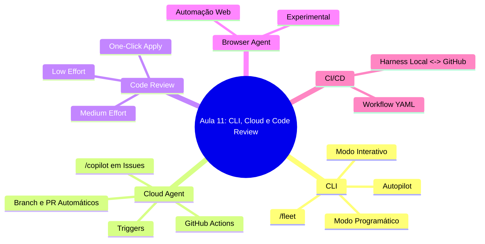


---

## Recapitulação das Aulas Anteriores

| Aula | Conceito | Onde aparece nesta aula | Como se conecta |
|---|---|---|---|
| Aula 05 | **Agent Mode** (Seção 3) | Seções 6, 10 | O loop Understand→Act→Validate do Agent Mode é o mesmo que o Autopilot usa na CLI e o Code Review usa no post-mortem |
| Aula 06 | **Slash Commands** (Seção 4) | Seções 5, 9 | Comandos como `/explain` e `/fix` no chat são o embrião do que o CLI faz no terminal e o Code Review faz em PRs |
| Aula 08 | **Custom Agents** (Seções 2-4) | Seções 7, 8 | Os agentes que você criou em `.github/agents/` são carregados pelo Cloud Agent quando ele executa no GitHub Actions |
| Aula 09 | **MCP e GitHub MCP Server** (Seções 5-6) | Seções 7, 10 | O GitHub MCP Server que você conectou dá ao Cloud Agent acesso programático às APIs do GitHub |
| Aula 10 | **Hooks e Plugins** (Seções 3-6) | Seção 10 | Os hooks de lifecycle (PreToolUse, PostToolUse) se estendem para CI/CD: hooks no VS Code + workflows no GitHub |

---

**FUNDAMENTOS: Automação Além do Editor — CLI, Agentes Remotos e Code Review Automatizado**

> *Os conceitos desta seção são universais — valem para qualquer ecossistema de desenvolvimento, independentemente da ferramenta de IA que você usa. Eles se aplicam a qualquer CLI de assistente, qualquer sistema de CI/CD com agentes remotos e qualquer pipeline de revisão automatizada. Na segunda parte, você verá como o ecossistema GitHub Copilot implementa cada um deles.*

---

## 1. CLI-Based AI Agents: Modos Interativo e Programático

Você já usa a linha de comando todos os dias. `git`, `npm`, `docker`, `curl` — cada um é uma interface de automação que transforma uma intenção em ação. Agora imagine que esses comandos podem ser **assistentes de IA**: você conversa, pede explicações, solicita sugestões. É exatamente isso que um **CLI-Based AI Agent** faz.

A CLI é a interface universal de automação. Ela transforma agentes de "assistentes de editor" (presos ao editor) em "etapas de pipeline" (encaixáveis em scripts, Makefiles e workflows de CI/CD). Um agente que só existe na IDE precisa de um humano operando o editor. Um agente que existe na CLI pode ser invocado por um script bash, por um cron job, por um hook de git ou por um pipeline de CI.

### Dois Modos de Operação

Um CLI-Based AI Agent opera em dois modos fundamentais:

**Modo Interativo:** Uma sessão com estado. Você inicia o agente, faz perguntas, ele responde baseado no contexto acumulado. O histórico da conversa informa as respostas seguintes. É análogo a uma sessão SSH: você mantém a conexão aberta enquanto trabalha. Serve para exploração, debugging interativo, aprendizado.

**Modo Programático:** Uma execução sem estado (one-shot). Você fornece o input via argumento ou stdin, o agente processa e retorna o resultado via stdout, com um exit code indicando sucesso ou falha. Não há memória entre chamadas. É análogo a comandos Unix tradicionais: `git log --oneline | wc -l` não guarda estado entre execuções. Serve para automação, pipelines, scripts.

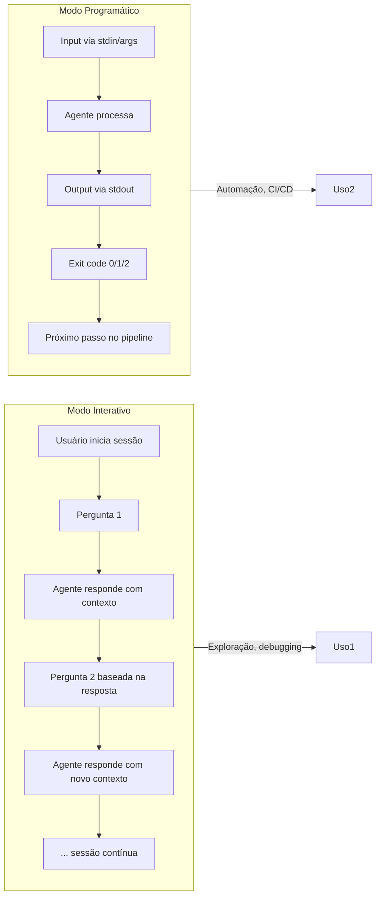

**Por que isso importa?** O modo programático é o que permite colocar IA em pipelines de CI/CD. Um comando que retorna exit code 0 ou 1 pode ser usado em condicionais, gates de quality, geração automática de documentação. Sem esse modo, o agente só funciona quando um humano está na frente do teclado.

### Onde Você Já Vê Isso

- **`git` CLI**: `git rebase -i` é interativo (abre um editor, você edita, salva). `git log --oneline | wc -l` é programático (pipe, sem interação).
- **APIs REST**: `curl -X POST` é programático (one-shot). Uma sessão no Postman ou Insomnia com coleção de requests é interativa.
- **Testes**: `npm test` em CI é programático (roda, falha ou passa). `npm run test:watch` no terminal do dev é interativo.

### Quick Check

**1. Qual a diferença fundamental entre o modo interativo e o modo programático de um CLI-Based AI Agent?**
**Resposta:** O modo interativo mantém estado e histórico entre chamadas — é uma sessão contínua. O modo programático é one-shot: recebe input, processa, retorna output, e não guarda memória entre execuções. O modo programático é o que permite usar o agente em pipelines de CI/CD.

**2. Dê um exemplo de ferramenta que você já usa que opera em modo programático e explique como o exit code é usado.**
**Resposta:** `grep "erro" arquivo.log` — se encontra o padrão, exit code 0; se não encontra, exit code 1. Em um script bash, `if grep -q "erro" arquivo.log; then echo "Achou"; fi` usa o exit code para controlar o fluxo. Qualquer CLI de IA que retorne exit codes pode ser usada da mesma forma em pipelines.

---

## 2. Agentes Remotos e Automação Orientada a Eventos

Um agente não precisa rodar na sua máquina. Na verdade, para muitas tarefas, **o agente deve rodar longe dela**. Um agente remoto é um assistente de IA que executa em infraestrutura cloud, acionado por eventos do repositório, e que tem acesso programático às APIs da plataforma.

### O Padrão Agent-as-CI

O ciclo de vida de um agente remoto segue um padrão previsível, muito parecido com o que você já conhece de pipelines de CI/CD tradicionais:

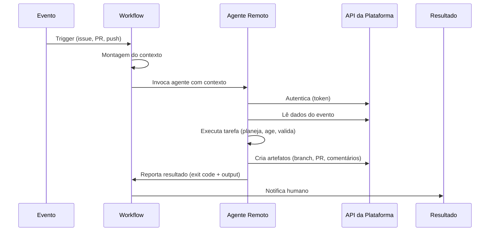

### Ciclo de Vida do Agente Remoto

1. **Trigger**: Um evento ocorre no repositório — uma issue é criada, um PR é aberto, um comentário é postado, um schedule dispara.
2. **Context Assembly**: O workflow coleta o contexto necessário: conteúdo do evento, arquivos do repositório, configurações do harness.
3. **Autenticação**: O agente remoto se autentica via token de acesso (ex: `GITHUB_TOKEN`) com escopos mínimos de permissão.
4. **Execução**: O agente executa a tarefa — analisa, planeja, implementa, testa. Pode iterar (loop Understand→Act→Validate) remotamente.
5. **Criação de Artefatos**: O agente produz artefatos na plataforma: branches, commits, pull requests, comentários, relatórios.
6. **Report**: O workflow notifica o humano — comentário no PR, atualização da issue, email, notificação.

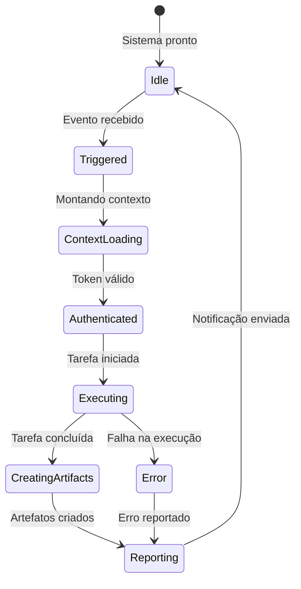

### Por Que Agentes Remotos São Importantes

- **Disponibilidade**: O agente não depende da máquina do desenvolvedor estar ligada.
- **Escopo**: O agente tem acesso ao repositório completo, não apenas ao workspace local.
- **Integração**: O agente pode interagir com a plataforma (criar branches, abrir PRs, comentar em issues) sem mediação humana.
- **Reprodutibilidade**: A execução em ambiente padronizado (runner) elimina "funciona na minha máquina".

### Onde Você Já Vê Isso

- **CI/CD tradicional**: Jenkins, GitLab CI, CircleCI — pipelines que rodam em resposta a eventos.
- **Bots de PR**: Dependabot, Renovate — criam PRs automaticamente para atualizar dependências.
- **Code quality bots**: CodeClimate, SonarCloud — analisam código e postam resultados em PRs.

### Quick Check

**1. Quais são as 6 etapas do ciclo de vida de um agente remoto?**
**Resposta:** Trigger (evento dispara), Context Assembly (montagem do contexto), Autenticação (token de acesso), Execução (tarefa), Criação de Artefatos (branch, PR, comentários), Report (notificação ao humano).

**2. Por que é importante que o agente remoto se autentique com escopos mínimos de permissão?**
**Resposta:** Pelo princípio do menor privilégio — o token deve ter apenas as permissões necessárias para a tarefa. Um agente que só precisa comentar em PRs não deve ter permissão para fazer push na branch principal. Isso limita o dano em caso de falha de segurança ou comportamento inesperado do agente.

---

## 3. Code Review Automatizado: O Espectro da Revisão

Code review é uma das práticas mais valiosas da engenharia de software — e também uma das mais caras. Revisar um PR manualmente exige atenção, contexto e tempo. É aí que entra o **code review automatizado**: um agente que analisa as mudanças e produz sugestões, liberando o revisor humano para focar no que realmente importa.

Mas atenção: **code review automatizado não substitui o humano — complementa.** A máquina é excelente para detectar padrões, inconsistências e bugs óbvios. O humano é insubstituível para decisões de arquitetura, adequação ao negócio e experiência do usuário.

### O Espectro de Revisão

O code review automatizado opera em um espectro de profundidade:

| Nível | Profundidade | O que detecta | Como aplica | Exemplo |
|---|---|---|---|---|
| **Shallow (Low Effort)** | Superficial | Erros de estilo, formatação, variáveis não usadas, imports duplicados | Auto-apply (confiança alta) | ESLint, Prettier, formatação automática |
| **Medium (Medium Effort)** | Moderada | Anti-padrões, problemas de segurança comuns, boas práticas, performance superficial | One-click apply (confiança média, aprovação humana) | Sugestão de early return, async/await, null check |
| **Deep (High Effort)** | Profunda | Arquitetura, acoplamento, coesão, impacto sistêmico, segurança avançada | Suggest (confiança baixa, apenas informativo) | "Esta mudança pode afetar o módulo de autenticação" |

### O Loop Review → Apply → Validate

O code review automatizado segue o mesmo princípio do loop **Understand→Act→Validate** que você aprendeu no Agent Mode (Aula 05):

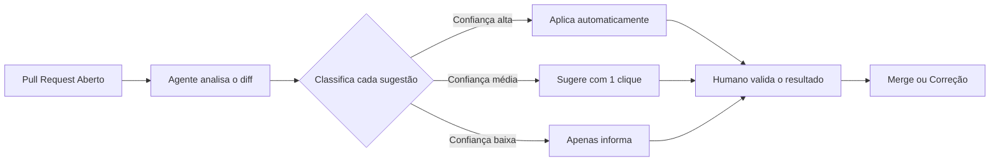

**O que a máquina captura melhor que o humano?**
- Consistência de estilo em todo o codebase
- Problemas repetitivos (variável não usada, import non utilizado)
- Padrões de segurança conhecidos (SQL injection, XSS, hardcoded secrets)
- Performance superficial (loops aninhados, falta de memoização)

**O que o humano captura melhor que a máquina?**
- Decisões de arquitetura e design
- Adequação ao contexto de negócio
- Experiência do usuário e acessibilidade
- Trade-offs que envolvem múltiplos sistemas
- Intenção e clareza da comunicação no código

### Quick Check

**1. Qual a diferença entre os níveis "low effort" e "medium effort" no code review automatizado?**
**Resposta:** Low effort é superficial — detecta problemas óbvios como estilo, formatação, variáveis não usadas. Tem confiança alta e pode ser auto-apply. Medium effort é moderado — detecta anti-padrões, problemas de segurança comuns, boas práticas. Tem confiança média e requer aprovação humana (one-click apply).

**2. O code review automatizado substitui o revisor humano? Justifique.**
**Resposta:** Não. A máquina complementa o humano, não substitui. A máquina é excelente para padrões repetitivos, estilo e bugs óbvios. O humano é insubstituível para decisões de arquitetura, contexto de negócio, UX e trade-offs sistêmicos. O melhor cenário é a combinação: máquina faz a varredura rápida, humano foca no que realmente importa.

---

**APLICAÇÃO: Copilot CLI, Cloud Agent e Code Review no Ecossistema GitHub**

> *Agora que você entende os fundamentos de CLI agents, agentes remotos e code review automatizado, vamos conectá-los à prática com o ecossistema GitHub Copilot. Você vai instalar e operar o Copilot CLI, configurar o Cloud Agent, praticar Code Review e fechar o ciclo com um workflow de CI/CD.*

---

## 4. Copilot CLI: Instalação, Autenticação e Chat Interativo

O **Copilot CLI** (`gh copilot`) leva o assistente Copilot para o terminal. Com ele, você pode explicar código, sugerir comandos e responder perguntas sem sair do fluxo de trabalho no terminal. Ele acessa o contexto do repositório — estrutura de arquivos, git history, código fonte — exatamente como o chat do VS Code faz.

### Instalação

O Copilot CLI é uma extensão do GitHub CLI (`gh`). Se você já tem o `gh` instalado e autenticado (pré-requisito), a instalação é um comando:

```bash
gh extension install github/gh-copilot
```

Para verificar se a instalação foi bem-sucedida:

```bash
gh copilot --version
```

### Autenticação

O Copilot CLI usa a mesma autenticação do `gh`. Se você já executou `gh auth login`, a extensão copilot herda essa autenticação. Para verificar:

```bash
gh copilot auth
```

Se a autenticação estiver OK, o comando retorna uma confirmação silenciosa. Se não, ele inicia o fluxo de login.

### Primeiro Comando: Modo Explain

O comando mais básico é `gh copilot explain` — você passa um texto ou código e o agente explica:

```bash
gh copilot explain "o que este repositório faz?"
```

A saída será uma descrição do projeto baseada na estrutura de arquivos, README e código fonte que o CLI consegue acessar.

### Modo Interativo: gh copilot chat

Para iniciar uma sessão interativa com estado:

```bash
gh copilot chat
```

Isso abre um prompt interativo. Você pode fazer perguntas sequenciais, e o agente mantém o contexto entre elas. Exemplo de sessão:

```
$ gh copilot chat
Welcome to GitHub Copilot Chat in the terminal! Type 'exit' to quit.

You> Qual a estrutura de diretórios deste projeto?
Copilot> O projeto Portal de Projetos Dev tem a seguinte estrutura:
  - index.html (página principal)
  - styles.css (estilos)
  - app.js (lógica)
  - data/ (dados JSON)
  - .github/ (harness: instructions, agents, skills, prompts)

You> Quais são as principais funções no app.js?
Copilot> O arquivo app.js contém as funções:
  - renderProjects() - renderiza cards de projetos
  - filterByStatus(status) - filtra por status
  - loadProjects() - carrega dados do JSON
```

Perceba como a segunda pergunta referencia o contexto estabelecido pela primeira. Isso é o **modo interativo com estado** em ação.

### Comandos Básicos

| Comando | Propósito | Exemplo |
|---|---|---|
| `gh copilot explain` | Explica código ou conceito | `gh copilot explain "o que é um closure?"` |
| `gh copilot suggest` | Sugere comandos shell | `gh copilot suggest "como listar arquivos modificados nos últimos 7 dias"` |
| `gh copilot chat` | Sessão interativa | `gh copilot chat` (abre prompt) |
| `gh copilot --help` | Ajuda completa | `gh copilot --help` |

### Contexto do Repositório

O Copilot CLI acessa:
- **Arquivos do diretório atual** (lê estrutura e conteúdo)
- **Git history** (commits, branches, diffs)
- **Arquivos de configuração** (`.github/copilot-instructions.md`, `.github/prompts/`)
- **README e documentação** do projeto

Isso significa que ele "conhece" o projeto tão bem quanto o chat do VS Code — mas agora no terminal.

**Mão na Massa — Instalar e Testar o Copilot CLI:**

- [ ] Instale a extensão: `gh extension install github/gh-copilot`
- [ ] Verifique a instalação: `gh copilot --version`
- [ ] Autentique (se necessário): `gh copilot auth`
- [ ] Execute `gh copilot explain "qual a estrutura deste projeto?"` no diretório do Portal
- [ ] Inicie o chat interativo: `gh copilot chat`
- [ ] Faça 3 perguntas sequenciais sobre o Portal

**Verificação:** O comando `gh copilot --version` mostra a versão. O `gh copilot explain` retorna uma descrição coerente do seu projeto. No chat interativo, a segunda e terceira perguntas produzem respostas que demonstram continuidade de contexto.

### Quick Check

**1. Qual comando instala o Copilot CLI e qual verifica a autenticação?**
**Resposta:** `gh extension install github/gh-copilot` instala a extensão. `gh copilot auth` verifica a autenticação.

**2. O que diferencia `gh copilot explain "texto"` de `gh copilot chat`?**
**Resposta:** `gh copilot explain` é um comando direto (one-shot): recebe o texto, explica e termina. `gh copilot chat` abre uma sessão interativa onde o estado é mantido entre perguntas — cada resposta considera o histórico da conversa.

---

## 5. Copilot CLI: Modo Programático para Scripts e CI/CD

O modo mais poderoso do Copilot CLI para automação é o **modo programático**. Ativado pela flag `--non-interactive`, ele transforma o CLI em uma ferramenta de pipeline: recebe input via stdin ou argumento, produz output em stdout e sinaliza sucesso ou erro via exit code.

### A Flag --non-interactive

```bash
gh copilot explain --non-interactive "explique este trecho de código"
```

Com `--non-interactive`:
- O CLI não abre prompt interativo
- Não espera por input do usuário
- Retorna o resultado via stdout
- Exit code 0 = sucesso, 1 = erro, 2 = sem resposta

### Piping: O Padrão Unix

O verdadeiro poder vem do **piping** — o padrão Unix de encadear comandos:

```bash
echo "explique este diff" | gh copilot explain --non-interactive
```

Ou, mais útil, passando o conteúdo de um arquivo:

```bash
cat app.js | gh copilot explain --non-interactive "explique este código"
```

Ou analisando um diff:

```bash
git diff HEAD~1 | gh copilot explain --non-interactive "explique as mudanças"
```

### Criando um Script de Automação

Aqui está um script completo que usa o Copilot CLI programaticamente para analisar mudanças:

```bash
#!/bin/bash
# scripts/review-changes.sh — Analisa o diff do último commit

set -euo pipefail

OUTPUT_DIR="reviews"
mkdir -p "$OUTPUT_DIR"

# Captura o diff
DIFF=$(git diff HEAD~1 2>/dev/null || git diff --cached 2>/dev/null)

if [ -z "$DIFF" ]; then
    echo "Nenhum diff encontrado. Faça um commit primeiro."
    exit 1
fi

# Envia para o Copilot CLI
echo "$DIFF" | gh copilot explain --non-interactive "Analise este diff e produza um resumo das mudanças, destacando possíveis problemas" > "$OUTPUT_DIR/latest.md"

EXIT_CODE=$?

if [ $EXIT_CODE -eq 0 ]; then
    echo "Review salvo em $OUTPUT_DIR/latest.md"
    echo "Resumo:"
    head -20 "$OUTPUT_DIR/latest.md"
elif [ $EXIT_CODE -eq 2 ]; then
    echo "O Copilot não conseguiu analisar o diff."
    exit 2
else
    echo "Erro na análise (exit code $EXIT_CODE)."
    exit $EXIT_CODE
fi
```

### Padrão de Script para CI/CD

Em pipelines de CI/CD, o padrão é ainda mais direto:

```bash
# Gera changelog automático a partir de commits
#!/bin/bash
COMMITS=$(git log --oneline --since="7 days ago")
echo "$COMMITS" | gh copilot explain --non-interactive \
  "Gere um changelog em markdown categorizando estes commits em Features, Bug Fixes e Improvements" > CHANGELOG.md
```

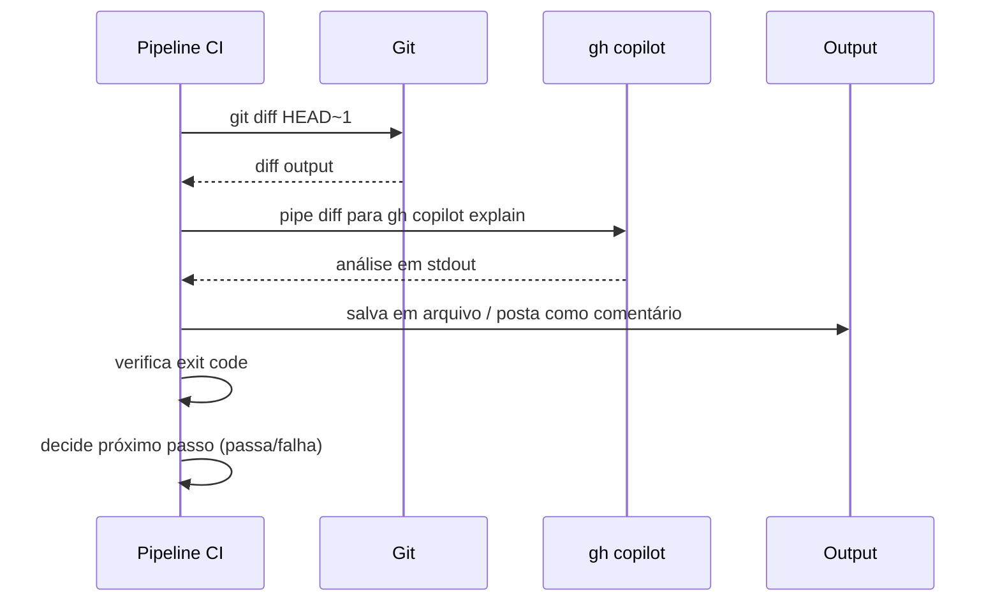

**Mão na Massa — Criar Script de Análise de Diff:**

- [ ] Crie a pasta `scripts/` no diretório do Portal
- [ ] Crie `scripts/review-changes.sh` com o conteúdo do script acima
- [ ] Torne o script executável: `chmod +x scripts/review-changes.sh`
- [ ] Faça uma alteração no Portal (adicione um comentário, mude uma cor)
- [ ] Commit: `git add -A && git commit -m "teste: pequena alteração para testar review"`
- [ ] Execute `./scripts/review-changes.sh`
- [ ] Verifique o conteúdo de `reviews/latest.md`

**Verificação:** O script executa sem erros. O arquivo `reviews/latest.md` contém um resumo coerente da mudança que você fez. O exit code é 0.

### Quick Check

**1. O que a flag `--non-interactive` faz no Copilot CLI e por que ela é importante para CI/CD?**
**Resposta:** `--non-interactive` faz o CLI operar em modo one-shot: recebe input, processa e retorna output sem interação do usuário. É importante para CI/CD porque permite usar o CLI em pipelines automatizados — scripts bash, workflows, Makefiles — onde não há um humano para interagir.

**2. Como você usaria o pipe (`|`) para analisar um diff de commit com o Copilot CLI?**
**Resposta:** `git diff HEAD~1 | gh copilot explain --non-interactive "analise estas mudanças"`. O pipe pega a saída do `git diff` e envia como entrada para o `gh copilot explain`.

---

## 6. Autopilot e /fleet na CLI

O Copilot CLI não é apenas um chat no terminal. Ele também oferece **Autopilot** (execução autônoma) e **/fleet** (orquestração paralela) — recursos que elevam a CLI de "assistente reativo" para "agente proativo".

### Autopilot Mode

O Autopilot permite que o Copilot CLI itere autonomamente até atingir um objetivo, similar ao Agent Mode no VS Code. Em vez de você fazer perguntas sequenciais, você dá um objetivo e o agente trabalha para alcançá-lo, tomando decisões pelo caminho.

```bash
gh copilot chat --autopilot "refatore o arquivo app.js para usar módulos ES6"
```

Com `--autopilot`, o CLI:
1. **Analisa** o estado atual do código
2. **Planeja** os passos necessários para a refatoração
3. **Executa** as mudanças (lê, edita, verifica)
4. **Valida** se o objetivo foi alcançado
5. **Reporta** o resultado

O loop é o mesmo Understand→Act→Validate que você aprendeu na Aula 05, agora rodando no terminal.

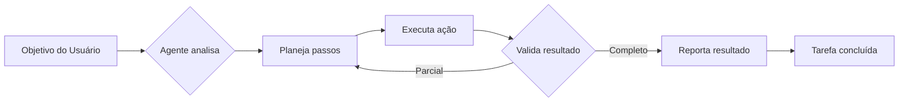

### /fleet: Distribuição Paralela

O `/fleet` é um comando que distribui múltiplas tarefas entre agentes paralelos. Enquanto o Autopilot executa uma tarefa de cada vez (sequencial), o `/fleet` orquestra execução concorrente e agrega os resultados.

```bash
gh copilot chat
> /fleet "revise os arquivos index.html, styles.css e app.js, cada um com foco em acessibilidade, performance e boas práticas"
```

O `/fleet`:
1. **Decompõe** a tarefa principal em subtarefas (um arquivo por agente)
2. **Distribui** cada subtarefa para um agente paralelo
3. **Agrega** os resultados parciais em um relatório único
4. **Apresenta** o resultado consolidado

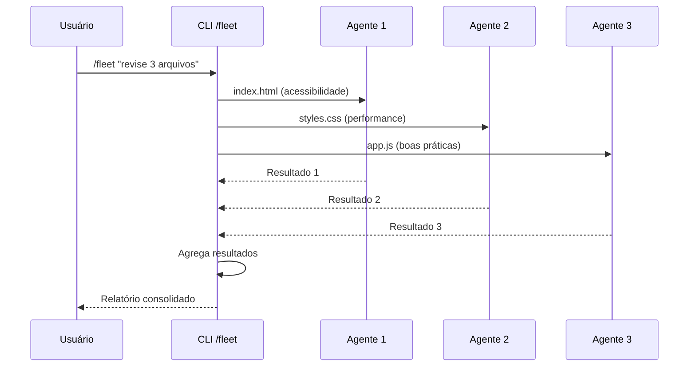

### Diferenças entre CLI Autopilot e VS Code Agent Mode

| Característica | CLI Autopilot | VS Code Agent Mode |
|---|---|---|
| **Contexto** | Terminal + sistema de arquivos | Editor + workspace + terminal |
| **Ferramentas** | Comandos shell, git, arquivos | 9 tool sets (#edit, #execute, etc.) |
| **Feedback visual** | Texto puro | Diffs inline, highlights |
| **Paralelismo** | /fleet explícito | runSubagent tool |
| **Melhor para** | Automação headless, scripts | Desenvolvimento interativo |

### Quick Check

**1. Qual a diferença entre o Autopilot mode e o `/fleet` na CLI?**
**Resposta:** Autopilot executa uma tarefa de cada vez em modo sequencial, iterando até atingir o objetivo. `/fleet` distribui múltiplas subtarefas entre agentes paralelos e agrega os resultados. Autopilot é para execução focada; `/fleet` é para orquestração paralela.

**2. Em que cenário o `/fleet` seria mais adequado que o Autopilot?**
**Resposta:** Quando a tarefa envolve múltiplos arquivos independentes que podem ser analisados em paralelo. Por exemplo, revisar 5 arquivos ao mesmo tempo com foco em aspectos diferentes (acessibilidade, performance, segurança) — cada agente pega um arquivo e o relatório final é consolidado.

---

## 7. Cloud Agent: Agente Remoto via GitHub Actions

O **Cloud Agent** é a peça que conecta o harness local ao GitHub. É um agente Copilot que roda na infraestrutura do GitHub Actions, acionado por eventos do repositório. Ele herda todo o harness do projeto — instructions, skills, agents, MCP — e opera com acesso às APIs do GitHub via token.

### Arquitetura

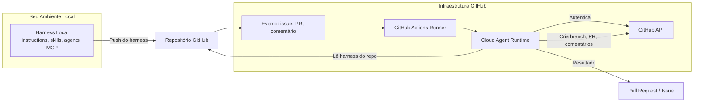

### Workflow YAML de Configuração

O Cloud Agent é configurado através de um workflow do GitHub Actions. Aqui está o mínimo necessário:

```yaml
# .github/workflows/copilot-cloud-agent.yml
name: Copilot Cloud Agent

on:
  issue_comment:
    types: [created]

permissions:
  issues: write
  contents: write
  pull-requests: write

jobs:
  copilot-agent:
    if: contains(github.event.comment.body, '/copilot')
    runs-on: ubuntu-latest
    steps:
      - name: Checkout repository
        uses: actions/checkout@v4

      - name: Setup Copilot Agent
        uses: github/copilot-agent-action@v1
        with:
          token: ${{ secrets.GITHUB_TOKEN }}
          instructions: .github/copilot-instructions.md
          prompt: ${{ github.event.comment.body }}
```

**Explicação de cada seção:**

- **`on.issue_comment`**: O workflow dispara quando alguém comenta em uma issue.
- **`if: contains(...)`**: Só executa se o comentário contiver `/copilot`.
- **`permissions`**: Token com permissões para issues, conteúdo e PRs (escopos mínimos).
- **`actions/checkout@v4`**: Faz checkout do repositório para o runner ter acesso ao código e ao harness.
- **`github/copilot-agent-action@v1`**: Action que invoca o Copilot Agent com o contexto.
- **`token`**: `GITHUB_TOKEN` é injetado automaticamente pelo GitHub Actions.
- **`instructions`**: Caminho para o arquivo de instruções customizadas.
- **`prompt`**: O conteúdo do comentário é passado como prompt para o agente.

### Como o Harness do Repositório é Carregado

Quando o Cloud Agent executa, ele automaticamente carrega:
- `.github/copilot-instructions.md` — regras de stack, estilo, convenções
- `.github/prompts/*.prompt.md` — slash commands customizados
- `.github/skills/*/SKILL.md` — skills para tarefas recorrentes
- `.github/agents/*.agent.md` — agentes especializados

Isso significa que tudo que você construiu nas Aulas 03-10 está disponível para o Cloud Agent.

### Segurança

- **`GITHUB_TOKEN`**: Token de curta duração injetado automaticamente pelo Actions, com escopos definidos no `permissions` do workflow.
- **Escopos mínimos**: Conceda apenas as permissões necessárias. Se o agente só precisa comentar, não dê permissão de `contents: write`.
- **Secrets**: Para tokens adicionais (ex: API externa), use `${{ secrets.MEU_SEGREDO }}`.

**Mão na Massa — Criar Workflow do Cloud Agent:**

- [ ] Crie a pasta `.github/workflows/` se não existir
- [ ] Crie `.github/workflows/copilot-cloud-agent.yml` com o conteúdo acima
- [ ] Faça commit e push do arquivo: `git add .github/workflows/ && git commit -m "adiciona Cloud Agent workflow" && git push`
- [ ] Verifique se o workflow aparece no GitHub (aba Actions do repositório)

**Verificação:** O workflow aparece na aba Actions do GitHub. A sintaxe YAML é válida (o GitHub mostra erro se não for). Quando uma issue receber um comentário com `/copilot`, o workflow dispara.

### Quick Check

**1. Qual evento do Actions dispara o Cloud Agent quando alguém comenta `/copilot` em uma issue?**
**Resposta:** O evento `issue_comment` com `types: [created]`. O workflow verifica se o comentário contém `/copilot` com o condicional `if: contains(github.event.comment.body, '/copilot')`.

**2. Quais arquivos do harness o Cloud Agent carrega automaticamente ao executar?**
**Resposta:** `.github/copilot-instructions.md` (instruções), `.github/prompts/*.prompt.md` (slash commands), `.github/skills/*/SKILL.md` (skills), `.github/agents/*.agent.md` (agentes). Tudo que foi construído nas Aulas 03-10.

---

## 8. Cloud Agent em Issues: Branch e PR Automáticos

Quando o Cloud Agent está configurado, qualquer pessoa com acesso ao repositório pode **atribuir uma issue ao Copilot** simplesmente comentando `/copilot` nela. O agente então:

1. Analisa a descrição e comentários da issue
2. Planeja a solução
3. Cria uma branch (`copilot/issue-NN-descricao`)
4. Implementa as mudanças
5. Abre um Pull Request vinculado à issue

### O Ciclo Completo

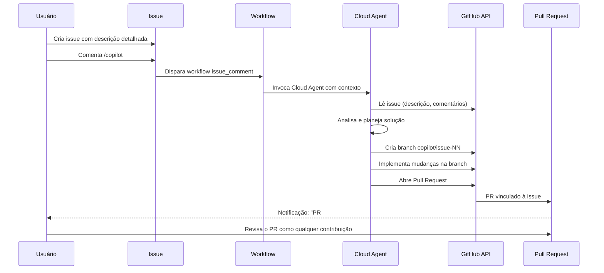

### O que o Agente Produz

Quando o Cloud Agent completa o ciclo, você recebe:

- **Uma branch**: `copilot/issue-NN-titulo-resumido` com as implementações
- **Commits**: Mensagens descritivas referenciando a issue
- **Um Pull Request**: Com descrição gerada automaticamente, link para a issue original e sumário das mudanças
- **Comentário na issue**: "O Copilot criou o PR #42 para implementar esta issue"

### Atribuindo uma Issue

1. Crie uma issue no repositório com uma descrição clara do que precisa ser feito
2. Comente `/copilot` na issue
3. Aguarde o workflow disparar (pode levar alguns segundos a minutos)
4. Verifique o PR criado na aba Pull Requests

**Dica:** Quanto mais clara a descrição da issue, melhor o resultado do agente. Inclua contexto, critérios de aceitação, e referências a arquivos relevantes.

### Limitações

- **Complexidade**: O agente lida bem com tarefas bem definidas e escopo limitado. Issues muito vagas ou de grande escopo podem produzir resultados inconsistentes.
- **Tempo de execução**: O GitHub Actions tem limite de 6 horas para jobs, mas o agente pode levar de alguns segundos a vários minutos dependendo da complexidade.
- **Contexto**: O agente depende do contexto na issue. Se a descrição for "arrume isso", sem detalhes, o resultado será impreciso.

**Mão na Massa — Atribuir Issue ao Cloud Agent:**

- [ ] Crie uma issue no repositório do Portal: "Adicionar tooltip nos cards de projeto mostrando a data de última atualização"
- [ ] Na issue, descreva: onde adicionar (função `renderProjects`), comportamento (hover mostra tooltip com data), estilo (tooltip com fundo escuro)
- [ ] Comente `/copilot` na issue
- [ ] Acompanhe o workflow na aba Actions
- [ ] Quando o PR for criado, revise-o como faria com qualquer PR

**Verificação:** Uma branch `copilot/issue-NN` foi criada. Um PR foi aberto com descrição e commits. O PR referencia a issue original. O código no PR implementa o solicitado.

### Quick Check

**1. O que acontece quando você comenta `/copilot` em uma issue?**
**Resposta:** O Cloud Agent é acionado via workflow. Ele lê a issue, planeja a solução, cria uma branch (`copilot/issue-NN`), implementa as mudanças e abre um Pull Request. O humano revisa o PR como faria com qualquer contribuição.

**2. Qual o principal fator para o sucesso do Cloud Agent em uma issue?**
**Resposta:** A clareza da descrição da issue. Issues bem detalhadas, com contexto, critérios de aceitação e referências a arquivos específicos produzem resultados muito melhores que issues vagas. O agente é tão bom quanto o contexto que recebe.

---

## 9. Code Review com Copilot: Low Effort, Medium Effort e One-Click Apply

O **Copilot Code Review** analisa Pull Requests automaticamente e gera sugestões inline. Funciona em dois níveis de esforço: **low** (rápido, superficial) e **medium** (completo, profundo). As sugestões podem ser aplicadas com 1 clique diretamente na interface do GitHub.

### Low Effort

Low effort é uma varredura rápida focada em problemas óbvios:

- **Estilo**: formatação inconsistente, espaçamento, quebra de linhas
- **Bugs simples**: variáveis não usadas, imports não utilizados, sintaxe incorreta
- **Boas práticas básicas**: nomes de variáveis, comentários ausentes

A execução é quase instantânea (segundos). Ideal para feedback imediato.

### Medium Effort

Medium effort é uma análise completa:

- **Padrões de código**: complexidade ciclomática, repetição de código, responsabilidade única
- **Segurança**: injeção, exposição de dados sensíveis, validação de input
- **Acessibilidade**: atributos ARIA, contraste, navegação por teclado
- **Performance**: loops desnecessários, manipulação DOM ineficiente, carregamento assíncrono
- **Boas práticas**: async/await, tratamento de erros, tipos

A execução leva mais tempo (pode chegar a minutos), mas produz sugestões mais relevantes.

### Como as Sugestões Aparecem

As sugestões do Code Review aparecem como:

1. **Comentários inline no diff do PR**: cada sugestão é associada a uma linha específica do código
2. **Sumário no topo do PR**: visão geral dos problemas encontrados, categorizados por severidade
3. **Botão "Apply suggestion"**: aplica a mudança com 1 clique, sem sair do GitHub

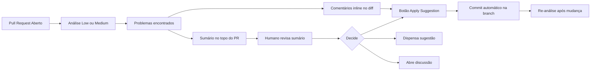

### Exemplo de Sugestão

Suponha que o PR adicione este código no `app.js`:

```javascript
fetch('data/projects.json').then(function(response) {
    return response.json();
}).then(function(data) {
    console.log(data);
});
```

O Code Review (medium effort) sugeriria:

```javascript
// Sugestão: usar async/await para legibilidade
async function loadProjects() {
    try {
        const response = await fetch('data/projects.json');
        const data = await response.json();
        console.log(data);
    } catch (error) {
        console.error('Erro ao carregar projetos:', error);
    }
}
```

A sugestão aparece como comentário inline com um botão "Apply suggestion".

### O que o Copilot NÃO Revisa

- Decisões de arquitetura
- Adequação ao negócio
- Experiência do usuário
- Trade-offs que envolvem múltiplos sistemas
- Intenção do código versus necessidade real

### Comparação: Máquina vs Humano

| Aspecto | Copilot Code Review | Revisor Humano |
|---|---|---|
| **Velocidade** | Segundos a minutos | Minutos a horas |
| **Consistência** | Mesmo padrão sempre | Varia conforme cansaço |
| **Escopo** | Linha por linha | Contexto do sistema |
| **Estilo** | Perfeito | Subjetivo |
| **Arquitetura** | Não captura | Captura |
| **Negócio** | Não entende | Entende |
| **Cansaço** | Nunca | Sim |

**Mão na Massa — Executar Code Review em um PR:**

- [ ] Crie um branch com algumas alterações no Portal (adicione intencionalmente: 1 variável não usada, 1 estilo inconsistente, 1 possível bug)
- [ ] Abra um Pull Request desse branch para a main
- [ ] No PR, execute o Code Review (low effort) — verifique as sugestões inline
- [ ] Execute o Code Review (medium effort) — compare a profundidade
- [ ] Aplique pelo menos uma sugestão com 1 clique
- [ ] Verifique que o commit foi criado automaticamente

**Verificação:** O PR mostra comentários inline com sugestões. A sugestão low effort é mais superficial que a medium effort. O botão "Apply suggestion" cria um commit na branch automaticamente.

### Quick Check

**1. Qual a diferença prática entre low effort e medium effort no Code Review?**
**Resposta:** Low effort é uma varredura rápida (segundos) focada em estilo, formatação e bugs óbvios. Medium effort é uma análise completa (pode levar minutos) que cobre padrões, segurança, acessibilidade e performance. Medium effort produz sugestões mais profundas mas leva mais tempo.

**2. O que o Copilot Code Review NÃO captura que um revisor humano capturaria?**
**Resposta:** Decisões de arquitetura, adequação ao negócio, experiência do usuário, trade-offs sistêmicos e intenção do código. A máquina analisa linha por linha; o humano entende o contexto do sistema.

---

## 10. Browser Agent (Experimental) e Integração CI/CD Completa

### Browser Agent (Experimental)

O **Browser Agent** é um recurso experimental do Copilot no VS Code que permite automação web dentro do editor. Com ele, o Copilot pode:

- **Navegar** para URLs específicas
- **Preencher formulários** e clicar em botões
- **Extrair dados** de páginas web
- **Interagir** com elementos da página

**Capacidades atuais:**
- Navegação headless (sem janela visível) ou headed (com janela)
- Preenchimento de campos de formulário
- Extração de conteúdo estruturado
- Screenshots de páginas

**Limitações (experimental):**
- Pode não funcionar com todos os tipos de página (SPAs complexos, autenticação multi-fator)
- Performance variável dependendo da complexidade da página
- API pode mudar entre versões do VS Code
- Não substitui ferramentas dedicadas de teste (Playwright, Puppeteer)

### A Integração CI/CD Completa

Agora vamos juntar todas as peças. O workflow final que conecta o harness local ao GitHub, revisando Pull Requests automaticamente:

```yaml
# .github/workflows/copilot-code-review.yml
name: Copilot Code Review

on:
  pull_request:
    types: [opened, synchronize, reopened]

permissions:
  contents: read
  pull-requests: write
  issues: write

jobs:
  code-review:
    runs-on: ubuntu-latest
    steps:
      - name: Checkout repository
        uses: actions/checkout@v4

      - name: Copilot Code Review
        uses: github/copilot-code-review-action@v1
        with:
          token: ${{ secrets.GITHUB_TOKEN }}
          instructions: .github/copilot-instructions.md
          effort: medium
          languages: javascript,html,css

      - name: Post Review Results
        uses: actions/github-script@v7
        with:
          script: |
            const review = require('${{ steps.code-review.outputs.review-file }}');
            github.rest.issues.createComment({
              issue_number: context.issue.number,
              owner: context.repo.owner,
              repo: context.repo.repo,
              body: `## Resultados da Revisão\n\n${review.summary}`
            });
```

### O Ciclo Completo (Dev Local → GitHub → Review → Apply → Merge)

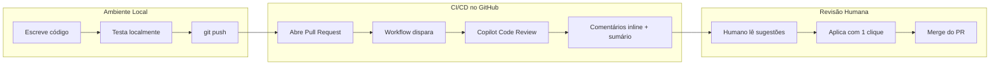

### Conexão com Hooks (Aula 10)

Os hooks de lifecycle que você criou na Aula 10 (PostToolUse, PreToolUse) agora têm um equivalente no CI/CD:

| Hook no VS Code | Equivalente no CI/CD |
|---|---|
| `preToolUse` | Validação antes de executar ação |
| `postToolUse` | Verificação pós-execução |
| `sessionStart` | Início do workflow |
| `sessionEnd` | Fim do workflow / postar resultado |
| `errorOccurred` | Tratamento de falhas |

O workflow é o **hook do GitHub** — a extensão do harness do VS Code para o repositório remoto.

**Mão na Massa — Criar Workflow CI/CD Completo:**

- [ ] Crie `.github/workflows/copilot-code-review.yml` com o conteúdo completo acima
- [ ] Faça commit e push: `git add .github/workflows/ && git commit -m "adiciona Code Review automatizado em PRs" && git push`
- [ ] Crie um branch de feature: `git checkout -b feature/adiciona-tooltip`
- [ ] Faça alterações no Portal (adicione tooltips nos cards)
- [ ] Commit e push do branch: `git add -A && git commit -m "adiciona tooltip nos cards" && git push origin feature/adiciona-tooltip`
- [ ] Abra um PR do branch `feature/adiciona-tooltip` para `main`
- [ ] Verifique na aba Actions se o workflow disparou
- [ ] Verifique os comentários do Code Review no PR
- [ ] Aplique pelo menos uma sugestão com 1 clique
- [ ] Faça o merge do PR

**Verificação:** O workflow aparece na aba Actions. O PR mostra comentários inline com sugestões do Code Review. O botão "Apply suggestion" funciona e cria commits na branch.

### Quick Check

**1. Quais são as capacidades atuais e limitações do Browser Agent?**
**Resposta:** Capacidades: navegação headless/headed, preenchimento de formulários, extração de dados, screenshots. Limitações: experimental, API pode mudar, performance variável em SPAs complexos, não substitui ferramentas dedicadas como Playwright.

**2. Descreva o ciclo completo conectando o ambiente local ao GitHub com o workflow de CI/CD.**
**Resposta:** O desenvolvedor escreve código localmente → faz push → abre PR → o workflow `copilot-code-review.yml` dispara automaticamente → o Copilot Code Review analisa as mudanças → posta comentários inline e sumário no PR → o humano revisa, aplica sugestões com 1 clique e faz o merge. O ciclo conecta o harness local (instructions, skills, agents) ao CI/CD remoto.

---

## Autoavaliação: Quiz Rápido

**1. Qual comando instala a extensão do Copilot CLI e qual comando inicia o chat interativo?**
**Resposta:**

`gh extension install github/gh-copilot` instala. `gh copilot chat` inicia o chat interativo.

**2. Qual a diferença entre `gh copilot explain "texto"` e `gh copilot explain --non-interactive "texto"`?**
**Resposta:**

Ambos processam o texto, mas `--non-interactive` garante que o CLI não abra prompt interativo e retorne via stdout com exit code — essencial para scripts e pipelines.

**3. O que o Autopilot mode faz no Copilot CLI?**
**Resposta:**

Executa uma tarefa autonomamente, iterando no loop Understand→Act→Validate até atingir o objetivo, similar ao Agent Mode no VS Code.

**4. Quais arquivos do harness o Cloud Agent carrega automaticamente?**
**Resposta:**

`.github/copilot-instructions.md`, `.github/prompts/*.prompt.md`, `.github/skills/*/SKILL.md`, `.github/agents/*.agent.md`.

**5. O que acontece quando você comenta `/copilot` em uma issue?**
**Resposta:**

O Cloud Agent analisa a issue, planeja a solução, cria uma branch, implementa as mudanças e abre um Pull Request.

**6. Qual a diferença entre low effort e medium effort no Code Review?**
**Resposta:**

Low effort varre superficialmente por estilo e bugs óbvios (segundos). Medium effort analisa padrões, segurança, acessibilidade e performance (minutos).

**7. Que garantia o workflow de CI/CD completo oferece ao repositório?**
**Resposta:**

Todo Pull Request recebe revisão automatizada do Copilot, com sugestões inline e sumário. O desenvolvedor pode aplicar correções com 1 clique antes do merge.

---

## Mão na Massa: Exercícios Graduados

**Exercício 1 (Fácil) — Primeiro Comando CLI e Verificação**

Instale o Copilot CLI, autentique e execute `gh copilot explain` sobre o arquivo `app.js` do Portal. Verifique a instalação e o output.

**Gabarito:**

```bash
# Instalação
gh extension install github/gh-copilot

# Verificação
gh copilot --version
# Saída esperada: versão tipo "0.6.0" ou superior

# Autenticação
gh copilot auth

# Explicar app.js
gh copilot explain "explique o arquivo app.js"
# Ou: cat app.js | gh copilot explain --non-interactive "explique este codigo"
```

**O que verificar:**
- [ ] `gh copilot --version` mostra a versão
- [ ] `gh copilot auth` não mostra erro
- [ ] O output de `explain` é coerente com o conteúdo real do `app.js`

---

**Exercício 2 (Médio) — Script Programático + Cloud Agent Workflow**

Crie um script `scripts/analyze-portal.sh` que usa `gh copilot suggest --non-interactive` para analisar a qualidade do código do Portal (HTML semântico, CSS organizado, JS limpo) e salvar o resultado. Depois, configure o workflow YAML do Cloud Agent para responder a `/copilot` em issues.

**Gabarito:**

**Script `scripts/analyze-portal.sh`:**

```bash
#!/bin/bash
# scripts/analyze-portal.sh — Analisa qualidade do código do Portal

set -euo pipefail

REVIEW_DIR="reviews"
mkdir -p "$REVIEW_DIR"

analyze_file() {
    local file=$1
    local focus=$2
    local output="$REVIEW_DIR/$(basename $file).md"

    echo "Analisando $file (foco: $focus)..."
    cat "$file" | gh copilot suggest --non-interactive \
      "Analise a qualidade deste código com foco em $focus. \
       Identifique problemas e sugira melhorias concretas." > "$output"

    if [ $? -eq 0 ]; then
        echo "  OK — resultado em $output"
    else
        echo "  ERRO ao analisar $file"
    fi
}

analyze_file "index.html" "HTML semantico, acessibilidade, estrutura"
analyze_file "styles.css" "organizacao CSS, responsividade, boas praticas"
analyze_file "app.js" "JavaScript limpo, modularizacao, tratamento de erros"

echo "Analise concluida. Resultados em $REVIEW_DIR/"
```

**Workflow `.github/workflows/copilot-cloud-agent.yml`:**

```yaml
name: Copilot Cloud Agent

on:
  issue_comment:
    types: [created]

permissions:
  issues: write
  contents: write
  pull-requests: write

jobs:
  copilot-agent:
    if: contains(github.event.comment.body, '/copilot')
    runs-on: ubuntu-latest
    steps:
      - uses: actions/checkout@v4
      - name: Run Copilot Agent
        uses: github/copilot-agent-action@v1
        with:
          token: ${{ secrets.GITHUB_TOKEN }}
          instructions: .github/copilot-instructions.md
          prompt: ${{ github.event.comment.body }}
```

**O que verificar:**
- [ ] `scripts/analyze-portal.sh` é executável (`chmod +x`)
- [ ] O script executa sem erros e produz 3 arquivos de análise em `reviews/`
- [ ] O workflow YAML tem sintaxe válida (GitHub não mostra erro na aba Actions)
- [ ] O workflow aparece na aba Actions do repositório

---

**Desafio (Difícil) — Pipeline CI/CD Completo com Code Review**

Configure o workflow completo `.github/workflows/copilot-code-review.yml` que dispara Code Review automático em PRs. O workflow deve: (1) rodar em `pull_request` opened/synchronize, (2) usar o harness do repositório (instructions, agents, skills), (3) postar resultados como comentário no PR, (4) incluir um step de verificação que bloqueia merge se houver sugestões críticas não resolvidas. Testar com um PR real no Portal.

**Gabarito:**

**Workflow `.github/workflows/copilot-code-review.yml`:**

```yaml
name: Copilot Code Review

on:
  pull_request:
    types: [opened, synchronize, reopened]

permissions:
  contents: read
  pull-requests: write
  issues: write

jobs:
  code-review:
    runs-on: ubuntu-latest
    steps:
      - name: Checkout repository
        uses: actions/checkout@v4

      - name: Copilot Code Review
        id: copilot-review
        uses: github/copilot-code-review-action@v1
        with:
          token: ${{ secrets.GITHUB_TOKEN }}
          instructions: .github/copilot-instructions.md
          effort: medium
          languages: javascript,html,css

      - name: Post Review Summary
        uses: actions/github-script@v7
        with:
          script: |
            const fs = require('fs');
            const reviewFile = process.env.REVIEW_FILE || '${{ steps.copilot-review.outputs.review-file }}';
            let review;
            try {
              review = JSON.parse(fs.readFileSync(reviewFile, 'utf8'));
            } catch (e) {
              review = { summary: "Revisão concluída.", critical_count: 0 };
            }

            const body = `## ßÖ Copilot Code Review

            ${review.summary || 'Análise concluída.'}

            **Sugestões críticas:** ${review.critical_count || 0}
            **Sugestões totais:** ${review.total_suggestions || 0}

            ${
              (review.critical_count || 0) > 0
                ? '> Ú�️ Existem sugestões críticas não resolvidas. Revise antes de fazer merge.'
                : '> “& Nenhuma sugestão crítica.'
            }`;

            github.rest.issues.createComment({
              issue_number: context.issue.number,
              owner: context.repo.owner,
              repo: context.repo.repo,
              body: body
            });

      - name: Block Merge on Critical Issues
        if: ${{ steps.copilot-review.outputs.critical_count > 0 }}
        uses: actions/github-script@v7
        with:
          script: |
            github.rest.issues.addLabels({
              issue_number: context.issue.number,
              owner: context.repo.owner,
              repo: context.repo.repo,
              labels: ['review-critical']
            });
            core.setFailed('Existem sugestões críticas não resolvidas. Resolva antes do merge.');
```

**Fluxo de teste:**

```bash
# 1. Crie um branch de feature
git checkout -b feature/adiciona-tooltip

# 2. Faça alterações no Portal
echo "// TODO: variavel nao usada" >> app.js

# 3. Commit e push
git add -A && git commit -m "feat: adiciona tooltip nos cards"
git push origin feature/adiciona-tooltip

# 4. Abra PR via GitHub CLI ou interface
gh pr create --title "Adiciona tooltip nos cards" --body "Implementa tooltip com data de atualização"

# 5. Verifique o workflow
gh run list --workflow "Copilot Code Review"

# 6. Verifique os comentários no PR
gh pr view --comments
```

**O que verificar:**
- [ ] O workflow dispara automaticamente ao abrir o PR
- [ ] Comentários inline aparecem no diff do PR
- [ ] Sumário aparece no topo do PR com contagem de sugestões
- [ ] Sugestões críticas bloqueiam o merge (label `review-critical` + falha no check)
- [ ] Sugestões não críticas podem ser aplicadas com 1 clique
- [ ] O merge só é possível quando sugestões críticas são resolvidas

---

## Resumo da Aula

### Os 6 Conceitos Fundamentais

1. **CLI-Based AI Agents**: A CLI é a interface universal de automação — transforma agentes de assistentes de editor em etapas de pipeline. Dois modos: interativo (com estado) e programático (one-shot, CI/CD).

2. **Agentes Remotos**: Agentes que rodam em infraestrutura cloud, acionados por eventos do repositório. Ciclo de vida: trigger → context → auth → execute → artifacts → report.

3. **Code Review Automatizado**: Opera em um espectro (shallow → medium → deep). Não substitui o humano — complementa, liberando o revisor para decisões de arquitetura e negócio.

4. **Autopilot e /fleet**: Autopilot executa tarefas sequencialmente com loop autônomo. /fleet distribui subtarefas entre agentes paralelos com agregação de resultados.

5. **Cloud Agent**: Agente Copilot que roda no GitHub Actions, herda o harness do repositório, e pode ser atribuído a issues via `/copilot`. Cria branch → implementa → abre PR.

6. **Workflow CI/CD Completo**: Conecta o harness local ao GitHub — todo PR recebe Code Review automático com sugestões inline, one-click apply e bloqueio condicional de merge.

### O Que Você Construiu Hoje

- [x] `gh copilot` instalado e autenticado
- [x] Chat interativo testado com contexto do Portal
- [x] `scripts/review-changes.sh` — script programático de análise de diff
- [x] `.github/workflows/copilot-cloud-agent.yml` — Cloud Agent para issues
- [x] Code Review executado (low e medium effort) em PR real
- [x] `.github/workflows/copilot-code-review.yml` — workflow CI/CD completo que revisa PRs automaticamente

---

## Próxima Aula

**Aula 12: SDK, Governança e Continual Harness**

Na última aula do curso, você criará uma custom tool com o Copilot SDK, aplicará métricas de governança para medir adoção e efetividade, e fechará o ciclo do Continual Harness — atuar, observar e refinar o próprio harness. Você terá um harness Copilot completo, do zero até a governança.

---

## Referências

### Documentação Oficial

- [GitHub Copilot CLI docs](https://docs.github.com/en/copilot/using-github-copilot/using-github-copilot-in-the-command-line)
- [GitHub Copilot Cloud Agent docs](https://docs.github.com/en/copilot/managing-copilot/managing-github-copilot-features/managing-cloud-agent)
- [GitHub Copilot Code Review docs](https://docs.github.com/en/copilot/using-github-copilot/code-review/using-copilot-code-review)
- [GitHub Actions workflow syntax](https://docs.github.com/en/actions/writing-workflows/workflow-syntax-for-github-actions)

### Ferramentas

- [GitHub CLI manual](https://cli.github.com/manual/)
- [GitHub Copilot](https://github.com/features/copilot)
- [VS Code — Browser Agent docs](https://code.visualstudio.com/docs/agents/browser-agent)

### Artigos para Aprofundamento

- [Copilot Code Review: Now in Public Beta](https://github.blog/changelog/2025-03-24-copilot-code-review-now-in-public-beta) — Blog do GitHub
- [Cloud Agent: Automate Issue Resolution](https://github.blog/changelog/2025-03-26-cloud-agent-automate-issue-resolution) — Blog do GitHub
- [GitHub Copilot in the CLI](https://github.blog/changelog/2024-10-29-github-copilot-in-the-cli) — Blog do GitHub

---

## FAQ

**P: Preciso de uma licença paga do Copilot para usar o CLI?**
R: Sim, você precisa de uma licença do GitHub Copilot (Free, Pro, Pro+ ou Max) — a mesma que você já usa no VS Code.

**P: O Copilot CLI funciona em Windows?**
R: Sim, o GitHub CLI (`gh`) funciona em Windows, macOS e Linux. A extensão `gh-copilot` herda essa compatibilidade.

**P: Posso usar o Copilot CLI sem o GitHub CLI instalado?**
R: Não. O Copilot CLI é uma extensão do `gh`. Você precisa do GitHub CLI instalado e autenticado primeiro.

**P: O Cloud Agent usa meus minutos do GitHub Actions?**
R: Sim, o Cloud Agent executa como um workflow do GitHub Actions. Contas Free têm 2.000 minutos/mês para repositórios privados (ilimitado para públicos).

**P: O Cloud Agent pode modificar qualquer arquivo do repositório?**
R: Ele pode modificar arquivos dentro das permissões do `GITHUB_TOKEN` configurado no workflow. Por segurança, conceda apenas as permissões necessárias.

**P: Quanto tempo leva o Cloud Agent para criar um PR a partir de uma issue?**
R: Depende da complexidade. Issues simples podem levar de 30 segundos a 2 minutos. Issues complexas podem levar vários minutos.

**P: O Code Review low effort é suficiente?**
R: Low effort captura problemas superficiais (estilo, bugs óbvios). Medium effort é mais completo (padrões, segurança). Para projetos reais, recomenda-se medium effort.

**P: O Copilot Code Review substitui o ESLint, Prettier ou SonarCloud?**
R: Não. Ferramentas de lint e análise estática são deterministicas e previsíveis. O Copilot Code Review complementa com análise semântica que ferramentas tradicionais não capturam.

**P: O Browser Agent é estável?**
R: É experimental. A API e o comportamento podem mudar entre versões do VS Code. Não é recomendado para automação crítica em produção.

**P: Preciso configurar algo no repositório para o workflow de CI/CD funcionar?**
R: Apenas criar o arquivo `.github/workflows/copilot-code-review.yml` e fazer push. O GitHub Actions detecta automaticamente e ativa o workflow.

---

## Glossário

| Termo | Definição |
|---|---|
| **CLI-Based AI Agent** | Assistente de IA que opera via linha de comando, com modos interativo e programático (Ver seções 1, 4, 5) |
| **Modo Interativo** | Sessão com estado onde o histórico da conversa informa as respostas seguintes (Ver seções 1, 4) |
| **Modo Programático** | Execução one-shot, sem estado, com input via stdin/args e output via stdout + exit code (Ver seções 1, 5) |
| **Agente Remoto** | Agente que executa em infraestrutura cloud, acionado por eventos do repositório (Ver seções 2, 7) |
| **Agent-as-CI** | Padrão onde agentes de IA são executados como etapas de pipeline de CI/CD (Ver seções 2, 10) |
| **Code Review Automatizado** | Análise de código por IA que produz sugestões inline em Pull Requests (Ver seções 3, 9) |
| **Low Effort** | Nível superficial de code review: estilo, formatação, bugs óbvios (Ver seção 9) |
| **Medium Effort** | Nível moderado de code review: padrões, segurança, boas práticas (Ver seção 9) |
| **Autopilot** | Modo de execução autônoma onde o agente itera até atingir o objetivo (Ver seção 6) |
| **/fleet** | Comando que distribui subtarefas entre agentes paralelos e agrega resultados (Ver seção 6) |
| **Cloud Agent** | Agente Copilot que roda no GitHub Actions, herda o harness do repositório, opera via `/copilot` em issues (Ver seções 7, 8) |
| **GITHUB_TOKEN** | Token de autenticação injetado automaticamente pelo GitHub Actions, com escopos definidos no workflow (Ver seção 7) |
| **Browser Agent** | Recurso experimental do Copilot no VS Code para automação web (Ver seção 10) |
| **Pipeline CI/CD** | Sequência automatizada de etapas (build, teste, revisão, deploy) acionada por eventos do repositório (Ver seção 10) |
| **One-Click Apply** | Botão na interface do GitHub que aplica uma sugestão de code review automaticamente (Ver seção 9) |
