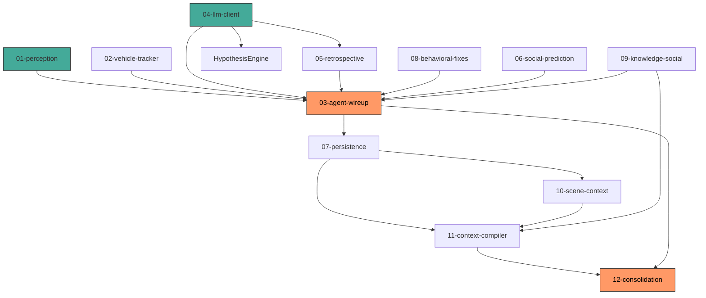

# Vigia — Handoff para Implementação

## Contexto

O Vigia é um sistema de **inteligência ambiental contínua** para segurança
doméstica. Ele aprende rotinas, reconhece padrões comportamentais, formula
hipóteses e dialoga com o usuário.

**Stack**: TypeScript 5.5+, Node 22, ESM, Zod, Pino, OpenAI, ChromaDB.

**Estado atual**: ~70% do core conceitual e de raciocínio implementado.
Faltam: persistência completa multi-sessão, contexto de cena,
context compiler, ciclo de consolidação contínua.

**Novo direcionamento**: [Issue #1 — Memória Persistente Multi-Sessão
e Compreensão Contextual Instintiva](https://github.com/ZanettiLG/SecurityAgent/issues/1).

---

## Estrutura do Handoff

Cada arquivo é uma tarefa independente que pode ser executada por um
subagente. A ordem sugerida respeita dependências.

```
handoff/
├── index.md              ← este arquivo
├── 01-perception.md       # Conectores de câmera + pipeline de visão
├── 02-vehicle-tracker.md  # Port do VehicleTracker Python → TS
├── 03-agent-wireup.md     # Conectar todos os subsistemas no agent.ts
├── 04-llm-client.md       # Cliente LLM real (OpenAI/Claude/Ollama)
├── 05-retrospective.md    # Analisador retrospectivo pós-incidente
├── 06-social-prediction.md # Port do SocialPredictionEngine Python → TS
├── 07-persistence.md      # Persistência real (SQLite/ChromaDB + KG + rotinas)
├── 08-behavioral-fixes.md # actorLevel + Camada 2 no RoutineLearner
├── 09-knowledge-social.md # KnowledgeGraph + SocialMediaInvestigator
├── 10-scene-context.md    # NOVO — Scene Context Bootstrapping (Issue #1 Fase 2)
├── 11-context-compiler.md # NOVO — Context Compiler hierárquico (Issue #1 Fase 3)
└── 12-consolidation.md   # NOVO — Ciclo de Consolidação Contínua (Issue #1 Fase 4)
```

---

## Grafo de Dependências



**Ordem recomendada**: 01 → 04 → 07 → 08 → 02 → 05 → 03 → 06 → 09 → 10 → 11 → 12

---

## Convenções para Todos os Arquivos

### Estilo de código

- TypeScript strict mode
- ESM (`import`/`export`, `"type": "module"` no package.json)
- Zod para validação de entrada
- Pino para logging (`import { logger } from "../../core/logger.js"`)
- Tipos do domínio em `src/core/types.ts`
- Eventos publicados via `EventBus` (`src/core/bus.ts`)

### Padrão de arquivo

- Um arquivo `.ts` por módulo
- Interfaces exportadas, implementações default export ou named export
- Testes manuais com `logger.info()` em pontos-chave
- TODO markers para integrações externas (APIs de hardware, serviços cloud)

### Nomenclatura

- `camelCase` para variáveis e métodos
- `PascalCase` para classes, interfaces, tipos
- `UPPER_SNAKE` para constantes e enums `as const`
- Prefixos: `I` não usado (structural typing); `T` não usado

---

## Checklist de Handoff

| #   | Tarefa                       | Dependências       | Complexidade | Status | Observação                                                                                                                                                      |
| --- | ---------------------------- | ------------------ | ------------ | ------ | --------------------------------------------------------------------------------------------------------------------------------------------------------------- |
| 01  | Perception + Vision Pipeline | Nenhuma            | Alta         | ✅     | `camera-connector.ts`, `vision-pipeline.ts`, `rtsp-connector.ts`, `mock-connector.ts` implementados                                                             |
| 02  | VehicleTracker (port)        | 01, 08             | Média        | ✅     | Portado para `src/processing/vehicle-tracker.ts`                                                                                                                |
| 03  | Agent Wire-up                | 01, 02, 04, 07, 08 | Alta         | 🔄     | `agent.ts` existe, integrações com subsistemas presentes, pode precisar de refinamento                                                                          |
| 04  | LLM Client                   | Nenhuma            | Média        | ✅     | OpenAI e Ollama integrados via `config.ts` + `agent.ts`                                                                                                         |
| 05  | Retrospective Analyzer       | 04, 07             | Média        | ✅     | `src/reasoning/retrospective.ts` implementado                                                                                                                   |
| 06  | Social Prediction (port)     | Nenhuma            | Baixa        | ✅     | `src/reasoning/social-prediction.ts` portado                                                                                                                    |
| 07  | Persistence Layer            | Nenhuma            | Alta         | 🔄     | `sqlite-event-store.ts`, `chroma-vector-store.ts`, `knowledge-graph.ts` implementados; `person-store.ts`, `routine_learner.ts`, `pattern_miner.ts` existem      |
| 08  | Behavioral Fixes             | Nenhuma            | Baixa        | ✅     | `src/reasoning/behavioral_pattern.ts` + `hypothesis.ts` implementados                                                                                           |
| 09  | Knowledge + Social           | 07                 | Média        | ✅     | `knowledge-graph.ts` + `social-investigator.ts` implementados                                                                                                   |
| 10  | Scene Context Bootstrapping  | 07, 09             | Média        | ⬜     | NOVO — `SceneContextStore` + `SceneAnalyzer` integration + bootstrapping com LLM Vision. Issue [#1](https://github.com/ZanettiLG/SecurityAgent/issues/1) Fase 2 |
| 11  | Context Compiler             | 07, 09, 10         | Média        | ⬜     | NOVO — `ContextCompiler` com camadas hierárquicas + token budget. Issue [#1](https://github.com/ZanettiLG/SecurityAgent/issues/1) Fase 3                        |
| 12  | Consolidation Loop           | 03, 11             | Alta         | ⬜     | NOVO — `ConsolidationLoop` com LLM-driven consolidation + auto-aprendizado. Issue [#1](https://github.com/ZanettiLG/SecurityAgent/issues/1) Fase 4              |

---

## Verificação de Integração

Após todas as tarefas, o sistema deve:

1. `npm run typecheck` passar sem erros
2. `npm run dev` iniciar sem crashes
3. O agente publicar eventos de câmera mock no EventBus
4. O pipeline completo `handleEvent` executar sem TODOs
5. O GOAP planejar e executar ao menos uma ação simulada
6. O Knowledge Graph, RoutineLearner, QueryManager e HypothesisEngine
   sobreviverem a um restart do agente (persistência multi-sessão)
7. O SceneContext ser carregado no boot e injetado no prompt do LLM
8. O ContextCompiler montar prompt hierárquico respeitando token budget
9. O ConsolidationLoop rodar periodicamente e gerar aprendizado
